# Focus layout — visual review gallery

> Factual capture of each topic on the focus layout: every reachable beat (desktop + mobile) + the code drawer. Descriptive only — annotate inline.
> **PARTIAL: 10/29 captured.** Remaining (capture run hit the session limit, resuming after reset): strings sets-tuples linked-lists stacks-queues hash-maps trees graphs binary-search two-pointers sliding-window sliding-window-variable activity-selection backtracking dfs bfs mergesort recursion monotonic-stack dp-1d

## Contents
- [variables](#variables)
- [data-types](#data-types)
- [operators](#operators)
- [constants](#constants)
- [conditionals](#conditionals)
- [functions](#functions)
- [for-loops](#for-loops)
- [while-loops](#while-loops)
- [try-except](#try-except)
- [arrays](#arrays)

---

## variables
route: `/categories/programming-basics/variables/` · diagram shape: line

### Beat 1 — The need
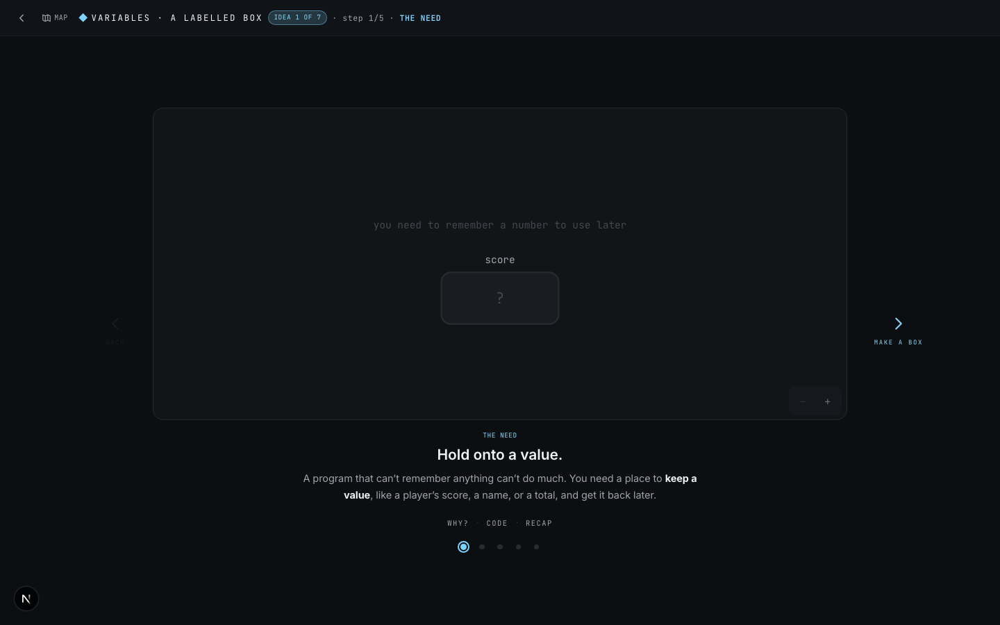
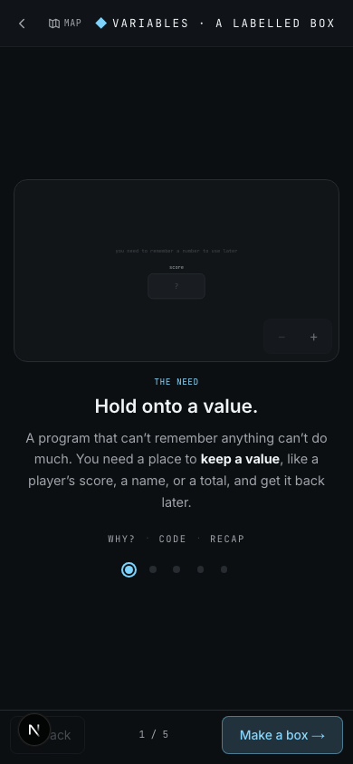
The header reads VARIABLES · A LABELLED BOX with an "IDEA 1 OF 7" pill, "step 1/5", and the beat label THE NEED. The diagram canvas holds a single labelled box: the name `score` floats above an empty box showing `?`, under the caption "you need to remember a number to use later". The main panel is titled "Hold onto a value." with body text about needing a place to keep a value and get it back later, and the why · code · recap chip row plus five progress dots (first filled) sit below it. Side nav shows BACK on the left and the action MAKE A BOX on the right; a −/+ stepper sits in the canvas corner. Mobile stacks the same content vertically with a "1 / 5" counter and a "Make a box →" button in the footer; the diagram caption and box render faintly at reduced size.

### Beat 2 — Create it
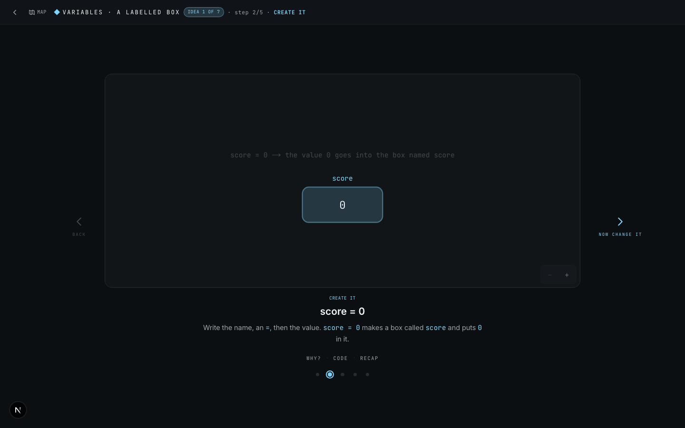
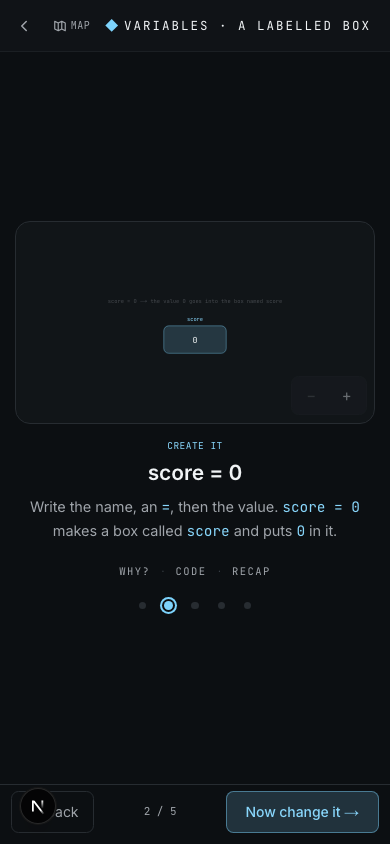
Step counter reads "step 2/5", label CREATE IT, second progress dot filled. The same `score` box is now active (accent fill and outline) holding the value `0`, under the caption "score = 0 → the value 0 goes into the box named score". The main panel title is "score = 0" with body explaining that writing the name, an `=`, then the value makes a box and puts `0` in it. There is no gate on this beat: the right nav action reads NOW CHANGE IT and advances directly. Mobile mirrors this with the "2 / 5" counter and a "Now change it →" footer button.

### Beat 3 — Change it (predict gate)
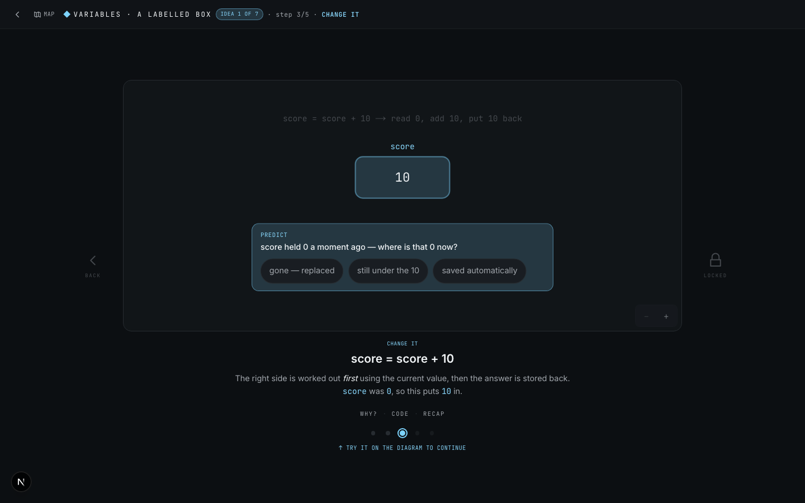
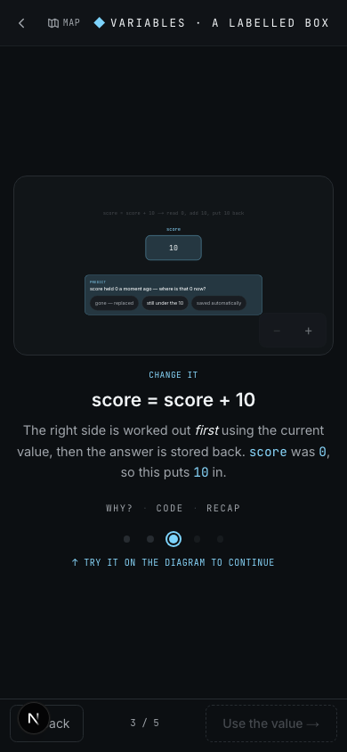
Step counter reads "step 3/5", label CHANGE IT, third progress dot filled. The `score` box now reads `10` under the caption "score = score + 10 → read 0, add 10, put 10 back". Below the box a PREDICT panel asks "score held 0 a moment ago — where is that 0 now?" with three choice chips: "gone — replaced", "still under the 10", and "saved automatically". This beat is gated (interaction type: wedge / predict gate): the right side nav shows a lock icon labelled LOCKED, and the prompt "↑ TRY IT ON THE DIAGRAM TO CONTINUE" appears under the progress dots. Selecting the correct choice ("gone — replaced") clears the gate and reveals the line "0 + 10 = 10 — the old 0 is gone". On mobile the gate behaves the same way: the footer "Use the value →" button renders dimmed/disabled with the same "↑ TRY IT ON THE DIAGRAM TO CONTINUE" hint, and the mobile capture stopped at this beat because the predict gate was not cleared.

### Beat 4 — Use it (desktop only)
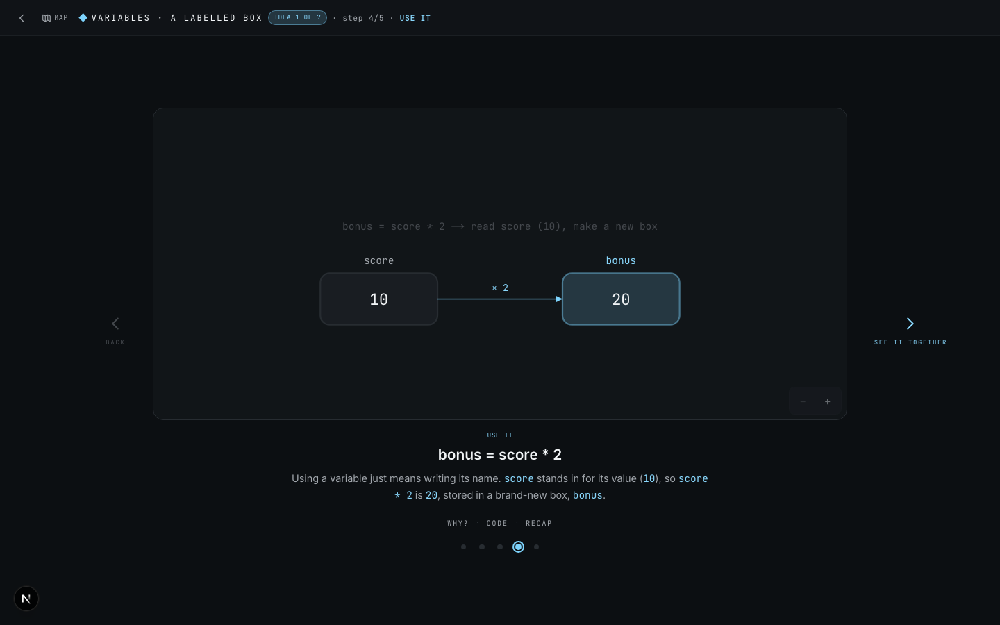
Step counter reads "step 4/5", label USE IT, fourth progress dot filled. The canvas now shows two boxes: `score` holding `10` (inactive) on the left and `bonus` holding `20` (active) on the right, joined by a flow arrow labelled "× 2", under the caption "bonus = score * 2 → read score (10), make a new box". The main panel title is "bonus = score * 2" with body explaining that `score` stands in for its value (10), so `score * 2` is 20, stored in a new box `bonus`. No gate on this beat; the right nav action reads SEE IT TOGETHER. Mobile did not reach this beat.

### Beat 5 — Put together (desktop only)
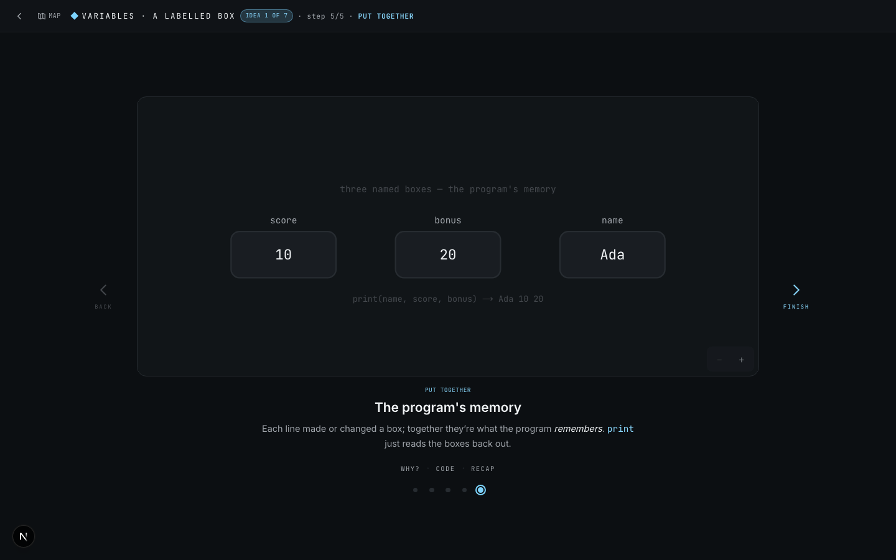
Step counter reads "step 5/5", label PUT TOGETHER, fifth progress dot filled. The canvas shows three named boxes side by side — `score` = `10`, `bonus` = `20`, `name` = `Ada` — under the caption "three named boxes — the program's memory", with a line beneath reading "print(name, score, bonus) → Ada 10 20". The main panel is titled "The program's memory" with body noting each line made or changed a box and `print` reads them back out. The right nav action reads FINISH. Mobile did not reach this beat.

### Code drawer
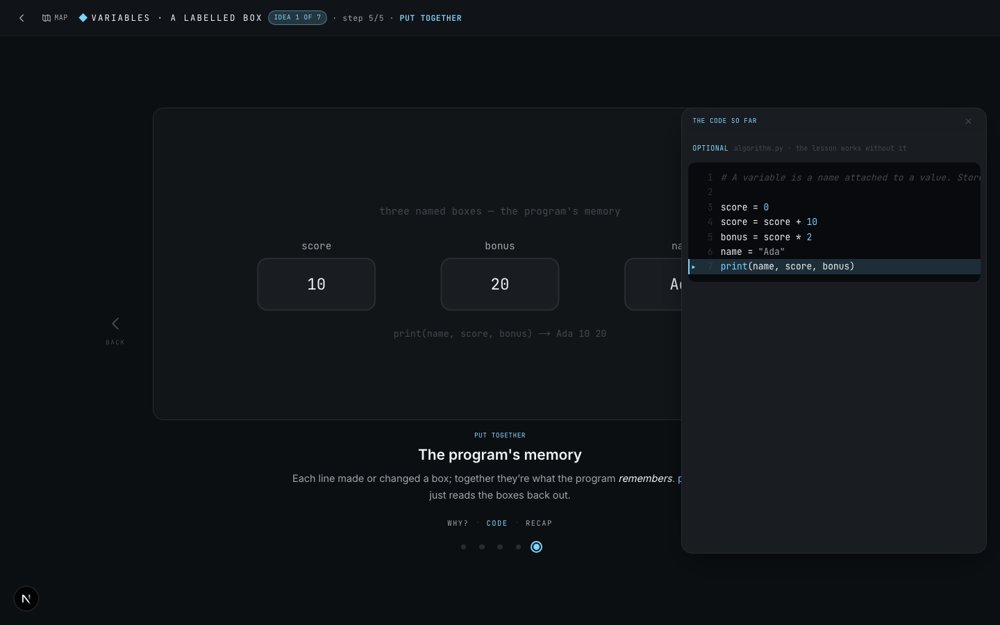
Opening the code drawer (via the CODE chip) slides a panel in from the right titled "THE CODE SO FAR", tagged "OPTIONAL  algorithm.py · the lesson works without it". It shows the numbered Python source: a comment on line 1 ("# A variable is a name attached to a value..."), then `score = 0`, `score = score + 10`, `bonus = score * 2`, `name = "Ada"`, and `print(name, score, bonus)` on lines 3–7. The current line (line 7, the `print` call) is highlighted with a play-arrow marker in the gutter. A close (×) control sits in the drawer's top-right corner.

_Capture note: desktop reached all 5 beats (5/5); mobile reached 3 of 5 (1/5 through 3/5). Mobile stopped at beat 3 because the predict/wedge gate on "Change it" was not cleared, leaving the advance button disabled. The captured sequence is the structured register (5 beats: need, create, update/change, use, recap); the spec's `types` beat ("Any kind of value") is cut for this register and was not in the captured run._

---

## data-types
route: `/categories/programming-basics/data-types/` · diagram shape: line

### Beat 1 — Kinds of value
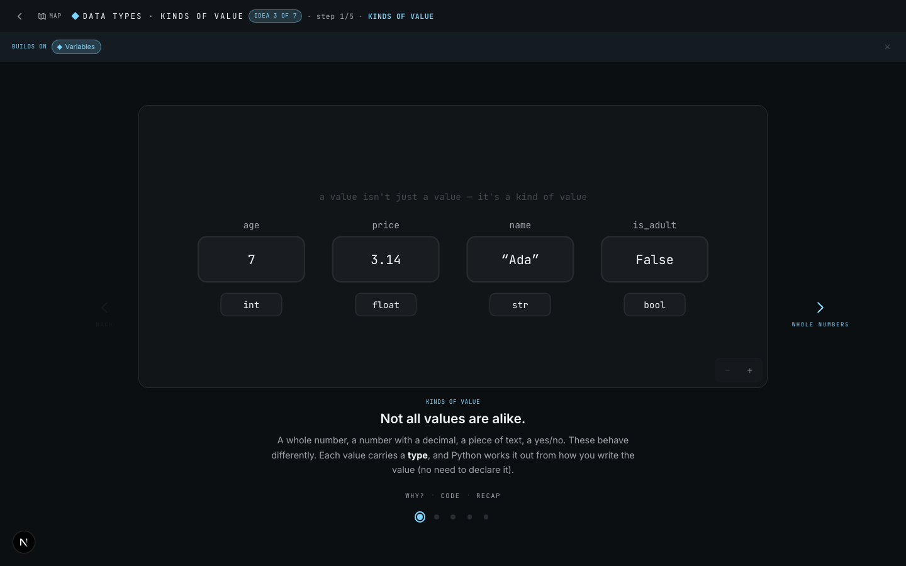
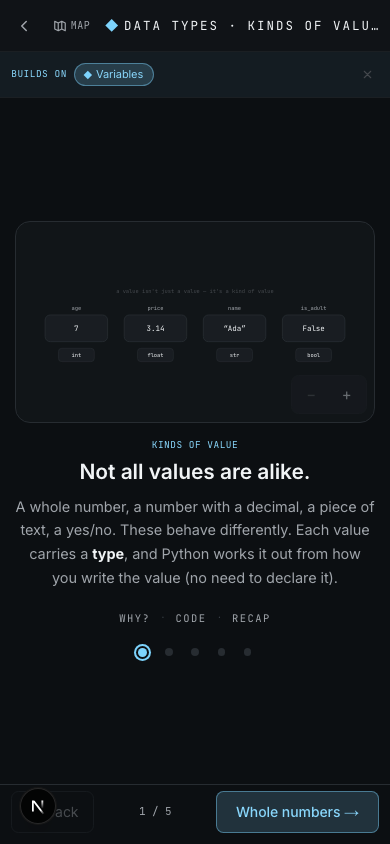
The diagram draws a row of four value boxes — `age` holding `7`, `price` holding `3.14`, `name` holding `"Ada"`, `is_adult` holding `False` — each with a type chip beneath it (`int`, `float`, `str`, `bool`). No box is highlighted on this beat; all four and their chips render in the muted tone. The caption above the row reads "a value isn't just a value — it's a kind of value". The top bar shows MAP, the diamond DATA TYPES · KINDS OF VALUE title, an "IDEA 3 OF 7" pill, and "step 1/5 · KINDS OF VALUE"; below it a "BUILDS ON" strip carries a "Variables" prereq pill with a close (x) control. The main panel under the diagram shows the "KINDS OF VALUE" label, the title "Not all values are alike.", body prose about each value carrying a type Python infers, then the why·code·recap chips and five progress dots (first filled). The right side nav reads "WHOLE NUMBERS" with a chevron; the left reads "BACK". On mobile the same four-box diagram, panel, and chips stack vertically, and a bottom action bar shows "Back", "1 / 5", and a "Whole numbers" forward button. No gate on this beat.

### Beat 2 — Numbers: int & float
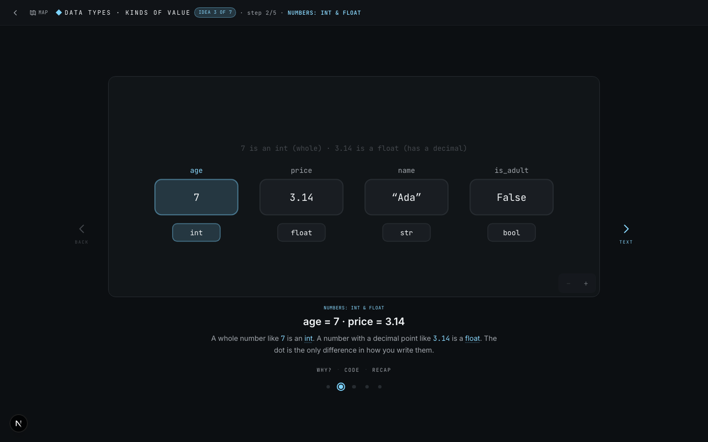
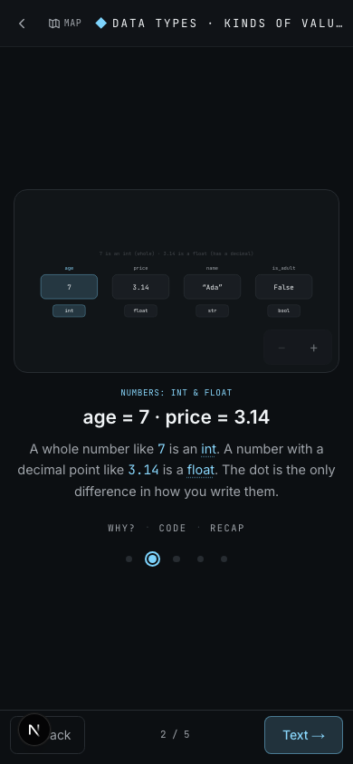
The same four-box row renders, now with the `age = 7` box and its `int` chip highlighted in the accent tone. The caption reads "7 is an int (whole) · 3.14 is a float (has a decimal)". The main panel label is "NUMBERS: INT & FLOAT", title "age = 7 · price = 3.14", with body text explaining a whole number like `7` is an int and `3.14` with a decimal point is a float, the dot being the only spelling difference. Progress dots show the second dot filled. Side nav reads "BACK" (left) and "TEXT" (right). Mobile mirrors the layout with the bottom bar showing "Back", "2 / 5", and a "Text" forward button. No gate on this beat.

### Beat 3 — Text: str (gated, wedge / predict)
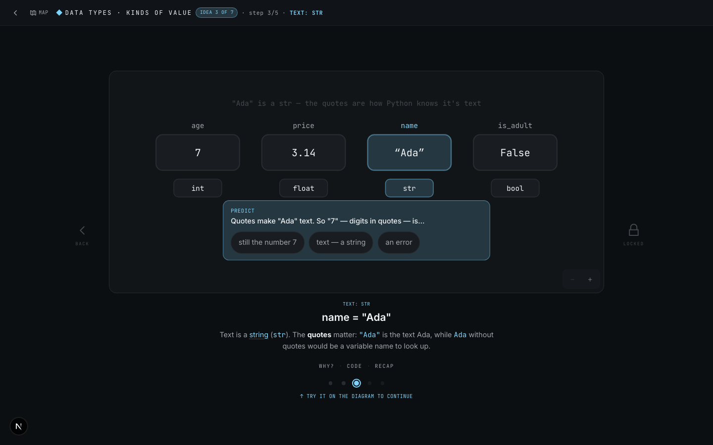
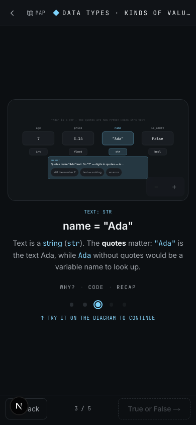
The four-box row renders with the `name` box (`"Ada"`) and its `str` chip highlighted. The caption reads `"Ada" is a str — the quotes are how Python knows it's text`. Overlaid on the diagram is a PREDICT gate panel asking 'Quotes make "Ada" text. So "7" — digits in quotes — is…' with three choice buttons: "still the number 7", "text — a string", and "an error". The main panel label is "TEXT: STR", title `name = "Ada"`, with body text about quotes delimiting text versus a bare name lookup. Below the progress dots (third filled) the prompt "↑ TRY IT ON THE DIAGRAM TO CONTINUE" appears, and the right side nav shows "LOCKED" with a padlock icon. This beat is gated: the learner must pick a choice in the predict gate (correct answer "text — a string") before the lesson unlocks and the forward nav becomes available. On mobile the same gate overlays the diagram, the bottom bar reads "Back", "3 / 5", and the "True or False" forward button renders disabled/greyed with the same "TRY IT ON THE DIAGRAM TO CONTINUE" prompt. Mobile capture stopped at this beat (reached 3/5) — the predict gate was not cleared, so beats 4 and 5 were not reachable on mobile.

### Beat 4 — Yes / no: bool
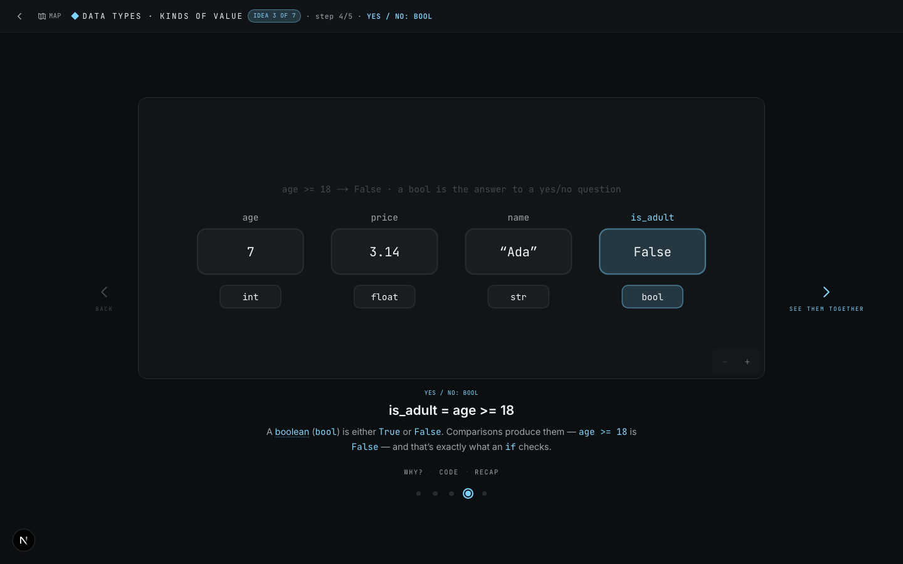
Desktop only (mobile blocked at the beat 3 gate). The four-box row renders with the `is_adult` box (`False`) and its `bool` chip highlighted in the accent tone. The caption reads `age >= 18 → False · a bool is the answer to a yes/no question`. The main panel label is "YES / NO: BOOL", title `is_adult = age >= 18`, with body text that a boolean is either True or False, comparisons produce them (`age >= 18` is False), and that is what an `if` checks. Progress dots show the fourth filled. Side nav reads "BACK" (left) and "SEE THEM TOGETHER" (right). No gate on this beat.

### Beat 5 — Four to start
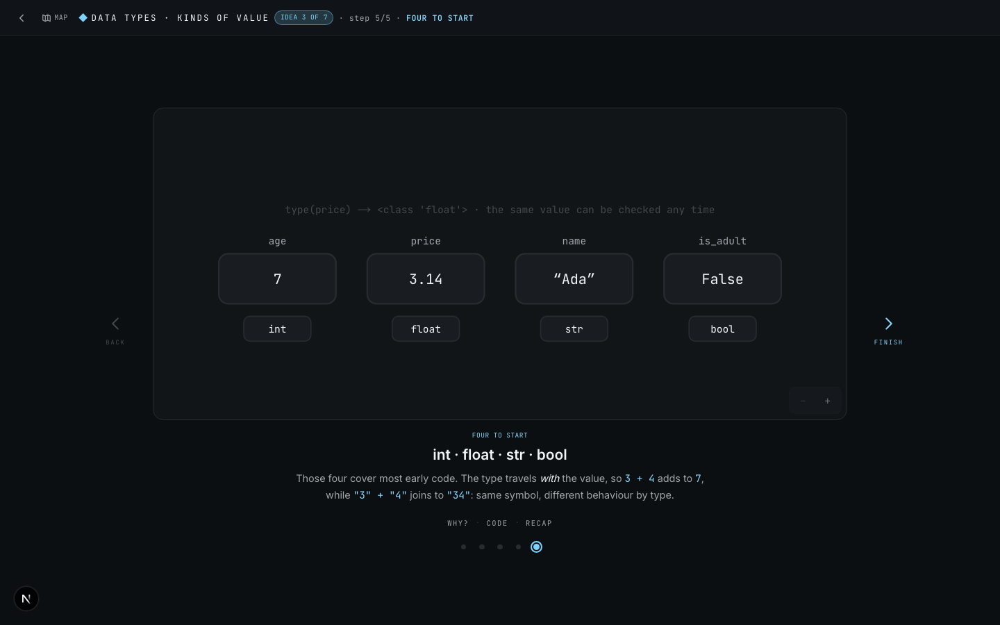
Desktop only (mobile blocked at the beat 3 gate). The four-box row renders with no single box highlighted; all four boxes and chips show in the resting tone. The caption reads `type(price) → <class 'float'> · the same value can be checked any time`. The main panel label is "FOUR TO START", title "int · float · str · bool", with body text that the four cover most early code and the type travels with the value, contrasting `3 + 4` adding to `7` with `"3" + "4"` joining to `"34"`. All five progress dots are filled, the last active. Side nav reads "BACK" (left) and "FINISH" (right). No gate on this beat.

### Code drawer
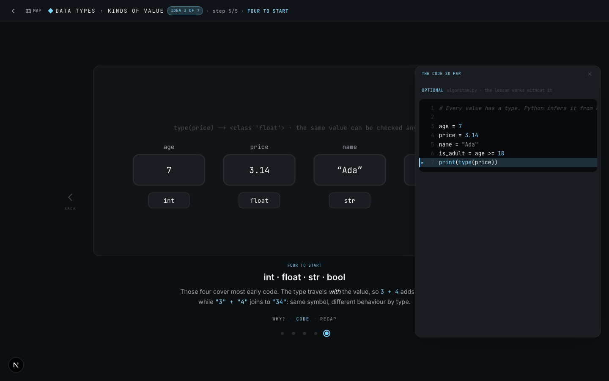
The code drawer slides in from the right with header "THE CODE SO FAR" and a close (x) control. A sub-line reads "OPTIONAL  algorithm.py · the lesson works without it". The code panel shows numbered lines of `algorithm.py`: a comment "# Every value has a type. Python infers it from…", then `age = 7`, `price = 3.14`, `name = "Ada"`, `is_adult = age >= 18`, and a highlighted line 7 `print(type(price))`. The drawer overlays the right portion of the diagram while the main panel and progress dots stay visible beneath.

---

## operators
route: `/categories/programming-basics/operators/` · diagram shape: line

### Beat 1 — Combine values
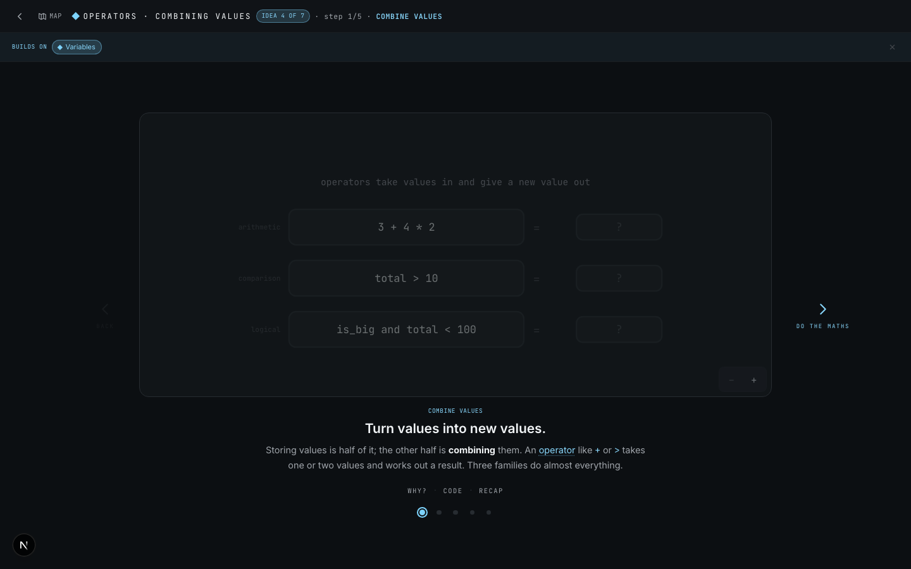
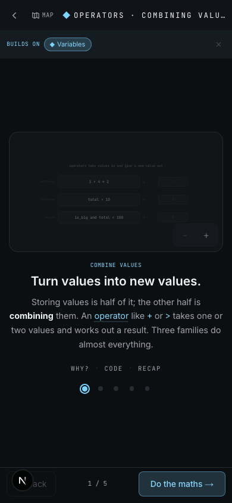
The canvas holds three stacked expression rows, each labelled at the left (`arithmetic`, `comparison`, `logical`) with the expression in a bordered pill (`3 + 4 * 2`, `total > 10`, `is_big and total < 100`), an `=` sign, and a result box on the right showing `?`. All three rows and their result boxes are dimmed, and every result reads `?` (nothing resolved yet). The caption above the rows reads "operators take values in and give a new value out". The header shows the breadcrumb `MAP · OPERATORS · COMBINING VALUES`, an `IDEA 4 OF 7` pill, and `step 1/5 · COMBINE VALUES`. A "BUILDS ON" strip below the header carries a `Variables` prereq pill with a dismiss (×). The main panel below reads label "COMBINE VALUES", title "Turn values into new values.", and body about storing being half and combining the other half. The why·code·recap chips and five progress dots (first filled) sit under the panel; the right side nav reads "DO THE MATHS". No interaction is required to advance. On mobile the three rows render in the canvas; the side nav becomes a bottom bar with a "1 / 5" counter and a "Do the maths →" button.

### Beat 2 — Arithmetic
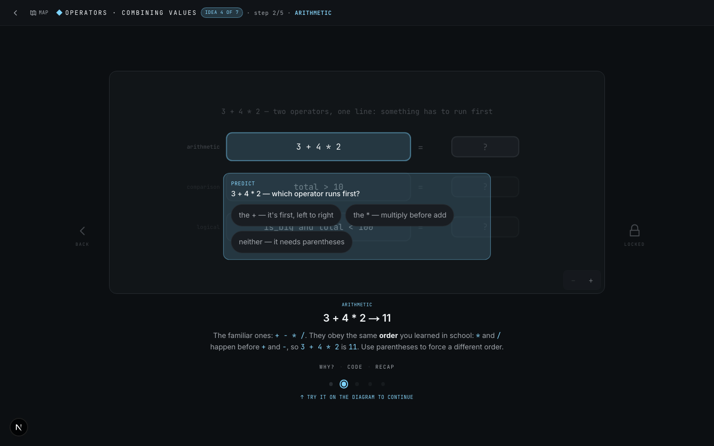
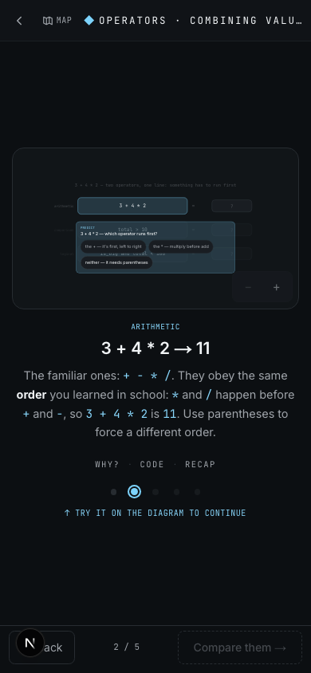
The arithmetic row (`3 + 4 * 2`) is now focused (highlighted border) and a PREDICT gate panel overlays the two lower rows. The gate asks "3 + 4 * 2 — which operator runs first?" with three tappable choices: "the + — it's first, left to right", "the * — multiply before add", and "neither — it needs parentheses". The caption reads "3 + 4 * 2 — two operators, one line: something has to run first" and the result box still shows `?` (the row has not resolved). The main panel reads label "ARITHMETIC", title "3 + 4 * 2 → 11", body explaining `* /` happen before `+ -`. Below the dots is the prompt "↑ TRY IT ON THE DIAGRAM TO CONTINUE", and the right side nav reads "LOCKED". This beat is gated by the predict gate: the learner must tap a choice on the diagram (the correct one being "the * — multiply before add"), after which the row resolves to `11` and the next-step nav unlocks. On mobile the same gate panel renders over the rows, the next button "Compare them →" is dimmed/disabled, and the "↑ TRY IT ON THE DIAGRAM TO CONTINUE" prompt appears.

Mobile capture stopped here (2 of 5 beats). The predict gate at beat 2 was not cleared in the mobile run, so no mobile screenshots exist for beats 3–5.

### Beat 3 — Comparison
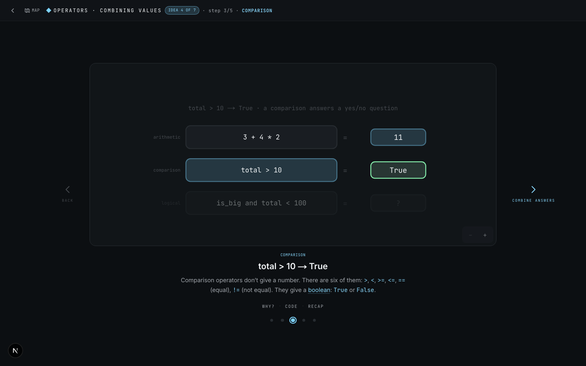
The arithmetic row has resolved: its result box now shows `11` (gate cleared). The comparison row (`total > 10`) is now focused, and its result box shows `True` in a green-bordered box. The logical row remains dimmed with `?`. The caption reads "total > 10 → True · a comparison answers a yes/no question". The header shows `step 3/5 · COMPARISON`. The main panel reads label "COMPARISON", title "total > 10 → True", body listing the six comparison operators (`> < >= <= == !=`) that yield a boolean. Progress dots show the third filled; the right side nav reads "COMBINE ANSWERS". No gate on this beat; advancing via the side nav.

### Beat 4 — Logical
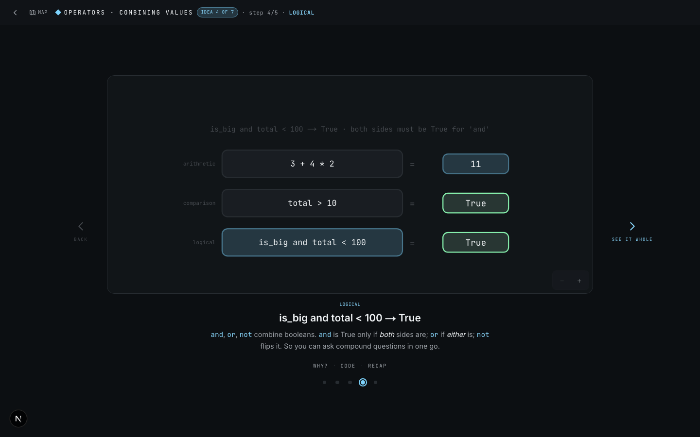
All three rows are now resolved: arithmetic `= 11`, comparison `= True`, and the logical row (`is_big and total < 100`) is focused with its result box showing `True` (green border). The caption reads "is_big and total < 100 → True · both sides must be True for 'and'". The header shows `step 4/5 · LOGICAL`. The main panel reads label "LOGICAL", title "is_big and total < 100 → True", body covering `and`, `or`, `not` combining booleans (and is True only if both sides are; or if either; not flips). Progress dots show the fourth filled; the right side nav reads "SEE IT WHOLE". No gate; advancing via the side nav.

### Beat 5 — Three families
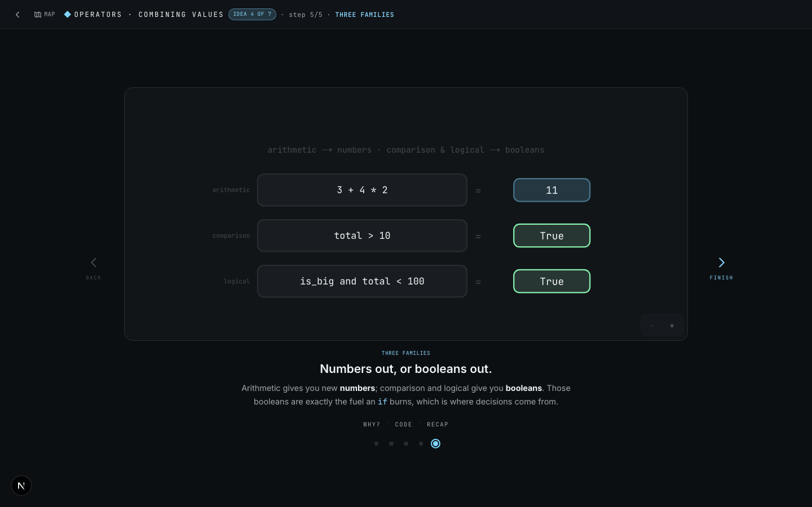
All three rows remain resolved (`11`, `True`, `True`) but none is focused now — the view steps back to show the whole set. The caption reads "arithmetic → numbers · comparison & logical → booleans". The header shows `step 5/5 · THREE FAMILIES`. The main panel reads label "THREE FAMILIES", title "Numbers out, or booleans out.", body explaining arithmetic gives numbers while comparison and logical give booleans, and those booleans are the fuel an `if` burns. Progress dots show the fifth (final) filled; the right side nav reads "FINISH". No completion ceremony overlay is visible in this capture — the final beat shows the recap state with the "FINISH" affordance.

### Code drawer
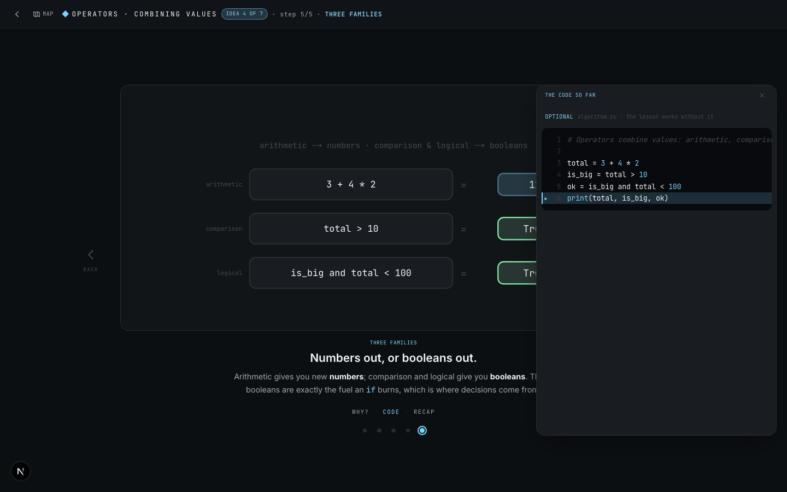
The drawer slides in from the right over the recap beat, titled "THE CODE SO FAR" with a close (×). A subheader reads "OPTIONAL · algorithm.py · the lesson works without it". The code listing shows numbered lines: a comment `# Operators combine values: arithmetic, comparis…`, then `total = 3 + 4 * 2`, `is_big = total > 10`, `ok = is_big and total < 100`, and a highlighted final line `print(total, is_big, ok)` (line 6, marked with a run pointer). The drawer overlaps the right portion of the canvas, partially covering the result boxes.

---

## constants
route: `/categories/programming-basics/constants/` · diagram shape: line

### Beat 1 — The fixed value
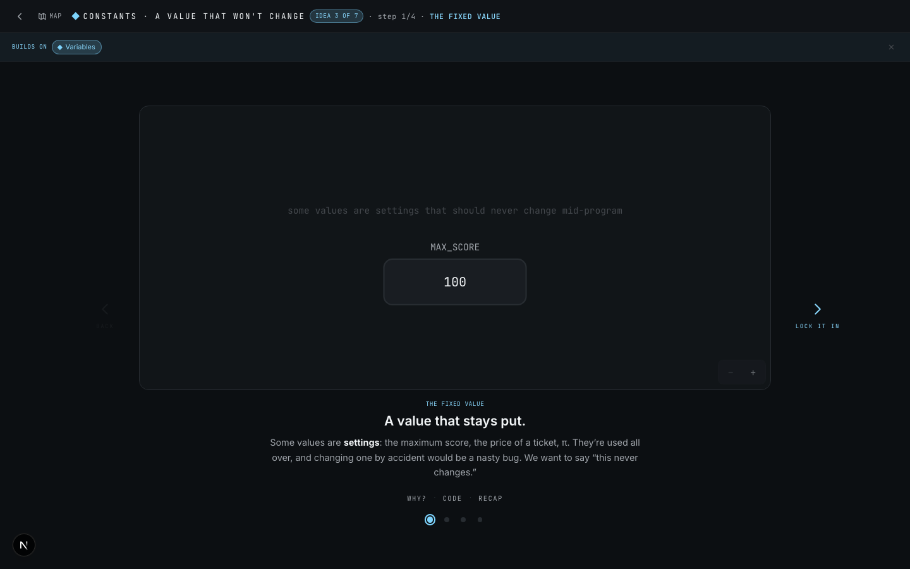
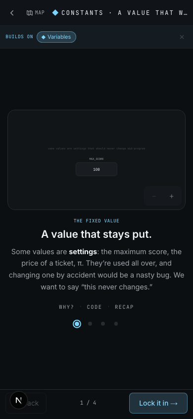

The header reads `CONSTANTS · A VALUE THAT WON'T CHANGE` with an `IDEA 3 OF 7` pill, a `step 1/4` counter, and the beat label `THE FIXED VALUE`. A `BUILDS ON` row carries a single prereq pill, `Variables`, with a close (×) control at the right. The diagram is a single box labeled `MAX_SCORE` holding the value `100`, under the idea caption "some values are settings that should never change mid-program". A stepper with − and + controls sits at the lower right of the canvas. The main panel below reads "A value that stays put." with body text about settings like maximum score, ticket price, and π. The why·code·recap chips appear under the panel above four progress dots (first dot filled). The right side nav shows a chevron labeled `LOCK IT IN`; the left shows `BACK`. Advancing uses the right nav; this beat has no gate.

### Beat 2 — Name it in CAPS
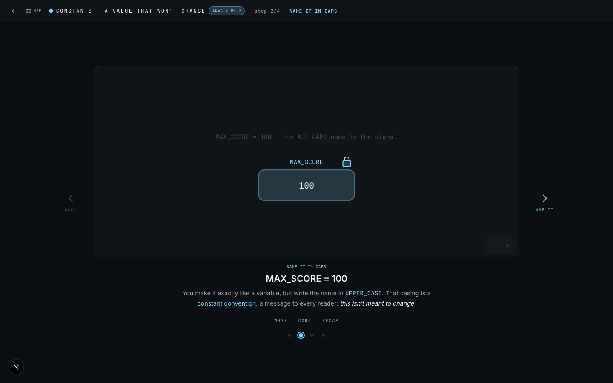
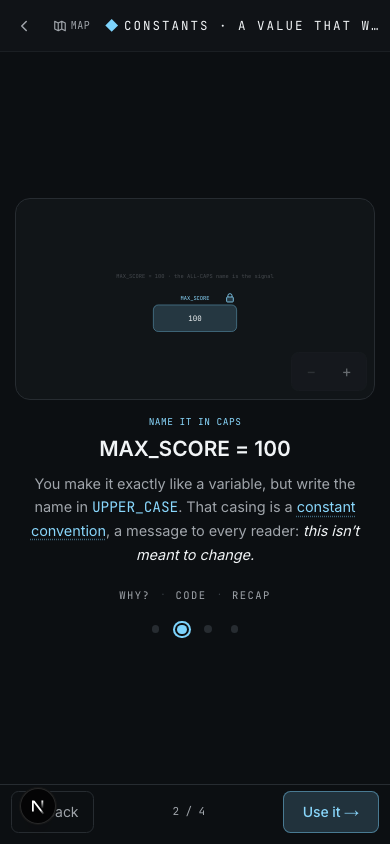

The counter reads `step 2/4`, label `NAME IT IN CAPS`. The diagram is the `MAX_SCORE` box holding `100`, now drawn active (highlighted outline) with a lock glyph above its top-right corner. The caption reads "MAX_SCORE = 100 · the ALL-CAPS name is the signal". The main panel title is `MAX_SCORE = 100`, with body text explaining the UPPER_CASE casing as a constant convention; "constant convention" renders as underlined inline Term links. The progress dots show the second dot filled. The right nav chevron is labeled `USE IT`. No gate; advancing uses the right nav.

### Beat 3 — Use it anywhere
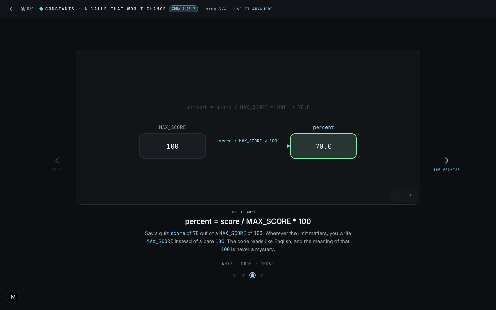
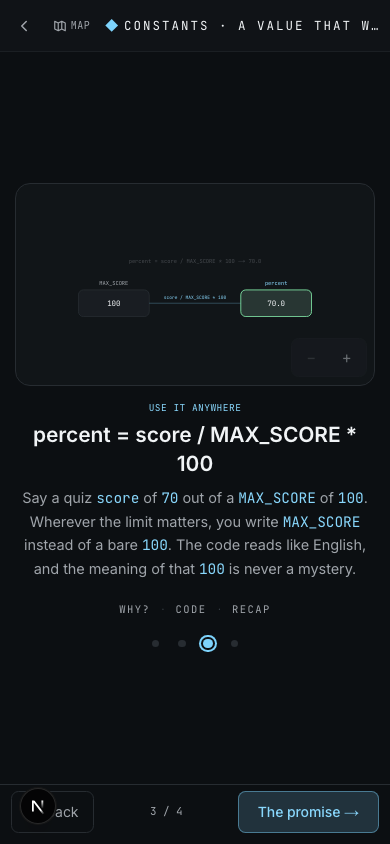

The counter reads `step 3/4`, label `USE IT ANYWHERE`. The diagram is now two boxes: `MAX_SCORE` holding `100` on the left and `percent` holding `70.0` on the right (the percent box is drawn active in a green/good tone), connected by an arrow labeled `score / MAX_SCORE * 100`. The caption reads "percent = score / MAX_SCORE * 100 → 70.0". The main panel title is `percent = score / MAX_SCORE * 100`, with body text about a score of 70 out of a MAX_SCORE of 100. The third progress dot is filled. The right nav chevron is labeled `THE PROMISE`. No gate; advancing uses the right nav.

### Beat 4 — A promise, not a lock
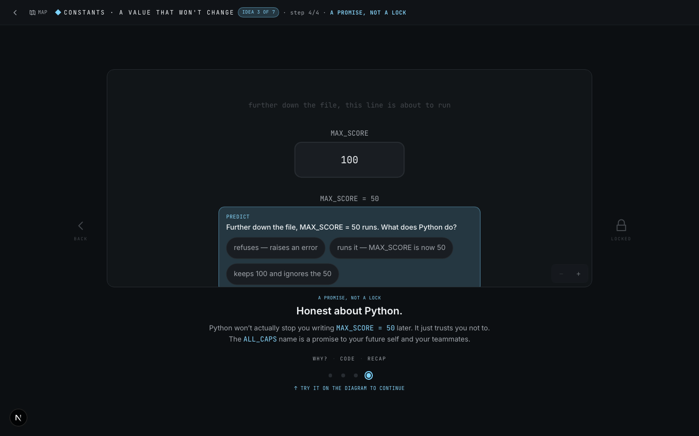
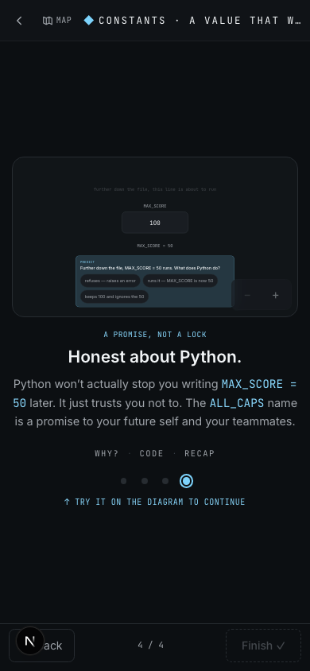

The counter reads `step 4/4`, label `A PROMISE, NOT A LOCK`. This beat is gated by a predict interaction. The diagram shows the `MAX_SCORE` box holding `100` under the caption "further down the file, this line is about to run", and below it a faint line `MAX_SCORE = 50`. A PREDICT card poses "Further down the file, MAX_SCORE = 50 runs. What does Python do?" with three choices: "refuses — raises an error", "runs it — MAX_SCORE is now 50", and "keeps 100 and ignores the 50". The right side nav reads `LOCKED` (lock glyph) rather than an advance chevron, and a prompt under the progress dots reads "↑ TRY IT ON THE DIAGRAM TO CONTINUE". The gate clears when the learner taps a prediction choice; on reveal the caption changes to "nothing technically stops a reassignment — the CAPS name is a promise" and the `MAX_SCORE = 50` line is shown crossed out with a × marker. The main panel title is "Honest about Python." with body text that Python won't stop a later `MAX_SCORE = 50`. The fourth progress dot is filled. On mobile, the footer shows `4 / 4` with a disabled `Finish ✓` button while the gate is unsatisfied, matching the desktop `LOCKED` state; the predict card and choices render the same, stacked within the narrower canvas.

### Code drawer
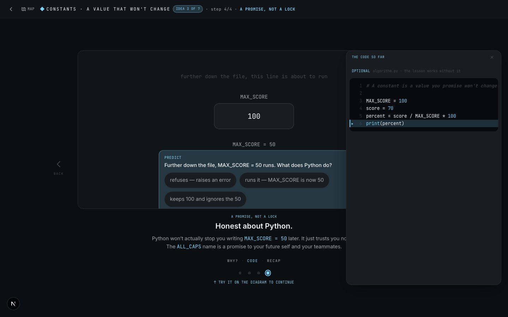

The drawer opens from the right titled `THE CODE SO FAR`, with an `OPTIONAL` tag and the note "algorithm.py · the lesson works without it". It shows numbered lines: a comment `# A constant is a value you promise won't change`, `MAX_SCORE = 100`, `score = 70`, `percent = score / MAX_SCORE * 100`, and `print(percent)`. The final line `print(percent)` is highlighted with a ▶ run-pointer marker, corresponding to beat 4's `print` code label. A close (×) control sits at the top right of the drawer.

Note: both desktop and mobile reached all 4 beats. The capture stops at beat 4 with the predict gate unanswered, so the completion ceremony (post-Finish state) is not shown in these screenshots; the gate-locked `Finish ✓` / `LOCKED` state is the final captured frame.

---

## conditionals
route: `/categories/programming-basics/conditionals/` · diagram shape: line

### Beat 1 — The choice
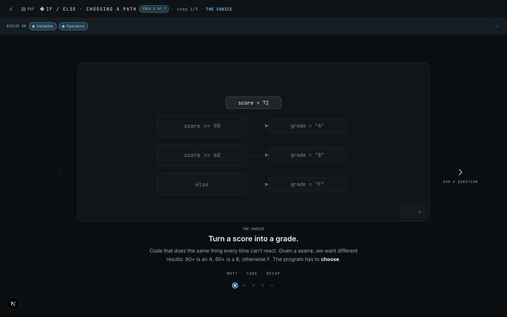
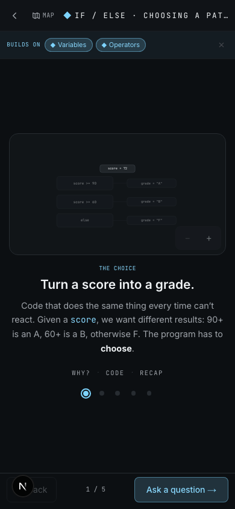
The canvas draws the if/elif/else ladder: a `score = 72` chip sits at the top, and three condition rows (`score >= 90`, `score >= 60`, `else`) each point through an arrow to an output box (`grade = "A"`, `grade = "B"`, `grade = "F"`). All rows render idle (greyed at half opacity) with no verdicts shown. The top bar reads "IF / ELSE · CHOOSING A PATH", an "IDEA 2 OF 7" pill, "step 1/5", and the beat label "THE CHOICE". Below the bar a "BUILDS ON" strip shows prereq pills "Variables" and "Operators" (dismissable via an x). The main panel below the canvas is captioned "THE CHOICE" with the title "Turn a score into a grade." and body text about code that does the same thing every time, ending on "choose". The why?·code·recap chips sit above five progress dots (first filled). Left nav is "BACK"; right nav is "ASK A QUESTION". This beat has no gate. On mobile the same ladder, panel, and prereq strip stack vertically with a bottom footer showing "back", "1 / 5", and an "Ask a question" button.

### Beat 2 — if: the first test
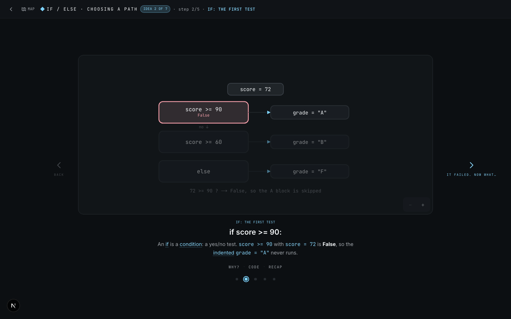
The ladder now evaluates the first row: `score >= 90` is outlined red with a "False" verdict label beneath it, and a "no ↓" marker drops to the next row. Rows 2 and 3 stay idle/greyed. A caption under the ladder reads "72 >= 90 ? → False, so the A block is skipped". The panel is captioned "IF: THE FIRST TEST", titled "if score >= 90:", with body text defining an if as a yes/no condition and noting the indented `grade = "A"` never runs (with linked Terms for "if", "condition", "indented"). Progress dots show the second filled. Right nav reads "IT FAILED. NOW WHAT…". This beat has no gate.

### Beat 3 — elif: the next test
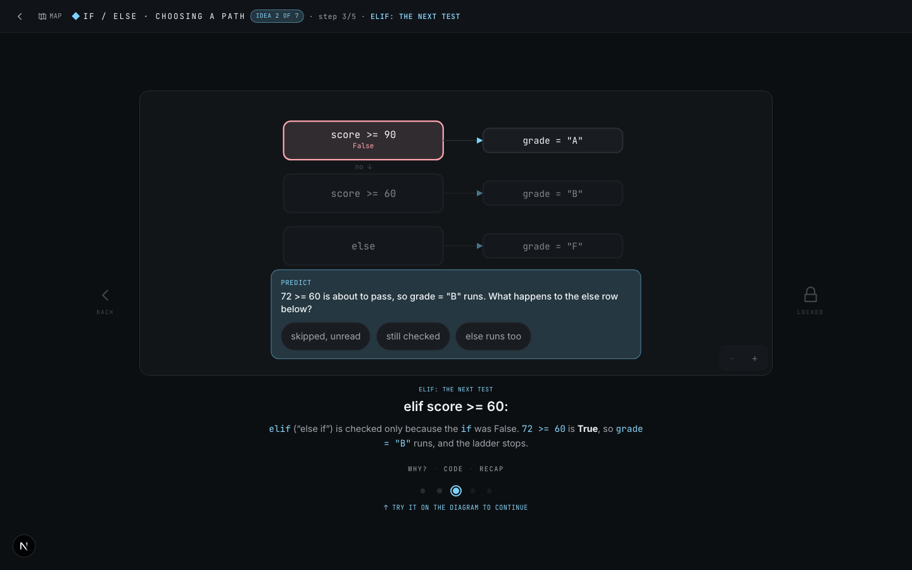
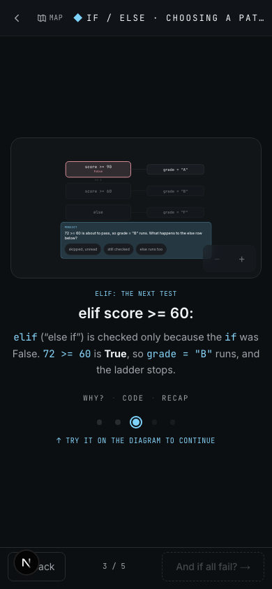
This beat is gated by a prediction wedge. The ladder shows row 1 (`score >= 90`) red with "False" and the "no ↓" drop; rows below stay idle and the `score = 72` chip is hidden in the pre-reveal state so the gate fits the band. A PREDICT panel overlays the lower canvas asking "72 >= 60 is about to pass, so grade = "B" runs. What happens to the else row below?" with three choice chips: "skipped, unread", "still checked", "else runs too". The correct choice is "skipped, unread"; selecting a choice shows its note, then after a pause the visual reveals (`score = 72` chip returns, row 2 turns accent/True, and the caption becomes "72 >= 60 ? → True, so grade = B (and we stop checking)"). The panel is captioned "ELIF: THE NEXT TEST", titled "elif score >= 60:". Until the gate is answered the right nav shows a "LOCKED" lock icon and the footer prompts "↑ TRY IT ON THE DIAGRAM TO CONTINUE". Progress dots show the third filled. On mobile the ladder and the PREDICT overlay render inside the canvas; the footer shows "back", "3 / 5", and a greyed "And if all fail? →" next button, confirming the gate blocks advance until a prediction is made.

### Beat 4 — else: the fallback
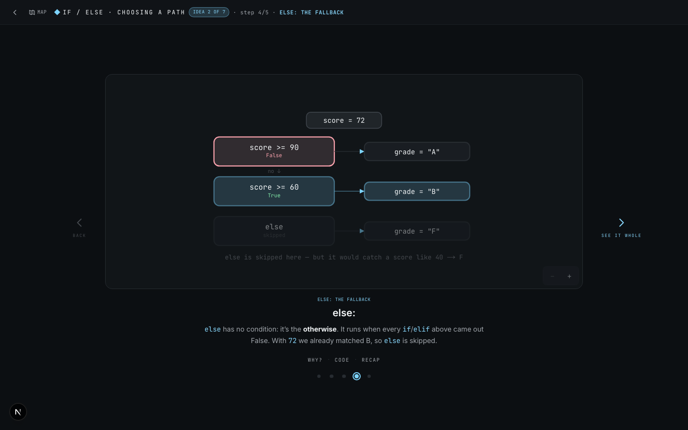
The ladder now shows the resolved state: row 1 `score >= 90` red with "False", row 2 `score >= 60` accent with "True" and its `grade = "B"` output box highlighted accent, and row 3 `else` greyed with a "skipped" verdict. Caption reads "else is skipped here — but it would catch a score like 40 → F". The panel is captioned "ELSE: THE FALLBACK", titled "else:", with body explaining else has no condition and runs only when every if/elif above was False, and that 72 already matched B so else is skipped. Progress dots show the fourth filled. Right nav reads "SEE IT WHOLE". This beat has no gate.

### Beat 5 — Exactly one path
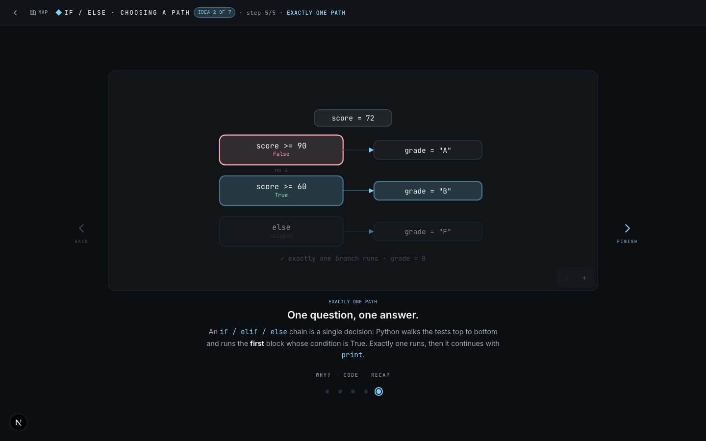
The final ladder repeats the resolved state — row 1 red "False", row 2 accent "True" with the `grade = "B"` box highlighted, row 3 `else` greyed "skipped" — with the caption "✓ exactly one branch runs · grade = B". The panel is captioned "EXACTLY ONE PATH", titled "One question, one answer.", with body describing the if/elif/else chain as a single decision: Python walks tests top to bottom, runs the first True block, exactly one runs, then continues with `print`. Progress dots show the fifth (final) filled. Right nav reads "FINISH". This beat has no gate.

### Code drawer
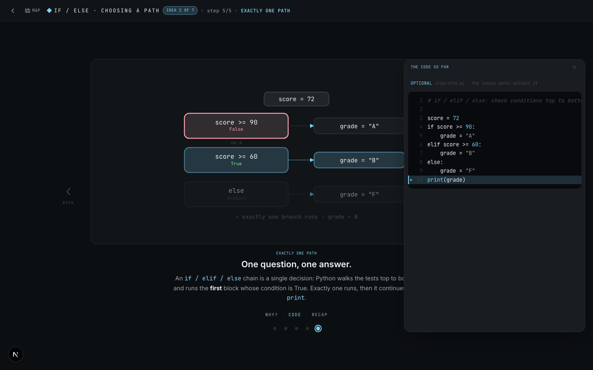
The drawer slides in from the right, headed "THE CODE SO FAR" with a close x and an "OPTIONAL · algorithm.py · the lesson works without it" subline. It shows the full Python source numbered lines 1–10: a `# if / elif / else` comment, `score = 72`, the `if score >= 90:` / `grade = "A"` block, `elif score >= 60:` / `grade = "B"`, `else:` / `grade = "F"`, and `print(grade)` on line 10 with a current-line marker (`▸`) highlighting it (captured on the final beat, where the recap maps to `print`).

---

## functions
route: `/categories/programming-basics/functions/` · diagram shape: line

### Beat 1 — Name a set of steps

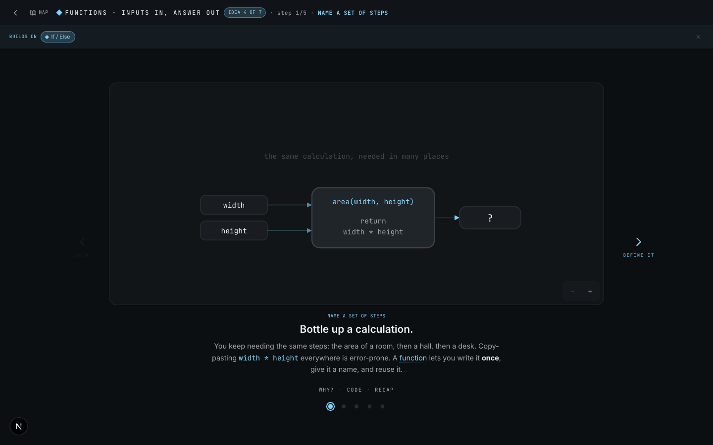
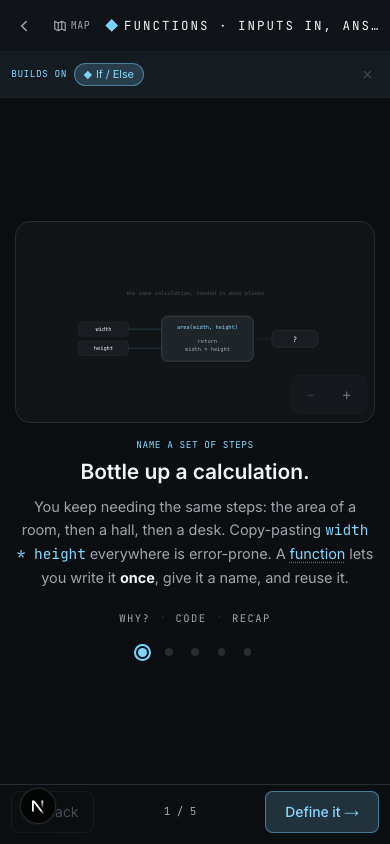

The diagram draws the function-as-machine: two stacked input chips labeled `width` and `height` on the left, arrows feeding into a rounded box that reads `area(width, height)` / `return` / `width * height`, and an arrow out to a `?` box on the right. The caption above reads "the same calculation, needed in many places". The header bar shows MAP, the diamond FUNCTIONS title with "INPUTS IN, ANSWER OUT", an "IDEA 4 OF 7" pill, and "step 1/5 · NAME A SET OF STEPS". A "BUILDS ON" row carries an "If / Else" prereq pill with a close (X). The main panel below the canvas shows the eyebrow label "NAME A SET OF STEPS", the title "Bottle up a calculation.", and body text about copy-pasting `width * height` being error-prone, with `function` linked as a term. Under it sit the WHY? · CODE · RECAP chips and five progress dots (first filled). The side nav reads "BACK" (left) and "DEFINE IT" (right). No gate; the learner advances with DEFINE IT. On mobile the canvas and panel stack vertically, the prereq pill stays in the BUILDS ON row, and a bottom bar shows Back, "1 / 5", and a "Define it" button.

### Beat 2 — def — the recipe

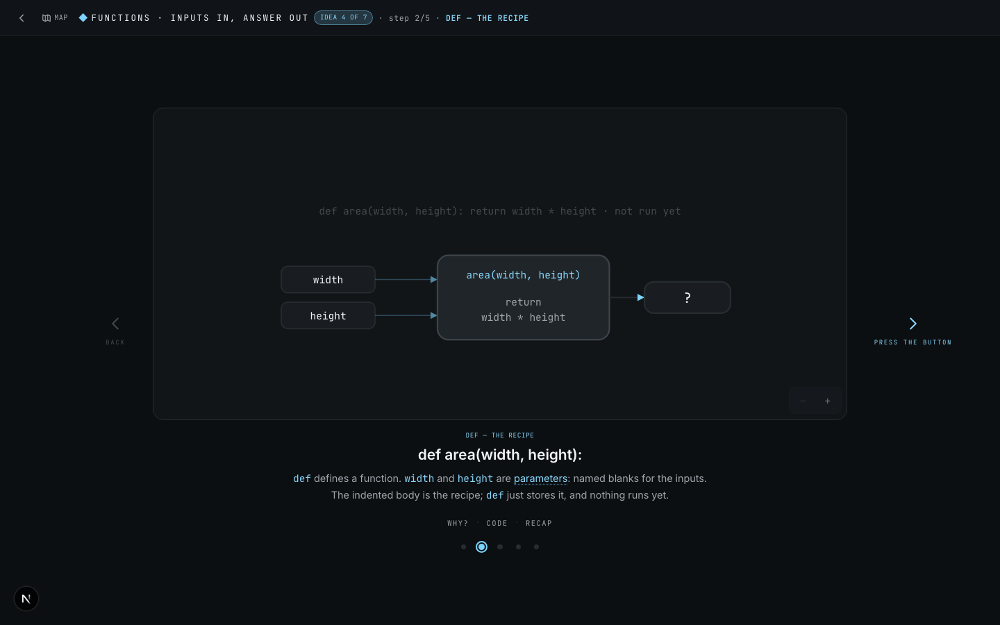
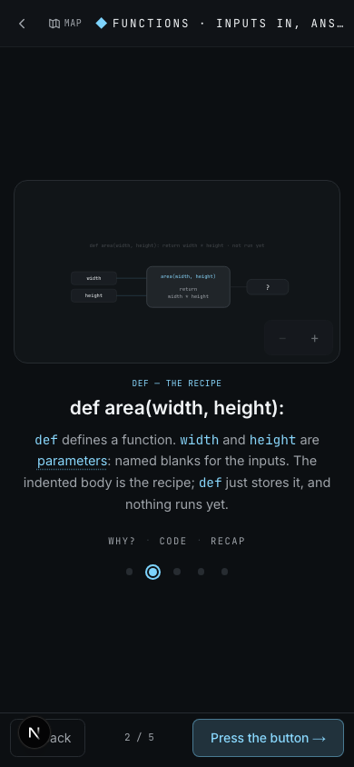

The same machine diagram renders, still with `width`/`height` inputs and an unlit `?` output. The caption reads "def area(width, height): return width * height · not run yet". Header shows "step 2/5 · DEF — THE RECIPE". The main panel title is "def area(width, height):" with body explaining `def` defines a function, `width` and `height` are `parameters` (named blanks), the indented body is the recipe, and nothing runs yet. Progress dots show the second dot filled. Side nav reads "BACK" and "PRESS THE BUTTON". No gate; advancing is a click on the right nav. Mobile stacks canvas over panel with the bottom Back / "2 / 5" / next bar.

### Beat 3 — call — fill the blanks

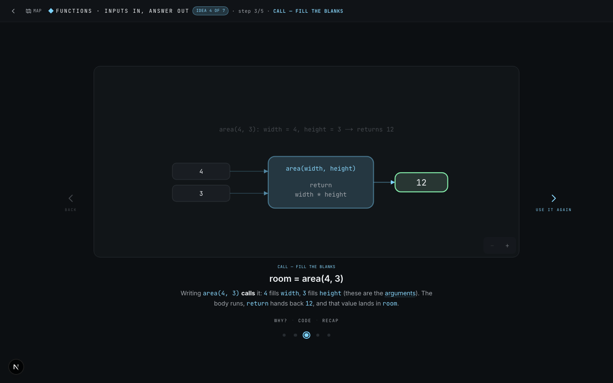
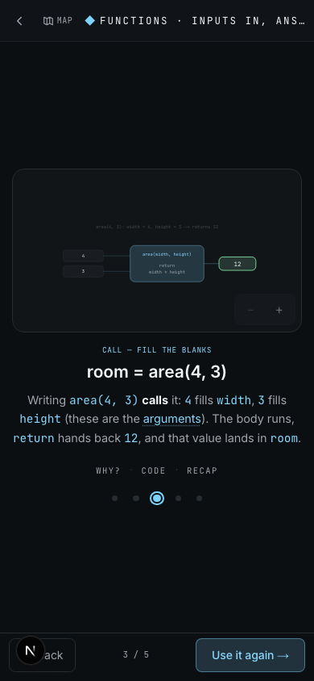

The machine is lit: the input chips now read `4` and `3`, the central machine box is highlighted with the accent fill/stroke, and the output box on the right shows `12` in the green "good" tone. The caption reads "area(4, 3): width = 4, height = 3 → returns 12". Header shows "step 3/5 · CALL — FILL THE BLANKS". The main panel title is "room = area(4, 3)" and the body explains writing `area(4, 3)` calls it, `4` fills `width`, `3` fills `height` (the `arguments`), the body runs, `return` hands back `12`, and the value lands in `room`. Third progress dot filled. Side nav reads "BACK" and "USE IT AGAIN". No gate; advance via the right nav.

### Beat 4 — Reuse it

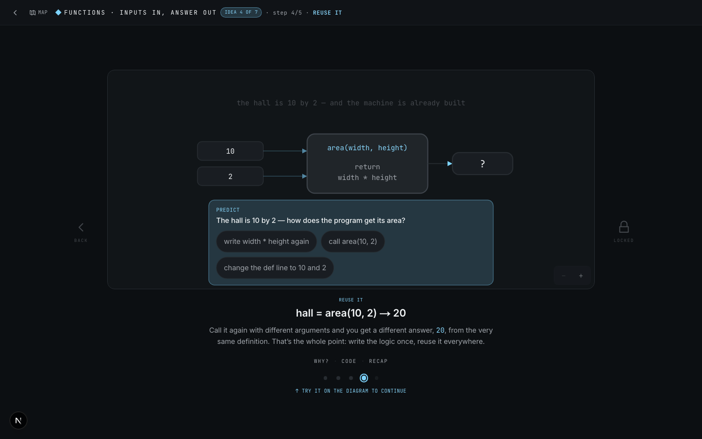
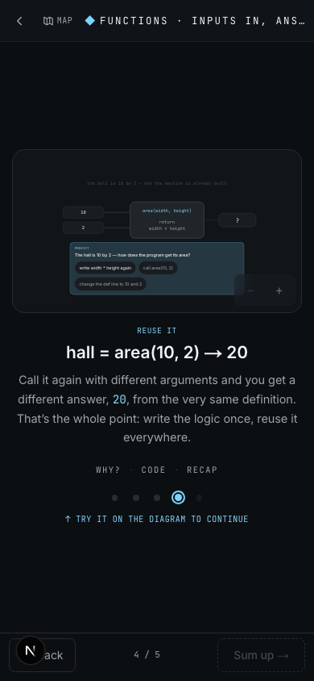

This beat is gated (wedge / predict gate). The diagram shows the machine with inputs `10` and `2` and an unlit `?` output; the caption reads "the hall is 10 by 2 — and the machine is already built". A PREDICT panel is overlaid on the canvas with the question "The hall is 10 by 2 — how does the program get its area?" and three choice chips: "write width * height again", "call area(10, 2)", and "change the def line to 10 and 2". Header shows "step 4/5 · REUSE IT". The right side nav reads "LOCKED" with a lock icon, and the prompt "↑ TRY IT ON THE DIAGRAM TO CONTINUE" sits under the progress dots (fourth dot filled). The main panel title is "hall = area(10, 2) → 20" with body about calling again with different arguments to get `20` from the same definition. The gate clears when the learner picks the correct choice ("call area(10, 2)"); on reveal the caption changes to "area(10, 2) → 20 · one definition, any inputs", the machine lights and the output box shows `20`, which unlocks the next nav. On mobile the PREDICT panel renders inside the canvas the same way, the bottom "Sum up" button is shown disabled, and the "TRY IT ON THE DIAGRAM TO CONTINUE" prompt appears; this gate is where the mobile run stopped (mobile reached 4 of 5 beats).

### Beat 5 — Inputs in, answer out

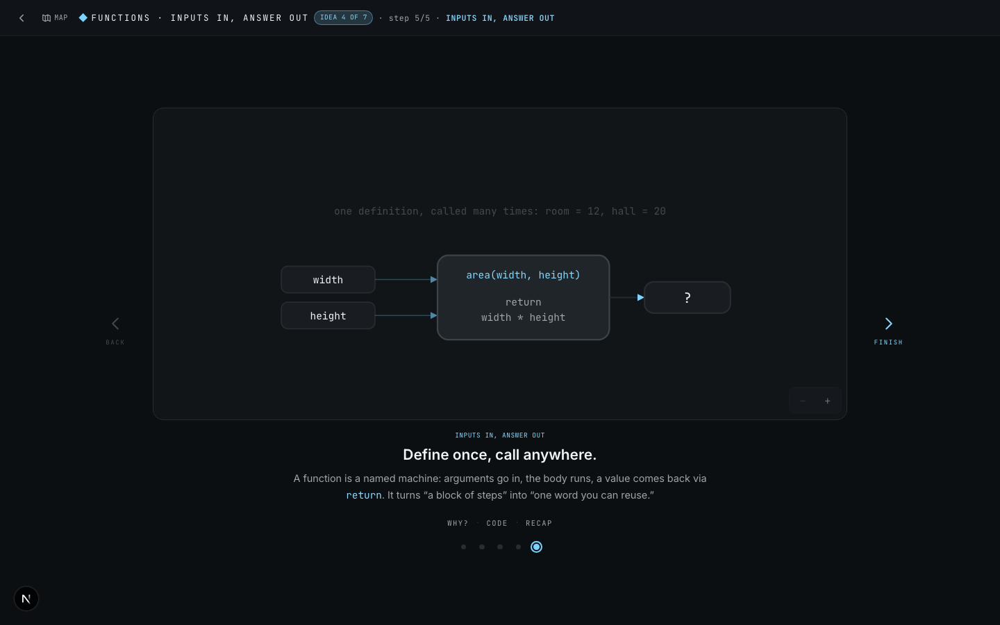

The diagram returns to the generic machine with `width`/`height` inputs and an unlit `?` output. The caption reads "one definition, called many times: room = 12, hall = 20". Header shows "step 5/5 · INPUTS IN, ANSWER OUT". The main panel title is "Define once, call anywhere." with body that a function is a named machine — arguments in, body runs, a value back via `return` — turning "a block of steps" into "one word you can reuse." Fifth (last) progress dot filled. Side nav reads "BACK" and "FINISH". No mobile shot exists for this beat because the mobile run stopped at the beat 4 gate.

### Code drawer

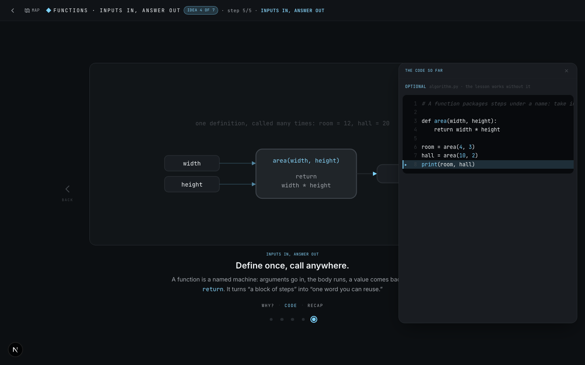

The drawer slides in from the right titled "THE CODE SO FAR", tagged "OPTIONAL · algorithm.py · the lesson works without it", with a close (X). It shows the eight-line Python source with line numbers: a comment on line 1 ("# A function packages steps under a name: take i…", clipped at the drawer edge), `def area(width, height):` / `return width * height`, then `room = area(4, 3)`, `hall = area(10, 2)`, and `print(room, hall)`. Line 8 (`print(room, hall)`) is highlighted with a left arrow marker as the current line. The underlying canvas (machine diagram, caption, panel) stays visible to the left while the drawer is open.

---

## for-loops
route: `/categories/programming-basics/for-loops/` · diagram shape: line

### Beat 1 — Walk a collection
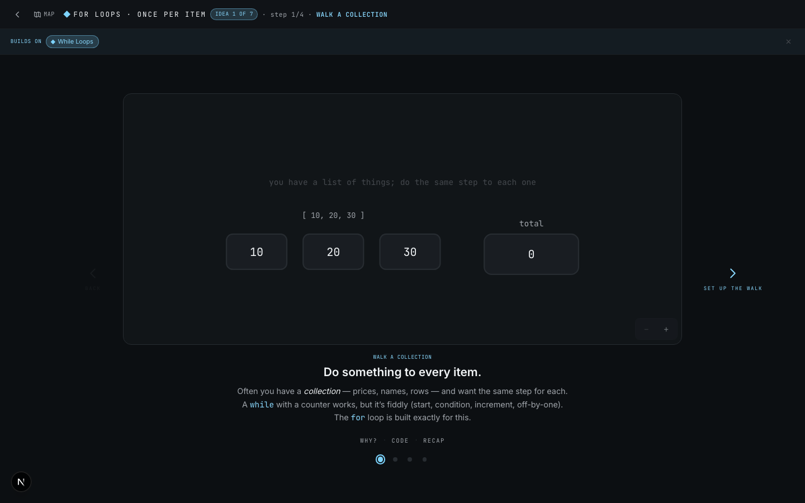
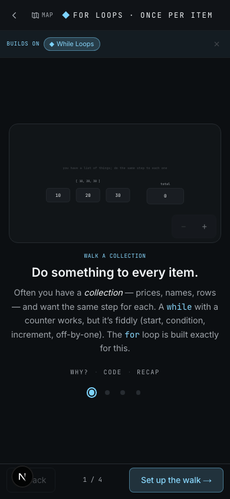
The header reads `FOR LOOPS · ONCE PER ITEM` with an `IDEA 1 OF 7` pill, a `MAP` link, and `step 1/4 · WALK A COLLECTION`. A `BUILDS ON` strip carries one prereq pill, `While Loops`, with a dismiss × on the right. The canvas shows the caption "you have a list of things; do the same step to each one" above the monospace literal `[ 10, 20, 30 ]` and three boxes holding 10, 20, 30, none highlighted; to the right a `total` box reads 0. The main panel below reads "WALK A COLLECTION / Do something to every item." with body prose about collections and the fiddliness of a `while` counter. The why·code·recap chips and four progress dots (first filled) sit at the bottom; side nav shows `BACK` (left, dimmed) and a `›` with `SET UP THE WALK` (right). On mobile the panel stacks under the canvas and the right-arrow becomes a bottom `Set up the walk →` button with a `1 / 4` counter; the diagram text is scaled down. No interaction gate — advancing is by the next-step arrow.

### Beat 2 — First item
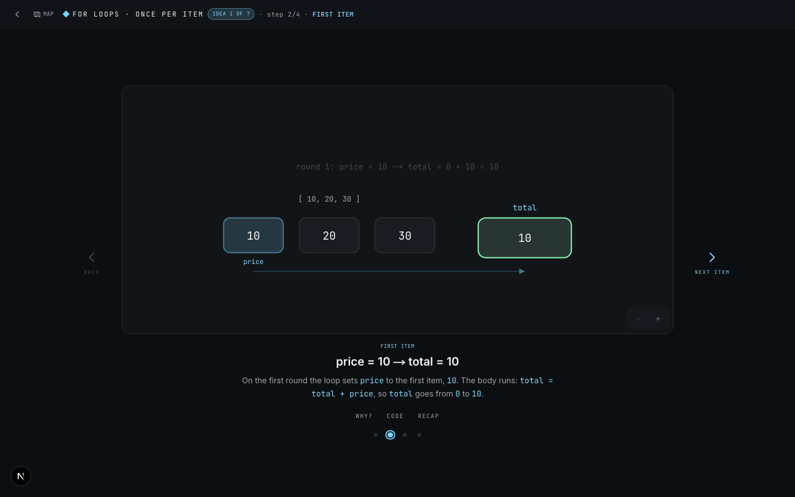
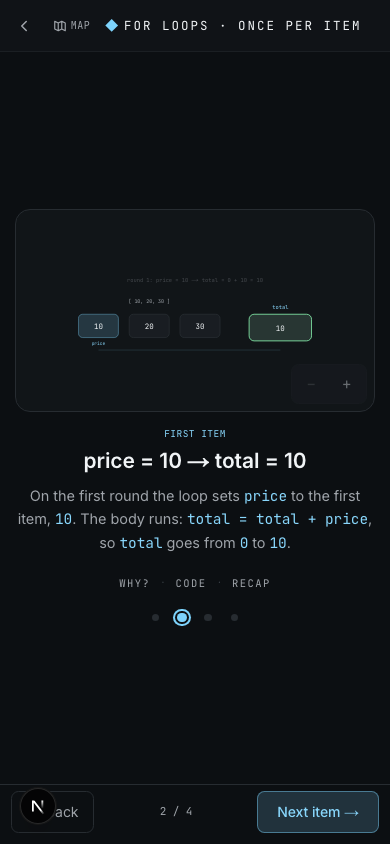
Header now reads `step 2/4 · FIRST ITEM`. The caption is "round 1: price = 10 → total = 0 + 10 = 10". In the box row the first item (10) is highlighted with an accent border and labelled `price` underneath; 20 and 30 are plain. The `total` box on the right is highlighted green at 10, and a faint arrow runs from the price box across to the total box. The main panel reads "FIRST ITEM / price = 10 → total = 10" with body text explaining the loop set `price` to the first item and ran `total = total + price`. Progress dots show the second dot filled. Side nav: `BACK` left, `› NEXT ITEM` right. Mobile mirrors this with the panel stacked below and a `Next item →` button, counter `2 / 4`. No interaction gate.

### Beat 3 — Each one in turn
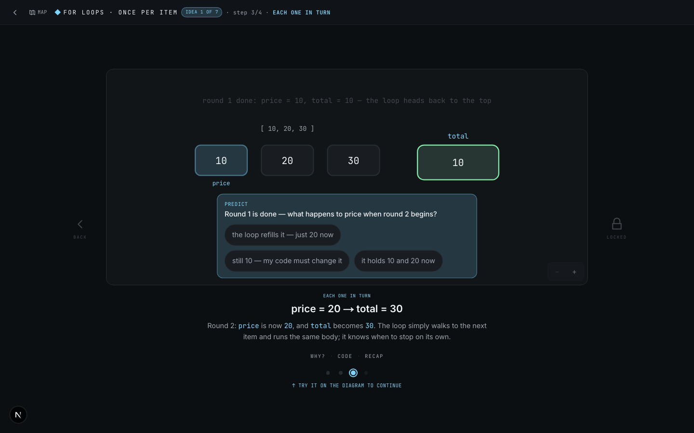
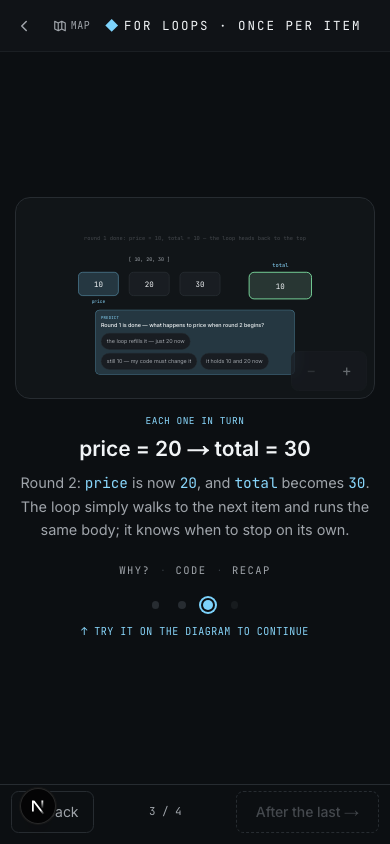
Header reads `step 3/4 · EACH ONE IN TURN`. Before the gate clears, the caption reads "round 1 done: price = 10, total = 10 — the loop heads back to the top"; the first box (10) is highlighted as `price` and `total` is 10. Overlaid on the canvas is a `PREDICT` card asking "Round 1 is done — what happens to price when round 2 begins?" with three choices: "the loop refills it — just 20 now", "still 10 — my code must change it", and "it holds 10 and 20 now". This beat is gated (interaction type: wedge / predict gate). The right side nav shows a lock icon with `LOCKED`, and a hint "↑ TRY IT ON THE DIAGRAM TO CONTINUE" sits under the progress dots (third dot filled). Selecting the correct choice ("the loop refills it") clears the gate and reveals round 2 — the caption becomes "round 2: price = 20 → total = 10 + 20 = 30", the second box (20) highlights as `price`, and `total` updates to 30, which is the state the panel ("price = 20 → total = 30") describes. On mobile the same predict card renders over the canvas with the lock unrendered in the desktop side-rail position; the bottom bar shows `After the last →` and counter `3 / 4`. In the automated capture the mobile run stopped at this beat (reached 3 of 4), so beat 4 has no mobile shot — the predict gate held mobile here.

### Beat 4 — Out the other side
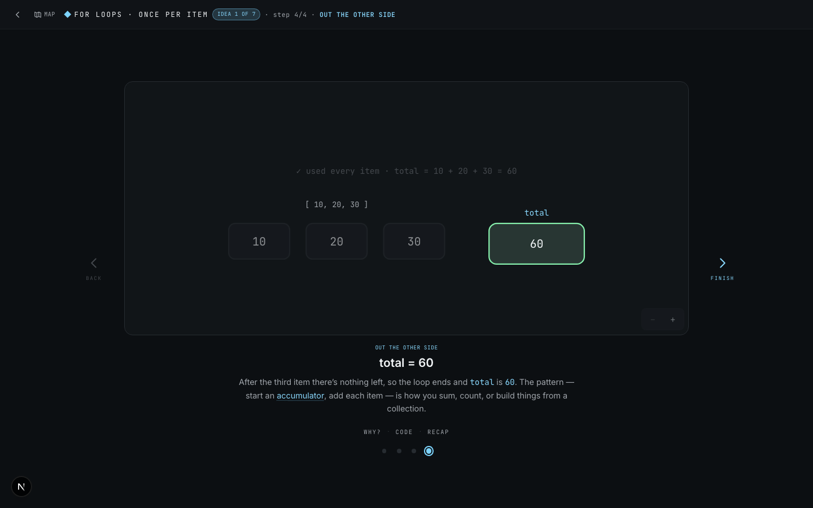
Header reads `step 4/4 · OUT THE OTHER SIDE`. The caption reads "✓ used every item · total = 10 + 20 + 30 = 60"; all three boxes (10, 20, 30) render as past/dimmed with none highlighted, and the `total` box is highlighted green at 60. The main panel reads "OUT THE OTHER SIDE / total = 60" with body text noting that after the third item there is nothing left, the loop ends, and the start-an-accumulator-and-add-each-item pattern is named (the word "accumulator" is a linked Term). Progress dots show the fourth dot filled; side nav shows `BACK` left and `› FINISH` right. No mobile shot was captured for this beat.

### Code drawer
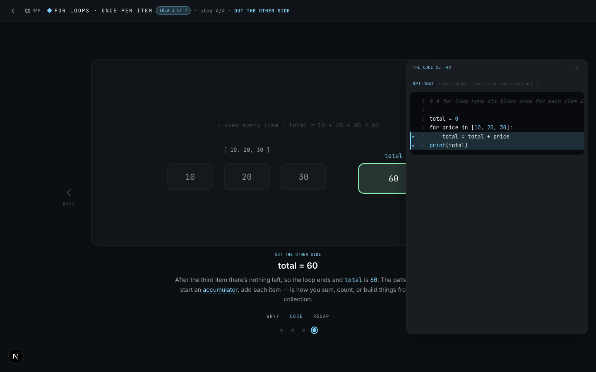
The drawer opens on the right titled "THE CODE SO FAR" with an `OPTIONAL` tag and the note "algorithm.py · the lesson works without it". It shows numbered source lines: a comment "# A for loop runs its block once for each item i...", a blank line, `total = 0`, `for price in [10, 20, 30]:`, `total = total + price`, and `print(total)`. Lines 5 and 6 are highlighted with a `▸` gutter marker, corresponding to this beat's `codeLabels` (body, after). The drawer overlays the right portion of the canvas while the main panel stays visible beneath.

---

## while-loops
route: `/categories/programming-basics/while-loops/` · diagram shape: line

The capture ran in the structured register (4 beats: need, run, exit, recap; the intuitive-only `setup` beat is cut). Desktop reached all 4 beats; mobile reached 3 of 4 — the predict gate on Beat 3 blocked advancement on the captured mobile pass (see Beat 3 below).

### Beat 1 — Repeat without copying
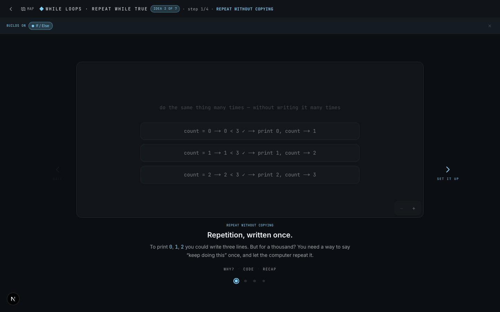
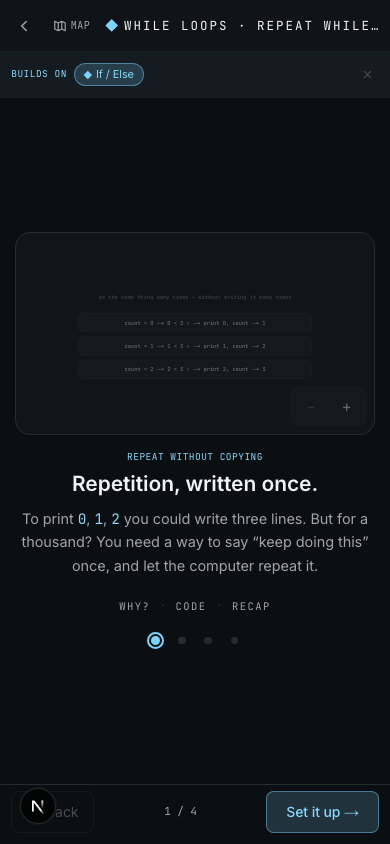
The diagram is three stacked rounded rows on the line-shape canvas, all dimmed (idle): `count = 0 → 0 < 3 ✓ → print 0, count → 1`, the same for `1` and `2`. Above them sits the dimmed caption "do the same thing many times — without writing it many times". The top bar reads MAP · WHILE LOOPS · REPEAT WHILE TRUE with an "IDEA 3 OF 7" pill and "step 1/4 · REPEAT WITHOUT COPYING"; a "BUILDS ON" strip below shows an "If / Else" prereq pill with a close (x) control. The main panel under the canvas shows the eyebrow "REPEAT WITHOUT COPYING", the idea title "Repetition, written once.", and body text about printing 0, 1, 2 vs. a thousand. Below are the WHY? · CODE · RECAP chips and four progress dots (first filled). The right side nav reads "SET IT UP" (the action label) with a chevron; left side nav reads "BACK". There is no gate; advancing uses the right-side action. On mobile the layout stacks vertically with a bottom bar showing "Back", "1 / 4", and a "Set it up →" button.

### Beat 2 — Round by round
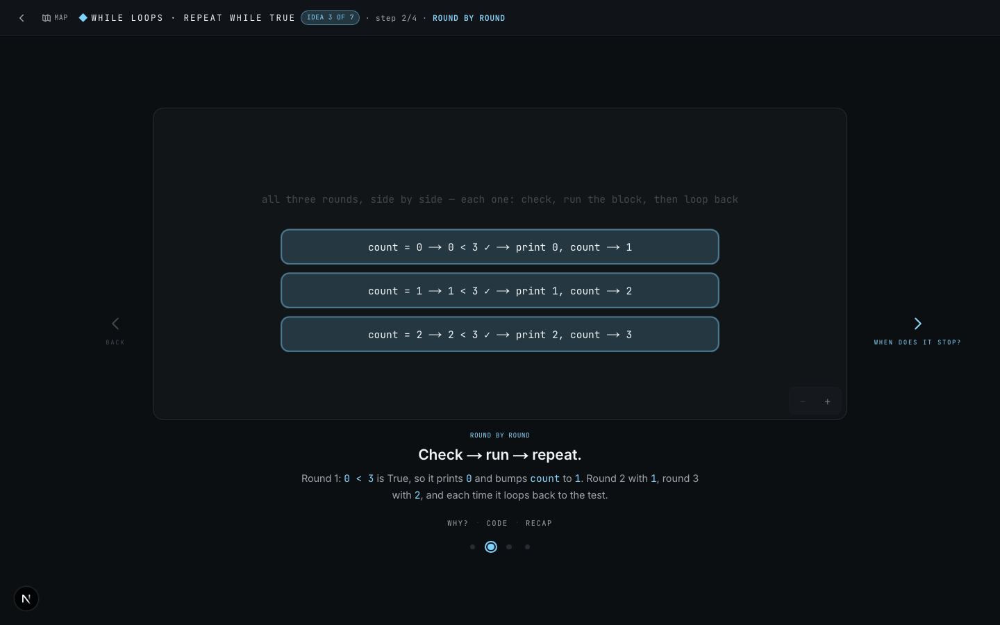
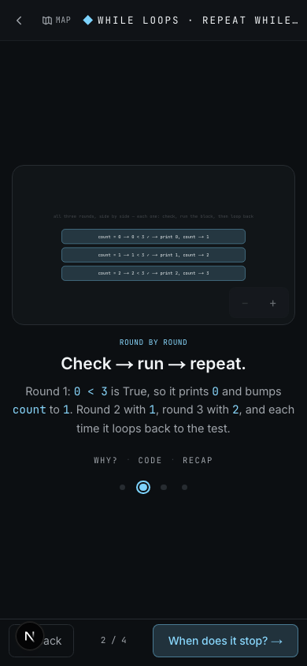
The same three round rows are now active (highlighted, accent-bordered, brighter fill) rather than dimmed, with the caption "all three rounds, side by side — each one: check, run the block, then loop back". The top bar shows "step 2/4 · ROUND BY ROUND". The main panel reads eyebrow "ROUND BY ROUND", title "Check → run → repeat.", and body tracing Round 1 (`0 < 3` True, prints `0`, bumps `count` to `1`), then rounds 2 and 3. Progress dots show the second filled. Right side nav reads "WHEN DOES IT STOP?" (the action label for the exit beat), left reads "BACK". No gate on this beat; advancing uses the right-side action. Mobile bottom bar shows "2 / 4" and a "When does it stop? →" button.

### Beat 3 — The exit
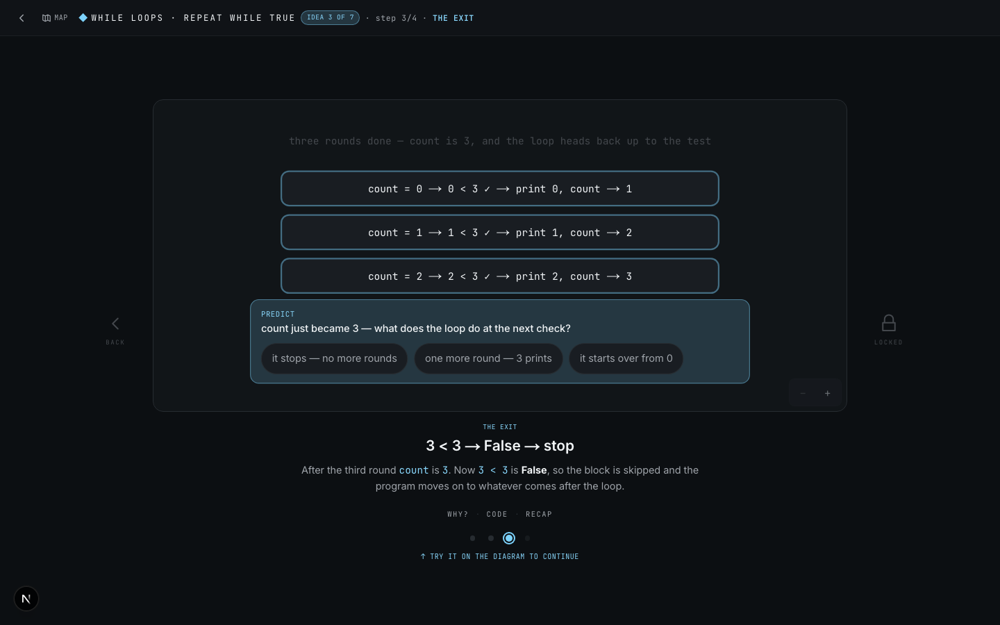
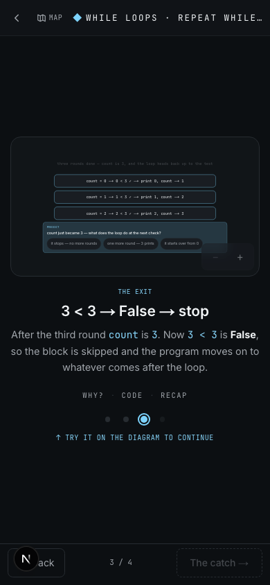
The three rounds stay active, with caption "three rounds done — count is 3, and the loop heads back up to the test". A PREDICT gate panel overlays the lower part of the diagram, posing "count just became 3 — what does the loop do at the next check?" with three choice chips: "it stops — no more rounds", "one more round — 3 prints", and "it starts over from 0". The main panel reads eyebrow "THE EXIT", title "3 < 3 → False → stop", and body explaining that after the third round `count` is `3`, `3 < 3` is False, the block is skipped, and the program moves on. This beat is gated: the right side nav reads "LOCKED" with a padlock icon, and below the progress dots a prompt reads "↑ TRY IT ON THE DIAGRAM TO CONTINUE". The learner must tap a prediction chip in the diagram; the correct choice is "it stops — no more rounds" (note: 3 < 3 is False so the block is skipped). After the tap and a feedback pause the visual reveals the failed exit row and updates the caption to "count is now 3 → 3 < 3 is False → the loop stops". On mobile the gate renders the same and the bottom-bar "The catch →" button is shown disabled; this gate is where the mobile pass stopped (3/4 reached), so mobile did not capture Beat 4.

### Beat 4 — Repeat while true
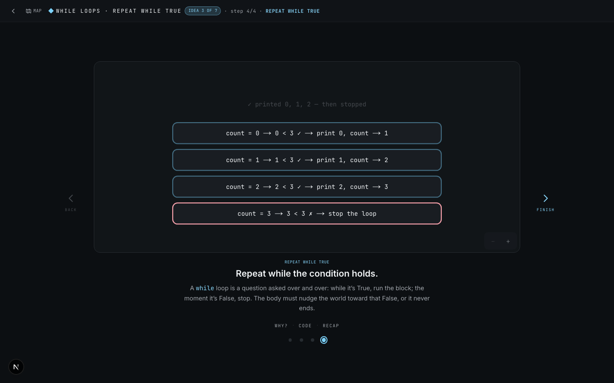
The diagram now shows all three active rounds plus a fourth row in a red (bad) tone: `count = 3 → 3 < 3 ✗ → stop the loop`, with the caption "✓ printed 0, 1, 2 — then stopped". The top bar reads "step 4/4 · REPEAT WHILE TRUE". The main panel shows eyebrow "REPEAT WHILE TRUE", title "Repeat while the condition holds.", and body describing the while loop as a question asked over and over — True runs the block, False stops, and the body must nudge toward False. Progress dots show the fourth filled. Right side nav reads "FINISH", left reads "BACK". No mobile shot exists for this beat (gate at Beat 3 blocked the mobile pass).

### Code drawer
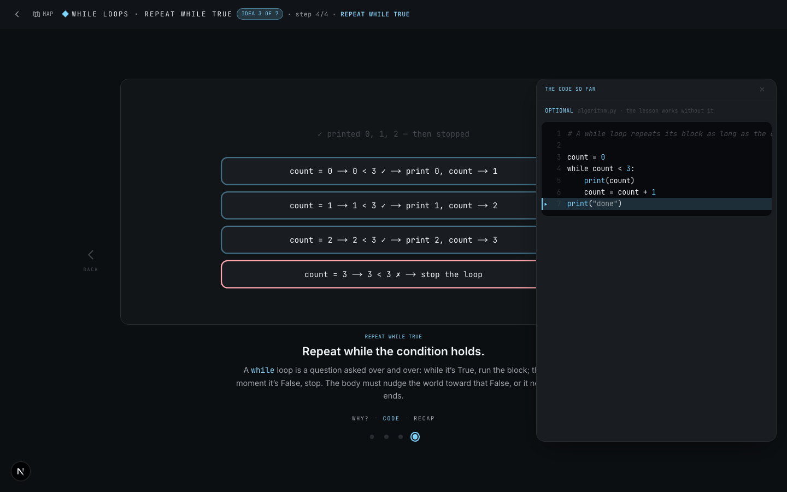
Opened over the right side of the Beat 4 view, the drawer is titled "THE CODE SO FAR" with a close (x) control and an "OPTIONAL  algorithm.py · the lesson works without it" subhead. It shows numbered Python lines: a comment "# A while loop repeats its block as long as the …" (truncated at the panel edge), `count = 0`, `while count < 3:`, `print(count)`, `count = count + 1`, and a highlighted line 7 `print("done")` marked with a ▶ pointer. The underlying main panel (title "Repeat while the condition holds.") remains visible to the left.

---

## try-except
route: `/categories/programming-basics/try-except/` · diagram shape: line

### Beat 1 — Code that can fail
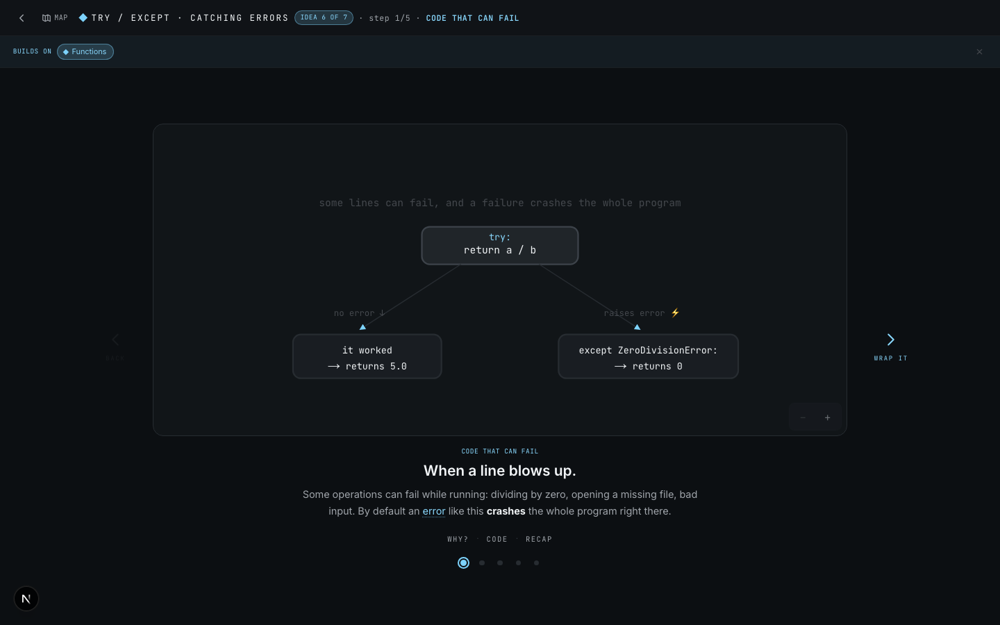
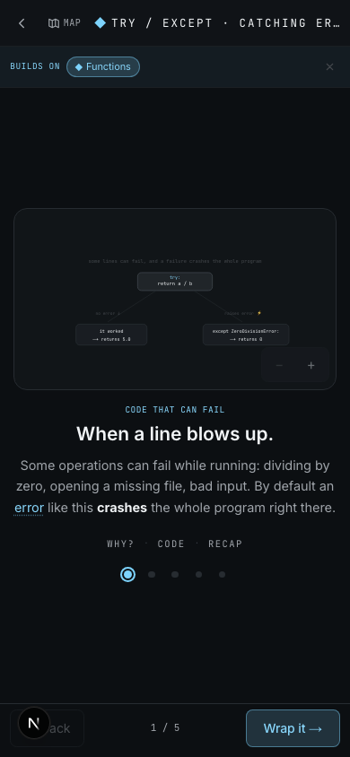
The diagram is a branching flow: a top `try: / return a / b` box splits into two downward-arrow routes labeled "no error" (left, to an "it worked → returns 5.0" box) and "raises error" with a lightning glyph (right, to an "except ZeroDivisionError: → returns 0" box). On this beat both routes render neutral/unlit. The dim caption above reads "some lines can fail, and a failure crashes the whole program". The header shows "TRY / EXCEPT · CATCHING ERRORS", an "IDEA 6 OF 7" pill, "step 1/5", and the beat label "CODE THAT CAN FAIL"; a "BUILDS ON · Functions" prereq pill sits below. The main panel reads idea "CODE THAT CAN FAIL", title "When a line blows up.", with body prose about division by zero, missing files, and bad input crashing the program; "error" is an underlined Term. Below are the WHY? · CODE · RECAP chips and a row of 5 progress dots with the first filled. The right side nav reads "WRAP IT", left reads "BACK". No gate; advancing is by the side nav / Wrap it button. On mobile the diagram is scaled to a single column, the side-nav labels become bottom "Back" and "Wrap it" buttons, and a "1 / 5" counter sits between them.

### Beat 2 — try — attempt it
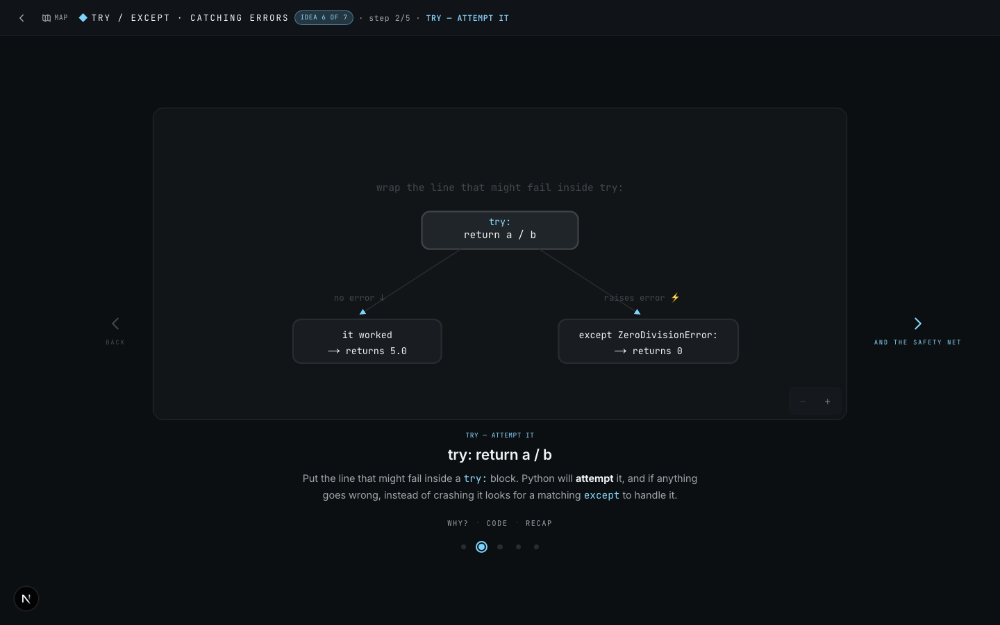
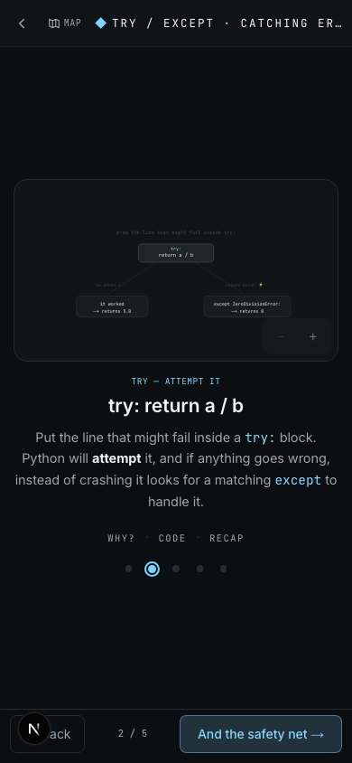
The same branching flow renders, with the `try: / return a / b` box now drawn with a brighter (highlighted) stroke than the two outcome boxes below it, which stay neutral. The caption reads "wrap the line that might fail inside try:". Header shows "step 2/5" and label "TRY — ATTEMPT IT". The main panel idea is "TRY — ATTEMPT IT", title "try: return a / b", body explaining that the risky line goes inside a `try:` block which Python attempts and, on failure, looks for a matching `except`. Progress dots show the second dot filled. Side nav: left "BACK", right "AND THE SAFETY NET". No gate; advance by side nav.

### Beat 3 — except — catch it
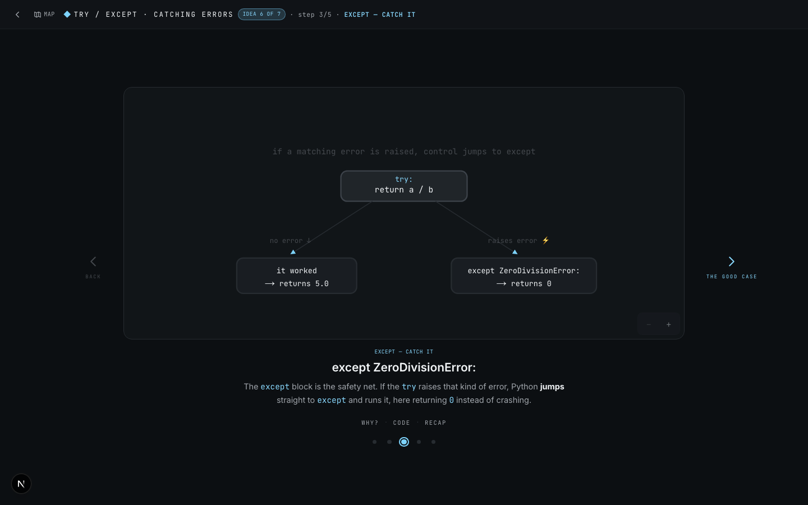
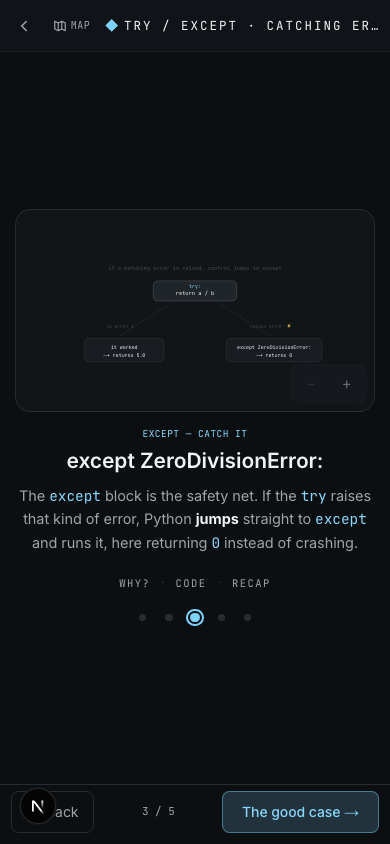
The same flow diagram, routes still unlit. Caption reads "if a matching error is raised, control jumps to except". Header shows "step 3/5" and label "EXCEPT — CATCH IT". The main panel idea is "EXCEPT — CATCH IT", title "except ZeroDivisionError:", body describing the `except` block as the safety net Python jumps to when `try` raises that error, returning `0` instead of crashing. The third progress dot is filled. Side nav: left "BACK", right "THE GOOD CASE". No gate; advance by side nav.

### Beat 4 — The happy path
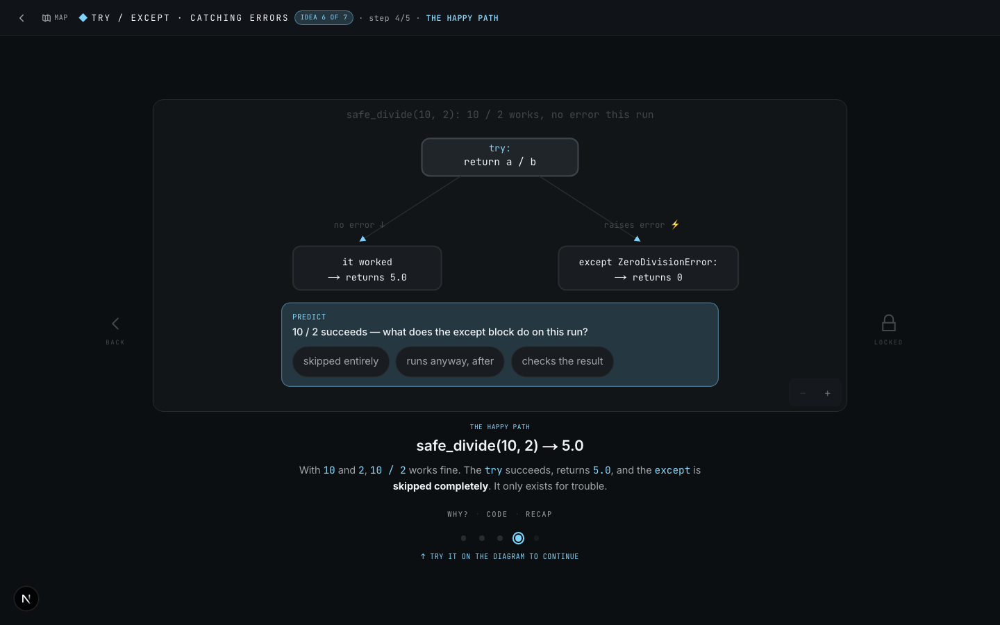
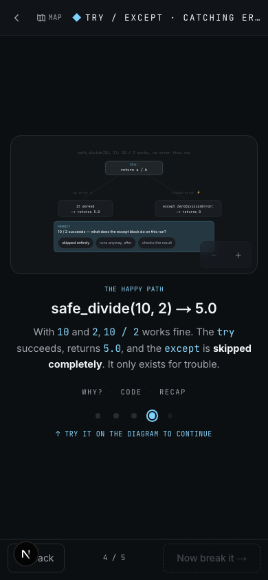
This beat is gated by a predict gate. The flow diagram shifts up to make room for a "PREDICT" panel overlaid on the lower diagram area, asking "10 / 2 succeeds — what does the except block do on this run?" with three choice chips: "skipped entirely", "runs anyway, after", and "checks the result". The caption above the boxes reads "safe_divide(10, 2): 10 / 2 works, no error this run" and both routes are unlit before the prediction. Header shows "step 4/5" and label "THE HAPPY PATH". The main panel idea is "THE HAPPY PATH", title "safe_divide(10, 2) → 5.0", body explaining the `try` succeeds, returns `5.0`, and the `except` is "skipped completely". Below the WHY? · CODE · RECAP chips, the fourth progress dot is filled and a hint reads "↑ TRY IT ON THE DIAGRAM TO CONTINUE". The right side nav reads "LOCKED" with a padlock icon. The gate clears when the learner taps a prediction choice on the diagram: that fires the interaction-done signal and reveals the lit "ok" route (the no-error path and the "it worked → returns 5.0" box light, caption updates to note "except skipped"), which unlocks the next-beat nav. On mobile the predict panel renders inside the scaled diagram with the same three chips, the "↑ TRY IT ON THE DIAGRAM TO CONTINUE" hint shows, and the bottom "Now break it →" button is disabled (dimmed) until the gate is cleared.

Mobile capture stopped at this beat (reached 4/5 versus desktop 5/5): the predict gate at Beat 4 was not cleared in the mobile run, so the locked next-beat control kept Beat 5 unreachable on mobile.

### Beat 5 — The caught error
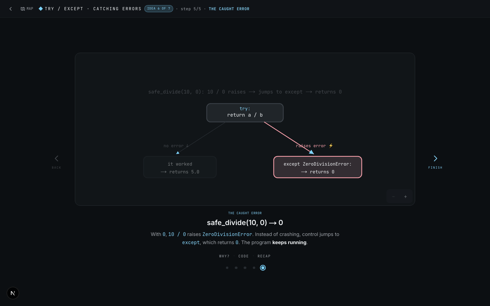
The flow diagram now lights the error route: the "raises error" arrow and the "except ZeroDivisionError: → returns 0" box render in the red/hard-difficulty tone with a glowing border, while the left "no error / it worked" box is dimmed. The caption reads "safe_divide(10, 0): 10 / 0 raises → jumps to except → returns 0". Header shows "step 5/5" and label "THE CAUGHT ERROR". The main panel idea is "THE CAUGHT ERROR", title "safe_divide(10, 0) → 0", body explaining that `10 / 0` raises `ZeroDivisionError`, control jumps to `except` which returns `0`, and the program "keeps running". The fifth progress dot is filled. Side nav: left "BACK", right "FINISH". No mobile shot exists for this beat (mobile did not reach it).

### Code drawer
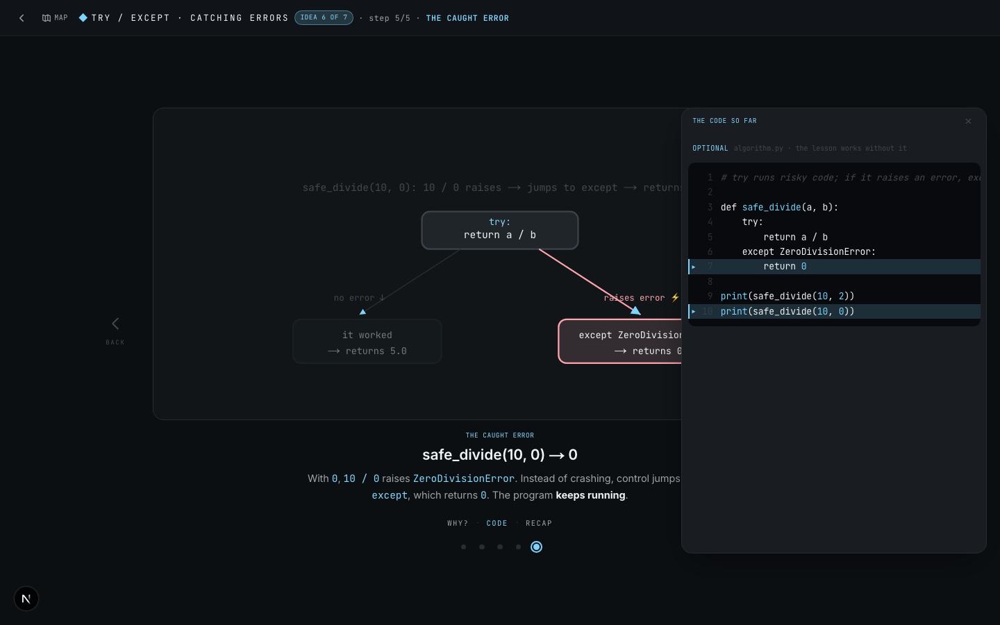
The drawer opens from the right edge over the Beat 5 scene, headed "THE CODE SO FAR" with a close (×) button. A sub-label reads "OPTIONAL · algorithm.py · the lesson works without it". It shows the Python source with line numbers: a comment "# try runs risky code; if it raises an error, ex…" (truncated at the drawer edge), then `def safe_divide(a, b):` with a `try: / return a / b` block, an `except ZeroDivisionError: / return 0` handler, and two calls `print(safe_divide(10, 2))` and `print(safe_divide(10, 0))`. Lines tied to the current beat are highlighted: line 7 (`return 0`) and line 10 (`print(safe_divide(10, 0))`) carry the active-line markers/highlight matching Beat 5's codeLabels.

---

## arrays
route: `/categories/data-structures/arrays/` · diagram shape: line

The runtime exposes 5 reachable beats (the header reads "step 1/5" through "step 5/5"). The lesson spec defines 7 beats, but two of them (`pile` "The obvious thing" and `fit` "When it fits") carry `trimOnRefresh: true` and were trimmed out, leaving the reachable sequence: setup, wedge, structure, operations, name. Desktop reached all 5; mobile reached 4 (the predict gate on beat 4 was not cleared, so it stopped there).

### Beat 1 — The setup
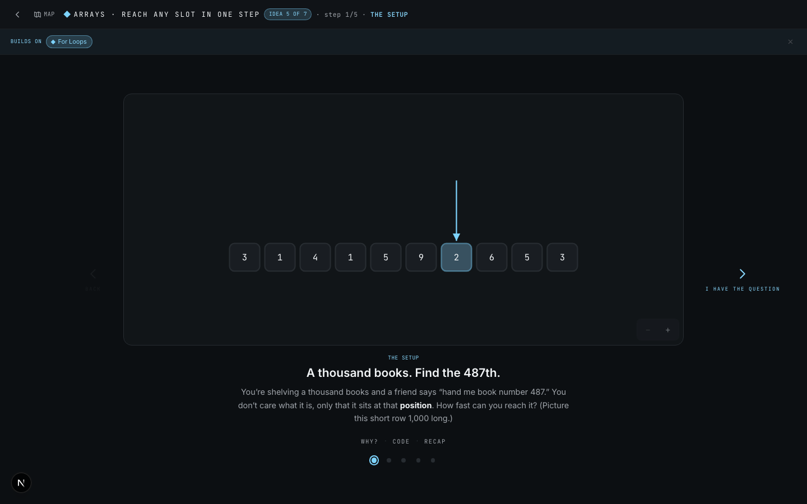
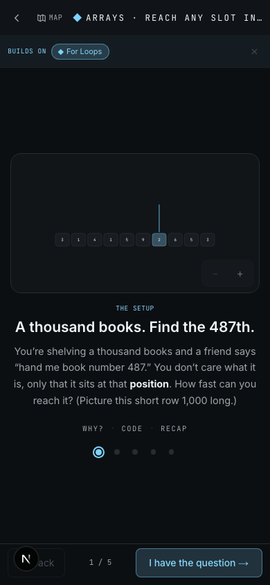

The diagram is a single horizontal row of ten same-size cells holding the values 3, 1, 4, 1, 5, 9, 2, 6, 5, 3; the cell at index 6 (value 2) is highlighted in an active blue tone with a vertical arrow pointing down into it. Top bar shows the "MAP" link, "ARRAYS · REACH ANY SLOT IN ONE STEP", an "IDEA 5 OF 7" pill, "step 1/5", and the beat label "THE SETUP". A "BUILDS ON" strip below the bar shows a prereq pill "For Loops". The main panel below the diagram is labeled "THE SETUP" with the title "A thousand books. Find the 487th." and body text about reaching book number 487 by its position. The why · code · recap chips sit under the panel above five progress dots (first dot filled). The right side nav reads "I HAVE THE QUESTION" with a forward chevron; the left reads "BACK". No interaction gate — clicking the forward control advances. On mobile the layout stacks vertically with the diagram in a card and a bottom bar showing "Back", "1 / 5", and "I have the question".

### Beat 2 — The instinct
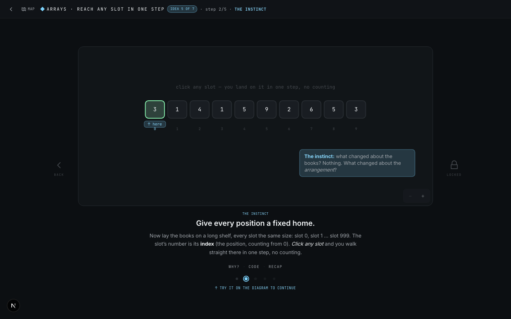
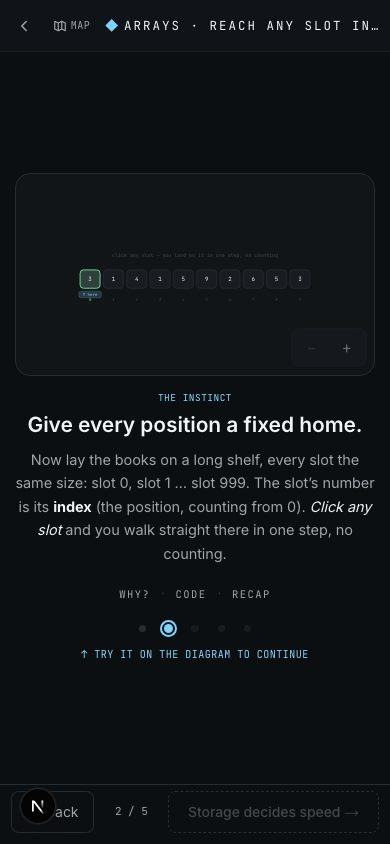

The diagram is the ten-cell row with index 0 (value 3) outlined in a green "good" tone and a "↑ here" marker beneath it; an index strip 0–9 runs below the cells, with the selected index drawn in accent ink. A caption above the row reads "click any slot — you land on it in one step, no counting". The main panel is labeled "THE INSTINCT", titled "Give every position a fixed home.", with body text introducing slot 0…999 and the term index. A secondary note panel on the right reads "The instinct: what changed about the books? Nothing. What changed about the arrangement?" This beat is a wedge gate (`interaction: "wedge"`): the right side nav shows a lock icon labeled "LOCKED" and the footer reads "↑ TRY IT ON THE DIAGRAM TO CONTINUE". The learner clicks any slot; the clicked cell turns green, the marker and index strip move to it, the caption updates to show `arr[i]` with the `base + i × size · 1 jump` text, and the gate fires `onInteractionDone`, unlocking the advance ("Storage decides speed"). Mobile shows the same gated state at step 2/5 with a dimmed "Storage decides speed" button and the "TRY IT ON THE DIAGRAM TO CONTINUE" prompt.

### Beat 3 — The structure
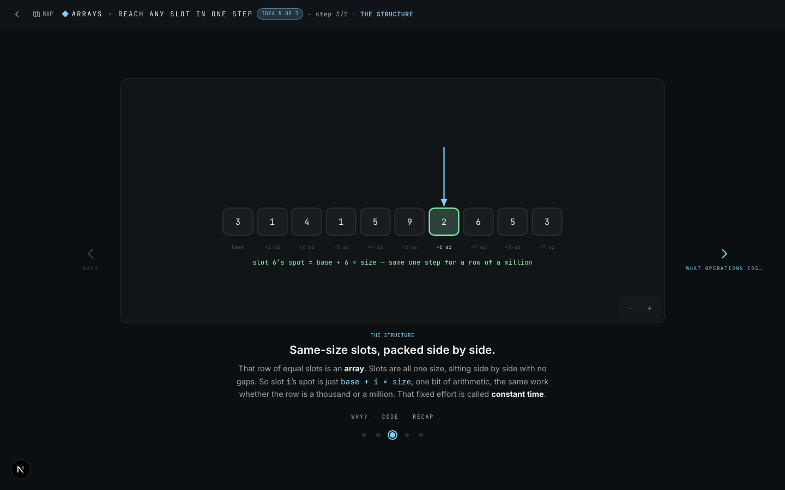
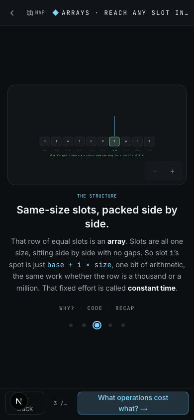

The diagram is the memory ruler: the ten-cell row with index 6 (value 2) highlighted green and an address-offset label under every cell — "base" under index 0, then "+1·sz", "+2·sz" … "+9·sz". A vertical arrow points down into the highlighted cell, and a green line below reads "slot 6's spot = base + 6 × size — same one step for a row of a million". The main panel is labeled "THE STRUCTURE", titled "Same-size slots, packed side by side.", explaining the `base + i × size` address arithmetic and the term constant time. The why · code · recap chips and five progress dots (third filled) sit below. Right nav reads "WHAT OPERATIONS COS…" (truncated) with a forward chevron; left reads "BACK". No interaction gate — this is a static visual that advances on click.

### Beat 4 — The operations
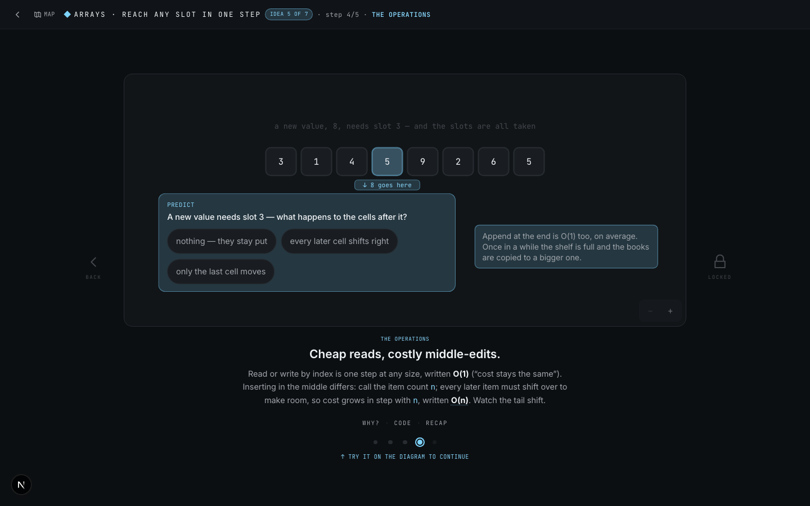
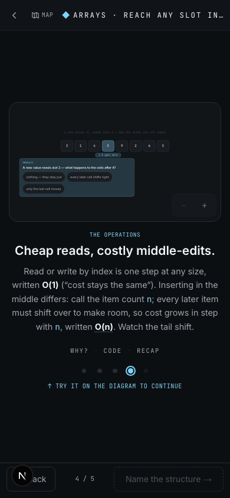

The diagram is the insert-cost predict gate. An eight-cell row (3, 1, 4, 5, 9, 2, 6, 5) is shown with index 3 (value 5) highlighted active and a "↓ 8 goes here" marker beneath it; a caption above reads "a new value, 8, needs slot 3 — and the slots are all taken". A PREDICT panel is hosted on the canvas with the question "A new value needs slot 3 — what happens to the cells after it?" and three choice pills: "nothing — they stay put", "every later cell shifts right", and "only the last cell moves". A right note panel reads "Append at the end is O(1) too, on average. Once in a while the shelf is full and the books are copied to a bigger one." The main panel is labeled "THE OPERATIONS", titled "Cheap reads, costly middle-edits.", explaining O(1) reads versus O(n) middle inserts. This beat is a predict gate (`interaction: "wedge"`): the right side nav shows a lock icon labeled "LOCKED" and the footer reads "↑ TRY IT ON THE DIAGRAM TO CONTINUE". The learner taps a choice; the gate marks the correct answer ("every later cell shifts right"), shows feedback, then after a reading pause auto-plays the AutoInsert animation in which the tail shifts right one cell at a time (muted tone) and the new value 8 lands in slot 3 (green), with a step counter and a "↺ replay" button. Clearing the gate unlocks the advance ("Name the structure"). On mobile this is the last reached beat (step 4/5): the predict panel is visible but the gate was not cleared, so the "Name the structure" button at the bottom remains dimmed and the "TRY IT ON THE DIAGRAM TO CONTINUE" prompt is shown. Mobile did not reach beat 5.

### Beat 5 — The pattern
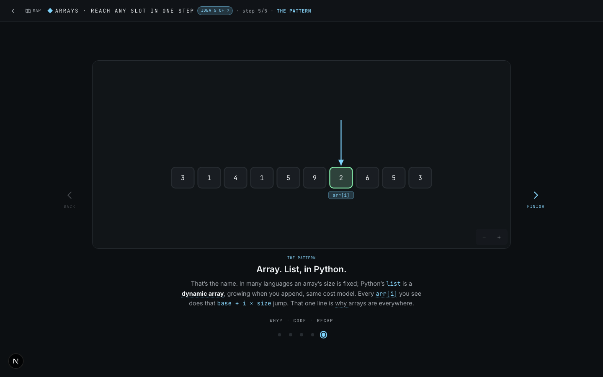

The diagram returns to the full ten-cell row with index 6 (value 2) highlighted green and an `arr[i]` marker beneath it, with the vertical arrow pointing into it. The main panel is labeled "THE PATTERN", titled "Array. List, in Python.", with body text naming the structure, the term dynamic array, and the `base + i × size` jump tying back to idea 5 of 7. The why · code · recap chips sit above the five progress dots (fifth filled). The right side nav reads "FINISH" with a forward chevron; the left reads "BACK". No interaction gate. No mobile capture exists for this beat.

### Code drawer
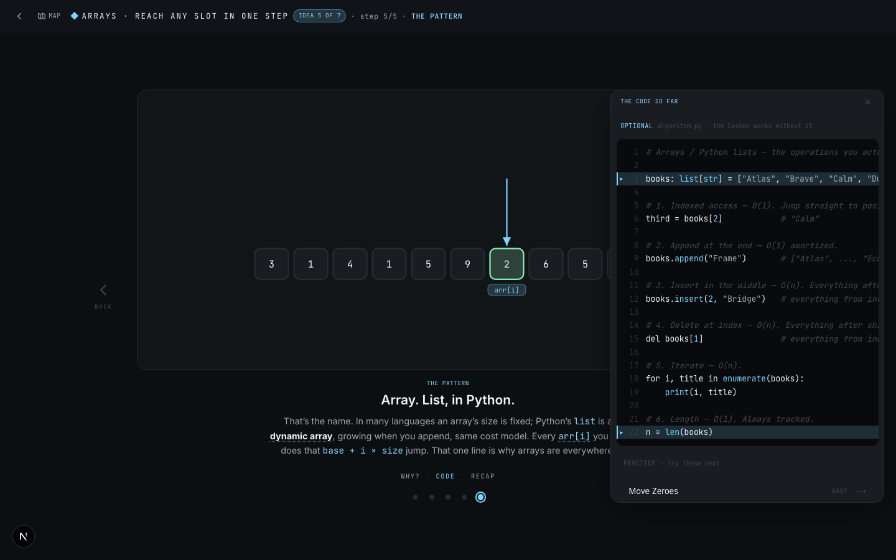

Opening the Code panel slides in a right-hand drawer titled "THE CODE SO FAR", with a sub-label "OPTIONAL  algorithm.py · the lesson works without it". It shows numbered Python source for `books: list[str]` with six commented operations: indexed access `books[2]` (O(1)), `books.append("Frame")` (O(1) amortized), `books.insert(2, "Bridge")` (O(n)), `del books[1]` (O(n)), iteration with `for i, title in enumerate(books)`, and `n = len(books)` (O(1)). Two lines (the `books` declaration on line 3 and `n = len(books)` on line 22) are highlighted with a left-edge marker. Below the code a "PRACTICE · try these next" section lists "Move Zeroes" tagged "EASY" with a forward arrow. The drawer has a close (×) control top-right. This drawer was captured on beat 5 (step 5/5). The captured final beat (beat 5, "The pattern") does not show a completion ceremony screen in the desktop shot.

---

