# Focus layout — visual review gallery

> Factual, opinion-free capture of every topic on the focus layout: each beat at desktop (1440) + mobile (390), plus the open code drawer. Wedge beats are shown in their pre-interaction (LOCKED) state; the narration states each interaction mechanic. Annotate inline with your feedback.
> **29/29 topics.**

## Contents
- [variables](#variables)
- [data-types](#data-types)
- [operators](#operators)
- [constants](#constants)
- [conditionals](#conditionals)
- [functions](#functions)
- [for-loops](#for-loops)
- [while-loops](#while-loops)
- [try-except](#try-except)
- [arrays](#arrays)
- [strings](#strings)
- [sets-tuples](#sets-tuples)
- [linked-lists](#linked-lists)
- [stacks-queues](#stacks-queues)
- [hash-maps](#hash-maps)
- [trees](#trees)
- [graphs](#graphs)
- [binary-search](#binary-search)
- [two-pointers](#two-pointers)
- [sliding-window](#sliding-window)
- [sliding-window-variable](#sliding-window-variable)
- [activity-selection](#activity-selection)
- [backtracking](#backtracking)
- [dfs](#dfs)
- [bfs](#bfs)
- [mergesort](#mergesort)
- [recursion](#recursion)
- [monotonic-stack](#monotonic-stack)
- [dp-1d](#dp-1d)

---

## variables
route: `/categories/programming-basics/variables/` · diagram shape: line

### Beat 1 — The need

The header reads VARIABLES · A LABELLED BOX with an "IDEA 1 OF 7" pill, a "step 1/5" marker, and the beat label THE NEED. The diagram canvas holds a single labelled box: the name `score` floats above an empty box showing `?`, under the caption "you need to remember a number to use later"; the box renders muted/inactive because no value is stored yet. The main panel "THE NEED" titled "Hold onto a value." explains a program needs a place to keep a value and get it back later, with the why · code · recap chip row and five progress dots (first dot active) below it. The side-nav shows BACK on the left and the action "Make a box" on the right, with a −/+ stepper in the canvas corner. Mobile stacks the diagram above the panel and shows a bottom bar with Back, a "1 / 5" counter, and a "Make a box →" button.

### Beat 2 — Create it

The marker reads "step 2/5 · CREATE IT" and the second progress dot is active. The same `score` box is now active (accent fill and outline) holding the value `0`, under the caption "score = 0 → the value 0 goes into the box named score". The main panel "CREATE IT" titled "score = 0" explains that writing the name, an `=`, then the value makes a box called `score` and puts `0` in it. There is no gated interaction on this beat: the right side-nav action reads "Now change it" and advances directly. Mobile mirrors this with the "2 / 5" counter and a "Now change it →" footer button.

### Beat 3 — Change it

The marker reads "step 3/5 · CHANGE IT" and the third progress dot is active. The `score` box now reads `10` under the caption "score = score + 10 → read 0, add 10, put 10 back", and below it a PREDICT panel asks "score held 0 a moment ago — where is that 0 now?" with three choice chips: "gone — replaced", "still under the 10", and "saved automatically". The interaction type is `wedge`: the beat is gated, so the right side-nav shows a lock icon labelled LOCKED and the prompt "↑ TRY IT ON THE DIAGRAM TO CONTINUE" appears under the dots; this is the captured initial pre-interaction state. Selecting the correct choice ("gone — replaced") clears the gate and reveals the line "0 + 10 = 10 — the old 0 is gone" before the lesson allows advancing. The main panel "CHANGE IT" titled "score = score + 10" explains the right side is worked out first using the current value, then stored back. On mobile the "Use the value →" footer button renders dimmed/disabled with the same "↑ TRY IT ON THE DIAGRAM TO CONTINUE" hint.

### Beat 4 — Use it

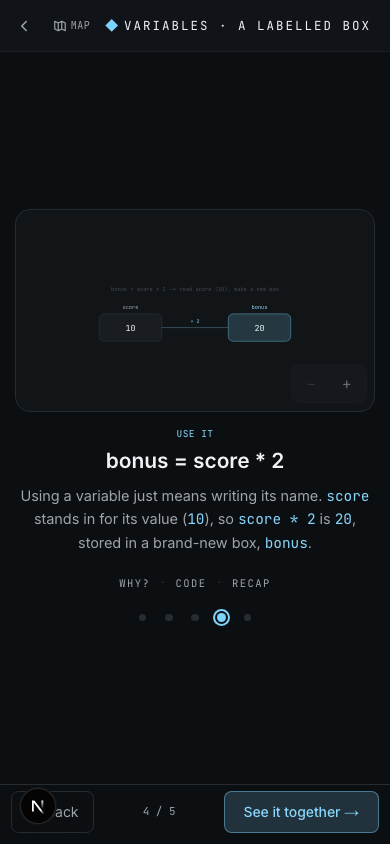
The marker reads "step 4/5 · USE IT" and the fourth progress dot is active. The canvas shows two boxes: `score` holding `10` (inactive) on the left and `bonus` holding `20` (active) on the right, joined by a flow arrow labelled "× 2", under the caption "bonus = score * 2 → read score (10), make a new box". The main panel "USE IT" titled "bonus = score * 2" explains that `score` stands in for its value (10), so `score * 2` is 20, stored in a new box `bonus`. There is no gate on this beat; the right side-nav action reads "See it together". Mobile stacks the same content with a "4 / 5" counter and a "See it together →" footer button.

### Beat 5 — Put together

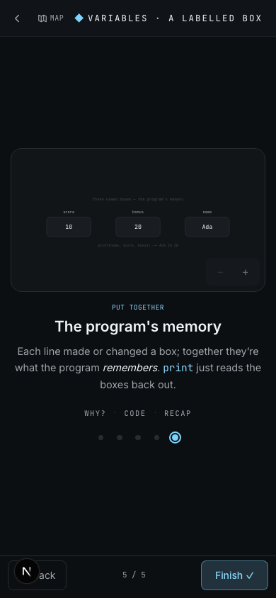
The marker reads "step 5/5 · PUT TOGETHER" and the fifth progress dot is active. The canvas shows three named boxes side by side — `score` = `10`, `bonus` = `20`, `name` = `Ada` — under the caption "three named boxes — the program's memory", with a line beneath reading "print(name, score, bonus) → Ada 10 20". The main panel "PUT TOGETHER" titled "The program's memory" notes each line made or changed a box and `print` reads them back out. This is the closing recap beat with no interaction; the right side-nav action reads FINISH, and mobile shows a matching "5 / 5" counter and "Finish" footer button.

### Code drawer

Opening the code drawer (via the CODE chip) slides a panel in from the right titled "THE CODE SO FAR", tagged "OPTIONAL · algorithm.py · the lesson works without it". It shows the numbered Python source: a comment on line 1 ("# A variable is a name attached to a value. Stor…"), then `score = 0`, `score = score + 10`, `bonus = score * 2`, `name = "Ada"`, and `print(name, score, bonus)` on lines 3–7. The current line (line 7, the `print` call) is highlighted with a play-arrow marker in the gutter, and a close (×) control sits in the drawer's top-right corner.

_Capture note: desktop reached all 5 beats (5/5) and mobile reached all 5 beats (5/5). The captured sequence is the structured register (5 beats: need, create, update/change, use, recap); the spec's `types` beat ("Any kind of value") is intuitive-only and is cut for this register, so it was not in the captured run. Wedge beats are shown in their initial locked state because the dot-jump does not perform the interaction._

---

## data-types
route: `/categories/programming-basics/data-types/` · diagram shape: line

### Beat 1 — Kinds of value

The diagram draws a row of four value boxes — `age` holding `7`, `price` holding `3.14`, `name` holding `"Ada"`, `is_adult` holding `False` — each with a type chip beneath it (`int`, `float`, `str`, `bool`). No box is highlighted on this beat; all four and their chips render in the muted tone. The caption above the row reads "a value isn't just a value — it's a kind of value". The top bar shows MAP, the diamond DATA TYPES · KINDS OF VALUE title, an "IDEA 3 OF 7" pill, and "step 1/5 · KINDS OF VALUE"; below it a "BUILDS ON" strip carries a "Variables" prereq pill with a close (x) control. The main panel under the diagram shows the "KINDS OF VALUE" label, the title "Not all values are alike.", body prose about each value carrying a type Python infers, then the why·code·recap chips and five progress dots (first filled). The right side nav reads "WHOLE NUMBERS" with a chevron; the left reads "BACK". On mobile the same four-box diagram, panel, and chips stack vertically, and a bottom action bar shows "Back", "1 / 5", and a "Whole numbers" forward button. No gate on this beat.

### Beat 2 — Numbers: int & float

The same four-box row renders, now with the `age = 7` box and its `int` chip highlighted in the accent tone. The caption reads "7 is an int (whole) · 3.14 is a float (has a decimal)". The main panel label is "NUMBERS: INT & FLOAT", title "age = 7 · price = 3.14", with body text explaining a whole number like `7` is an int and `3.14` with a decimal point is a float, the dot being the only spelling difference. Progress dots show the second dot filled. Side nav reads "BACK" (left) and "TEXT" (right). Mobile mirrors the layout with the bottom bar showing "Back", "2 / 5", and a "Text" forward button. No gate on this beat.

### Beat 3 — Text: str (gated, wedge / predict)

The four-box row renders with the `name` box (`"Ada"`) and its `str` chip highlighted. The caption reads `"Ada" is a str — the quotes are how Python knows it's text`. Overlaid on the diagram is a PREDICT gate panel asking 'Quotes make "Ada" text. So "7" — digits in quotes — is…' with three choice buttons: "still the number 7", "text — a string", and "an error". The main panel label is "TEXT: STR", title `name = "Ada"`, with body text about quotes delimiting text versus a bare name lookup. Below the progress dots (third filled) the prompt "↑ TRY IT ON THE DIAGRAM TO CONTINUE" appears, and the right side nav shows "LOCKED" with a padlock icon. This beat is gated (interaction type wedge): the learner must pick a choice in the predict gate (correct answer "text — a string") before the lesson unlocks and the forward nav becomes available. The capture is shown in its initial pre-interaction state, so the gate appears locked — the dot-jump does not perform the prediction. On mobile the same gate overlays the diagram, the bottom bar reads "Back", "3 / 5", and the "True or False" forward button renders disabled/greyed with the same "TRY IT ON THE DIAGRAM TO CONTINUE" prompt.

### Beat 4 — Yes / no: bool

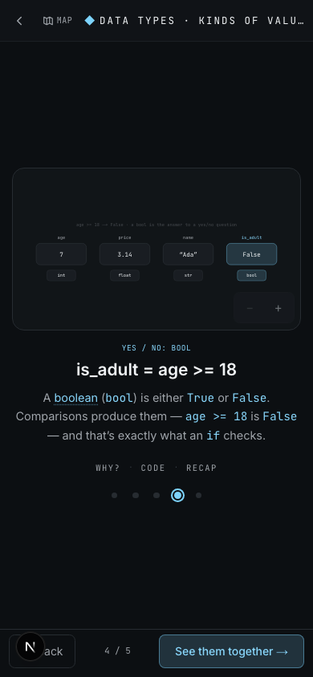
The four-box row renders with the `is_adult` box (`False`) and its `bool` chip highlighted in the accent tone. The caption reads `age >= 18 → False · a bool is the answer to a yes/no question`. The main panel label is "YES / NO: BOOL", title `is_adult = age >= 18`, with body text that a boolean is either True or False, comparisons produce them (`age >= 18` is False), and that is what an `if` checks. Progress dots show the fourth filled. Side nav reads "BACK" (left) and "SEE THEM TOGETHER" (right). Mobile mirrors the layout with the bottom bar showing "Back", "4 / 5", and a "See them together" forward button. No gate on this beat.

### Beat 5 — Four to start

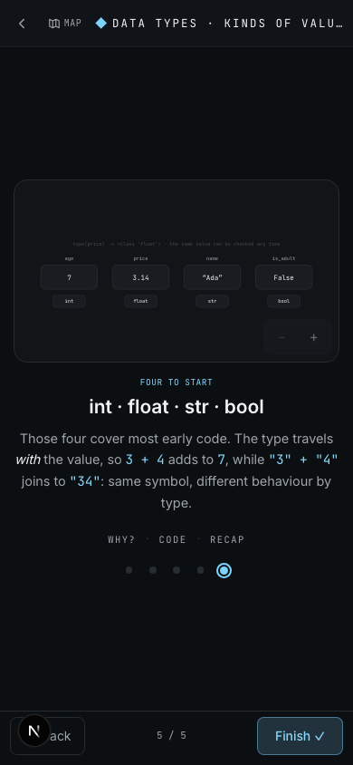
The four-box row renders with no single box highlighted; all four boxes and chips show in the resting tone. The caption reads `type(price) → <class 'float'> · the same value can be checked any time`. The main panel label is "FOUR TO START", title "int · float · str · bool", with body text that the four cover most early code and the type travels with the value, contrasting `3 + 4` adding to `7` with `"3" + "4"` joining to `"34"`. All five progress dots are filled, the last active. Side nav reads "BACK" (left) and "FINISH" (right). Mobile mirrors the layout with the bottom bar showing "Back", "5 / 5", and a "Finish ✓" button. No gate on this beat.

### Code drawer

The code drawer slides in from the right with header "THE CODE SO FAR" and a close (x) control. A sub-line reads "OPTIONAL  algorithm.py · the lesson works without it". The code panel shows numbered lines of `algorithm.py`: a comment "# Every value has a type. Python infers it from…", then `age = 7`, `price = 3.14`, `name = "Ada"`, `is_adult = age >= 18`, and a highlighted line 7 `print(type(price))`. The drawer overlays the right portion of the diagram while the main panel and progress dots stay visible beneath.

---

## operators
route: `/categories/programming-basics/operators/` · diagram shape: line

### Beat 1 — Combine values

The canvas holds three stacked expression rows, each labelled at the left (`arithmetic`, `comparison`, `logical`) with the expression in a bordered pill (`3 + 4 * 2`, `total > 10`, `is_big and total < 100`), an `=` sign, and a result box on the right showing `?`. All three rows and their result boxes are dimmed, and every result reads `?` (nothing resolved yet). The caption above the rows reads "operators take values in and give a new value out". The header shows the breadcrumb `MAP · OPERATORS · COMBINING VALUES`, an `IDEA 4 OF 7` pill, and `step 1/5 · COMBINE VALUES`. A "BUILDS ON" strip below the header carries a `Variables` prereq pill with a dismiss (×). The main panel below reads label "COMBINE VALUES", title "Turn values into new values.", and body about storing being half and combining the other half. The why·code·recap chips and five progress dots (first filled) sit under the panel; the right side nav reads "DO THE MATHS". No interaction is required to advance. On mobile the three rows render in the canvas; the side nav becomes a bottom bar with a "1 / 5" counter and a "Do the maths →" button.

### Beat 2 — Arithmetic

The arithmetic row (`3 + 4 * 2`) is now focused (highlighted border) and a PREDICT gate panel overlays the two lower rows. The gate asks "3 + 4 * 2 — which operator runs first?" with three tappable choices: "the + — it's first, left to right", "the * — multiply before add", and "neither — it needs parentheses". The caption reads "3 + 4 * 2 — two operators, one line: something has to run first" and the result box still shows `?` (the row has not resolved). The main panel reads label "ARITHMETIC", title "3 + 4 * 2 → 11", body explaining `* /` happen before `+ -`. Below the dots is the prompt "↑ TRY IT ON THE DIAGRAM TO CONTINUE", and the right side nav reads "LOCKED". This beat is the lesson's single `wedge` interaction, shown here pre-interaction (the dot-jump does not tap a choice, so the capture is in the locked, unresolved state). The learner must tap a choice on the diagram — the correct one being "the * — multiply before add" — after which the row resolves to `11` and the next-step nav unlocks. On mobile the same gate panel renders over the rows, the bottom-bar next button is disabled, and the "↑ TRY IT ON THE DIAGRAM TO CONTINUE" prompt appears.

### Beat 3 — Comparison

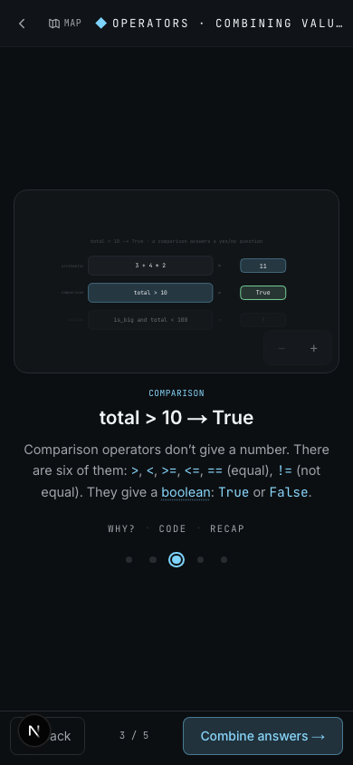
The arithmetic row has resolved: its result box now shows `11` (gate cleared). The comparison row (`total > 10`) is now focused, and its result box shows `True` in a green-bordered box. The logical row remains dimmed with `?`. The caption reads "total > 10 → True · a comparison answers a yes/no question". The header shows `step 3/5 · COMPARISON`. The main panel reads label "COMPARISON", title "total > 10 → True", body listing the six comparison operators (`> < >= <= == !=`) that yield a boolean. Progress dots show the third filled; the right side nav reads "COMBINE ANSWERS". This beat has no interaction (`none`); advancing via the side nav.

### Beat 4 — Logical

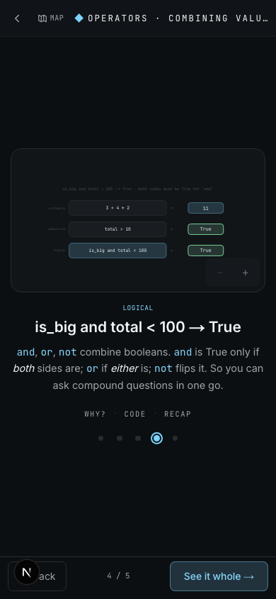
All three rows are now resolved: arithmetic `= 11`, comparison `= True`, and the logical row (`is_big and total < 100`) is focused with its result box showing `True` (green border). The caption reads "is_big and total < 100 → True · both sides must be True for 'and'". The header shows `step 4/5 · LOGICAL`. The main panel reads label "LOGICAL", title "is_big and total < 100 → True", body covering `and`, `or`, `not` combining booleans (and is True only if both sides are; or if either; not flips). Progress dots show the fourth filled; the right side nav reads "SEE IT WHOLE". No interaction (`none`); advancing via the side nav.

### Beat 5 — Three families

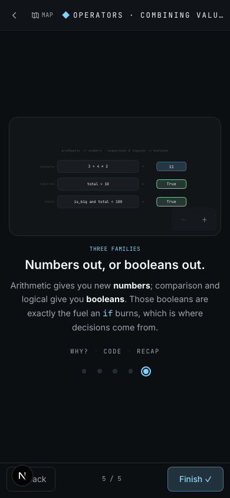
All three rows remain resolved (`11`, `True`, `True`) but none is focused now — the view steps back to show the whole set. The caption reads "arithmetic → numbers · comparison & logical → booleans". The header shows `step 5/5 · THREE FAMILIES`. The main panel reads label "THREE FAMILIES", title "Numbers out, or booleans out.", body explaining arithmetic gives numbers while comparison and logical give booleans, and those booleans are the fuel an `if` burns. Progress dots show the fifth (final) filled; the right side nav reads "FINISH". No interaction (`none`); the final beat shows the recap state with the "FINISH" affordance.

### Code drawer

The drawer slides in from the right over the recap beat, titled "THE CODE SO FAR" with a close (×). A subheader reads "OPTIONAL · algorithm.py · the lesson works without it". The code listing shows numbered lines: a comment `# Operators combine values: arithmetic, comparis…`, then `total = 3 + 4 * 2`, `is_big = total > 10`, `ok = is_big and total < 100`, and a highlighted final line `print(total, is_big, ok)` (line 6, marked with a run pointer). The drawer overlaps the right portion of the canvas, partially covering the result boxes.

---

## constants
route: `/categories/programming-basics/constants/` · diagram shape: line

### Beat 1 — The fixed value

The header reads `CONSTANTS · A VALUE THAT WON'T CHANGE` with an `IDEA 3 OF 7` pill, a `step 1/4` counter, and the beat label `THE FIXED VALUE`. A `BUILDS ON` row carries a single prereq pill, `Variables`, with a close (×) control at the right. The diagram is a single box labeled `MAX_SCORE` holding the value `100`, under the idea caption "some values are settings that should never change mid-program". A stepper with − and + controls sits at the lower right of the canvas. The main panel below reads "A value that stays put." with body text about settings like maximum score, ticket price, and π. The why·code·recap chips appear under the panel above four progress dots (first dot filled). The right side nav shows a chevron labeled `LOCK IT IN`; the left shows `BACK`. This beat has no interaction; advancing uses the right nav.

### Beat 2 — Name it in CAPS

The counter reads `step 2/4`, label `NAME IT IN CAPS`. The diagram is the `MAX_SCORE` box holding `100`, now drawn active (highlighted outline) with an outline lock glyph above its top-right corner. The caption reads "MAX_SCORE = 100 · the ALL-CAPS name is the signal". The main panel title is `MAX_SCORE = 100`, with body text explaining the UPPER_CASE casing as a constant convention; the words "constant" and "convention" render as underlined inline Term links. The progress dots show the second dot filled. The right nav chevron is labeled `USE IT`. No interaction; advancing uses the right nav.

### Beat 3 — Use it anywhere

The counter reads `step 3/4`, label `USE IT ANYWHERE`. The diagram is now two boxes: `MAX_SCORE` holding `100` on the left and `percent` holding `70.0` on the right (the percent box is drawn active in a green/good tone), connected by a left-to-right arrow labeled `score / MAX_SCORE * 100`. The caption reads "percent = score / MAX_SCORE * 100 → 70.0". The main panel title is `percent = score / MAX_SCORE * 100`, with body text about a score of 70 out of a MAX_SCORE of 100; `score`, `70`, `MAX_SCORE`, and `100` are highlighted inline. The third progress dot is filled. The right nav chevron is labeled `THE PROMISE`. No interaction; advancing uses the right nav.

### Beat 4 — A promise, not a lock

The counter reads `step 4/4`, label `A PROMISE, NOT A LOCK`. This beat carries the lesson's one interaction, a wedge/predict gate, shown here in its initial pre-interaction state. The diagram shows the `MAX_SCORE` box holding `100` under the caption "further down the file, this line is about to run", and below it a faint line `MAX_SCORE = 50`. A PREDICT card poses "Further down the file, MAX_SCORE = 50 runs. What does Python do?" with three tappable choices: "refuses — raises an error", "runs it — MAX_SCORE is now 50", and "keeps 100 and ignores the 50". The right side nav reads `LOCKED` with a filled lock glyph rather than an advance chevron, and a prompt under the progress dots reads "↑ TRY IT ON THE DIAGRAM TO CONTINUE". Mechanically, the gate clears when the learner taps a prediction choice (the correct answer per the spec is "runs it — MAX_SCORE is now 50"); on reveal the caption changes to "nothing technically stops a reassignment — the CAPS name is a promise", the `MAX_SCORE = 50` line is shown crossed out with a × marker, and the action unlocks to `Done`. The main panel title is "Honest about Python." with body text that Python won't stop a later `MAX_SCORE = 50`. The fourth progress dot is filled. On mobile the canvas stacks above the panel, and the footer shows `4 / 4` with a `Back` control and a disabled `Finish ✓` button while the gate is unsatisfied, matching the desktop `LOCKED` state.

### Code drawer

The drawer opens from the right titled `THE CODE SO FAR`, with an `OPTIONAL` tag and the note "algorithm.py · the lesson works without it". It shows numbered lines: a comment `# A constant is a value you promise won't change`, `MAX_SCORE = 100`, `score = 70`, `percent = score / MAX_SCORE * 100`, and `print(percent)`. Numeric literals (`100`, `70`) are syntax-highlighted, and the final line `print(percent)` is highlighted with a ▶ run-pointer marker, corresponding to beat 4's `print` code label. A close (×) control sits at the top right of the drawer.

Note: both desktop and mobile reached all 4 beats. Captures show each beat in its initial state; beat 4's predict gate is shown unanswered, so the post-reveal verdict and the completion ceremony after `Finish` are not pictured.

---

## conditionals
route: `/categories/programming-basics/conditionals/` · diagram shape: line

### Beat 1 — The choice

The canvas draws the if/elif/else ladder: a `score = 72` chip sits at the top, and three condition rows (`score >= 90`, `score >= 60`, `else`) each point through an arrow to an output box (`grade = "A"`, `grade = "B"`, `grade = "F"`). All rows render idle (greyed at half opacity) with no verdicts shown. The top bar reads "IF / ELSE · CHOOSING A PATH", an "IDEA 2 OF 7" pill, "step 1/5", and the beat label "THE CHOICE". Below the bar a "BUILDS ON" strip shows prereq pills "Variables" and "Operators" (dismissable via an x). The main panel below the canvas is captioned "THE CHOICE" with the title "Turn a score into a grade." and body text about code that does the same thing every time, ending on "choose". The why?·code·recap chips sit above five progress dots (first filled). Left nav is "BACK"; right nav is "ASK A QUESTION". This beat has no gate. On mobile the same ladder, panel, and prereq strip stack vertically with a bottom footer showing "back", "1 / 5", and an "Ask a question" button.

### Beat 2 — if: the first test

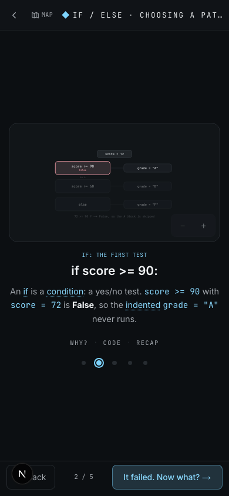
The ladder now evaluates the first row: `score >= 90` is outlined red with a "False" verdict label beneath it, and a "no ↓" marker drops to the next row. Rows 2 and 3 stay idle/greyed. A caption under the ladder reads "72 >= 90 ? → False, so the A block is skipped". The panel is captioned "IF: THE FIRST TEST", titled "if score >= 90:", with body text defining an if as a yes/no condition and noting the indented `grade = "A"` never runs (with linked Terms for "if", "condition", "indented"). Progress dots show the second filled. Right nav reads "IT FAILED. NOW WHAT…". This beat has no gate. On mobile the ladder, caption, and panel stack vertically with the footer showing "back", "2 / 5", and the next control.

### Beat 3 — elif: the next test

This beat is gated by a prediction wedge and is captured pre-interaction (the dot-jump does not perform the tap). The ladder shows row 1 (`score >= 90`) red with "False" and the "no ↓" drop; rows below stay idle and the `score = 72` chip is hidden in the pre-reveal state so the gate fits the band. A PREDICT panel overlays the lower canvas asking "72 >= 60 is about to pass, so grade = "B" runs. What happens to the else row below?" with three choice chips: "skipped, unread", "still checked", "else runs too". The correct choice is "skipped, unread"; selecting a choice shows its note, then after a pause the visual reveals (`score = 72` chip returns, row 2 turns accent/True, and the caption becomes "72 >= 60 ? → True, so grade = B (and we stop checking)"). The panel is captioned "ELIF: THE NEXT TEST", titled "elif score >= 60:". Until the gate is answered the right nav shows a "LOCKED" lock icon and the footer prompts "↑ TRY IT ON THE DIAGRAM TO CONTINUE". Progress dots show the third filled. On mobile the ladder and the PREDICT overlay render inside the canvas; the footer shows "back", "3 / 5", and a greyed "And if all fail? →" next button, confirming the gate blocks advance until a prediction is made.

### Beat 4 — else: the fallback

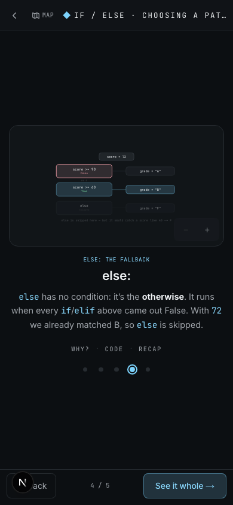
The ladder now shows the resolved state: row 1 `score >= 90` red with "False", row 2 `score >= 60` accent with "True" and its `grade = "B"` output box highlighted accent, and row 3 `else` greyed with a "skipped" verdict. Caption reads "else is skipped here — but it would catch a score like 40 → F". The panel is captioned "ELSE: THE FALLBACK", titled "else:", with body explaining else has no condition and runs only when every if/elif above was False, and that 72 already matched B so else is skipped. Progress dots show the fourth filled. Right nav reads "SEE IT WHOLE". This beat has no gate. On mobile the resolved ladder, caption, and panel stack vertically with the footer showing "back", "4 / 5", and the next control.

### Beat 5 — Exactly one path

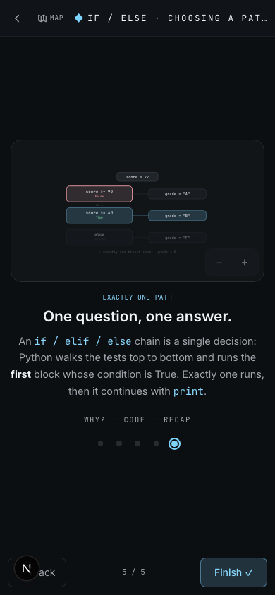
The final ladder repeats the resolved state — row 1 red "False", row 2 accent "True" with the `grade = "B"` box highlighted, row 3 `else` greyed "skipped" — with the caption "✓ exactly one branch runs · grade = B". The panel is captioned "EXACTLY ONE PATH", titled "One question, one answer.", with body describing the if/elif/else chain as a single decision: Python walks tests top to bottom, runs the first True block, exactly one runs, then continues with `print`. Progress dots show the fifth (final) filled. Right nav reads "FINISH". This beat has no gate. On mobile the ladder, caption, and panel stack vertically with the footer showing "back", "5 / 5", and the finish control.

### Code drawer

The drawer slides in from the right, headed "THE CODE SO FAR" with a close x and an "OPTIONAL · algorithm.py · the lesson works without it" subline. It shows the full Python source numbered lines 1–10: a `# if / elif / else: check conditions top to bott…` comment, `score = 72`, the `if score >= 90:` / `grade = "A"` block, `elif score >= 60:` / `grade = "B"`, `else:` / `grade = "F"`, and `print(grade)` on line 10 with a current-line marker (`▸`) highlighting it (captured on the final beat, where the recap maps to `print`). The ladder diagram and main panel remain visible to the left while the drawer is open.

---

## functions
route: `/categories/programming-basics/functions/` · diagram shape: line

### Beat 1 — Name a set of steps

The diagram draws the function-as-machine: two stacked input chips labeled `width` and `height` on the left, arrows feeding into a rounded box that reads `area(width, height)` / `return` / `width * height`, and an arrow out to a `?` box on the right. The caption above reads "the same calculation, needed in many places". The header bar shows MAP, the diamond FUNCTIONS title with "INPUTS IN, ANSWER OUT", an "IDEA 4 OF 7" pill, and "step 1/5 · NAME A SET OF STEPS". A "BUILDS ON" row carries an "If / Else" prereq pill with a close (X). The main panel below the canvas shows the eyebrow label "NAME A SET OF STEPS", the title "Bottle up a calculation.", and body text about copy-pasting `width * height` being error-prone, with `function` linked as a term. Under it sit the WHY? · CODE · RECAP chips and five progress dots (first filled). The side nav reads "BACK" (left) and "DEFINE IT" (right). No gate; the learner advances with DEFINE IT. On mobile the canvas and panel stack vertically, the prereq pill stays in the BUILDS ON row, and a bottom bar shows Back, "1 / 5", and a "Define it" button.

### Beat 2 — def — the recipe

The same machine diagram renders, still with `width`/`height` inputs and an unlit `?` output. The caption reads "def area(width, height): return width * height · not run yet". Header shows "step 2/5 · DEF — THE RECIPE". The main panel title is "def area(width, height):" with body explaining `def` defines a function, `width` and `height` are `parameters` (named blanks), the indented body is the recipe, and nothing runs yet. Progress dots show the second dot filled. Side nav reads "BACK" and "PRESS THE BUTTON". No gate; advancing is a click on the right nav. Mobile stacks canvas over panel with the bottom Back / "2 / 5" / next bar.

### Beat 3 — call — fill the blanks

The machine is lit: the input chips now read `4` and `3`, the central machine box is highlighted with the accent fill/stroke, and the output box on the right shows `12` in the green "good" tone. The caption reads "area(4, 3): width = 4, height = 3 → returns 12". Header shows "step 3/5 · CALL — FILL THE BLANKS". The main panel title is "room = area(4, 3)" and the body explains writing `area(4, 3)` calls it, `4` fills `width`, `3` fills `height` (the `arguments`), the body runs, `return` hands back `12`, and the value lands in `room`. Third progress dot filled. Side nav reads "BACK" and "USE IT AGAIN". No gate; advance via the right nav.

### Beat 4 — Reuse it

This beat is gated (wedge / predict gate) and is shown here in its initial, pre-interaction state — the dot-jump lands on it without performing the prediction. The diagram shows the machine with inputs `10` and `2` and an unlit `?` output; the caption reads "the hall is 10 by 2 — and the machine is already built". A PREDICT panel is overlaid on the canvas with the question "The hall is 10 by 2 — how does the program get its area?" and three choice chips: "write width * height again", "call area(10, 2)", and "change the def line to 10 and 2". Header shows "step 4/5 · REUSE IT". The right side nav reads "LOCKED" with a lock icon, and the prompt "↑ TRY IT ON THE DIAGRAM TO CONTINUE" sits under the progress dots (fourth dot filled). The main panel title is "hall = area(10, 2) → 20" with body about calling again with different arguments to get `20` from the same definition. Mechanically, the gate clears when the learner picks the correct choice ("call area(10, 2)"); on reveal the caption changes to "area(10, 2) → 20 · one definition, any inputs", the machine lights and the output box shows `20`, which unlocks the next nav. On mobile the PREDICT panel renders inside the canvas the same way, the "↑ TRY IT ON THE DIAGRAM TO CONTINUE" prompt appears, and the bottom "Sum up" button is shown disabled until the prediction is committed.

### Beat 5 — Inputs in, answer out

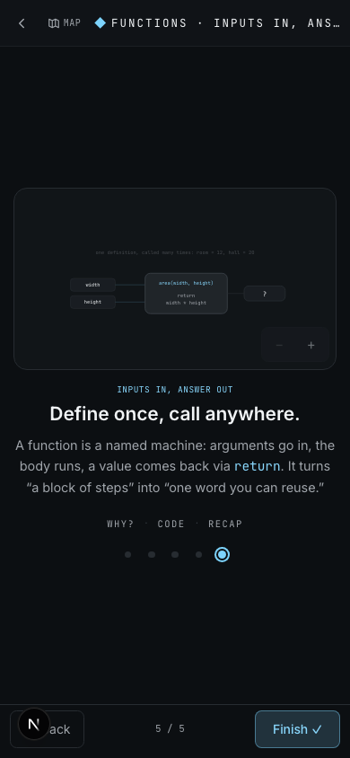

The diagram returns to the generic machine with `width`/`height` inputs and an unlit `?` output. The caption reads "one definition, called many times: room = 12, hall = 20". Header shows "step 5/5 · INPUTS IN, ANSWER OUT". The main panel title is "Define once, call anywhere." with body that a function is a named machine — arguments in, body runs, a value back via `return` — turning "a block of steps" into "one word you can reuse." Fifth (last) progress dot filled. Side nav reads "BACK" and the forward action "Done". Mobile stacks canvas over panel with the bottom Back / "5 / 5" / Done bar.

### Code drawer

The drawer slides in from the right titled "THE CODE SO FAR", tagged "OPTIONAL · algorithm.py · the lesson works without it", with a close (X). It shows the eight-line Python source with line numbers: a comment on line 1 ("# A function packages steps under a name: take i…", clipped at the drawer edge), `def area(width, height):` / `return width * height`, then `room = area(4, 3)`, `hall = area(10, 2)`, and `print(room, hall)`. Line 8 (`print(room, hall)`) is highlighted with a left arrow marker as the current line. The underlying canvas (machine diagram, caption, panel) stays visible to the left while the drawer is open.

---

## for-loops
route: `/categories/programming-basics/for-loops/` · diagram shape: line

### Beat 1 — Walk a collection

The header reads `FOR LOOPS · ONCE PER ITEM` with an `IDEA 1 OF 7` pill, a `MAP` link, and `step 1/4 · WALK A COLLECTION`. A `BUILDS ON` strip carries one prereq pill, `While Loops`, with a dismiss × on the right. The canvas shows the caption "you have a list of things; do the same step to each one" above the monospace literal `[ 10, 20, 30 ]` and three boxes holding 10, 20, 30, none highlighted (current is -1); to the right a `total` box reads 0. The main panel below reads "WALK A COLLECTION / Do something to every item." with body prose about collections and the fiddliness of a `while` counter. The why·code·recap chips and four progress dots (first filled) sit at the bottom; side nav shows `BACK` (left, dimmed) and a `›` with `SET UP THE WALK` (right). On mobile the panel stacks under the canvas and the right-arrow becomes a bottom `Set up the walk →` button with a `1 / 4` counter; the diagram text is scaled down. No interaction gate — advancing is by the next-step arrow.

### Beat 2 — First item

Header now reads `step 2/4 · FIRST ITEM`. The caption is "round 1: price = 10 → total = 0 + 10 = 10". In the box row the first item (10) is highlighted with an accent border and labelled `price` underneath; 20 and 30 are plain. The `total` box on the right is highlighted green at 10, and a faint arrow runs from the price box across to the total box, depicting the value flowing into the accumulator. The main panel reads "FIRST ITEM / price = 10 → total = 10" with body text explaining the loop set `price` to the first item and ran `total = total + price`. Progress dots show the second dot filled. Side nav: `BACK` left, `› NEXT ITEM` right. Mobile mirrors this with the panel stacked below and a `Next item →` button, counter `2 / 4`. No interaction gate.

### Beat 3 — Each one in turn

Header reads `step 3/4 · EACH ONE IN TURN`. This is the gated wedge beat, shown here pre-interaction in its round-1 state (the dot-jump does not perform the prediction): the caption reads "round 1 done: price = 10, total = 10 — the loop heads back to the top"; the first box (10) is highlighted as `price` and `total` is 10. Overlaid on the canvas is a `PREDICT` card asking "Round 1 is done — what happens to price when round 2 begins?" with three choices: "the loop refills it — just 20 now" (correct), "still 10 — my code must change it", and "it holds 10 and 20 now". The interaction type is `wedge`: the learner commits a prediction on the diagram before continuing. The right side nav shows a lock icon with `LOCKED`, and a hint "↑ TRY IT ON THE DIAGRAM TO CONTINUE" sits under the progress dots (third dot filled). Selecting the correct choice ("the loop refills it") clears the gate and reveals round 2 — the caption becomes "round 2: price = 20 → total = 10 + 20 = 30", the second box (20) highlights as `price`, and `total` updates to 30, which is the state the panel ("price = 20 → total = 30") describes. On mobile the same predict card renders over the canvas (the desktop note panels do not render on mobile), and the bottom bar shows `Back`, the counter `3 / 4`, and a dimmed `After the last →` action.

### Beat 4 — Out the other side

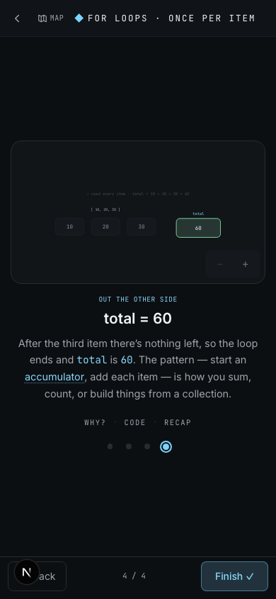
Header reads `step 4/4 · OUT THE OTHER SIDE`. The caption reads "✓ used every item · total = 10 + 20 + 30 = 60"; all three boxes (10, 20, 30) render as past/dimmed with none highlighted (the `done` state marks the whole row finished), and the `total` box is highlighted green at 60. The main panel reads "OUT THE OTHER SIDE / total = 60" with body text noting that after the third item there is nothing left, the loop ends, and the start-an-accumulator-and-add-each-item pattern is named (the word "accumulator" is a linked Term). The detail content carries the "seed of idea 1 of 7, information reuse" callout. Progress dots show the fourth dot filled; side nav shows `BACK` left and `› FINISH` right. Mobile mirrors this with the panel stacked below and a `Finish →` button, counter `4 / 4`. No interaction gate.

### Code drawer

The drawer opens on the right titled "THE CODE SO FAR" with an `OPTIONAL` tag and the note "algorithm.py · the lesson works without it". It shows numbered source lines: a comment "# A for loop runs its block once for each item i...", a blank line, `total = 0`, `for price in [10, 20, 30]:`, the indented `total = total + price`, and `print(total)`. Lines 5 and 6 are highlighted with a `▸` gutter marker, corresponding to this beat's `codeLabels` (body, after). The drawer overlays the right portion of the canvas while the main panel stays visible beneath.

---

## while-loops
route: `/categories/programming-basics/while-loops/` · diagram shape: line

The capture ran in the default/structured register, which surfaces 4 of the spec's 5 beats: `need` → `run` → `exit` → `recap`. The intuitive-only `setup` beat ("A counter + a test") is cut in this register and is not shown. Desktop reached all 4 beats and mobile reached all 4 beats. The top bar reads MAP · WHILE LOOPS · REPEAT WHILE TRUE with an "IDEA 3 OF 7" pill and a "step N/4 · <beat label>" counter; the diagram is the line shape (stacked monospaced trace rows on a single canvas).

### Beat 1 — Repeat without copying

The diagram is three stacked rounded rows on the line-shape canvas, all dimmed (idle): `count = 0 → 0 < 3 ✓ → print 0, count → 1`, the same for `1` and `2`. Above them sits the dimmed caption "do the same thing many times — without writing it many times". The top bar shows "step 1/4 · REPEAT WITHOUT COPYING"; a "BUILDS ON" strip below it shows an "◆ If / Else" prereq pill with a close (x) control. The main panel under the canvas shows the eyebrow "REPEAT WITHOUT COPYING", the idea title "Repetition, written once.", and body text about printing 0, 1, 2 vs. a thousand. Below are the WHY? · CODE · RECAP chips and four progress dots (first filled). The right side nav reads "SET IT UP" (the action label) with a chevron; left side nav reads "BACK". There is no gate; advancing uses the right-side action. On mobile the layout stacks vertically with a bottom bar showing "Back", "1 / 4", and a "Set it up →" button.

### Beat 2 — Round by round

The same three round rows are now active (highlighted, accent-bordered, brighter fill) rather than dimmed, with the caption "all three rounds, side by side — each one: check, run the block, then loop back". The top bar shows "step 2/4 · ROUND BY ROUND". The main panel reads eyebrow "ROUND BY ROUND", title "Check → run → repeat.", and body tracing Round 1 (`0 < 3` True, prints `0`, bumps `count` to `1`), then rounds 2 and 3, each looping back to the test. Progress dots show the second filled. The right side nav reads "WHEN DOES IT STOP?" (the action label for the exit beat), left reads "BACK". The panel's `-`/`+` zoom controls render greyed on this beat. No gate on this beat; advancing uses the right-side action. Mobile bottom bar shows "2 / 4" and a "When does it stop? →" button.

### Beat 3 — The exit

This beat carries a predict/wedge interaction; the capture shows it in its initial pre-interaction (LOCKED) state, since the dot-jump does not perform the tap. The three rounds stay active, with caption "three rounds done — count is 3, and the loop heads back up to the test". A PREDICT gate panel overlays the lower part of the diagram, posing "count just became 3 — what does the loop do at the next check?" with three choice chips: "it stops — no more rounds", "one more round — 3 prints", and "it starts over from 0". The main panel reads eyebrow "THE EXIT", title "3 < 3 → False → stop", and body explaining that after the third round `count` is `3`, `3 < 3` is False, the block is skipped, and the program moves on. The beat is gated: the right side nav reads "LOCKED" with a padlock icon, and below the progress dots a prompt reads "↑ TRY IT ON THE DIAGRAM TO CONTINUE". Mechanically the learner taps a prediction chip in the diagram; the correct choice is "it stops — no more rounds" (3 < 3 is False, so the block is skipped). After the tap and a short feedback pause the visual reveals the failed exit row and updates the caption to "count is now 3 → 3 < 3 is False → the loop stops", which clears the gate and re-enables advancing. On mobile the gate renders the same and the bottom-bar "The catch →" button is shown disabled until the prediction is made.

### Beat 4 — Repeat while true

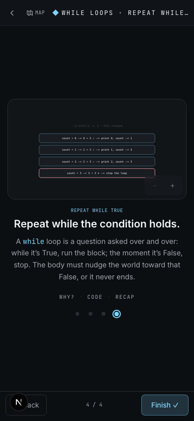
The diagram now shows all three active rounds plus a fourth row in a red (bad) tone: `count = 3 → 3 < 3 ✗ → stop the loop`, with the caption "✓ printed 0, 1, 2 — then stopped". The top bar reads "step 4/4 · REPEAT WHILE TRUE". The main panel shows eyebrow "REPEAT WHILE TRUE", title "Repeat while the condition holds.", and body describing the while loop as a question asked over and over — True runs the block, False stops, and the body must nudge toward False. Progress dots show the fourth filled. The right side nav reads "FINISH", left reads "BACK". No gate on this beat. The detail content for this beat carries the "idea 3 of 7" foreshadow callout about invariants and progress. Mobile renders the same with a "4 / 4" bottom-bar counter.

### Code drawer

Opened over the right side of the Beat 4 view, the drawer is titled "THE CODE SO FAR" with a close (x) control and an "OPTIONAL  algorithm.py · the lesson works without it" subhead. It shows numbered Python lines: a comment "# A while loop repeats its block as long as the …" (truncated at the panel edge), `count = 0`, `while count < 3:`, the indented `print(count)`, `count = count + 1`, and a highlighted line 7 `print("done")` marked with a ▶ pointer (the recap beat's `after` code label). The underlying main panel (title "Repeat while the condition holds.") remains visible to the left.

---

## try-except
route: `/categories/programming-basics/try-except/` · diagram shape: line

### Beat 1 — Code that can fail

The diagram is a branching flow: a top `try: / return a / b` box splits into two downward-arrow routes labeled "no error ↓" (left, to an "it worked → returns 5.0" box) and "raises error" with a lightning glyph (right, to an "except ZeroDivisionError: → returns 0" box). On this beat both routes render neutral/unlit. The dim caption above reads "some lines can fail, and a failure crashes the whole program". The header shows "TRY / EXCEPT · CATCHING ERRORS", an "IDEA 6 OF 7" pill, "step 1/5", and the beat label "CODE THAT CAN FAIL"; a "BUILDS ON · Functions" prereq pill sits in the strip below. The main panel reads idea "CODE THAT CAN FAIL", title "When a line blows up.", with body prose about division by zero, missing files, and bad input crashing the program; "error" is an underlined Term. Below are the WHY? · CODE · RECAP chips and a row of 5 progress dots with the first filled. The right side nav reads "WRAP IT", left reads "BACK". No gate; advancing is by the side nav / Wrap it button. On mobile the diagram is scaled to a single column, the side-nav labels become bottom "Back" and "Wrap it →" buttons, and a "1 / 5" counter sits between them.

### Beat 2 — try — attempt it

The same branching flow renders with all three boxes drawn; the routes stay neutral/unlit. The caption reads "wrap the line that might fail inside try:". Header shows "step 2/5" and label "TRY — ATTEMPT IT". The main panel idea is "TRY — ATTEMPT IT", title "try: return a / b", body explaining that the risky line goes inside a `try:` block which Python attempts and, on failure, looks for a matching `except`. Progress dots show the second dot filled. Side nav: left "BACK", right "AND THE SAFETY NET". No gate; advance by side nav.

### Beat 3 — except — catch it

The same flow diagram, routes still unlit. Caption reads "if a matching error is raised, control jumps to except". Header shows "step 3/5" and label "EXCEPT — CATCH IT". The main panel idea is "EXCEPT — CATCH IT", title "except ZeroDivisionError:", body describing the `except` block as the safety net Python jumps to when `try` raises that error, returning `0` instead of crashing. The third progress dot is filled. Side nav: left "BACK", right "THE GOOD CASE". No gate; advance by side nav. Per the spec this beat appears for every register and is where the rigorous register opens.

### Beat 4 — The happy path

This beat is a wedge/predict interaction and is captured here in its pre-interaction (locked) state. The flow diagram makes room for a "PREDICT" panel overlaid on the lower diagram area asking "10 / 2 succeeds — what does the except block do on this run?" with three choice chips: "skipped entirely", "runs anyway, after", and "checks the result". The caption above the boxes reads "safe_divide(10, 2): 10 / 2 works, no error this run" and both routes are unlit before the prediction. The header shows section name "THE HAPPY PATH" (step counter reads 5/5 in the header on desktop; the fourth progress dot is the active one in the dots row). The main panel idea is "THE HAPPY PATH", title "safe_divide(10, 2) → 5.0", body explaining the `try` succeeds, returns `5.0`, and the `except` is "skipped completely". Below the WHY? · CODE · RECAP chips, a hint reads "↑ TRY IT ON THE DIAGRAM TO CONTINUE" and the right side nav reads "LOCKED" with a padlock icon. Mechanically, the gate clears when the learner taps a prediction choice: that fires `api.onInteractionDone()` inside PredictGate and reveals the lit "ok" route (the no-error path and the "it worked → returns 5.0" box light up, caption updates to "safe_divide(10, 2): 10 / 2 works → returns 5.0, except skipped"), which unlocks the next-beat nav. On mobile the predict panel renders inside the scaled diagram with the same three chips and the "↑ TRY IT ON THE DIAGRAM TO CONTINUE" hint.

### Beat 5 — The caught error

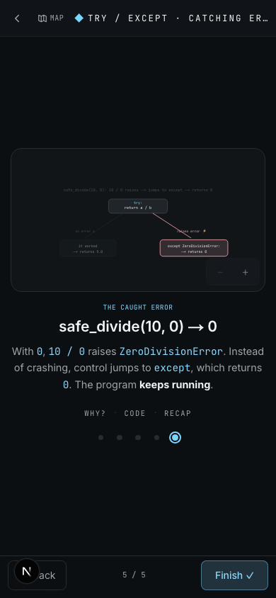
The flow diagram now lights the error route: the "raises error ⚡" line and the "except ZeroDivisionError: → returns 0" box render in the red/hard-difficulty tone with a glowing border, while the left "no error / it worked" box is dimmed. The caption reads "safe_divide(10, 0): 10 / 0 raises → jumps to except → returns 0". Header shows "step 5/5" and label "THE CAUGHT ERROR". The main panel idea is "THE CAUGHT ERROR", title "safe_divide(10, 0) → 0", body explaining that `10 / 0` raises `ZeroDivisionError`, control jumps to `except` which returns `0`, and the program "keeps running". The fifth progress dot is filled. Side nav: left "BACK", right "FINISH". This beat carries no interaction (actionLabel "Done").

### Code drawer

The drawer opens from the right edge over the Beat 5 scene, headed "THE CODE SO FAR" with a close (×) button. A sub-label reads "OPTIONAL · algorithm.py · the lesson works without it". It shows the Python source with line numbers: a comment "# try runs risky code; if it raises an error, ex…" (truncated at the drawer edge), then `def safe_divide(a, b):` with a `try: / return a / b` block, an `except ZeroDivisionError: / return 0` handler, and two calls `print(safe_divide(10, 2))` and `print(safe_divide(10, 0))`. Lines tied to the current beat are highlighted with run markers: line 7 (`return 0`) and line 10 (`print(safe_divide(10, 0))`), matching Beat 5's codeLabels.

---

## arrays
route: `/categories/data-structures/arrays/` · diagram shape: line

The runtime exposes 5 reachable beats and the capture reached all 5 on both desktop and mobile (the header reads "step 1/5" through "step 5/5"). The lesson spec defines 7 beats, but two of them (`pile` "The obvious thing" and `fit` "When it fits") are intuitive-register-only with `trimOnRefresh: true` and are absent from the default reachable sequence, leaving: setup, instinct, structure, operations, name. The captures are dot-jumps showing each beat in its INITIAL state, so the two wedge beats (2 and 4) appear LOCKED, pre-interaction.

### Beat 1 — The setup

The diagram is a single horizontal row of ten same-size cells holding the values 3, 1, 4, 1, 5, 9, 2, 6, 5, 3; the cell at index 6 (value 2) is highlighted in an active blue tone with a vertical arrow pointing down into it. The top bar shows the "MAP" link, "ARRAYS · REACH ANY SLOT IN ONE STEP", an "IDEA 5 OF 7" pill, "step 1/5", and the beat label "THE SETUP". A "BUILDS ON" strip below the bar shows a prereq pill "For Loops". The main panel under the diagram is labeled "THE SETUP", titled "A thousand books. Find the 487th.", with body text about reaching book number 487 by its position. The why · code · recap chips sit below the panel above five progress dots (first dot filled). The right side nav reads "I HAVE THE QUESTION" with a forward chevron; the left reads "BACK". No interaction gate — clicking the forward control advances. On mobile the layout stacks vertically with the diagram in a card and a bottom bar showing "Back", "1 / 5", and "I have the question".

### Beat 2 — The instinct

The diagram is the ten-cell row with index 0 (value 3) outlined in a green "good" tone and a "↑ here" marker beneath it; an index strip 0–9 runs below the cells, with the selected index drawn in accent ink. A caption above the row reads "click any slot — you land on it in one step, no counting". The main panel is labeled "THE INSTINCT", titled "Give every position a fixed home.", with body text introducing slot 0…999 and the term index. A secondary note panel on the right reads "The instinct: what changed about the books? Nothing. What changed about the arrangement?" This beat is a wedge gate (`interaction: "wedge"`); shown here pre-interaction, so the right side nav displays a lock icon labeled "LOCKED" and the footer reads "↑ TRY IT ON THE DIAGRAM TO CONTINUE". Mechanically, the learner clicks any slot (DragToSlot): the clicked cell turns green, the marker and index strip move to it, the caption updates to show `arr[i] = …  ·  base + i × size  ·  1 jump`, and the gate fires `onInteractionDone`, which clears the lock and enables the advance ("Storage decides speed"). Mobile shows the same gated state at step 2/5 with a dimmed "Storage decides speed" button and the "TRY IT ON THE DIAGRAM TO CONTINUE" prompt.

### Beat 3 — The structure

The diagram is the memory ruler: the ten-cell row with index 6 (value 2) highlighted green and an address-offset label under every cell — "base" under index 0, then "+1·sz", "+2·sz" … "+9·sz". A vertical arrow points down into the highlighted cell, and a green line below reads "slot 6's spot = base + 6 × size — same one step for a row of a million". The main panel is labeled "THE STRUCTURE", titled "Same-size slots, packed side by side.", explaining the `base + i × size` address arithmetic and the term constant time. The why · code · recap chips and five progress dots (third filled) sit below. The right side nav reads "WHAT OPERATIONS COS…" (truncated) with a forward chevron; the left reads "BACK". No interaction gate — this is a static visual that advances on click. Mobile stacks the labeled ruler row in the diagram card with the same panel text and a footer "3 / …" plus a "What operations cost what?" button.

### Beat 4 — The operations

The diagram is the insert-cost predict gate. An eight-cell row (3, 1, 4, 5, 9, 2, 6, 5) is shown with index 3 (value 5) highlighted active and a "↓ 8 goes here" marker beneath it; a caption above reads "a new value, 8, needs slot 3 — and the slots are all taken". A PREDICT panel is hosted on the canvas with the question "A new value needs slot 3 — what happens to the cells after it?" and three choice pills: "nothing — they stay put", "every later cell shifts right", and "only the last cell moves". A right note panel reads "Append at the end is O(1) too, on average. Once in a while the shelf is full and the books are copied to a bigger one." The main panel is labeled "THE OPERATIONS", titled "Cheap reads, costly middle-edits.", explaining O(1) reads versus O(n) middle inserts. This beat is a predict gate (`interaction: "wedge"`); shown here pre-interaction, so the right side nav displays a lock icon labeled "LOCKED" and the footer reads "↑ TRY IT ON THE DIAGRAM TO CONTINUE". Mechanically, the learner taps a choice: the gate marks the correct answer ("every later cell shifts right"), shows feedback, then after a reading pause auto-plays the AutoInsert animation in which the tail shifts right one cell at a time (muted tone) and the new value 8 lands in slot 3 (green), with a running shift counter and a "↺ replay" button. Clearing the gate enables the advance ("Name the structure"). Mobile shows the same gated state at step 4/5 with the predict panel visible, a dimmed "Name the structure" button, and the "TRY IT ON THE DIAGRAM TO CONTINUE" prompt.

### Beat 5 — The pattern

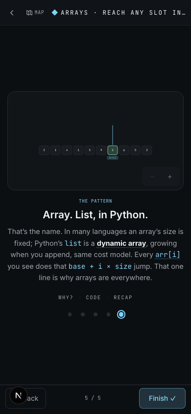

The diagram returns to the full ten-cell row with index 6 (value 2) highlighted green and an `arr[i]` marker beneath it, with the vertical arrow pointing into it. The main panel is labeled "THE PATTERN", titled "Array. List, in Python.", with body text naming the structure, the term dynamic array, and the `base + i × size` jump tying back to idea 5 of 7. The why · code · recap chips sit above the five progress dots (fifth filled). The right side nav reads "FINISH" with a forward chevron; the left reads "BACK". No interaction gate. Mobile shows the same final beat at step 5/5 with a "Finish ✓" button in the bottom bar.

### Code drawer

Opening the Code panel slides in a right-hand drawer titled "THE CODE SO FAR", with a sub-label "OPTIONAL  algorithm.py · the lesson works without it". It shows numbered Python source for `books: list[str]` with six commented operations: indexed access `books[2]` (O(1)), `books.append("Frame")` (O(1) amortized), `books.insert(2, "Bridge")` (O(n)), `del books[1]` (O(n)), iteration with `for i, title in enumerate(books)`, and `n = len(books)` (O(1)). Two lines — the `books` declaration on line 3 and `n = len(books)` on line 22 — are highlighted with a left-edge marker. Below the code a "PRACTICE · try these next" section lists "Move Zeroes" tagged "EASY" with a forward arrow. The drawer has a close (×) control top-right. It was captured on beat 5 (step 5/5).

---

## strings
route: `/categories/data-structures/strings/` · diagram shape: line

This re-capture reached all beats on both viewports: desktop `{reached:5, total:5}` and mobile `{reached:5, total:5}`. The live lesson runs the 5-step flow (the step counter reads `step 1/5` … `step 5/5`): The setup, The instinct, The structure, The operations, String. Each beat below is shown in its initial state from the dot-jump; the interactive (wedge) beats appear pre-interaction, so their gates read `LOCKED` and the interactions are described from the spec.

### Beat 1 — The setup

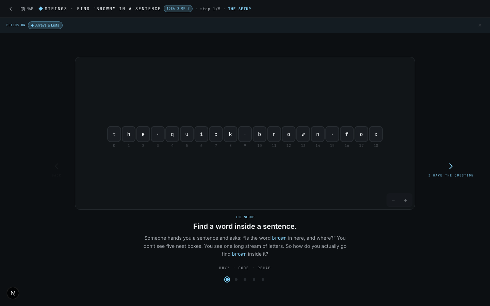
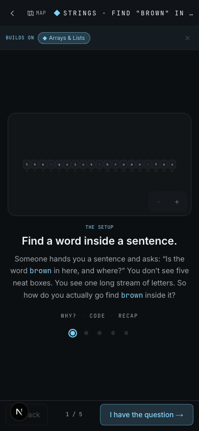

The diagram is a single horizontal row of 19 character cells spelling out `the quick brown fox`, with spaces drawn as a faint dot (`·`) and an index (0–18) labeled under each cell. The header reads `STRINGS · FIND "BROWN" IN A SENTENCE`, an `IDEA 3 OF 7` pill, then `· step 1/5 · THE SETUP`; a `BUILDS ON` prereq bar below carries one pill, `Arrays & Lists`. The main panel under the canvas is captioned `THE SETUP` with the title "Find a word inside a sentence." and body text asking whether the word `brown` is in the sentence and where, noting you see one long stream of letters rather than five neat boxes. The why·code·recap chips sit below the body with five progress dots (first dot filled). The left side nav reads `BACK`; the right side nav reads `I HAVE THE QUESTION` (the beat's actionLabel). On mobile the row is compressed to fit width, and the side-nav labels become a bottom bar with `back`, a `1 / 5` counter, and an `I have the question →` button. There is no gate on this beat; advancing is a single click of the forward nav.

### Beat 2 — The instinct

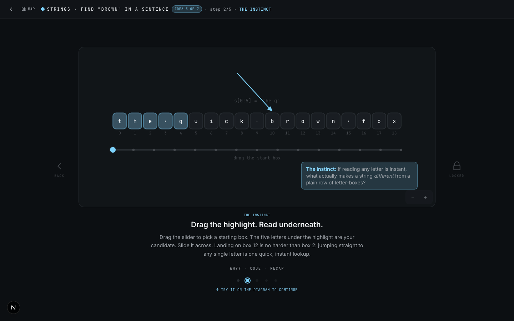
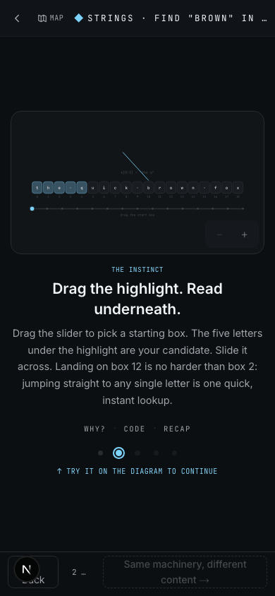

The same 19-cell `the quick brown fox` row is shown, now with a draggable slider track running beneath it labeled "drag the start box" and a caption above the row reading `s[0:5] = "the·q"` (the current 5-letter candidate window, starting at index 0). A diagonal arrow points down toward the highlighted cells; cells 0–4 (the window) render in the active tone. The main panel is captioned `THE INSTINCT`, title "Drag the highlight. Read underneath.", with body text explaining that the five highlighted letters are the candidate and that landing on box 12 is no harder than box 2. A separate note panel to the right reads "The instinct: if reading any letter is instant, what actually makes a string different from a plain row of letter-boxes?". The right side nav shows `LOCKED` (this is the pre-interaction state), and under the why·code·recap dots a prompt reads `↑ TRY IT ON THE DIAGRAM TO CONTINUE`. This is a wedge interaction: the learner drags the start-box slider, which re-slices the candidate (`s[start:start+5]`) and compares it to `brown`; any move fires the interaction-done signal and unlocks the forward nav. The capture shows it locked because the dot-jump does not perform the drag. On mobile the row, slider, and arrow are scaled down, the note panel is not visibly separated, and the bottom bar shows `back`, a `2 …` counter, and a dimmed `Same machinery, different content →` button; the same `↑ TRY IT ON THE DIAGRAM TO CONTINUE` prompt appears.

### Beat 3 — The structure

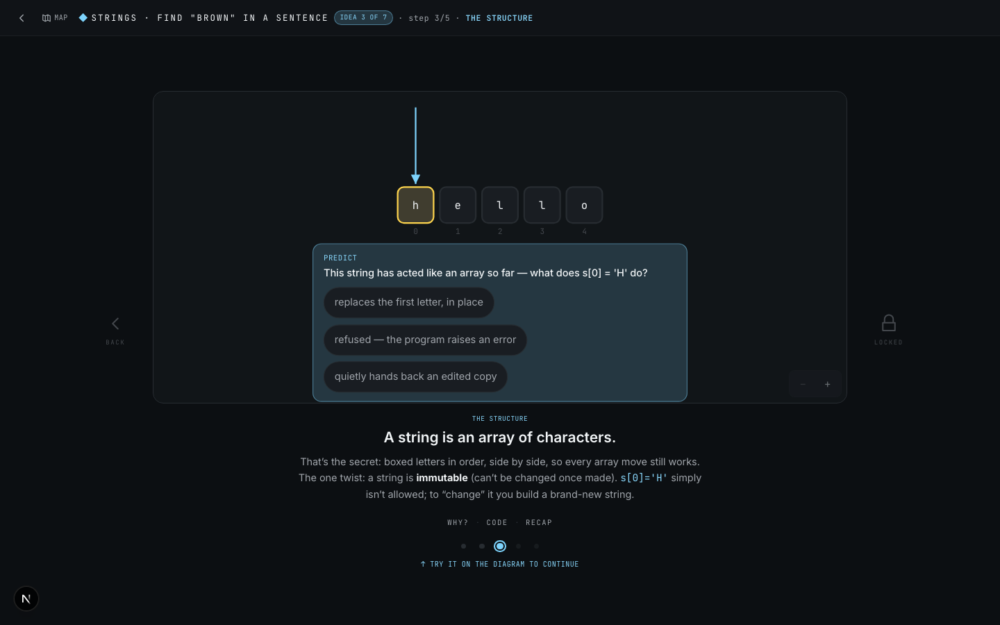
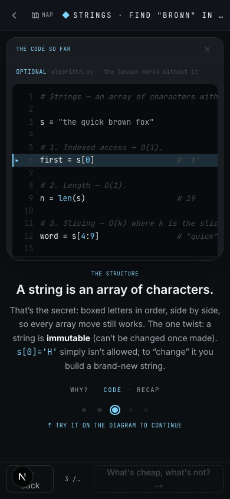

The diagram switches to the short 5-cell `hello` row (indices 0–4), with cell 0 (`h`) outlined and a vertical arrow pointing down into it. A `PREDICT` panel overlays the lower canvas asking "This string has acted like an array so far — what does s[0] = 'H' do?" with three tappable choices: "replaces the first letter, in place", "refused — the program raises an error", and "quietly hands back an edited copy". The main panel is captioned `THE STRUCTURE`, title "A string is an array of characters.", with body text stating the one twist: a string is immutable, so `s[0]='H'` is not allowed and to change it you build a brand-new string. The right side nav reads `LOCKED` and the `↑ TRY IT ON THE DIAGRAM TO CONTINUE` prompt is shown; the third progress dot is filled. This is a wedge interaction via a prediction gate: tapping one choice fires interaction-done and reveals the answer (the correct one is "refused"); on reveal a `🔒 locked` pill and a refusal caption ("s[0] = 'H' is not allowed — strings are immutable") appear, which are hidden in this pre-interaction capture. On mobile the `hello` row, predict panel, and choices stack within the narrower canvas above the same caption and chips.

### Beat 4 — The operations

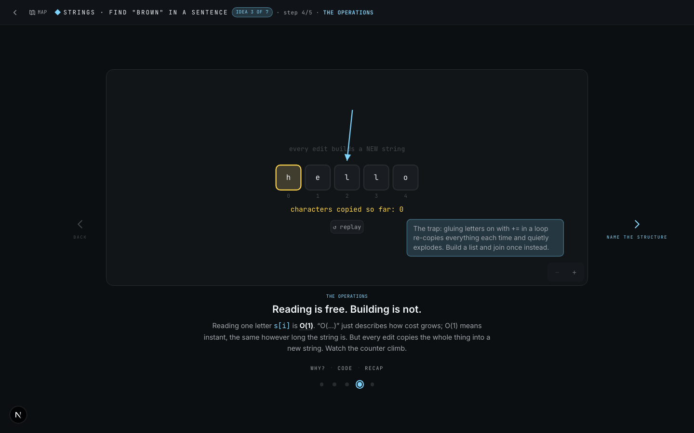
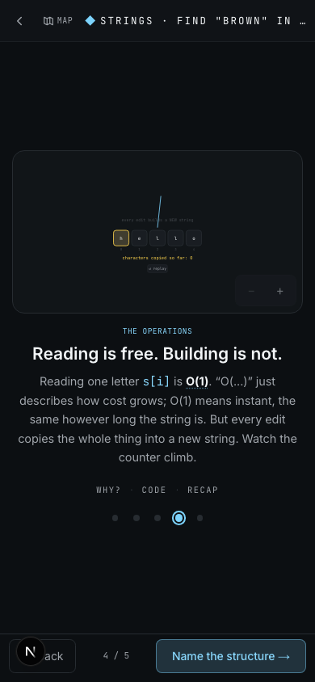

The `hello` row (indices 0–4) is shown with cell 0 outlined, a caption above reading "every edit builds a NEW string", a vertical arrow into the row, and a counter below reading "characters copied so far: 0". A `↺ replay` button sits under the counter. A note panel to the right reads "The trap: gluing letters on with += in a loop re-copies everything each time and quietly explodes. Build a list and join once instead." The main panel is captioned `THE OPERATIONS`, title "Reading is free. Building is not.", with body text explaining `s[i]` is O(1) while every edit copies the whole string into a new string. The right side nav reads `NAME THE STRUCTURE` and the fourth progress dot is filled. This is a playback beat: a timed animation replaces `s[0]` with `H`, then appends `!` twice, incrementing the copied-characters counter each step (the capture shows the initial frame at count 0); the `↺ replay` button restarts the animation. On mobile the row, counter, and note are scaled into the narrower canvas above the caption.

### Beat 5 — String

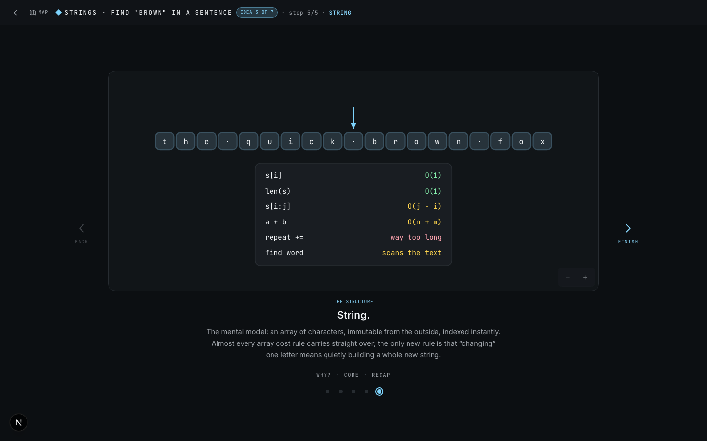
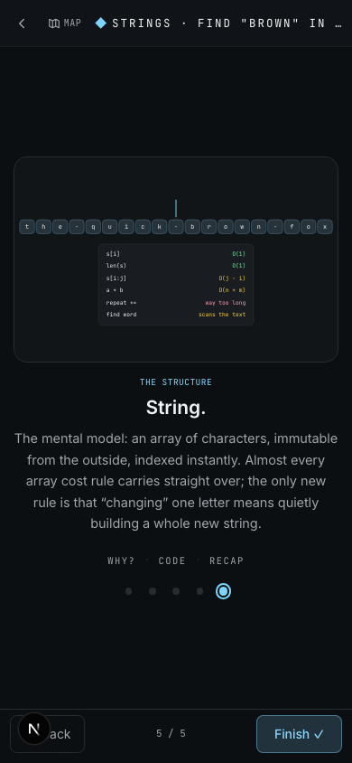

The 19-cell `the quick brown fox` row returns, dimmed (visited tone), with a vertical arrow pointing down into a centered cost-table card. The table lists six operations and their costs: `s[i]` → `O(1)`, `len(s)` → `O(1)`, `s[i:j]` → `O(j - i)`, `a + b` → `O(n + m)`, `repeat +=` → `way too long`, `find word` → `scans the text`. The main panel is captioned `THE STRUCTURE`, title "String.", with body text giving the mental model: an array of characters, immutable from the outside, indexed instantly, where "changing" one letter quietly builds a whole new string. The right side nav reads `FINISH` and the fifth (final) progress dot is filled. There is no gate on this beat. On mobile the dimmed row and cost table sit inside the narrower canvas, and the bottom bar shows `back`, a `5 / 5` counter, and a `Finish ✓` button.

### Code drawer

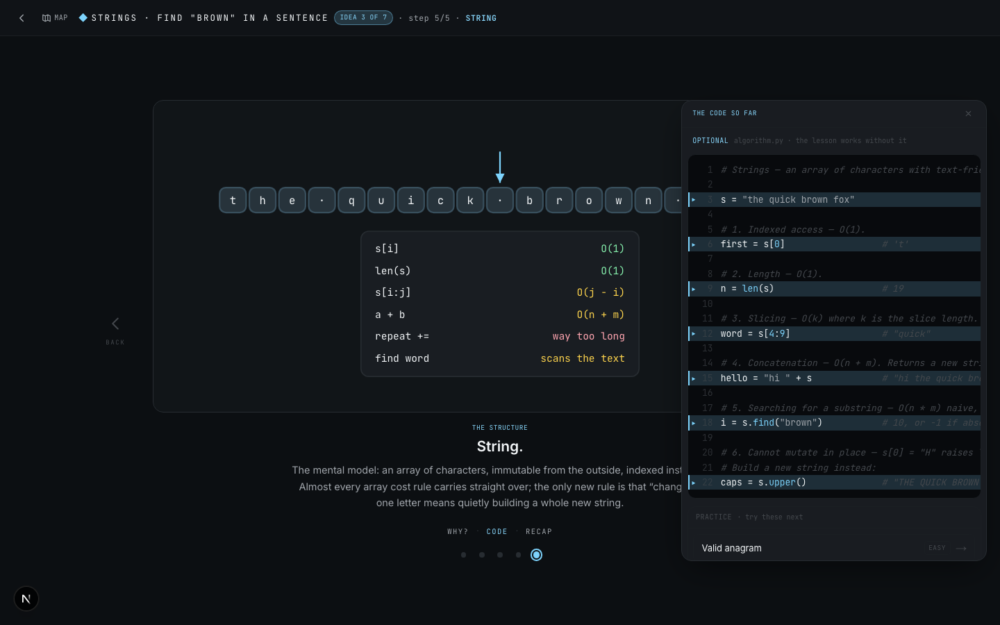

The code drawer (captured open on the final beat) slides over the right side of the canvas, headed `THE CODE SO FAR` with an `OPTIONAL · algorithm.py · the lesson works without it` subtitle. It shows the Python string interface line by line: `s = "the quick brown fox"`, indexed access `first = s[0]` (O(1), `# 't'`), `n = len(s)` (O(1), `# 19`), slicing `word = s[4:9]` (O(k), `# "quick"`), concatenation `hello = "hi " + s` (O(n + m)), substring search `i = s.find("brown")` (`# 10, or -1 if absent`), the mutation note `# 6. Cannot mutate in place — s[0] = "H" raises`, then `caps = s.upper()` (`# "THE QUICK BROWN..."`). Several lines carry a left-arrow active marker (including `s = "the quick brown fox"`, `first = s[0]`, `n = len(s)`, `word = s[4:9]`, `hello = "hi " + s`, `i = s.find("brown")`, and `caps = s.upper()`), matching the active code labels for this beat. Below the code a `PRACTICE · try these next` section lists "Valid anagram" tagged `EASY →`.

---

## sets-tuples
route: `/categories/data-structures/sets-tuples/` · diagram shape: line

The runtime exposes 5 reachable beats (the header reads "step 1/5" through "step 5/5"). The lesson spec defines 7 beats, but two of them (`scan` "The obvious thing" and `fit` "When they fit") are register-trimmed, leaving the reachable sequence: setup, wedge, structures, operations, name. Desktop and mobile both reached all 5.

### Beat 1 — The setup
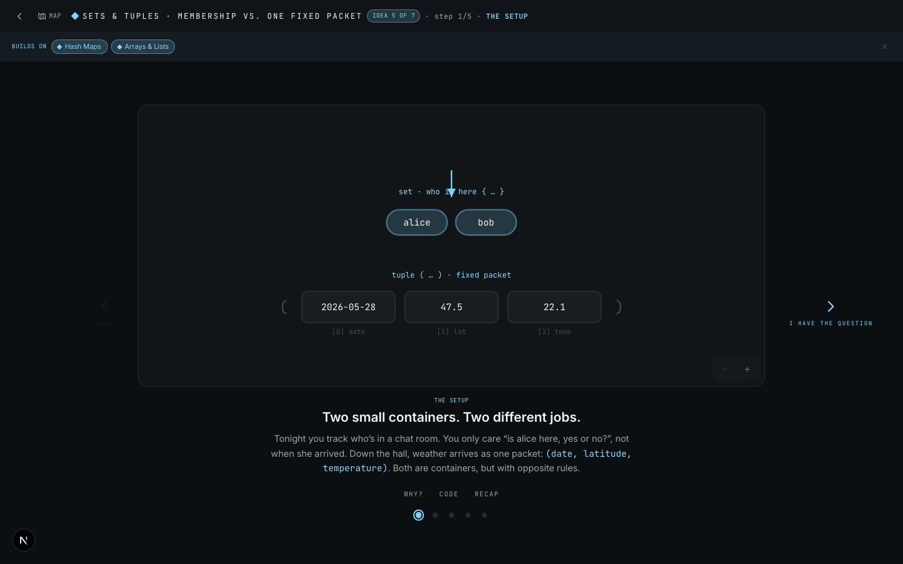
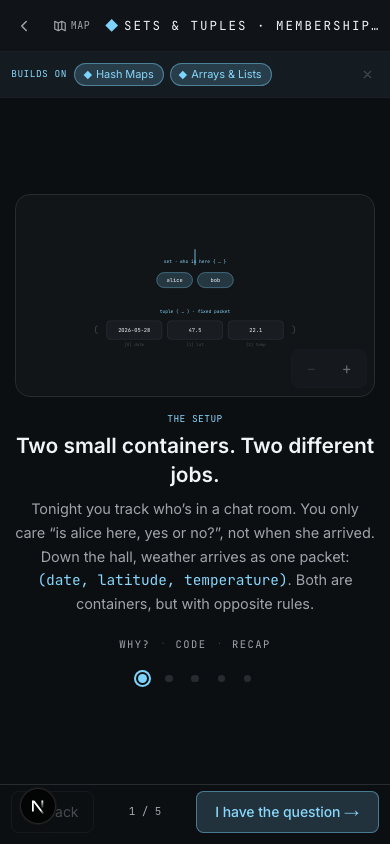

The diagram stacks two containers. On top, a set labeled "set · who is here { … }" holds two rounded pills, "alice" and "bob", with a vertical arrow pointing down into the set caption. Below it, a tuple labeled "tuple ( … ) · fixed packet" is drawn as three boxed cells inside parentheses holding `2026-05-28`, `47.5`, `22.1`, with position labels "[0] date", "[1] lat", "[2] temp" beneath each cell. Top bar shows the "MAP" link, "SETS & TUPLES · MEMBERSHIP VS. ONE FIXED PACKET", an "IDEA 5 OF 7" pill, "step 1/5", and the beat label "THE SETUP". A "BUILDS ON" strip below the bar shows two prereq pills, "Hash Maps" and "Arrays & Lists". The main panel is labeled "THE SETUP", titled "Two small containers. Two different jobs.", with body text about tracking who is in a chat room ("is alice here, yes or no?") versus the weather packet `(date, latitude, temperature)`. The why · code · recap chips sit under the panel above five progress dots (first dot filled). The right side nav reads "I HAVE THE QUESTION" with a forward chevron; the left reads "BACK". No interaction gate — clicking the forward control advances. On mobile the layout stacks vertically with the diagram in a card and a bottom bar showing "Back", "1 / 5", and "I have the question →".

### Beat 2 — The instinct
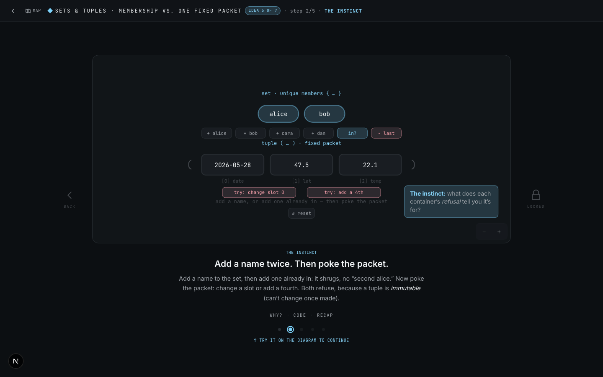
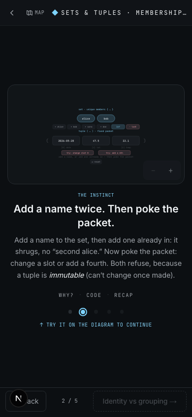

The diagram is the interactive add-name wedge, shown in its initial pre-interaction state (the dot-jump does not perform the tap). The set is labeled "set · unique members { … }" with the "alice" and "bob" pills, and a row of control buttons below it: "+ alice", "+ bob", "+ cara", "+ dan", an accent-colored "in?" button, and a "− last" button. Beneath that is the tuple ("tuple ( … ) · fixed packet") with its three cells, plus two poke buttons under it, "try: change slot 0" and "try: add a 4th", a caption "add a name, or add one already in — then poke the packet", and a "↺ reset" button. A right note panel reads "The instinct: what does each container's refusal tell you it's for?" The main panel is labeled "THE INSTINCT", titled "Add a name twice. Then poke the packet.", explaining that the set shrugs at a duplicate (no "second alice") and the tuple refuses any change because it is immutable. This beat is a wedge gate (`interaction: "wedge"`): the right side nav shows a lock icon labeled "LOCKED" and the footer reads "↑ TRY IT ON THE DIAGRAM TO CONTINUE". Mechanically, the learner clicks one of the controls — adding a fresh name appends a new pill, re-adding an existing name leaves the set size unchanged, "in?" reports membership, "− last" removes a pill, and the tuple poke buttons flash a refusal ("not allowed — a tuple can't be changed"/"can't grow"); any of these fires `onInteractionDone` and clears the gate to unlock the advance ("Identity vs grouping"). Mobile shows the same gated state at step 2/5.

### Beat 3 — The structures
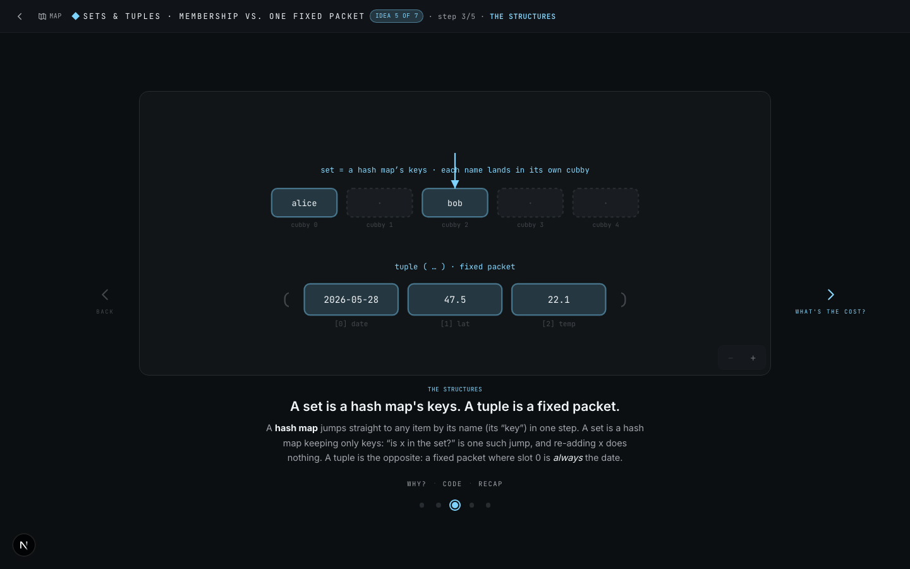
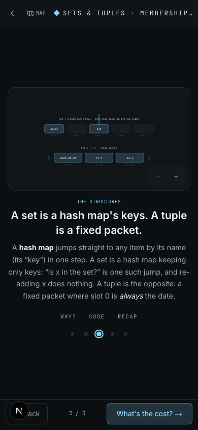

The diagram is the cubbies (buckets) view. Five numbered slots are drawn in a row, labeled "cubby 0" through "cubby 4" beneath them; cubby 0 holds "alice" and cubby 2 holds "bob" (filled, solid border), while cubbies 1, 3, 4 are empty (dashed border, a "·" placeholder). A caption above reads "set = a hash map's keys · each name lands in its own cubby" with a vertical arrow pointing down into a cubby. Below the cubbies, the tuple ("tuple ( … ) · fixed packet") is shown with its three cells `2026-05-28`, `47.5`, `22.1` drawn in an accent tone. The main panel is labeled "THE STRUCTURES", titled "A set is a hash map's keys. A tuple is a fixed packet.", explaining that a hash map jumps straight to any item by its key in one step, a set is a hash map keeping only keys, and a tuple is a fixed packet where slot 0 is always the date. The why · code · recap chips and five progress dots (third filled) sit below. Right nav reads "WHAT'S THE COST?" with a forward chevron; left reads "BACK". No interaction gate — this is a static visual that advances on click.

### Beat 4 — The operations
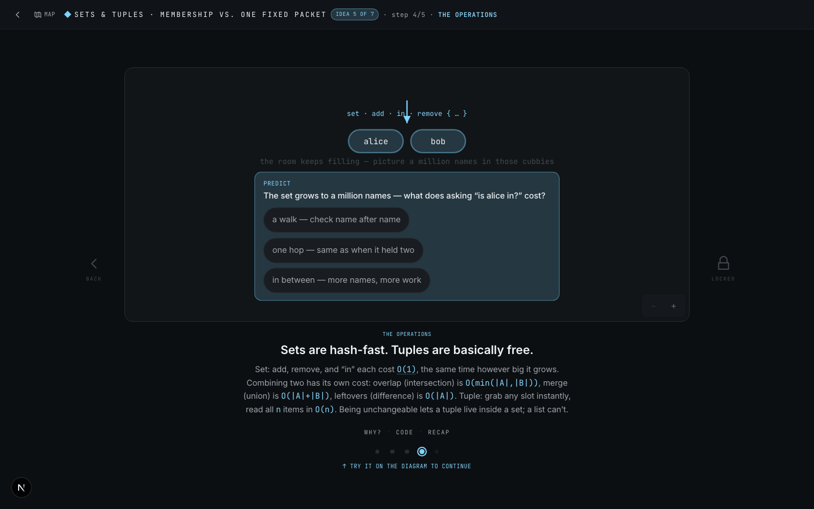
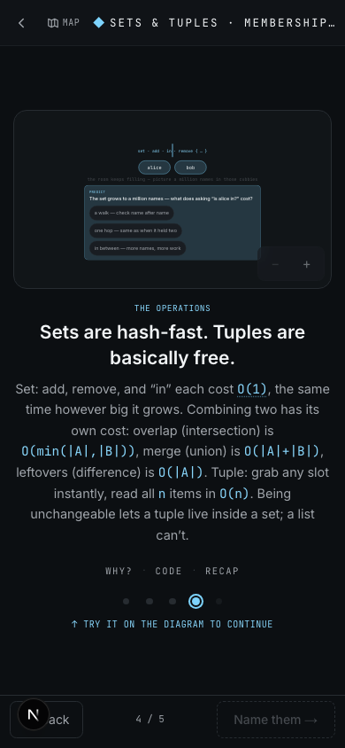

The diagram is the membership-cost predict gate, shown in its initial pre-interaction state. The set is labeled "set · add · in · remove { … }" with the "alice" and "bob" pills and a vertical arrow into the caption, plus a line "the room keeps filling — picture a million names in those cubbies". A PREDICT panel is hosted on the canvas with the question "The set grows to a million names — what does asking 'is alice in?' cost?" and three choice pills: "a walk — check name after name", "one hop — same as when it held two", and "in between — more names, more work". The main panel is labeled "THE OPERATIONS", titled "Sets are hash-fast. Tuples are basically free.", explaining set add/remove/in at `O(1)`, intersection `O(min(|A|,|B|))`, union `O(|A|+|B|)`, difference `O(|A|)`, tuple index `O(1)` / full read `O(n)`, and that immutability lets a tuple live inside a set. This beat is a predict gate (`interaction: "wedge"`): the right side nav shows a lock icon labeled "LOCKED" and the footer reads "↑ TRY IT ON THE DIAGRAM TO CONTINUE". Mechanically, the learner taps a choice; the gate marks the correct answer ("one hop — same as when it held two"), shows feedback, then after a reading pause reveals the OpsVisual with the actual cost list (add O(1) · in O(1) · ∩ O(min) · ∪ O(|A|+|B|) · − O(|A|), plus the slot/read costs and the tuple-inside-set note). Clearing the gate unlocks the advance ("Name them"). Mobile shows the same gated state at step 4/5.

### Beat 5 — Set and Tuple
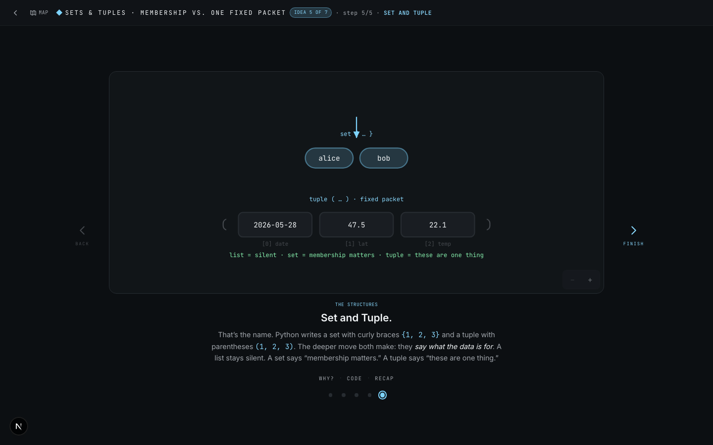
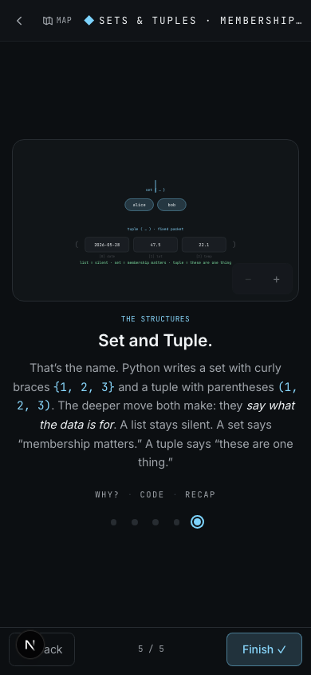

The diagram returns to the two-container layout: the set ("set { … }") with the "alice" and "bob" pills and a vertical arrow into the caption, and below it the tuple ("tuple ( … ) · fixed packet") with its three cells `2026-05-28`, `47.5`, `22.1` and position labels, plus a green summary line "list = silent · set = membership matters · tuple = these are one thing". The main panel is labeled "THE STRUCTURES", titled "Set and Tuple.", with body text naming the structures (set written `{1, 2, 3}`, tuple written `(1, 2, 3)`), stating both declare what the data is for while a list stays silent. The why · code · recap chips sit above the five progress dots (fifth filled). The right side nav reads "FINISH" with a forward chevron; the left reads "BACK". No interaction gate. Mobile shows the same closing beat at step 5/5.

### Code drawer
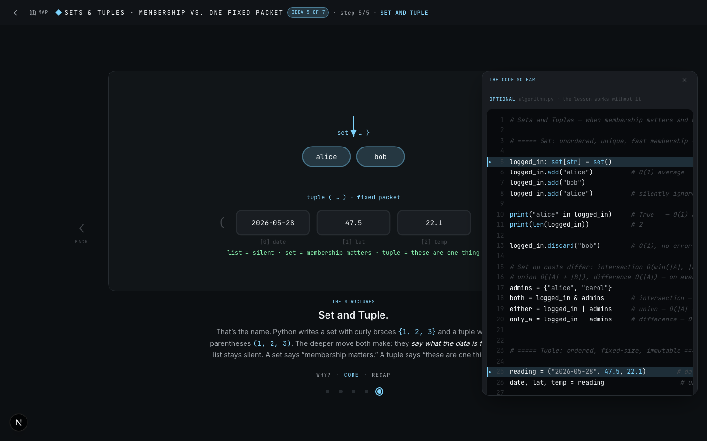

Opening the Code panel slides in a right-hand drawer titled "THE CODE SO FAR", with a sub-label "OPTIONAL  algorithm.py · the lesson works without it", overlaying the dimmed lesson scene. It shows numbered Python source headed "# Sets and Tuples — when membership matters" with two sections. The set section builds `logged_in: set[str] = set()`, calls `.add("alice")` (O(1) average), `.add("bob")`, and `.add("alice")` again (silently ignored), then `print("alice" in logged_in)` (True, O(1)), `print(len(logged_in))`, and `.discard("bob")` (O(1), no error). A "# Set op costs differ" block defines `admins = {"alice", "carol"}` and computes `both = logged_in & admins` (intersection), `either = logged_in | admins` (union), and `only_a = logged_in - admins` (difference) with their costs commented. The tuple section defines `reading = ("2026-05-28", 47.5, 22.1)` and unpacks `date, lat, temp = reading`. Two lines (the `logged_in` declaration and the `reading` declaration) are highlighted with a left-edge marker. The drawer has a close (×) control top-right. This drawer was captured on beat 5 (step 5/5).

---

## linked-lists

route: `/categories/data-structures/linked-lists/` · diagram shape: line

The captured run renders the structured register, which is 5 beats: setup, instinct (the wedge), structure, operations, and name. The "obvious" and "when it fits" beats are not in this register. The top bar reads "LINKED LISTS · ORDER LIVES IN THE ARROWS, NOT THE POSITIONS" with a "MAP" link, an "IDEA 4 OF 7" chip, a "step N/5" counter, and the current beat label. A "BUILDS ON" row carries an "Arrays & Lists" prereq pill (visible until dismissed with the X on the right). The main panel sits under the canvas with a label/title/body, and a "WHY? · CODE · RECAP" chip row over a row of step dots. Side rails show "BACK" on the left and the forward action label (or a LOCKED padlock on gated beats) on the right.

### Beat 1 — The setup

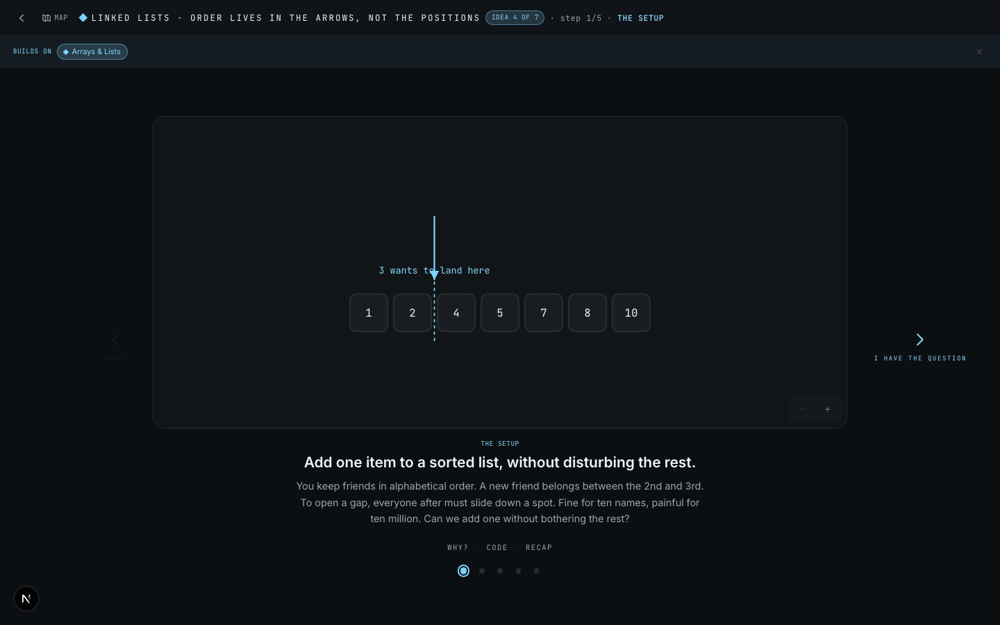
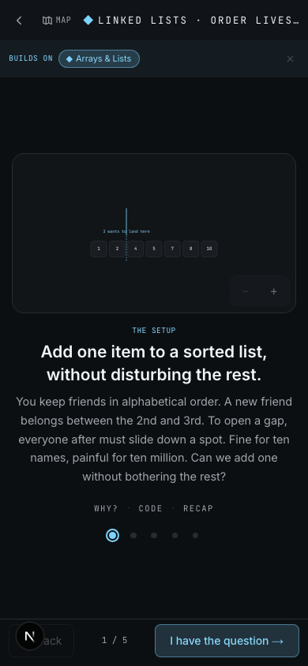

The visual is a sorted array row of cells 1, 2, 4, 5, 7, 8, 10 with a dashed vertical gap marker between cell 2 and cell 4, captioned "3 wants to land here". The main panel is labelled "THE SETUP" with title "Add one item to a sorted list, without disturbing the rest." and body text about keeping friends in alphabetical order where a new friend belongs between the 2nd and 3rd name and everyone after must slide down a spot. There is no diagram interaction on this beat; the forward action reads "I HAVE THE QUESTION" on desktop and "I have the question" on mobile, and the step counter shows 1/5 with the first of five dots filled. On mobile the canvas stacks above the panel and the back/forward controls run along the bottom bar ("Back · 1 / 5 · I have the question").

### Beat 2 — The instinct

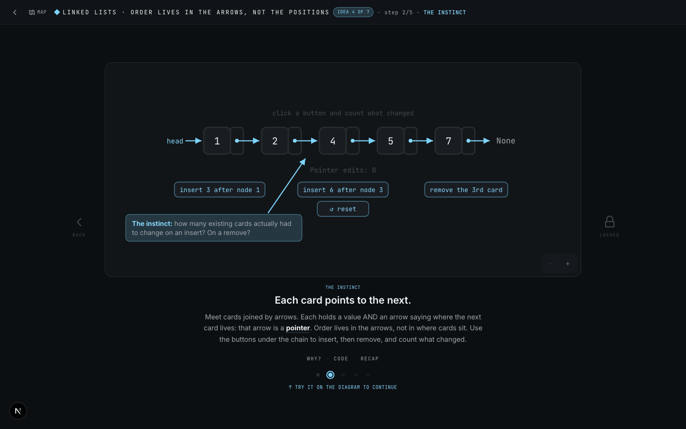
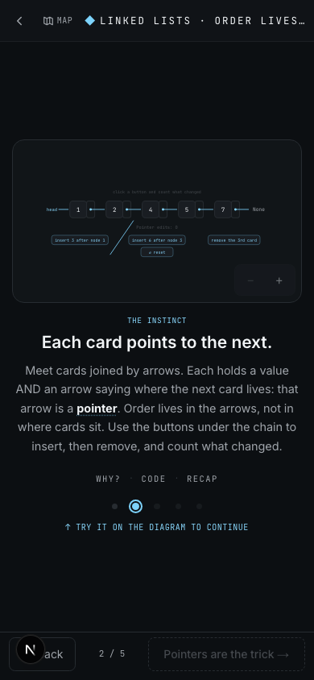

The visual switches to the linked-list chain: a "head" label arrows into nodes 1, 2, 4, 5, 7, each drawn as a value box plus a small "next" compartment with a dot, arrows linking each node to the next, ending in "None". A caption above reads "click a button and count what changed", and a "Pointer edits: 0" counter sits below. Three SVG buttons ("insert 3 after node 1", "insert 6 after node 3", "remove the 3rd card") plus a "reset" button drive the chain; a note callout reads "The instinct: how many existing cards actually had to change on an insert? On a remove?" with an arrow up to the chain. The interaction type is wedge: this beat is gated, captured here in its pre-interaction (LOCKED) state with the padlock on the right rail and the footer hint "TRY IT ON THE DIAGRAM TO CONTINUE". Clicking a button splices the chain, recolors the touched nodes and the single rerouted pointer green, updates the edit count (2 for an insert, 1 for a remove), fires onInteractionDone, and unlocks forward navigation.

### Beat 3 — The structure

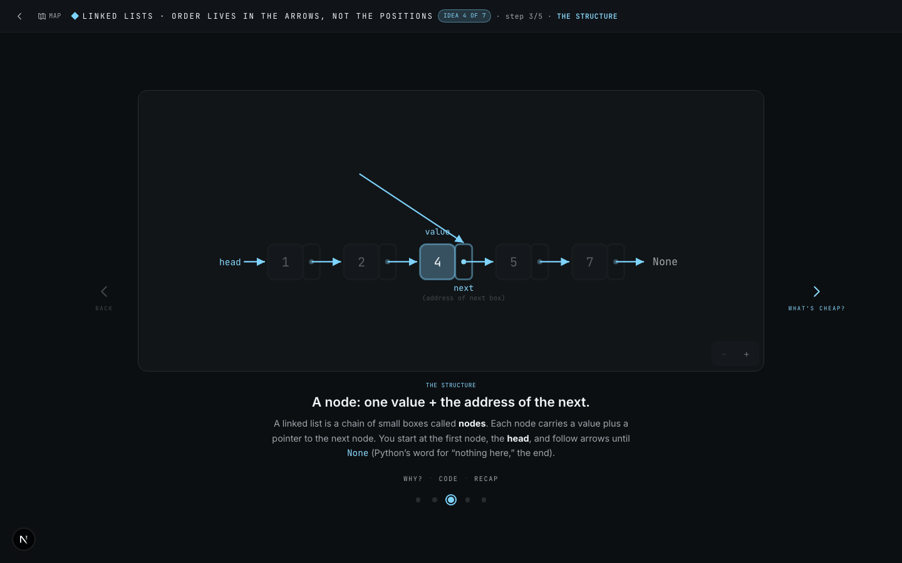
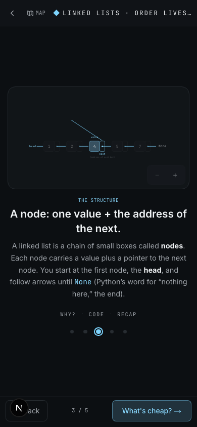

The visual spotlights the third node (value 4) of the chain: it is highlighted while the other nodes are dimmed, with the label "value" above its left compartment and "next" plus "(address of next box)" below its right compartment, and an arrow pointing down into the next compartment. The main panel is labelled "THE STRUCTURE" with title "A node: one value + the address of the next." and body explaining that a linked list is a chain of boxes called nodes, each carrying a value plus a pointer to the next, where you start at the head and follow arrows until None. There is no gating interaction on this beat; the forward action reads "WHAT'S CHEAP?" and the step counter shows 3/5.

### Beat 4 — The operations

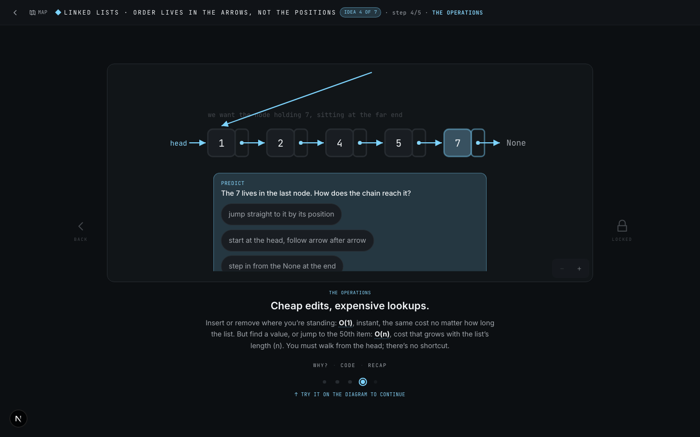
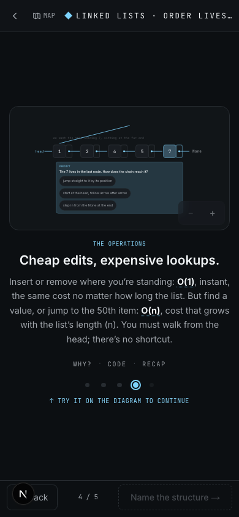

The visual shows the full chain with the last node (value 7) highlighted and a caption "we want the node holding 7, sitting at the far end". Below the chain a PREDICT panel asks "The 7 lives in the last node. How does the chain reach it?" with three choices: "jump straight to it by its position", "start at the head, follow arrow after arrow", and "step in from the None at the end". The main panel is labelled "THE OPERATIONS" with title "Cheap edits, expensive lookups." and body contrasting O(1) inserts/removes where you stand against O(n) find or jump. The interaction type is wedge (a prediction gate), captured pre-interaction, so the right rail shows LOCKED and the footer reads "TRY IT ON THE DIAGRAM TO CONTINUE". Tapping a pill commits the prediction and fires onInteractionDone; after a short pause the FindWalk playback runs the head-to-tail traversal, lighting each node and counting the hops, and a cost table (insert/remove O(1), find/jump O(n)) appears.

### Beat 5 — Linked list

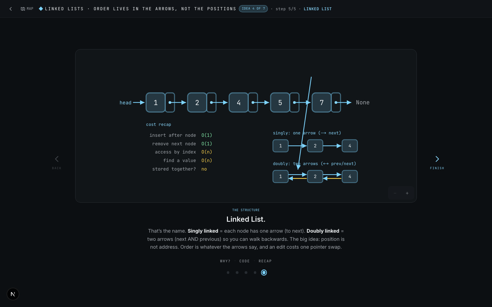
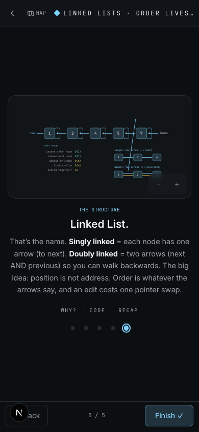

The visual shows the clean chain (all nodes in the accent tone), a left "cost recap" column (insert after node O(1), remove next node O(1), access by index O(n), find a value O(n), stored together? no), and on the right two mini diagrams: "singly: one arrow (-> next)" with three nodes 1, 2, 4 linked forward, and "doubly: two arrows (<-> prev/next)" with forward arrows plus return arrows in a second color. The main panel is labelled "THE STRUCTURE" with title "Linked List." and body defining singly vs doubly linked and the idea that position is not address (order is whatever the arrows say). This is the closing beat; the forward action reads "FINISH" and the step counter shows 5/5 with the last dot filled.

### Code drawer

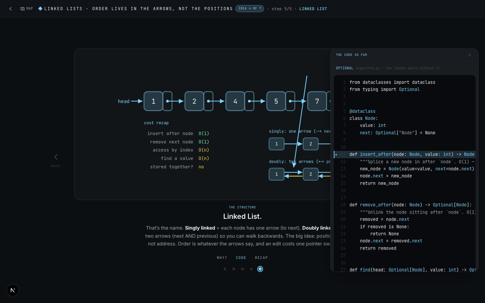

Opening the drawer slides in a "THE CODE SO FAR" panel on the right, marked "OPTIONAL · algorithm.py · the lesson works without it". The Python source imports `dataclass` and `Optional`, defines a `@dataclass class Node` with `value: int` and `next: Optional["Node"] = None`, then `insert_after(node, value) -> Node` (docstring "Splice a new node in after `node`. O(1)…", with `new_node = Node(value=value, next=node.next)` then `node.next = new_node`), `remove_after(node) -> Optional[Node]` (unlinks the following node, O(1), with a None check), and the start of `find(head, value)`. Line 11 (`def insert_after`) carries the active-line indicator, matching the codeLabels on the operations beat. A close (X) control sits at the drawer's top-right.

---

## stacks-queues
route: `/categories/data-structures/stacks-queues/` · diagram shape: box

The gallery renders this lesson in its structured register, so the side rail and the dot strip show 5 steps (`step N/5`). The top bar reads `STACKS & QUEUES · TWO CONTRACTS ON A ROW`, carries an `IDEA 3 OF 7` chip, a `MAP` link, and the current beat label. A `BUILDS ON` banner with an `Arrays & Lists` prereq pill (and an X to dismiss) sits under the bar on the first beat. Each beat shows a `WHY? · CODE · RECAP` chip trio above the five-dot progress strip, left/right side-nav labels (`BACK` and the next action chevron), and a `−`/`+` zoom control in the canvas. On desktop the panel text sits below the canvas; on mobile the canvas crops to the center of the diagram and the nav collapses into a bottom bar with `back`, an `N / 5` step counter, and the next-action button.

### Beat 1 — The setup
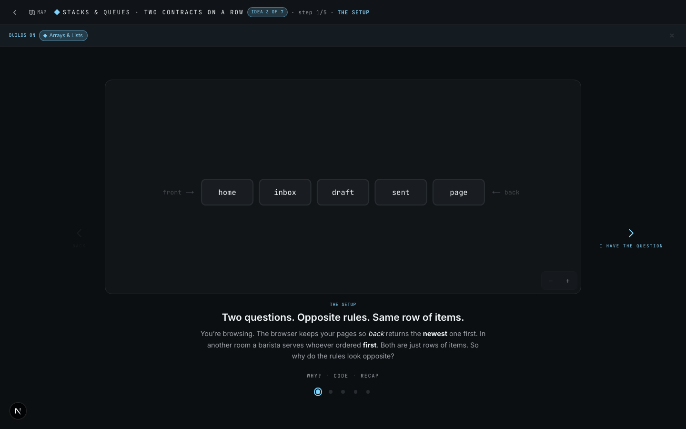
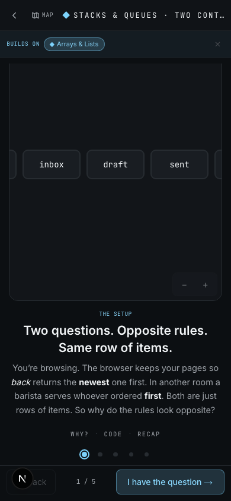

The canvas draws a single horizontal row of five boxes (home, inbox, draft, sent, page) with a faint `front →` marker at the left edge and `← back` at the right; this is the shared row both later stories sit on. The main panel reads `THE SETUP` as the caption, titled "Two questions. Opposite rules. Same row of items.", with body text contrasting the browser back button (returns the newest page first) against a barista serving whoever ordered first (oldest). The right rail shows the `I HAVE THE QUESTION` action; the first of five dots is filled. This beat has no gate; the learner advances by pressing the action chevron. On mobile the row crops to inbox/draft/sent and the `BUILDS ON · Arrays & Lists` banner shows at the top, with a `1 / 5` counter and "I have the question →" in the bottom bar.

### Beat 2 — The instinct
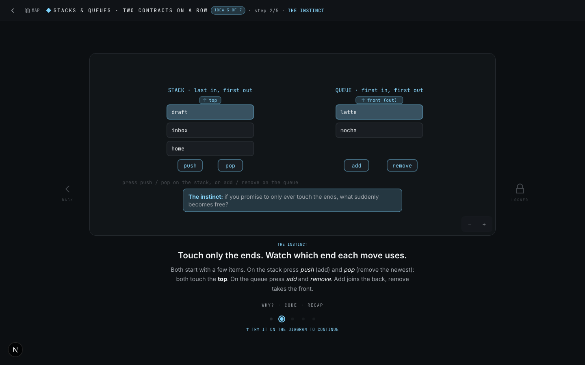
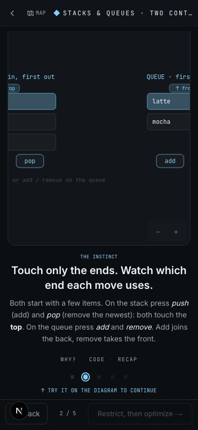

The canvas splits into two stacked-box structures side by side. On the left, `STACK · last in, first out` with an `↑ top` pill above three boxes (draft tinted on top, then inbox, then home) and `push`/`pop` buttons beneath. On the right, `QUEUE · first in, first out` with an `↑ front (out)` pill above latte (tinted at front) and mocha, plus `add`/`remove` buttons. A helper line reads "press push / pop on the stack, or add / remove on the queue", and a note panel overlays the lower canvas: "The instinct: if you promise to only ever touch the ends, what suddenly becomes free?". The main panel caption is `THE INSTINCT`, titled "Touch only the ends. Watch which end each move uses." The interaction is a wedge gate: clicking any of the four SVG buttons mutates that structure (push appends a pooled value to the top, pop removes the top, add joins the queue's back, remove serves the front), highlights the matching code line, and fires the interaction-done callback to clear the gate. Captured pre-interaction, so the right rail shows a padlock with `LOCKED` and the footer reads `↑ TRY IT ON THE DIAGRAM TO CONTINUE` (the mobile advance button "Restrict, then optimize →" renders greyed/disabled).

### Beat 3 — The structure
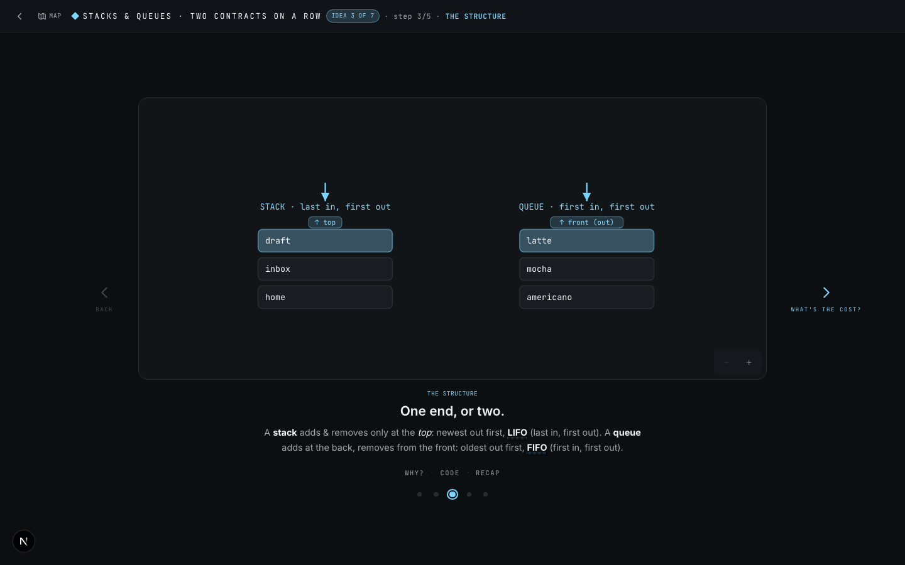
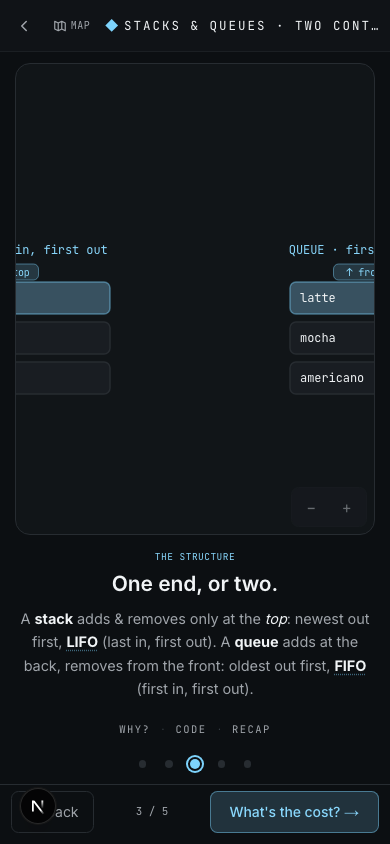

The canvas shows the two contracts side by side (STACK with draft/inbox/home, QUEUE with latte/mocha/americano), each with a downward arrow pointing at it from above and the touch-point tinted (stack top active, queue front active). The main panel caption is `THE STRUCTURE`, titled "One end, or two.", explaining that a stack adds and removes only at the top (LIFO, last in first out) while a queue adds at the back and removes from the front (FIFO, first in first out); LIFO and FIFO render as underlined glossary terms. The right rail action is `WHAT'S THE COST?`. This beat has no gate; the third dot is filled.

### Beat 4 — The operations
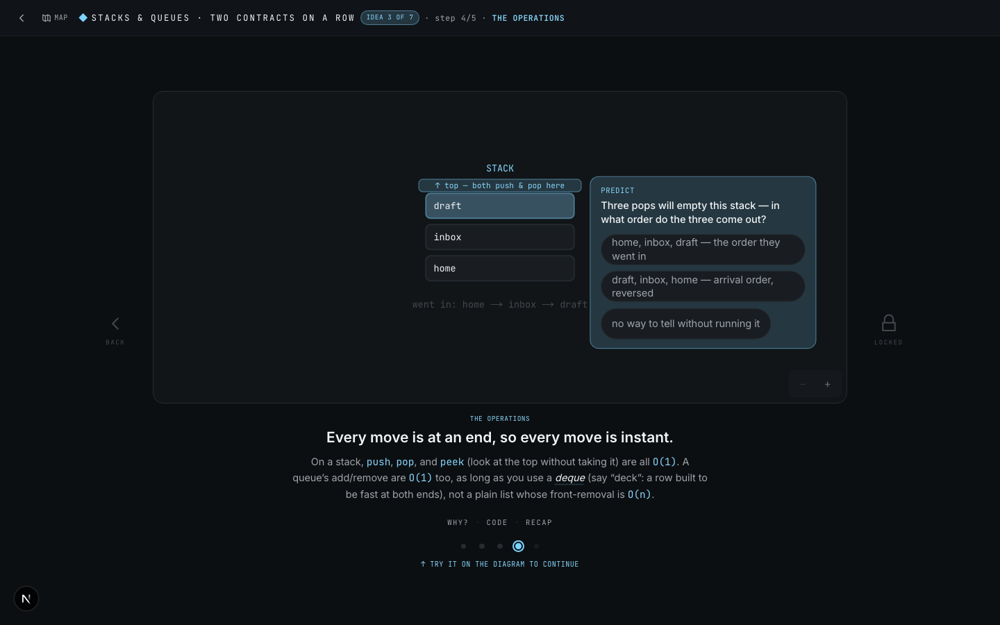
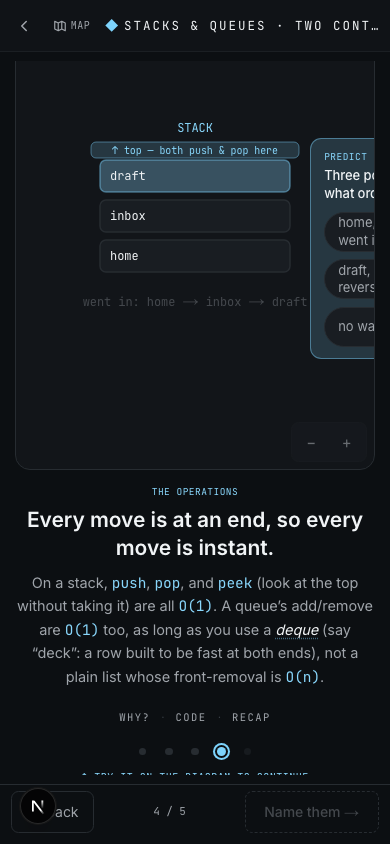

The canvas shows a single STACK column (`↑ top — both push & pop here`, items draft/inbox/home with the top tinted) and a caption "went in: home → inbox → draft" beneath it. A `PREDICT` gate panel sits to the right asking "Three pops will empty this stack — in what order do the three come out?" with three choices: "home, inbox, draft — the order they went in", "draft, inbox, home — arrival order, reversed", and "no way to tell without running it". The main panel caption is `THE OPERATIONS`, titled "Every move is at an end, so every move is instant.", noting push/pop/peek are O(1) and a queue's add/remove are O(1) only on a deque, not a plain list whose front-removal is O(n) (O(1), deque, O(n) render as glossary terms). The interaction is a wedge: tapping one prediction choice fires the interaction-done callback, shows feedback (the reversed-order choice is correct), then after a short pause auto-plays a push-three-then-pop-three animation answering the prediction. Captured pre-interaction, so the right rail shows `LOCKED` and the footer reads `↑ TRY IT ON THE DIAGRAM TO CONTINUE`. Mobile crops the canvas so the STACK column and the left edge of the PREDICT panel are visible.

### Beat 5 — The pattern
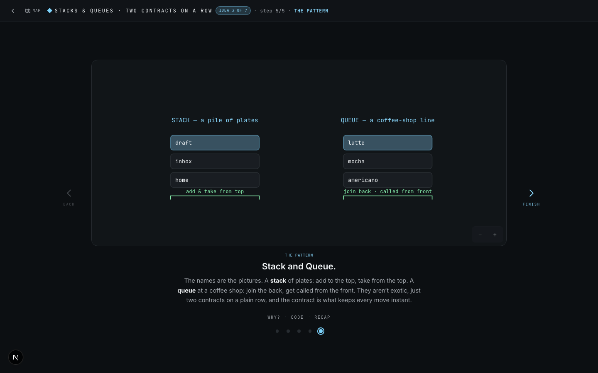
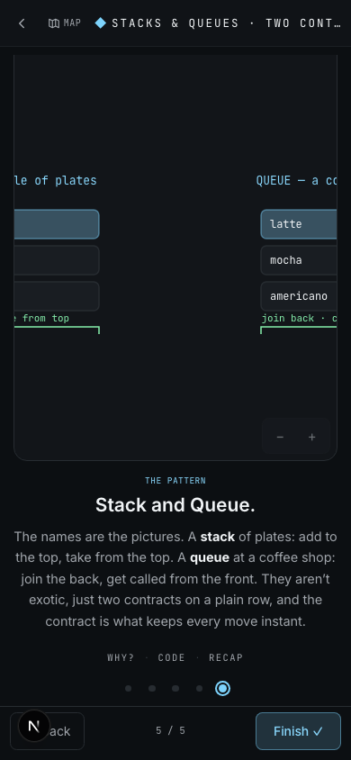

The canvas draws the two named contracts as physical pictures: `STACK — a pile of plates` (draft/inbox/home with a bracket reading "add & take from top") and `QUEUE — a coffee-shop line` (latte/mocha/americano with a bracket reading "join back · called from front"), both brackets drawn in the easy-difficulty color. The main panel caption is `THE PATTERN`, titled "Stack and Queue.", stating the names come from the pictures and that both are two contracts on a plain row where the contract keeps every move instant. The right rail action is `FINISH` and the fifth dot is filled. This beat has no gate.

### Code drawer
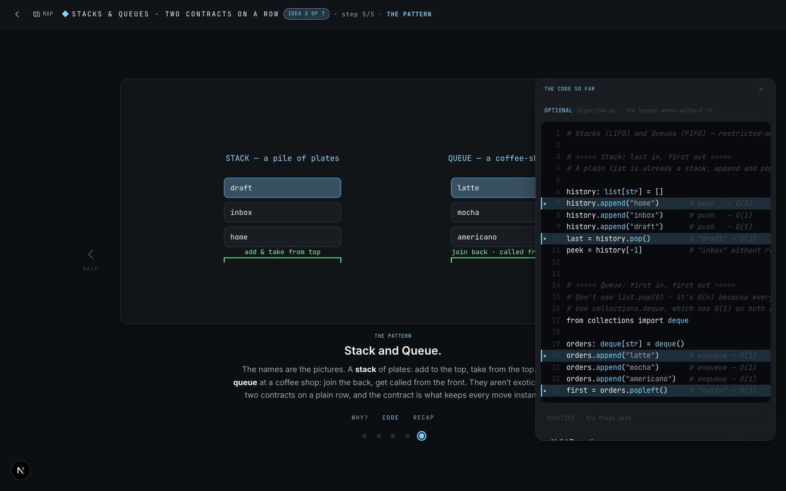

Opening the code drawer slides a panel in from the right over the canvas. Its header reads `THE CODE SO FAR` with an `OPTIONAL · algorithm.py — the lesson works without it` subtitle. The numbered Python source shows the stack section first (`history: list[str] = []`, three `history.append(...)` lines commented `# push — O(1)`, then `last = history.pop()` and `peek = history[-1]`), then the queue section (`from collections import deque`, `orders: deque[str] = deque()`, three `orders.append(...)` lines commented `# enqueue — O(1)`, and `first = orders.popleft()`), with notes to avoid `list.pop(0)` because it is O(n). Highlighted lines correspond to the active `codeLabels` for the current beat (the append/push and pop lines). A `PRACTICE — try these next` footer lists a follow-up exercise with a forward arrow.

---

## hash-maps
route: `/categories/data-structures/hash-maps/` · diagram shape: box

The capture was taken in the structured register, which renders 5 of the spec's 7 beats (it cuts the `scan` and `fit` beats). The top bar reads "MAP · HASH MAPS · FIND ALICE'S NUMBER", carries an "IDEA 5 OF 7" pill, and a "step N/5" counter that names the current beat. The two `wedge` beats (Beat 2 and Beat 3) are captured in their pre-interaction state because the dot-jump navigates to the beat without performing the interaction.

### Beat 1 — The setup
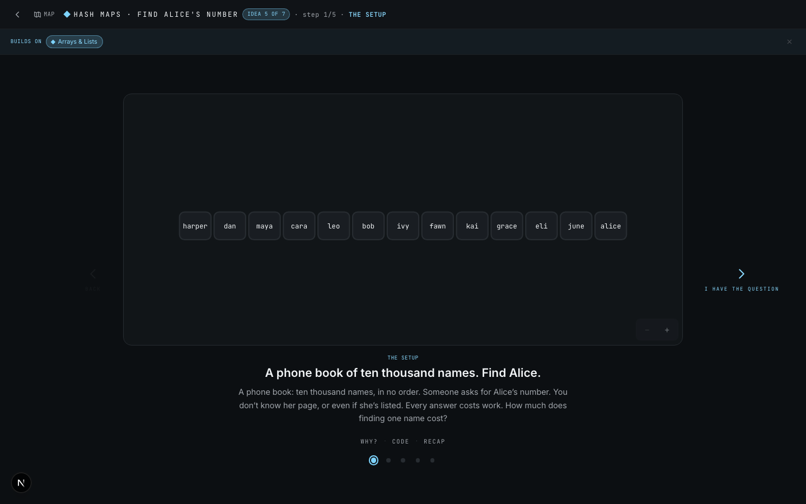
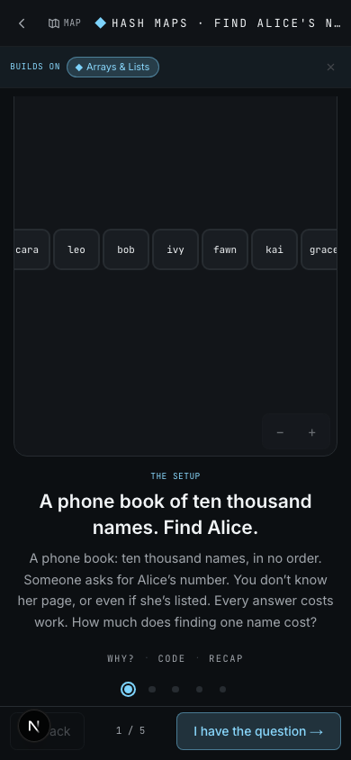
The diagram is a single horizontal row of 13 name cells (harper, dan, maya, cara, leo, bob, ivy, fawn, kai, grace, eli, june, alice) representing the unsorted phone book; all cells render untinted with no scan in progress. The top bar reads "MAP · HASH MAPS · FIND ALICE'S NUMBER", a pill "IDEA 5 OF 7", "step 1/5", and the beat label "THE SETUP"; a "BUILDS ON" strip below shows the prereq pill "Arrays & Lists" with a close (x) control on its right. The main panel caption is "THE SETUP", title "A phone book of ten thousand names. Find Alice.", with body text about ten thousand unordered names and the cost of finding one. Below the panel are the WHY? · CODE · RECAP chips and five progress dots (first filled). Right side nav shows the forward action "I HAVE THE QUESTION"; left side shows "BACK". No gate — clicking the forward arrow advances. On mobile the same row scrolls horizontally (showing cara…grace), the side nav collapses into a footer with "Back", "1 / 5", and the "I have the question →" button, and a +/- zoom control sits on the canvas.

### Beat 2 — The instinct
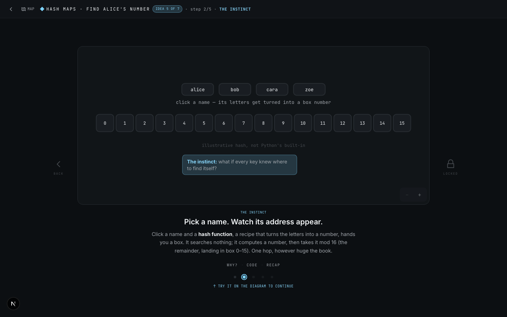
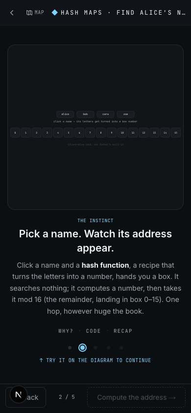
The diagram shows a row of four clickable name chips (alice, bob, cara, zoe — zoe is not in the book) above a row of 16 numbered slot boxes (0–15). The line "click a name — its letters get turned into a box number" sits between them, and a footnote "illustrative hash, not Python's built-in" sits below the boxes. A note panel reads "The instinct: what if every key knew where to find itself?" The main panel caption is "THE INSTINCT", title "Pick a name. Watch its address appear.", body explaining the hash function and mod 16. This beat is gated (interaction: wedge): the right side nav reads "LOCKED" and the footer shows "↑ TRY IT ON THE DIAGRAM TO CONTINUE". Clicking a name chip computes its slot, lights one box active, drops a pill with the name under that box, fires onInteractionDone, and unlocks the forward nav. In this capture no chip is selected yet, so the computation line still reads the prompt and no box is lit. On mobile the chips and box row scroll horizontally and the footer "Compute the address →" button is faint/disabled until a chip is tapped.

### Beat 3 — The structure
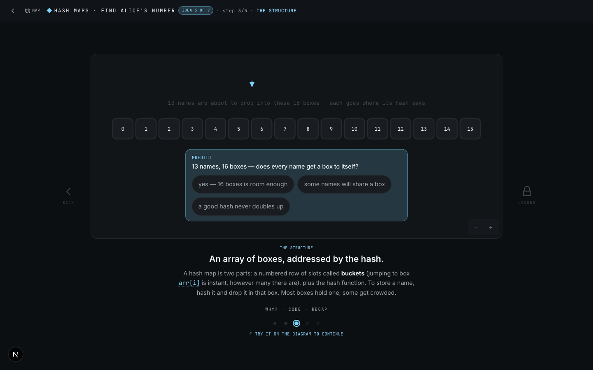
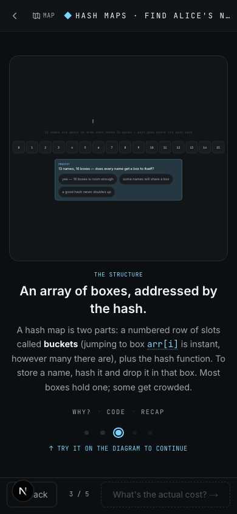
The diagram shows the 16 empty numbered boxes (0–15) with a downward arrow pointing at box 0 and the line "13 names are about to drop into these 16 boxes — each goes where its hash says". A PREDICT panel overlays the lower canvas asking "13 names, 16 boxes — does every name get a box to itself?" with three choices: "yes — 16 boxes is room enough", "some names will share a box", and "a good hash never doubles up". The main panel caption is "THE STRUCTURE", title "An array of boxes, addressed by the hash.", body defining a hash map as a numbered row of buckets (with `arr[i]`) plus the hash function. This beat is gated (interaction: wedge via a predict gate): right side nav reads "LOCKED" and the footer reads "↑ TRY IT ON THE DIAGRAM TO CONTINUE". Tapping a prediction pill records the guess, shows feedback, then after a pause runs the drop playback (names fall into their hashed boxes) and clears the gate. In this capture no choice is selected, so the boxes are still empty. On mobile the predict panel and box row scroll horizontally and the footer "What's the actual cost? →" button is faint/disabled until a prediction pill is tapped.

### Beat 4 — The operations
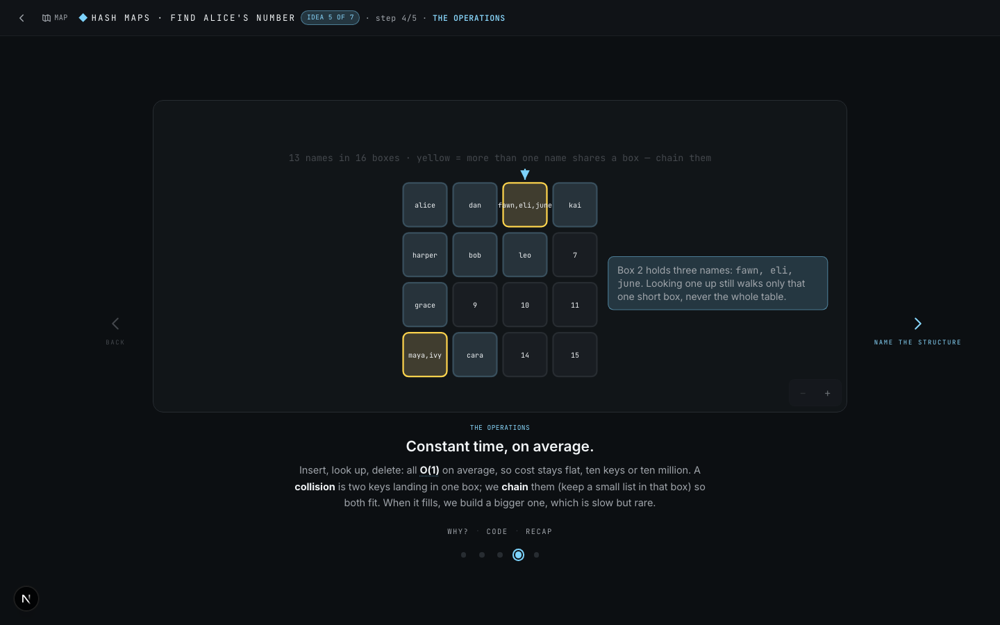
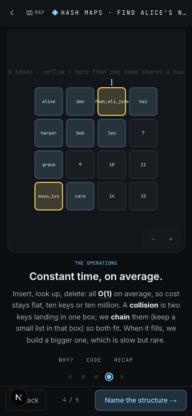
The diagram is a 4×4 grid of buckets (0–15) with the 13 names settled into their hashed boxes; collision boxes are outlined yellow. Box 2 holds the chain "fawn,eli,june" (highlighted with a downward arrow above it) and another box holds "maya,ivy"; single-name boxes (alice, dan, kai, harper, bob, leo, grace, cara) render in a visited tone and empty boxes show their index. The line above reads "13 names in 16 boxes · yellow = more than one name shares a box — chain them". A note panel reads "Box 2 holds three names: fawn, eli, june. Looking one up still walks only that one short box, never the whole table." The main panel caption is "THE OPERATIONS", title "Constant time, on average.", body covering O(1) average insert/look up/delete, collisions, chaining, and the rare rebuild. The progress dots show the fourth filled; right side nav reads "NAME THE STRUCTURE". This beat is static (no gate) — the forward arrow advances. On mobile the grid is shown in full, the note panel drops out, and the footer carries "Back", "4 / 5", and the active "Name the structure →" button.

### Beat 5 — The pattern
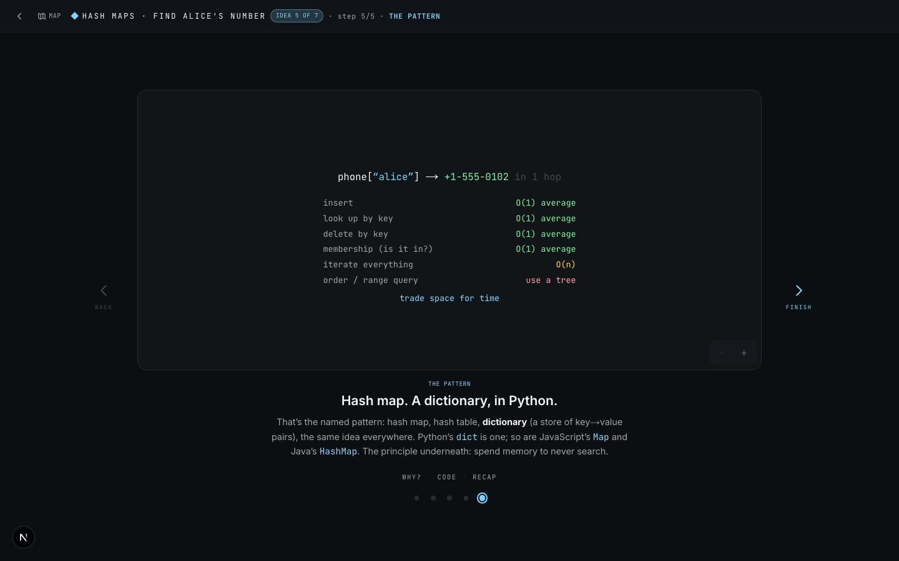
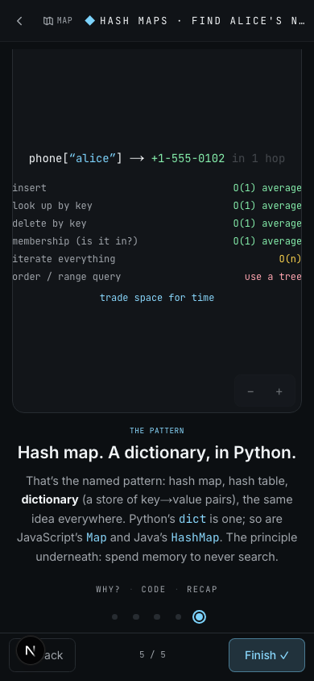
The diagram is a summary card. The header line reads `phone["alice"] → +1-555-0102 in 1 hop`. Below it a cost table lists: insert / O(1) average, look up by key / O(1) average, delete by key / O(1) average, membership (is it in?) / O(1) average, iterate everything / O(n), order / range query / use a tree — with the O(1) rows in green, O(n) in amber, and "use a tree" in red. A centered line reads "trade space for time". The main panel caption is "THE PATTERN", title "Hash map. A dictionary, in Python.", body naming hash map / hash table / dictionary, citing Python `dict`, JavaScript `Map`, Java `HashMap`, and the principle "spend memory to never search." This is the final beat (step 5/5); right side nav reads "FINISH" and all five progress dots are filled. On mobile the card is shown in full and the footer carries "Back", "5 / 5", and the active "Finish ✓" button.

### Code drawer
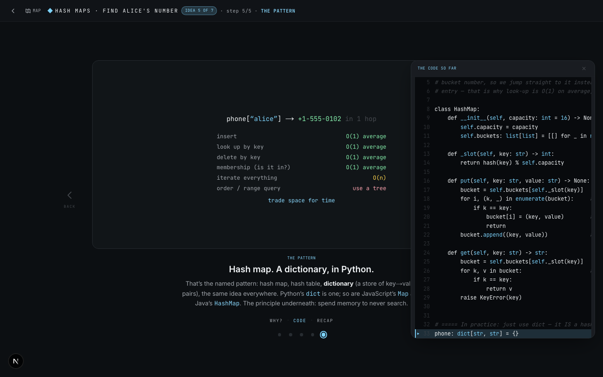
The drawer slides in from the right over the beat 5 view, headed "THE CODE SO FAR" with its own close (x) control, and splits the screen so the lesson canvas stays visible on the left. It shows a Python `HashMap` class implementation: `__init__` with `capacity` and `self.buckets = [[] for _ in range(...)]`, a `_slot` method returning `hash(key) % self.capacity`, a `put` method that computes the bucket, enumerates it to overwrite an existing key or append a new `(key, value)` pair, and a `get` method that computes the bucket, scans it for the key, returns the value or raises `KeyError(key)`. A closing comment notes "In practice: just use dict" followed by `phone: dict[str, str] = {}` (highlighted as the active line). The left portion of the screen still shows the beat 5 summary card behind the drawer.

---

## trees
route: `/categories/data-structures/trees/` · diagram shape: box

The lesson spec defines seven beats (setup, obvious, instinct, structure, operations, fits, name), but the default capture register trims "The obvious thing" and "When it fits", so the lesson renders as a 5-step run (header reads "step N/5"). This capture reached all 5 steps on both viewports (desktop 1440, mobile 390); each beat has a `beatN-d.png` and `beatN-m.png`, plus the open code drawer `drawer-code-d.png`. The top bar reads "◆ TREES · HIERARCHY YOU CAN WALK" with an "IDEA 4 OF 7" pill, the step counter, and the section label; a "MAP" link and back chevron sit at far left. Desktop puts "‹ BACK" and the forward action label on left/right side rails; mobile stacks the visual above the prose and uses a fixed bottom bar (back chevron, "N / 5" counter, primary forward button).

### Beat 1 — The setup (step 1/5)
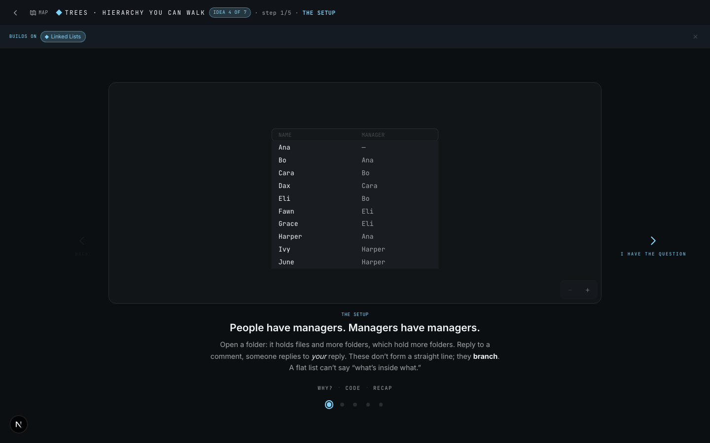
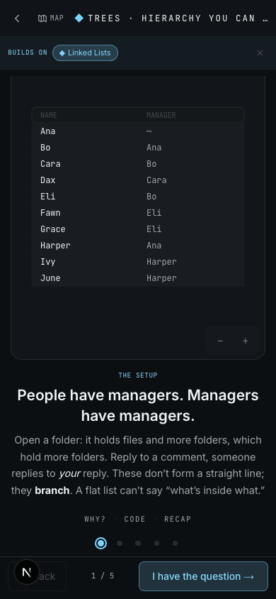

The diagram is a two-column flat table (NAME / MANAGER header) listing ten people: Ana (manager "—"), Bo→Ana, Cara→Bo, Dax→Cara, Eli→Bo, Fawn→Eli, Grace→Eli, Harper→Ana, Ivy→Harper, June→Harper. The top bar shows "◆ TREES · HIERARCHY YOU CAN WALK", an "IDEA 4 OF 7" pill, "step 1/5", and the section label "THE SETUP"; a "BUILDS ON ◆ Linked Lists" prereq strip sits below it with a dismiss X. The main panel under the canvas reads caption "THE SETUP", title "People have managers. Managers have managers.", and body text about folders nesting and replies branching, ending "A flat list can't say 'what's inside what.'" Below the body are the why / code / recap chips and five progress dots (first filled). On desktop the side nav shows "‹ BACK" at left and "I HAVE THE QUESTION ›" at right; on mobile these collapse to a bottom bar with a back chevron, a "1 / 5" counter, and a primary "I have the question →" button. A zoom −/+ control sits at the canvas bottom-right.

### Beat 2 — The instinct (step 2/5, wedge-gated)
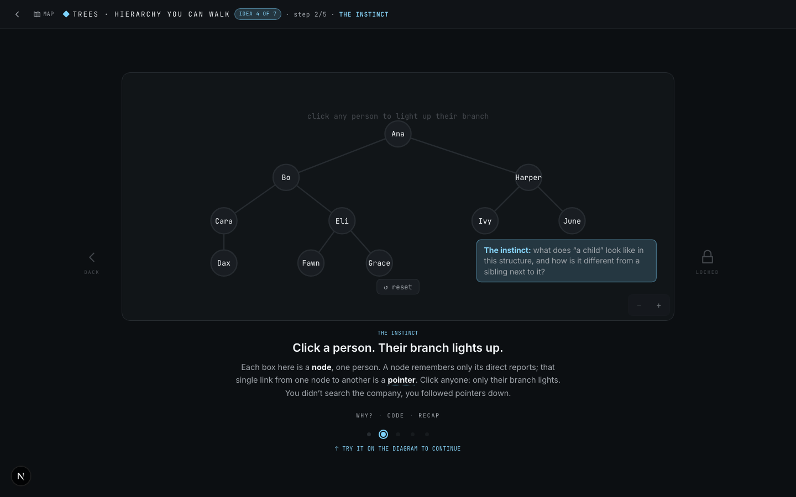
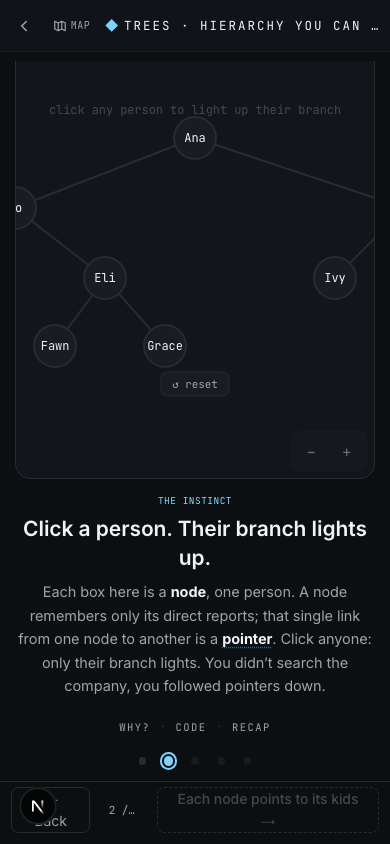

The diagram switches to an org-chart NodeGraph: Ana at the root, branching to Bo and Harper, then down to Cara, Eli, Ivy, June, and the leaves Dax, Fawn, Grace, connected by edges. A canvas caption reads "click any person to light up their branch", and a "↺ reset" button sits below the nodes. A blue note box on the canvas reads "The instinct: what does 'a child' look like in this structure, and how is it different from a sibling next to it?" The main panel shows label "THE INSTINCT", title "Click a person. Their branch lights up.", and body defining a node ("one person") and a pointer ("that single link from one node to another"), ending "You didn't search the company, you followed pointers down." The interaction is a wedge gate: clicking any node calls the subtree highlighter so the clicked person's whole branch lights ("active") while the rest dims ("muted"), which fires the interaction-done signal that unlocks advancing and activates the dfs code lines. While locked, desktop shows a "LOCKED" lock icon where the forward nav would be, with helper text "↑ TRY IT ON THE DIAGRAM TO CONTINUE"; mobile shows the same helper text and a dashed, inactive bottom button reading "Each node points to its kids →". The progress dots show the second dot filled. Both shots are pre-interaction: the dot-jump lands on this beat without performing the click, so no branch is lit and the gate reads locked.

### Beat 3 — The structure (step 3/5)
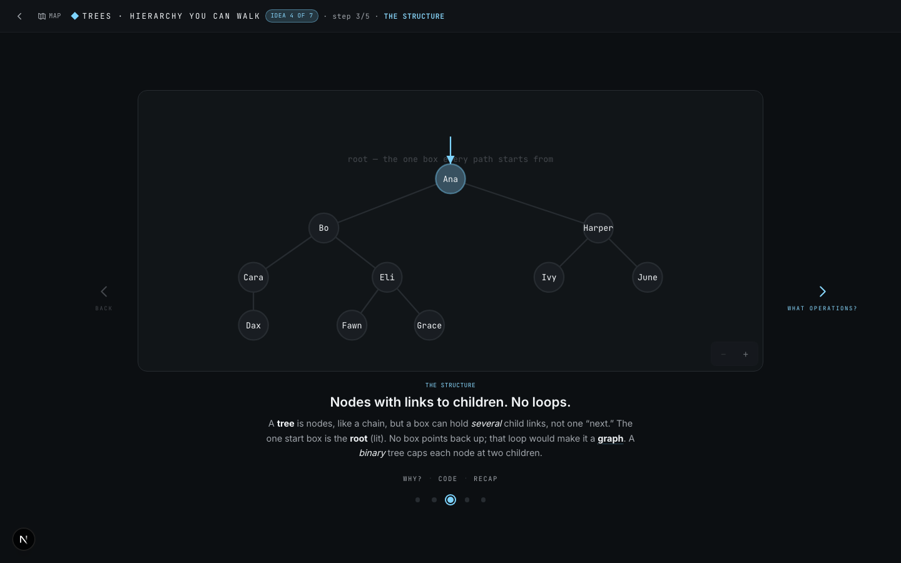
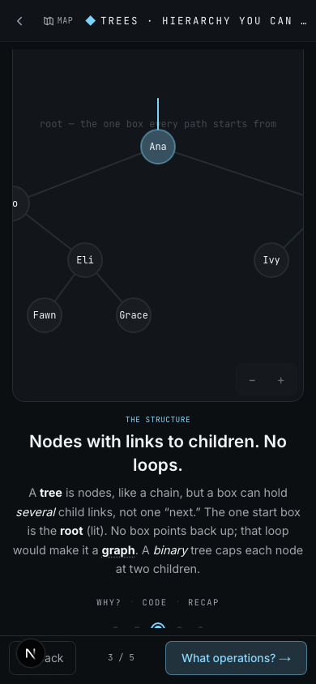

The same org-chart NodeGraph renders, now with the root Ana lit ("active", filled blue) and a blue down-arrow pointing into it. A canvas caption reads "root — the one box every path starts from". The main panel shows label "THE STRUCTURE", title "Nodes with links to children. No loops.", and body text defining a tree as nodes where a box can hold several child links (not one "next"), naming the lit start box the root, noting that a loop back up would make it a graph, and that a binary tree caps each node at two children. The why / code / recap chips and five progress dots appear below (third dot filled). Desktop side nav reads "‹ BACK" at left and "WHAT OPERATIONS? ›" at right.

### Beat 4 — The operations (step 4/5, wedge-gated predict)
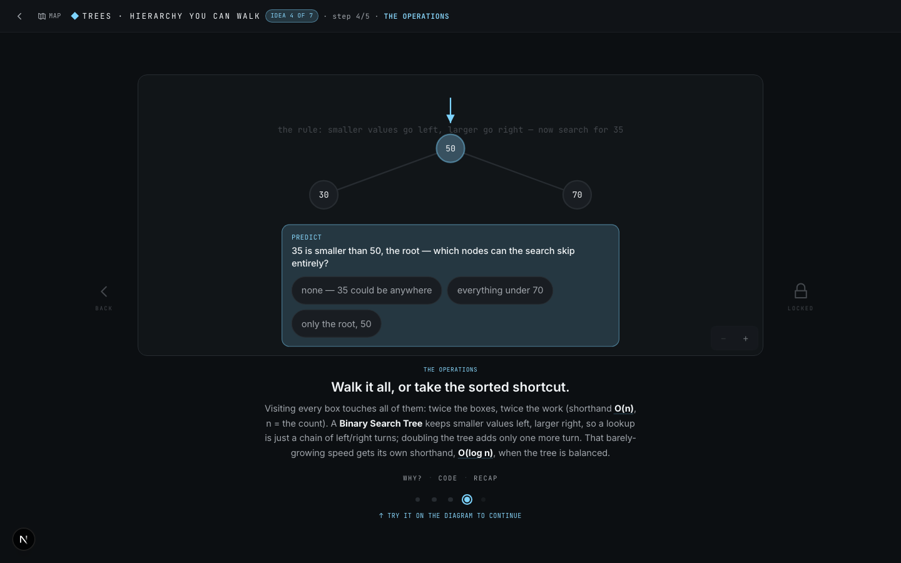
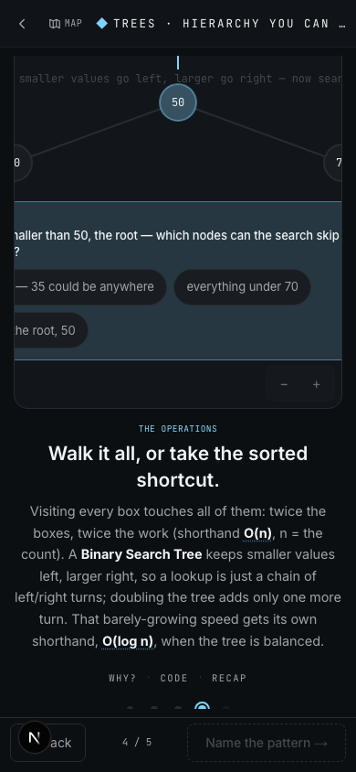

The diagram collapses to a pre-reveal BST showing only the root 50 (lit "active") and its two children 30 and 70, with a blue down-arrow above the root. A canvas caption reads "the rule: smaller values go left, larger go right — now search for 35". A "PREDICT" gate panel sits on the canvas asking "35 is smaller than 50, the root — which nodes can the search skip entirely?" with three choice buttons: "none — 35 could be anywhere", "everything under 70" (the correct answer), and "only the root, 50". The main panel shows label "THE OPERATIONS", title "Walk it all, or take the sorted shortcut.", and body text contrasting visiting every box (O(n)) against a Binary Search Tree's left/right lookup (O(log n) when balanced); O(n) and O(log n) render as inline Term links. The interaction is a wedge via the PredictGate: tapping a prediction choice fires interaction-done, and after a reading pause the full tree reveals and an AutoBSTSearch plays the real path to 35 one hop per frame. While the gate is unanswered the forward nav shows "LOCKED" with "↑ TRY IT ON THE DIAGRAM TO CONTINUE"; the fourth progress dot is filled, and on mobile the bottom button "Name the pattern →" is dashed/inactive. Both shots are pre-interaction: the prediction prompt is shown with no choice committed, so the full tree and the animated search are not yet revealed.

### Beat 5 — The pattern (step 5/5)
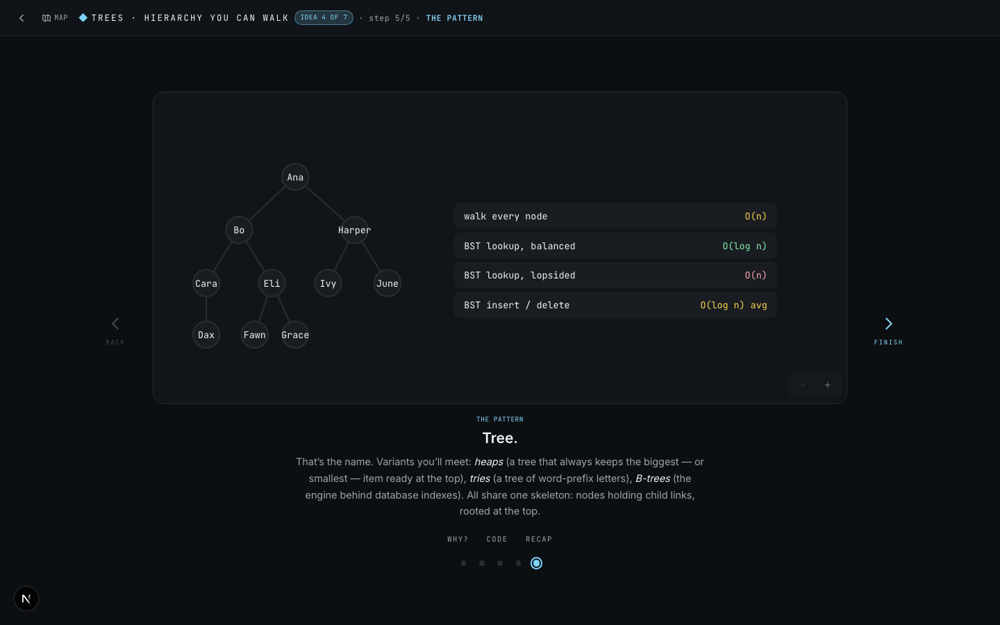
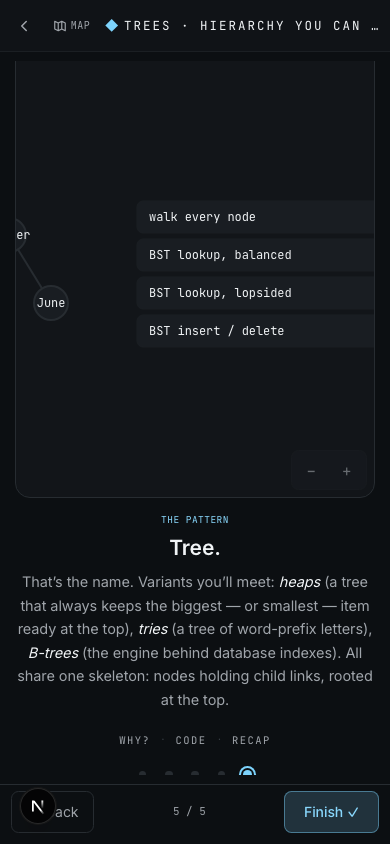

The diagram shows a compact org tree on the left (Ana, Bo, Harper, Cara, Eli, Ivy, June, Dax, Fawn, Grace) beside a complexity recap grid on the right with four rows: "walk every node" → O(n), "BST lookup, balanced" → O(log n), "BST lookup, lopsided" → O(n), "BST insert / delete" → O(log n) avg, each Big-O value color-coded. The main panel shows label "THE PATTERN", title "Tree.", and body naming the variants (heaps, tries, B-trees) and the shared skeleton "nodes holding child links, rooted at the top." The why / code / recap chips and five progress dots appear below (fifth dot filled). Desktop side nav reads "‹ BACK" at left and "FINISH ›" at right; mobile shows the same back chevron, a "5 / 5" counter, and a primary "Finish ✓" button. The final beat presents this finish forward control rather than an inline completion-ceremony screen within the captured frame.

### Code drawer
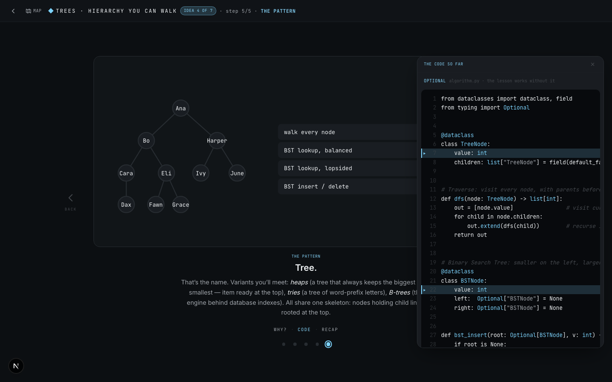

Opened over step 5, the drawer is a right-side panel headed "THE CODE SO FAR" with a close X. It shows `algorithm.py` (tagged OPTIONAL, "the lesson works without it") with line numbers and syntax highlighting. Visible code: imports of `dataclass`, `field`, and `Optional`; a `@dataclass class TreeNode` with `value: int` and `children: list["TreeNode"] = field(default_fa…)`; a `def dfs(node: TreeNode) -> list[int]` traversal that builds `out = [node.value]`, loops `for child in node.children` extending with `dfs(child)`, and returns `out` (commented "# Traverse: visit every node…" and "# recurse…"); then a "# Binary Search Tree: smaller on the left, larger…" section with a `@dataclass class BSTNode` carrying `value: int`, `left`/`right` typed `Optional["BSTNode"] = None`, and the start of `def bst_insert(root: Optional[BSTNode], v: int)` with `if root is None:`. The lesson canvas (Tree. recap beat) remains visible behind the drawer at the left.

---

## graphs
route: `/categories/data-structures/graphs/` · diagram shape: box

### Beat 1 — The setup

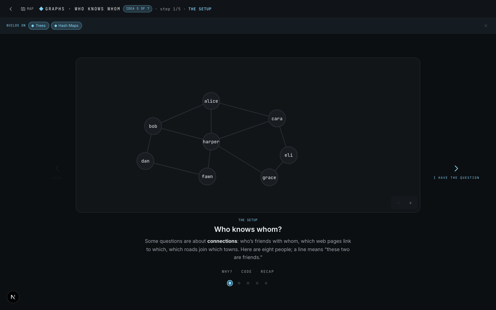
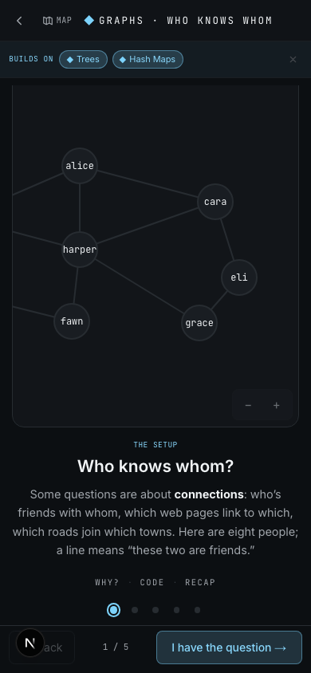

The header reads "GRAPHS · WHO KNOWS WHOM" with an "IDEA 5 OF 7" pill and "step 1/5 · THE SETUP". A "BUILDS ON" bar shows two prerequisite pills, Trees and Hash Maps, with a close (×) control at the right. The canvas shows the social network as an idle node-and-edge graph: eight labelled circle nodes (alice, bob, cara, harper, dan, eli, fawn, grace) joined by undirected friendship lines, with no node lit. The main panel below carries the eyebrow "THE SETUP", title "Who knows whom?", and body text introducing connections (friends, web links, roads) and that a line means "these two are friends." The footer has the why? · code · recap chips and a row of five progress dots with the first filled. On desktop the side rails read "BACK" (left) and "I HAVE THE QUESTION" with a chevron (right). On mobile the diagram stacks above the panel, the prerequisite pills sit under the header, and a bottom bar shows "Back", a "1 / 5" counter, and an "I have the question →" button. A zoom −/+ control sits at the canvas bottom-right. This beat has no interaction.

### Beat 2 — The instinct

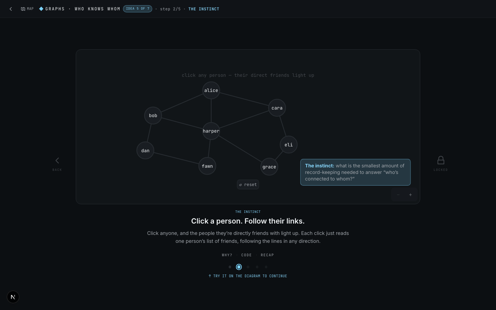
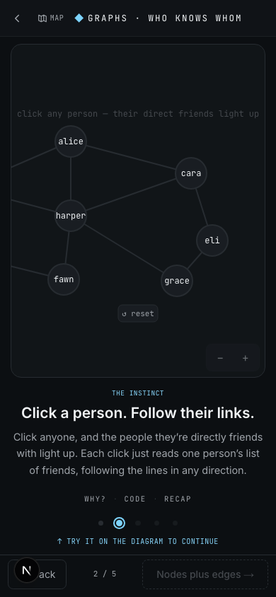

Labelled "THE INSTINCT" with title "Click a person. Follow their links." The same eight-person graph appears with the caption "click any person — their direct friends light up" above it and a "↺ reset" button below the nodes. A floating note card overlaps the lower-right of the canvas: "The instinct: what is the smallest amount of record-keeping needed to answer 'who's connected to whom?'". The interaction type is wedge: clicking a node fires the interaction-done signal, turns that node active, lights its direct neighbors ("trail" tone) plus the connecting edges, activates the bfs_neighbors code line, and changes the caption to report that person's friend count ("one lookup"). The shot shows the pre-interaction state, so the right rail reads "LOCKED" and the footer instructs "↑ TRY IT ON THE DIAGRAM TO CONTINUE"; performing one click clears the gate and unlocks advance. The why? · code · recap chips and the five-dot tracker (second dot filled) sit at the bottom.

### Beat 3 — The structure

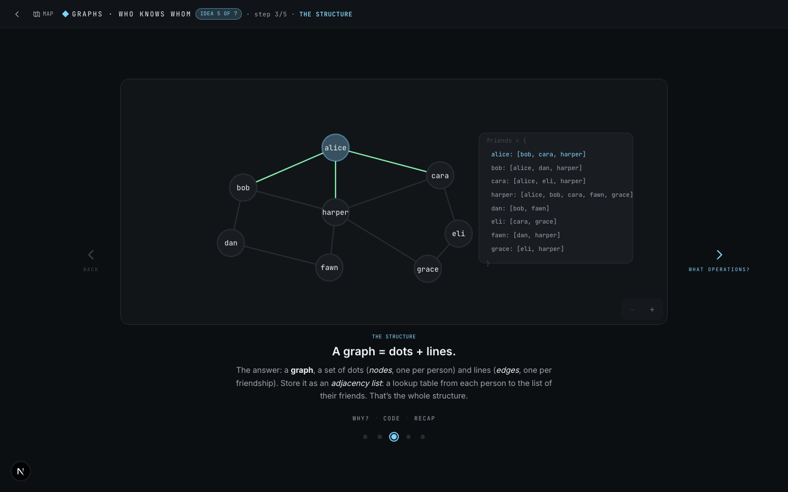
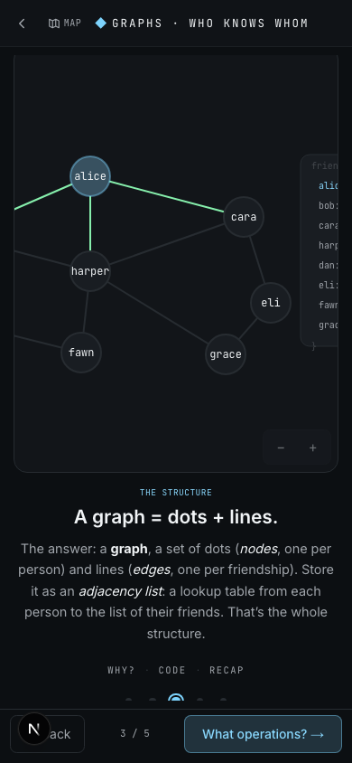

Labelled "THE STRUCTURE" with title "A graph = dots + lines." The visual highlights alice (active/blue) with her edges drawn green ("trail" tone), and beside the graph a code-styled panel renders the adjacency list as `friends = {` followed by one row per person (`alice: [bob, cara, harper]`, `bob: [alice, dan, harper]`, `cara: [alice, eli, harper]`, `harper: [alice, bob, cara, fawn, grace]`, `dan: [bob, fawn]`, `eli: [cara, grace]`, `fawn: [dan, harper]`, `grace: [eli, harper]`) and a closing `}`, with alice's row tinted in the accent color. The body text defines a graph as nodes plus edges stored as an adjacency list, a lookup table from each person to their friends. The right rail reads "WHAT OPERATIONS?". The footer shows the why? · code · recap chips and the five-dot tracker with the third dot filled. This beat has no interaction.

### Beat 4 — The operations

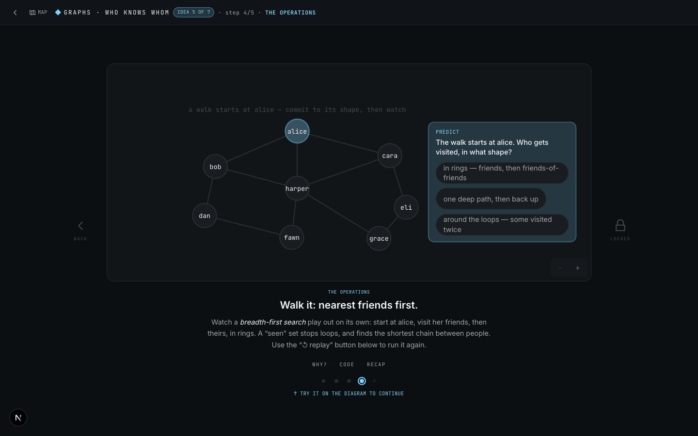
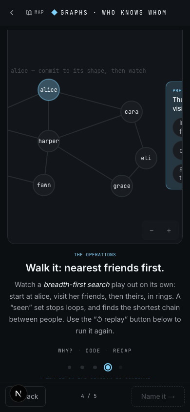

Labelled "THE OPERATIONS" with title "Walk it: nearest friends first." The graph sits idle with only alice lit (active/blue) and a caption above reading "a walk starts at alice — commit to its shape, then watch". A "PREDICT" panel on the right poses "The walk starts at alice. Who gets visited, in what shape?" with three choice pills: "in rings — friends, then friends-of-friends", "one deep path, then back up", and "around the loops — some visited twice". The interaction type is wedge, run through a prediction gate: tapping one pill fires the interaction-done signal, shows feedback, and after a short pause the gate reveals an automatic breadth-first-search playback that spreads ring by ring from alice (the "rings" pill is the correct choice). The shot shows the pre-interaction, pre-reveal state, so the right rail reads "LOCKED" and the footer instructs "↑ TRY IT ON THE DIAGRAM TO CONTINUE". The why? · code · recap chips and the five-dot tracker (fourth dot filled) appear at the bottom; on mobile the predict panel is partly off-screen to the right and the bottom bar shows "4 / 5" with a "Name it →" button.

### Beat 5 — Graph

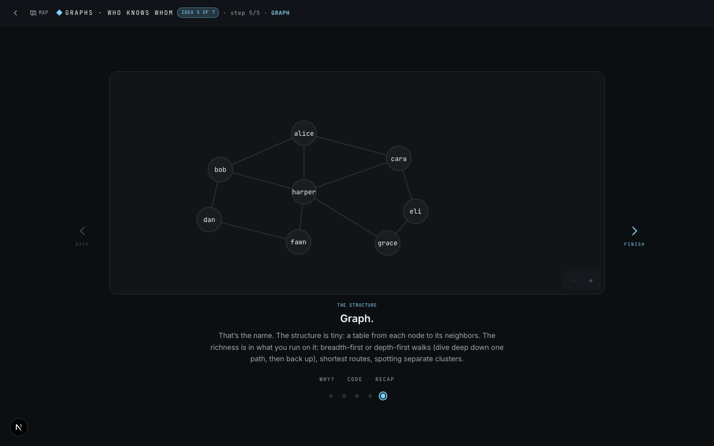
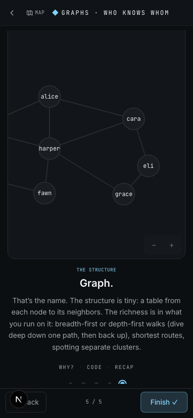

Labelled "THE STRUCTURE" with the single-word title "Graph." The visual returns to the plain idle eight-person graph with no nodes highlighted. The body text names the structure as a table from each node to its neighbors and points to breadth-first / depth-first walks (dive deep down one path, then back up), shortest routes, and spotting separate clusters as the richness on top. The right rail reads "FINISH". The footer shows the why? · code · recap chips and the five-dot tracker with the fifth (last) dot filled. This beat has no interaction.

### Code drawer

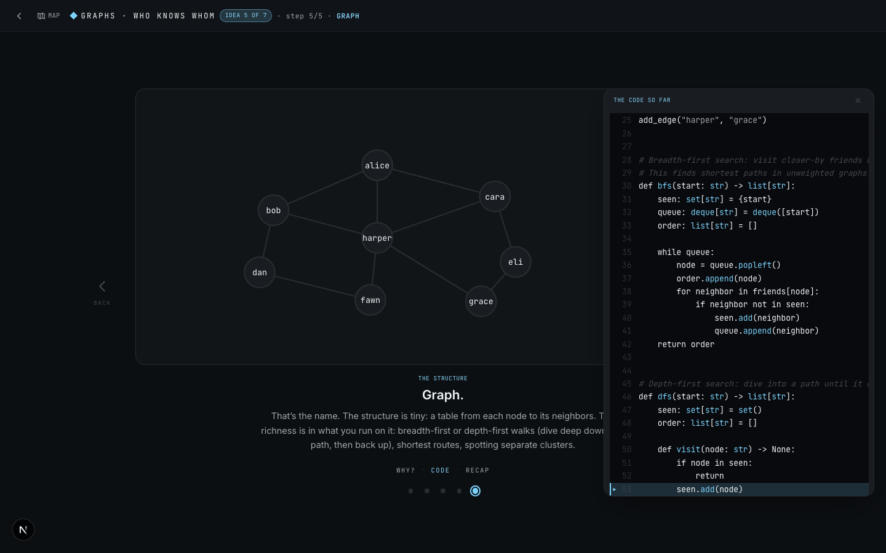

Opened from the "CODE" chip, the drawer slides in from the right titled "THE CODE SO FAR" and shows the Python source with line numbers. Visible lines include the tail of the edge setup (`add_edge("harper", "grace")`), then a commented breadth-first search section: "Breadth-first search: visit closer-by friends … This finds shortest paths in unweighted graphs", `def bfs(start: str) -> list[str]:` with `seen: set[str] = {start}`, `queue: deque[str] = deque([start])`, and `order: list[str] = []`, followed by a `while queue:` loop that pops with `queue.popleft()`, appends to `order`, iterates `for neighbor in friends[node]:`, and adds unseen neighbors to both `seen` and the queue, then `return order`. Below it a commented depth-first search section defines `def dfs(start: str) -> list[str]:` with a `seen` set and `order` list and a nested `def visit(node: str) -> None:` helper that returns early if the node is in `seen`, then calls `seen.add(node)`. The current active line (around line 53, `seen.add(node)`) is highlighted with a left-edge caret marker.

---

## binary-search
route: `/categories/algorithms/binary-search/` · diagram shape: line

The lesson spec defines 7 beats (setup, scan, wedge, derive, win, general, name); the depth captured here renders 5 of them (setup, wedge, derive, win, name) — `scan` and `general` are cut at this depth, so they are not shown. The dot-jump reached all 5 beats on both desktop (1440) and mobile (390). Captures show each beat in its INITIAL state, so the two gated (wedge) beats appear LOCKED because the dot-jump does not perform the interaction. The diagram is a single horizontal "line" of 15 sorted cells (3, 7, 11, 14, 19, 23, 27, 32, 38, 44, 51, 59, 68, 74, 81), and the target is 27 at index 6.

### Beat 1 — The setup
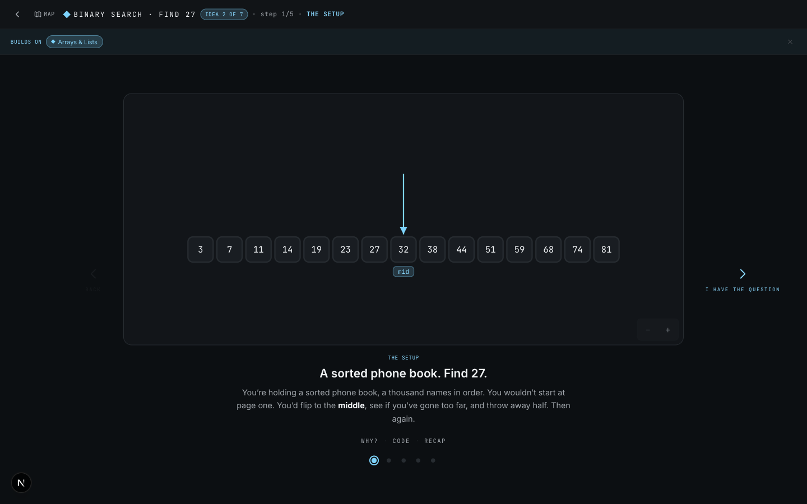
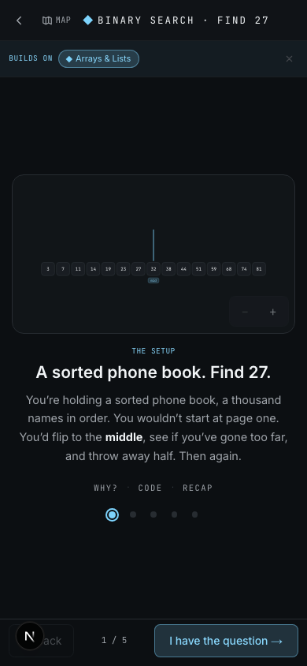
The diagram is the 15-cell row with the cell holding 32 tagged by a `mid` marker pill below it and a vertical arrow pointing down into that cell (the first probe, ⌊(0+14)/2⌋ = 7). The top bar reads "MAP · BINARY SEARCH · FIND 27" with an "IDEA 2 OF 7" pill and "step 1/5 · THE SETUP". A "BUILDS ON" strip shows the prereq pill "Arrays & Lists" with a close (×) at its right. Below the canvas the caption "THE SETUP" sits over the title "A sorted phone book. Find 27." and the idea body about flipping to the middle and throwing away half. The why · code · recap chips and a five-dot progress row (first dot filled) sit under the text. Right-side nav reads "I HAVE THE QUESTION"; left nav reads "BACK". This beat has no gate; the learner advances with the right nav. On mobile the row renders edge to edge without wrapping, and the footer shows "1 / 5" with a "Back" button and an "I have the question →" advance button.

### Beat 2 — The instinct
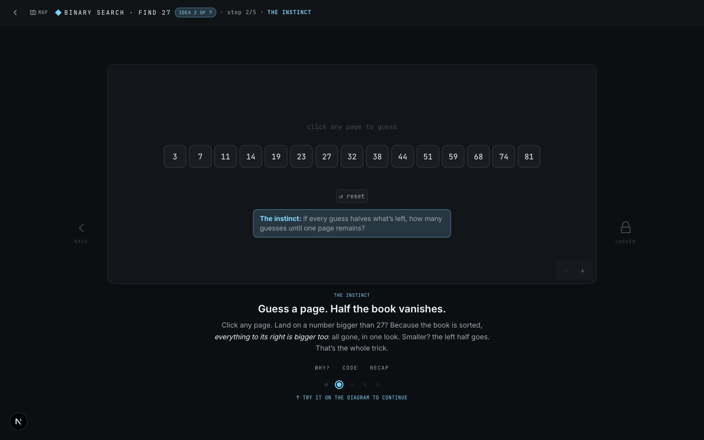
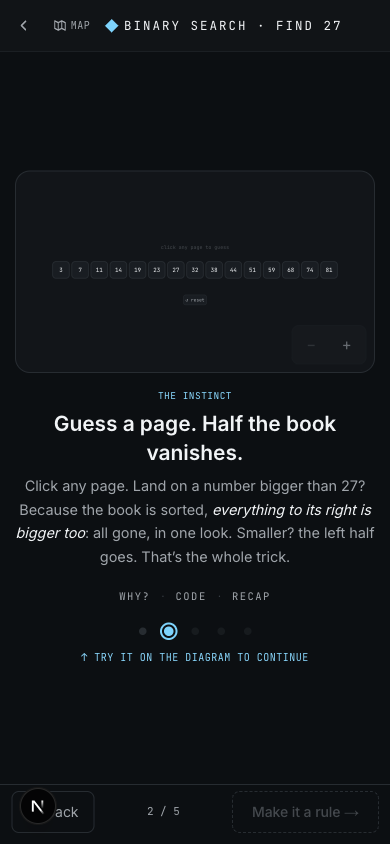
The diagram is the same 15-cell row, now the interactive ClickToHalve ("click any page to guess" caption above it) with a "↺ reset" button beneath. A "note" panel overlays the canvas reading "The instinct: if every guess halves what's left, how many guesses until one page remains?". The main panel below reads "THE INSTINCT" / "Guess a page. Half the book vanishes." explaining that landing on a number bigger than 27 dims everything to its right and a smaller number dims the left half. The interaction type is "wedge" (gated click): clicking a cell compares it to 27, dims the eliminated side, and fires onInteractionDone to clear the gate. Captured pre-interaction, so the row is undimmed, the right nav shows "LOCKED" with a lock icon, and the footer prompt reads "↑ TRY IT ON THE DIAGRAM TO CONTINUE"; clicking any cell is what unlocks the next beat. The why·code·recap chips and five-dot progress row (second dot filled) sit under the text. On mobile the footer shows "2 / 5" with a greyed "Make it a rule →" forward button.

### Beat 3 — The derivation
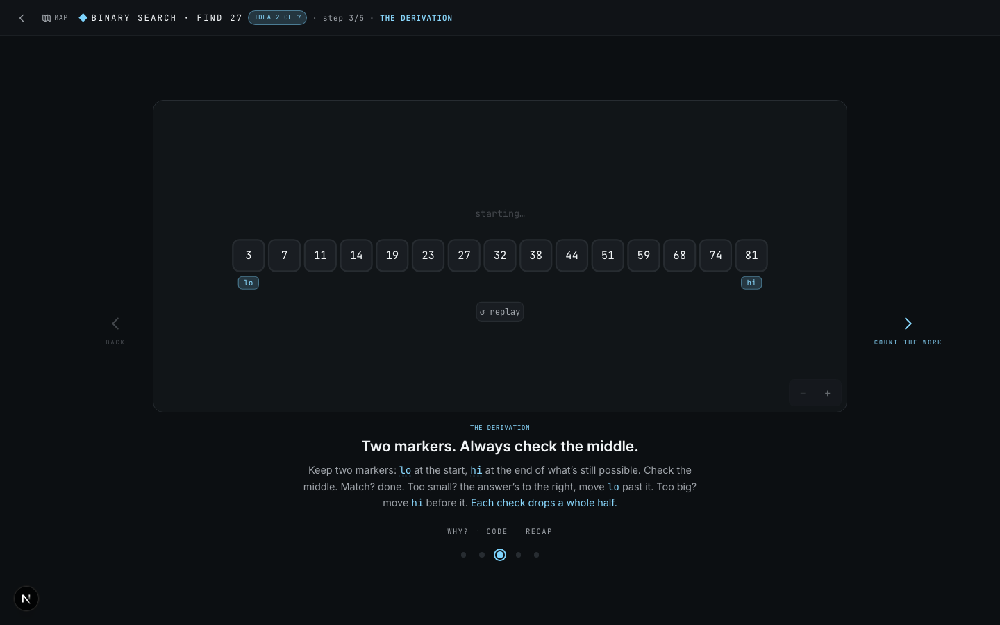
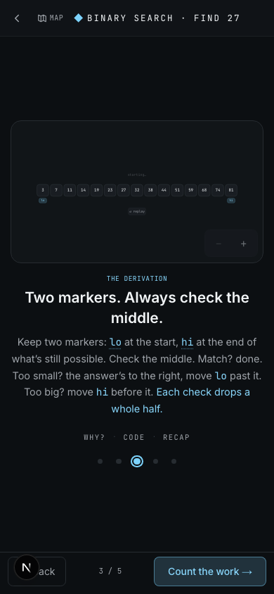
The diagram is the AutoBinarySearch playback over the 15-cell row. At capture it shows the start frame: a "starting…" caption above the row, a `lo` marker pill under cell 0 (value 3) and a `hi` marker pill under cell 14 (value 81), with a "↺ replay" button below; no cells are dimmed yet. The interaction type is "playback" (no gate): as it runs it stamps a `mid` marker, tones the probed cell, moves `lo`/`hi`, and dims the eliminated half each tick. The main panel reads "THE DERIVATION" / "Two markers. Always check the middle." describing `lo` and `hi` fencing the live window, ending on the highlighted line "Each check drops a whole half." Right nav reads "COUNT THE WORK", left nav "BACK". The why·code·recap chips and five-dot progress row (third dot filled) sit beneath.

### Beat 4 — The win
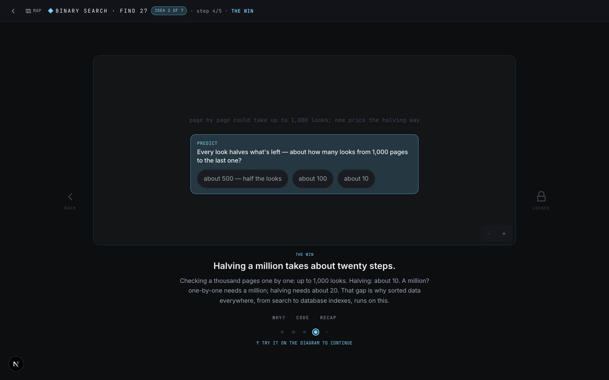
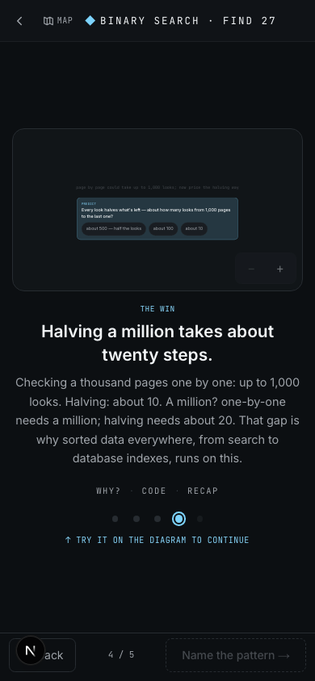
The canvas hosts the HalvingCostGate prediction panel (an HTML PredictGate on the SVG). A faint line above reads "page by page could take up to 1,000 looks; now price the halving way", and a "PREDICT" panel asks "Every look halves what's left — about how many looks from 1,000 pages to the last one?" with three choice pills: "about 500 — half the looks", "about 100", and "about 10" (the correct answer per the spec). The main panel reads "THE WIN" / "Halving a million takes about twenty steps." comparing one-by-one cost to halving cost. The interaction type is "wedge" via PredictGate: tapping a pill reveals the answer and fires onInteractionDone, then after a short pause the visual swaps to the HalvingCascade reveal (1,000 → 500 → 250 … → 1). Captured pre-interaction, so the pills are still shown, the right nav reads "LOCKED", and the footer prompt is "↑ TRY IT ON THE DIAGRAM TO CONTINUE"; selecting a pill clears the gate. The five-dot progress row has the fourth dot filled. On mobile the footer shows "4 / 5" with a greyed "Name the pattern →" forward button and the same diagram prompt.

### Beat 5 — The pattern
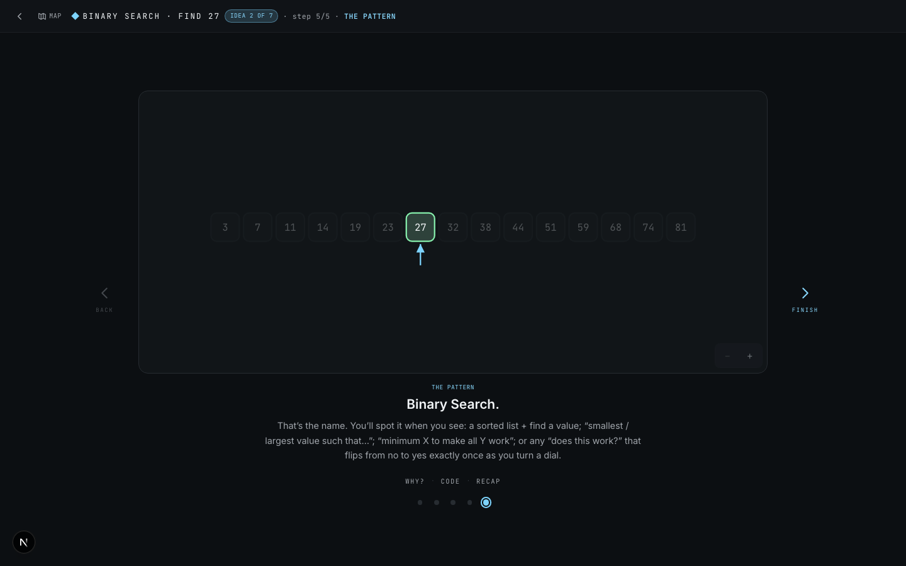
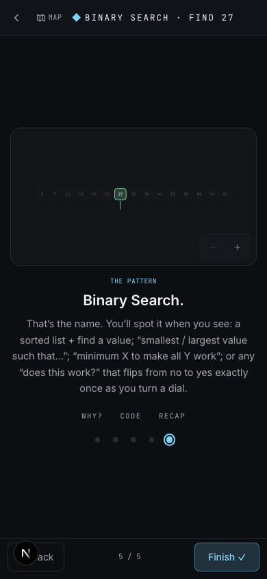
The diagram is the 15-cell row with every cell dimmed except cell 6 (value 27), which is outlined in green (the "good" tone) with an upward arrow pointing into it, marking the found target. The main panel reads "THE PATTERN" / "Binary Search." with body text listing the trigger cues: a sorted list + find a value; "smallest / largest value such that…"; "minimum X to make all Y work"; any "does this work?" that flips from no to yes once as you turn a dial. This beat has no gate. Right nav reads "FINISH", left nav "BACK". The why·code·recap chips and five-dot progress row (fifth/last dot filled) sit beneath. The top bar reads "step 5/5 · THE PATTERN". On mobile the footer shows "5 / 5" with a "Finish ✓" button.

### Code drawer
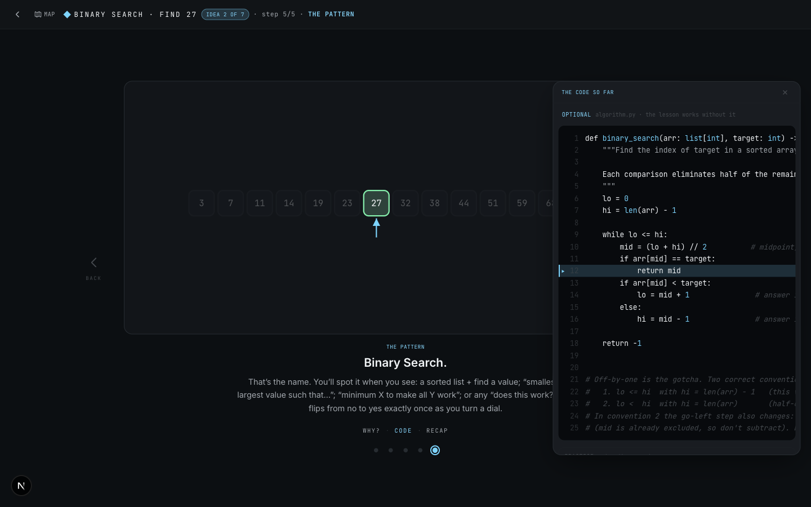
The drawer slides in from the right titled "THE CODE SO FAR" with a subtitle "OPTIONAL · algorithm.py · the lesson works without it" and a close (×) button. It shows the numbered Python `binary_search(arr: list[int], target: int)` source: docstring, `lo = 0` / `hi = len(arr) - 1`, the `while lo <= hi:` loop, `mid = (lo + hi) // 2`, the `if arr[mid] == target: return mid` block (line 12 is highlighted with a left-edge marker), the `arr[mid] < target` / else branches updating `lo`/`hi`, `return -1`, and trailing comments about the off-by-one gotcha and the two closed / half-open conventions. It is captured at beat 5 (step 5/5 · THE PATTERN), with the diagram showing 27 found behind it.

---

## two-pointers
route: `/categories/algorithms/two-pointers/` · diagram shape: line

The re-capture reached all 5 of 5 beats on both desktop (1440) and mobile (390). The captured run renders the lesson at its default depth of five beats: the setup, the instinct (wedge), the derivation (wedge), the win, and the pattern. The top bar carries MAP, the diamond "TWO POINTERS · FIND A PAIR THAT SUMS TO 17" title, an "IDEA 3 OF 7" pill, a "step N/5" counter, and the current beat label. On the first beat a "BUILDS ON" strip beneath the bar holds a single prereq pill, "Arrays & Lists", with a close (x) control. The diagram is a single horizontal row of ten ascending number cards (1, 3, 5, 7, 9, 10, 12, 15, 18, 20) drawn on an SVG canvas with a floating "target = 17" tag above it. Each beat shows a main panel under the canvas with a small caption label, a bold title, and body prose, plus a "WHY? · CODE · RECAP" chip strip and a row of five progress dots. Side-nav labels ("BACK" left, an action label or "LOCKED" right) sit at the canvas edges on desktop; mobile collapses these into a bottom bar with "Back", an "N / 5" counter, and the action button. Wedge beats are shown in their initial, pre-interaction state because the dot-jump does not perform the interaction.

### Beat 1 — The setup

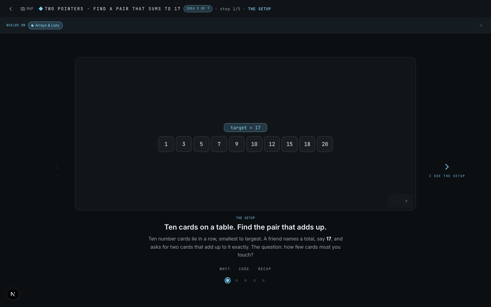
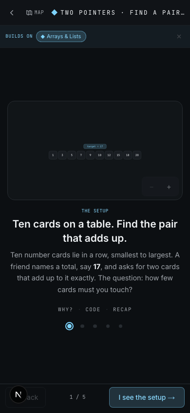

The canvas shows the ten-card row in ascending order with the "target = 17" tag centered above it and no pointer markers yet. The bar reads "step 1/5 · THE SETUP" and the "BUILDS ON" strip with the "Arrays & Lists" prereq pill sits beneath it. The main panel is labeled "THE SETUP" with the title "Ten cards on a table. Find the pair that adds up." and body text about ten ordered cards, a friend naming the total 17, and the question of how few cards must be touched. The "WHY? · CODE · RECAP" chips and five progress dots (first filled) appear below. On desktop the right side nav reads "I SEE THE SETUP" with a forward chevron and the left reads "BACK"; on mobile these collapse into a bottom bar showing "Back", "1 / 5", and an enabled "I see the setup →" button. There is no diagram interaction on this beat — advancing uses the next control.

### Beat 2 — The instinct

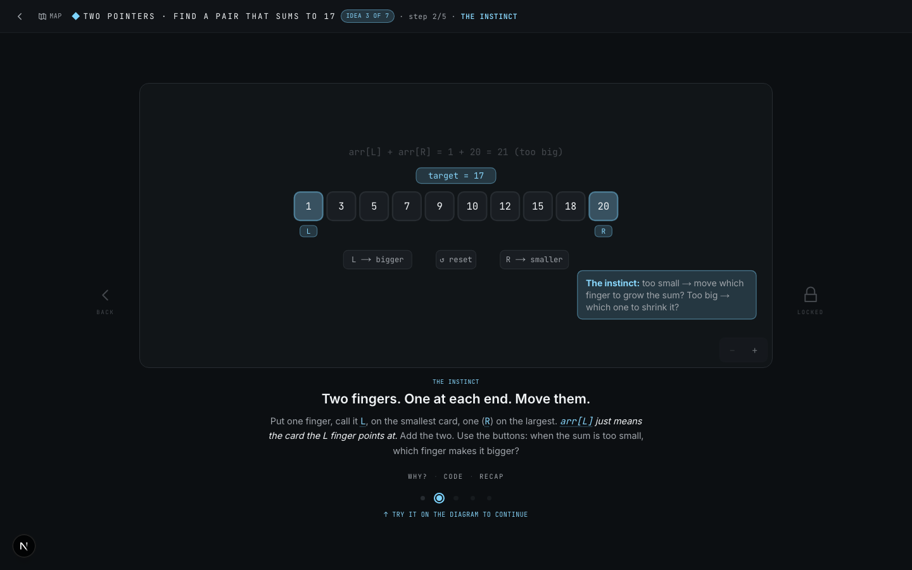
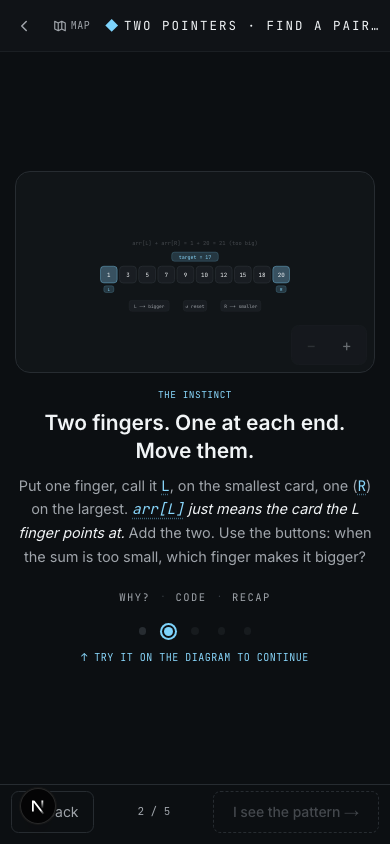

The row now shows the L marker pill under the first card (1) and the R marker pill under the last card (20), both cards highlighted. A line above the row reads "arr[L] + arr[R] = 1 + 20 = 21 (too big)" under the "target = 17" tag. Three clickable controls render below the row: "L → bigger", "↺ reset", and "R → smaller". On desktop a secondary note panel sits to the right reading "The instinct: too small → move which finger to grow the sum? Too big → which one to shrink it?". The main panel is labeled "THE INSTINCT" with the title "Two fingers. One at each end. Move them." and body text introducing L and R as the cards each finger points at. The interaction type is wedge: clicking a finger button (L → bigger or R → smaller) steps that pointer one card inward, updates the running sum and verdict, and fires the beat's completion. Shown pre-interaction here, the right side nav reads "LOCKED" (desktop) and the bottom "I see the pattern →" button is disabled (mobile), with the panel footer showing "↑ TRY IT ON THE DIAGRAM TO CONTINUE".

### Beat 3 — The derivation

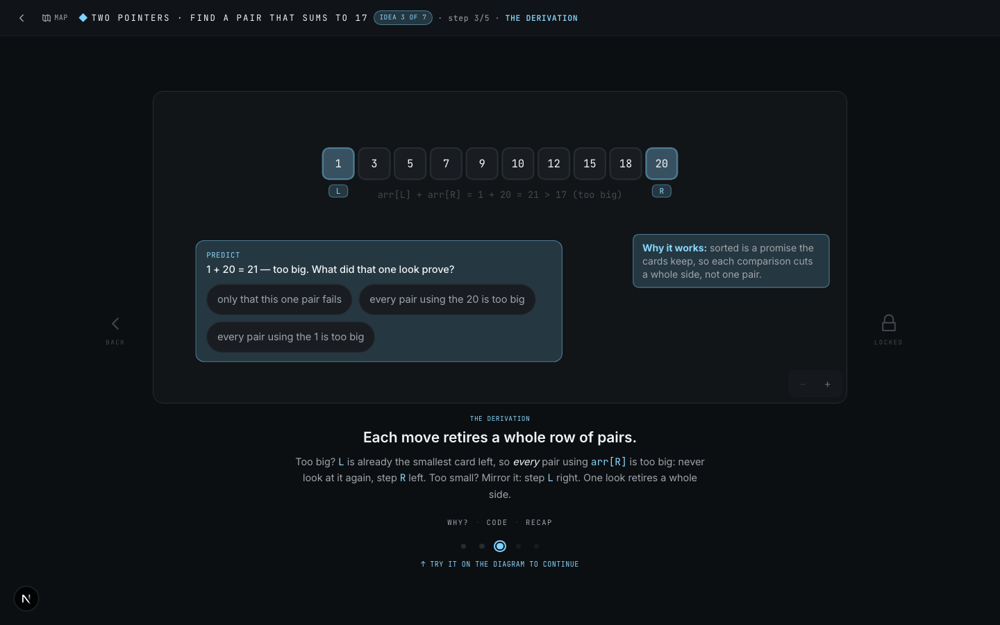
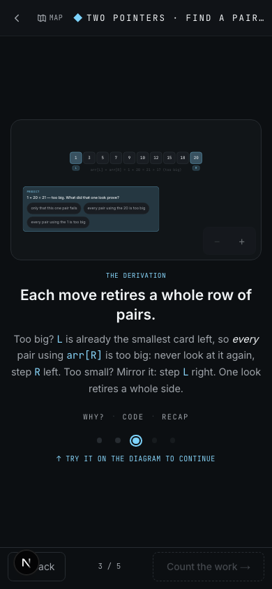

The row again marks L on card 1 and R on card 20, with the line "arr[L] + arr[R] = 1 + 20 = 21 > 17 (too big)" below the cards. A PREDICT gate panel is drawn on the canvas asking "1 + 20 = 21 — too big. What did that one look prove?" with three pill choices: "only that this one pair fails", "every pair using the 20 is too big" (the correct one), and "every pair using the 1 is too big". On desktop a note panel on the right reads "Why it works: sorted is a promise the cards keep, so each comparison cuts a whole side, not one pair." The main panel is labeled "THE DERIVATION" with the title "Each move retires a whole row of pairs." The interaction type is wedge, driven by the prediction gate: tapping a choice fires completion and reveals the bracket over the row, the dimmed-out side, and the "R steps left" arrow — all hidden in this pre-interaction capture. The right side nav shows "LOCKED" (desktop) and the bottom button is disabled (mobile), with the footer reading "↑ TRY IT ON THE DIAGRAM TO CONTINUE".

### Beat 4 — The win

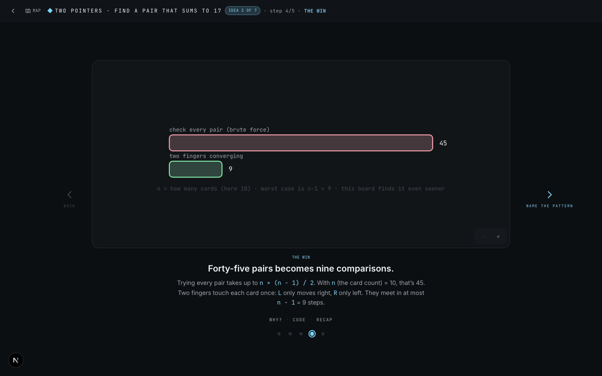
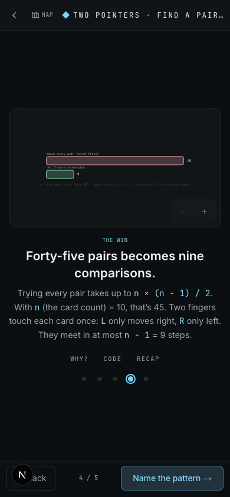

The canvas swaps the card row for two horizontal stat bars: a long red-outlined bar labeled "check every pair (brute force)" with the value 45, and a short green-outlined bar labeled "two fingers converging" with the value 9. A caption beneath reads "n = how many cards (here 10) · worst case is n−1 = 9 · this board finds it even sooner". The main panel is labeled "THE WIN" with the title "Forty-five pairs becomes nine comparisons." and body text explaining brute force takes up to n × (n − 1) / 2 = 45 while two fingers touch each card once (L only moves right, R only left) and meet in at most n − 1 = 9 steps. The right side nav action reads "NAME THE PATTERN". This beat has no interaction.

### Beat 5 — The pattern

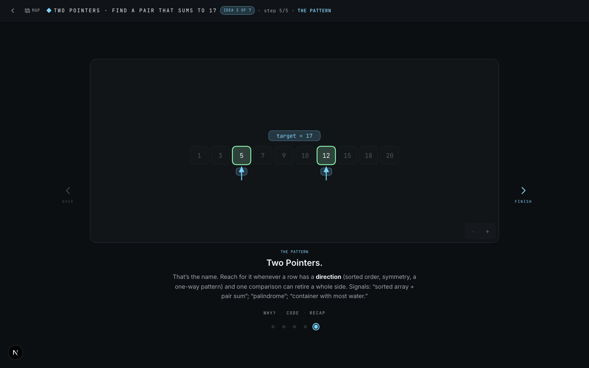
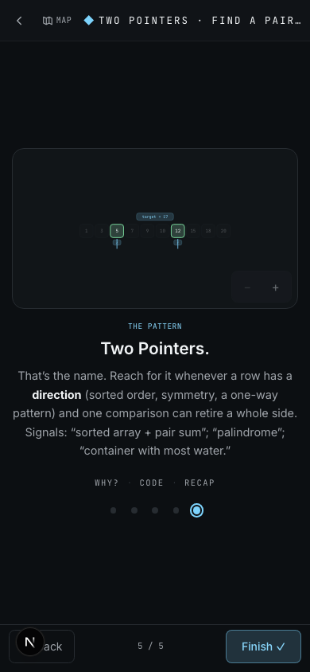

The canvas dims all cards except 5 and 12 (the answer pair, indices 2 and 6), which render green with "✓" markers and small up-arrows pointing at them; the "target = 17" tag remains above the row. The main panel is labeled "THE PATTERN" with the title "Two Pointers." and body text saying to reach for it whenever a row has a direction (sorted order, symmetry, a one-way pattern) and one comparison can retire a whole side, listing signals: "sorted array + pair sum", "palindrome", "container with most water." The right side nav action reads "FINISH". This beat has no interaction.

### Code drawer

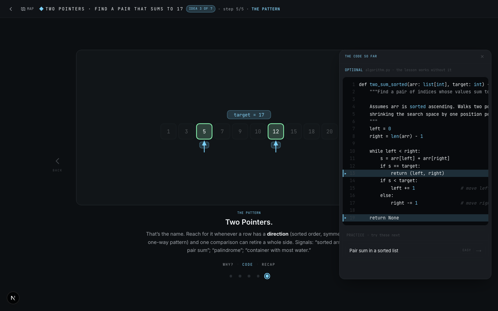

The drawer opens from the right (captured over the beat-5 view), titled "THE CODE SO FAR" and subtitled "OPTIONAL · algorithm.py · the lesson works without it". It shows the Python source for `two_sum_sorted(arr: list[int], target: int)` with a docstring noting the array is assumed sorted ascending and that it walks two pointers, shrinking the search space by one position per step. The body sets `left = 0` and `right = len(arr) - 1`, then runs a `while left < right:` loop computing `s = arr[left] + arr[right]`, returning `(left, right)` on `s == target`, incrementing `left` when `s < target` (# move left), else decrementing `right` (# move right), and ends with `return None`. The `return (left, right)` and `return None` lines carry active-line markers. Below the code, a "PRACTICE · try these next" section lists one item, "Pair sum in a sorted list", tagged EASY with a forward arrow.

---

## sliding-window
route: `/categories/algorithms/sliding-window/` · diagram shape: line

Captured in the structured register: the side nav reads "step 1/5" through "step 5/5", so the five reachable beats are setup, instinct (wedge), derivation, win, and pattern. This run reached all 5 beats on both desktop and mobile.

### Beat 1 — The setup
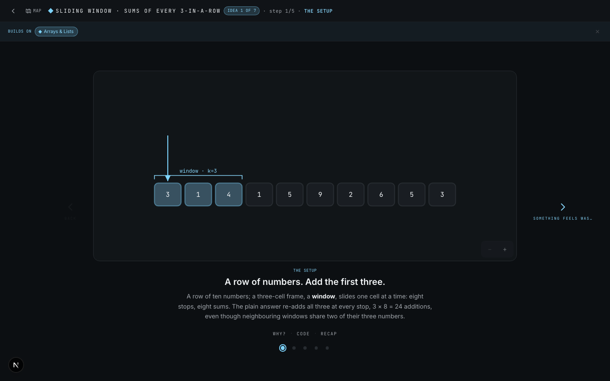
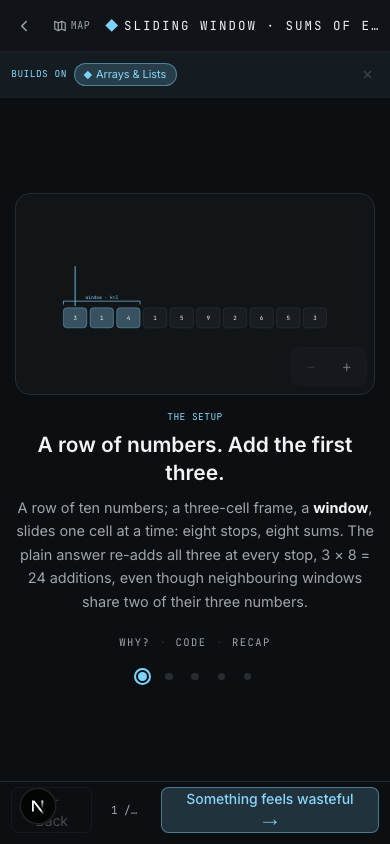
The diagram is a horizontal line of ten cells holding the values 3, 1, 4, 1, 5, 9, 2, 6, 5, 3. The first three cells are toned as the active window, with a bracket labelled "window · k=3" above them and a vertical arrow pointing down to the first cell. The top bar shows the topic title "SLIDING WINDOW · SUMS OF EVERY 3-IN-A-ROW", an "IDEA 1 OF 7" pill, "step 1/5", and the beat name "THE SETUP". A "BUILDS ON" strip below carries a single prereq pill, "Arrays & Lists". The main panel reads caption "THE SETUP", title "A row of numbers. Add the first three.", with body text describing eight overlapping windows of three and the 3 × 8 = 24 from-scratch additions. Below the panel sit the "WHY? · CODE · RECAP" chips and five progress dots (first filled). The right side nav shows the forward action "SOMETHING FEELS WAS…" (Something feels wasteful). This beat has no gate; advancing right moves to the next beat. On mobile the diagram and panel stack vertically, the chips and dots sit below, and a bottom bar shows "Back", the step counter "1 /…", and the forward button "Something feels wasteful →".

### Beat 2 — The instinct
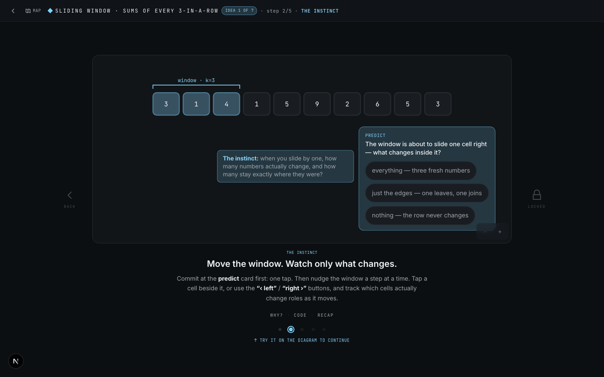
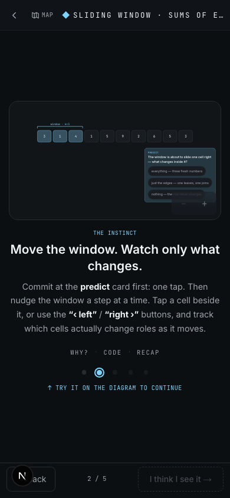
The same ten-cell row shows the first three cells toned active under the "window · k=3" bracket, with the window not yet moved. To the right of the row is a "PREDICT" card asking "The window is about to slide one cell right — what changes inside it?" with three tappable choices: "everything — three fresh numbers", "just the edges — one leaves, one joins", and "nothing — the row never changes". A note panel to the left reads "The instinct: when you slide by one, how many numbers actually change, and how many stay exactly where they were?". The main panel caption is "THE INSTINCT", title "Move the window. Watch only what changes.", instructing the learner to commit on the predict card first, then nudge with the "‹ left" / "right ›" buttons. This beat is gated (interaction: "wedge") and shown pre-interaction: the side nav reads "LOCKED" and the footer shows "↑ TRY IT ON THE DIAGRAM TO CONTINUE" (the dot-jump capture lands on the locked initial state and does not perform the tap). Tapping a predict choice fires the gate; after a short pause the interactive DragWindow mounts (tap a cell beside the window or use the step buttons to slide it, where one cell tones "bad" as it leaves, one tones "good" as it enters, and the middle stays), which clears the lock. On mobile the predict card overlays the right portion of the canvas card, the note panel does not render, the footer shows the same "↑ TRY IT ON THE DIAGRAM TO CONTINUE" gate prompt, and the bottom bar's forward button reads "I think I see it →".

### Beat 3 — The derivation
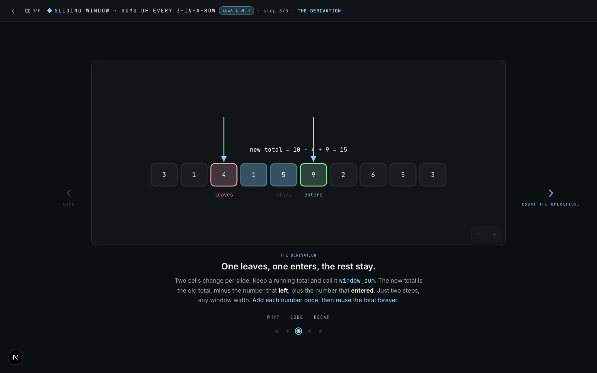
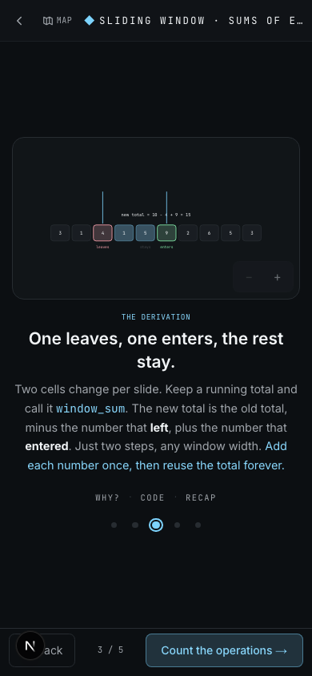
A frozen single slide on the ten-cell row: cell index 2 (value 4) is toned "bad" and labelled "leaves", cell index 4 (value 5) labelled "stays", and cell index 5 (value 9) toned "good" and labelled "enters". The equation "new total = 10 − 4 + 9 = 15" sits above the row, with two vertical arrows pointing down to the leaver and the newcomer cells. Side nav shows "step 3/5" and "THE DERIVATION". The main panel caption is "THE DERIVATION", title "One leaves, one enters, the rest stay.", body introducing the running total `window_sum` and the rule new total = old total − leaver + newcomer, with the highlighted line "Add each number once, then reuse the total forever." The right side nav forward action reads "COUNT THE OPERATION…". This beat is non-interactive (static visual); advancing right continues. The third progress dot is filled.

### Beat 4 — The win
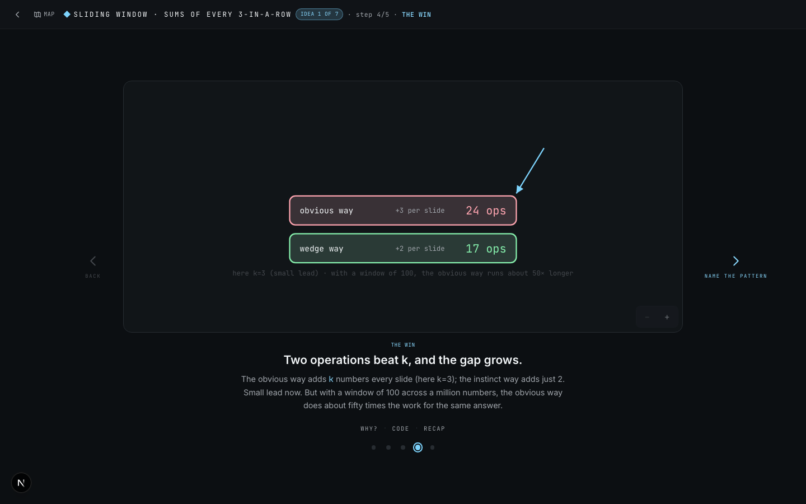
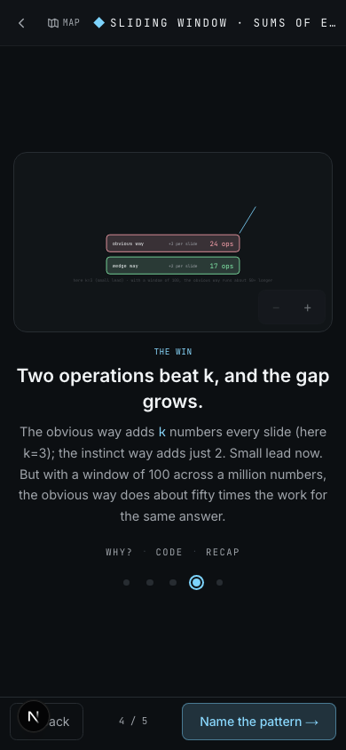
The diagram is a two-row counter race. The top row, toned red, reads "obvious way · +3 per slide · 24 ops"; the bottom row, toned green, reads "wedge way · +2 per slide · 17 ops". A diagonal arrow points to the red row, and a caption below reads "here k=3 (small lead) · with a window of 100, the obvious way runs about 50× longer". Side nav shows "step 4/5" and "THE WIN". The main panel caption is "THE WIN", title "Two operations beat k, and the gap grows.", body contrasting the obvious way's k additions per slide against the instinct way's 2, scaling the comparison up to a window of 100. The right side nav forward action reads "NAME THE PATTERN". The beat is tagged interaction "playback" in the spec (an AutoSlide visual marches the window and updates the running total with a "↺ replay" control), but the captured frame shows the static counter-race framing. The fourth progress dot is filled.

### Beat 5 — The pattern
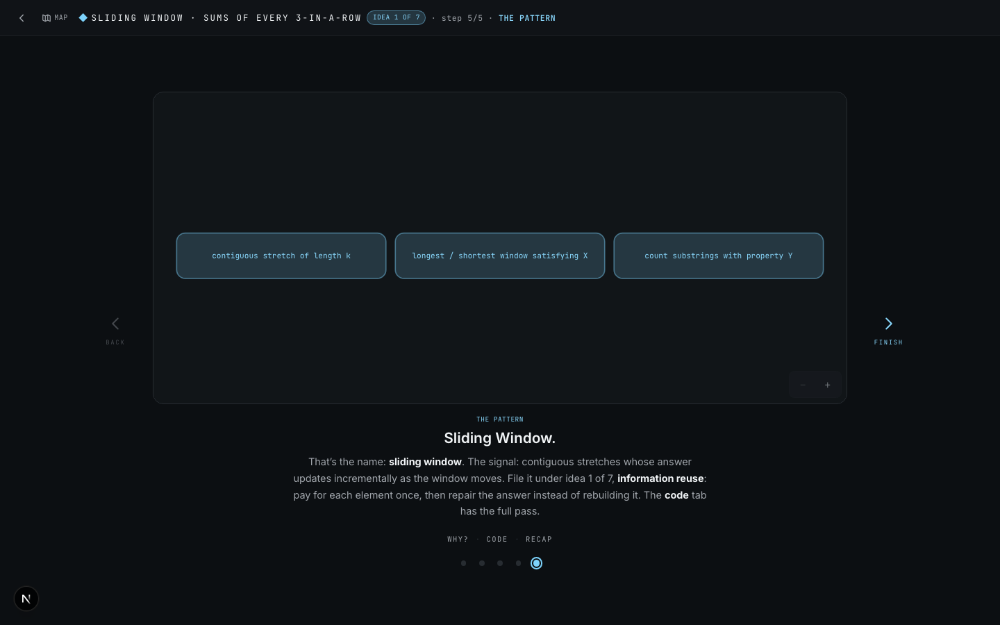
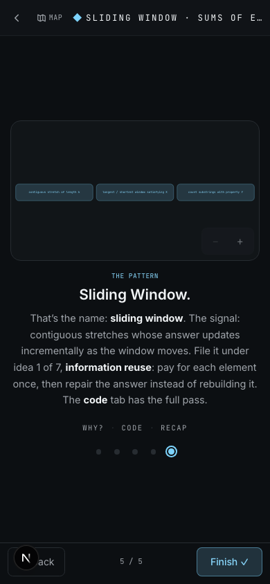
The diagram is three signal chips in a row, toned with the accent: "contiguous stretch of length k", "longest / shortest window satisfying X", and "count substrings with property Y". Side nav shows "step 5/5" and "THE PATTERN". The main panel caption is "THE PATTERN", title "Sliding Window.", body naming the pattern, listing the cue (contiguous stretches whose answer updates incrementally), and filing it under "idea 1 of 7, information reuse", pointing to the code tab for the full pass. The right side nav forward action reads "FINISH". The fifth (last) progress dot is filled. This is the final beat.

### Code drawer
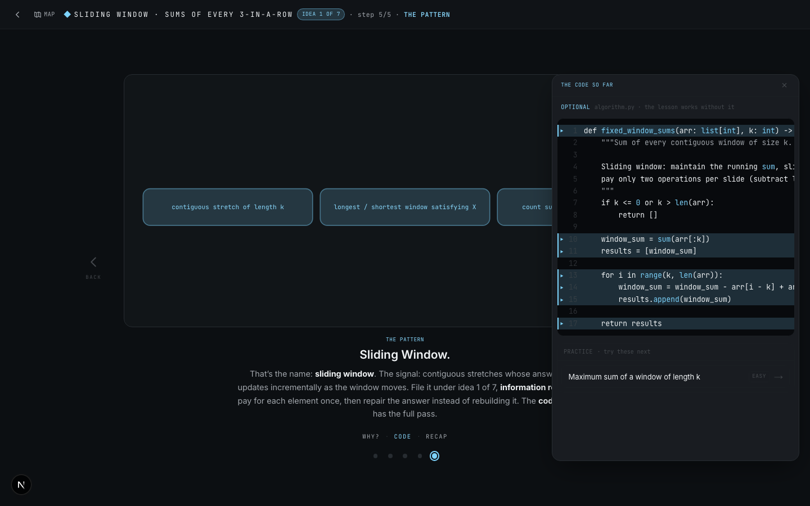
Opening the code drawer slides in a right-hand panel headed "THE CODE SO FAR", tagged "OPTIONAL  algorithm.py · the lesson works without it". It shows the Python source `def fixed_window_sums(arr: list[int], k: int) -> ...` with a docstring describing the sliding window and "pay only two operations per slide (subtract…)", a guard `if k <= 0 or k > len(arr): return []`, `window_sum = sum(arr[:k])`, `results = [window_sum]`, the loop `for i in range(k, len(arr)):` with `window_sum = window_sum - arr[i - k] + ar…` and `results.append(window_sum)`, and `return results`. Line numbers run 1–17 and several lines have a left-edge triangle marker indicating active/labelled lines. Below the code is a "PRACTICE · try these next" section with one item, "Maximum sum of a window of length k", tagged "EASY →". The drawer overlays the right portion of the beat-5 scene, which remains visible behind it.

---

## sliding-window-variable
route: `/categories/algorithms/sliding-window-variable/` · diagram shape: line

The re-capture reached all beats on both viewports (desktop 5/5, mobile 5/5). The lesson renders in its five-beat register: setup, instinct, derivation, win, pattern. The spec defines seven beats total; the `naive` ("The obvious thing") and `general` ("The generalization") beats are register-trimmed and do not appear in this render. The top bar shows a MAP link, the topic title "VARIABLE SLIDING WINDOW · LONGEST RUN WITH NO REPEATS", an "IDEA 1 OF 7" pill, a "step N/5" counter, and the per-beat label. The worked string is `abracadabra`, one letter per box.

### Beat 1 — The setup
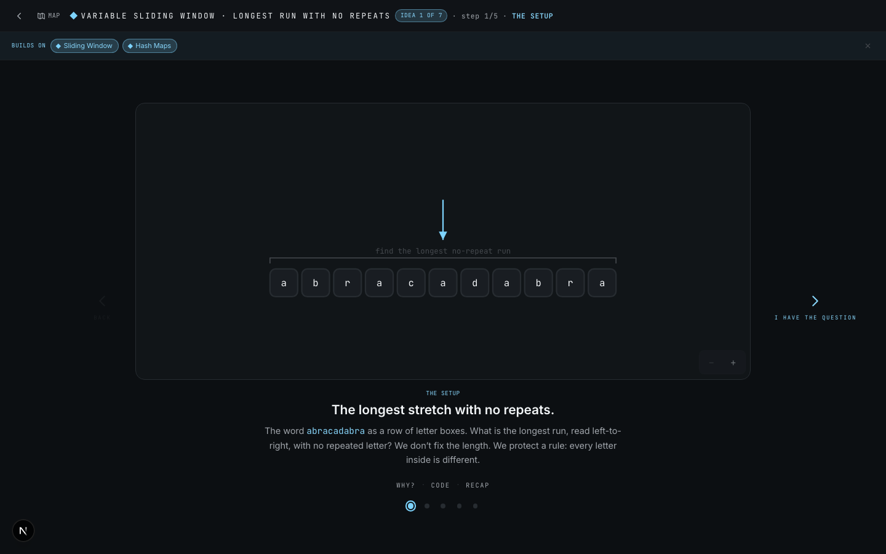
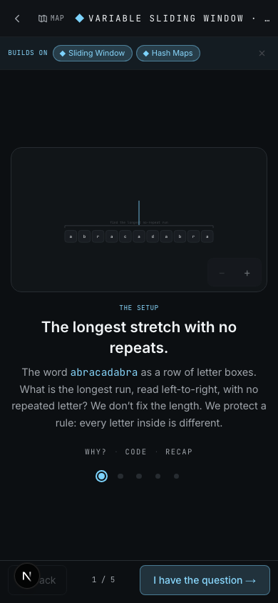

The diagram is a single line of eleven letter boxes spelling `abracadabra`, one character per box, with a bracket above the row labeled "find the longest no-repeat run" and a vertical arrow pointing down into the row. A "BUILDS ON" prereq strip below the header carries two pills, "Sliding Window" and "Hash Maps". The main panel under the diagram is captioned "THE SETUP" with the title "The longest stretch with no repeats." and body text describing `abracadabra` as a row of letter boxes and the rule that every letter inside the run must be different (no fixed length is given). Under the panel are the WHY? · CODE · RECAP chips and a five-dot progress row with the first dot filled. The right side nav reads "I HAVE THE QUESTION", the left reads "BACK". This beat has no diagram interaction (interaction: none), so the learner advances by clicking the forward nav. A zoom +/− control sits at the bottom-right of the diagram frame. On mobile the row, caption, and body stack vertically, with a bottom bar holding "Back", a "1 / 5" counter, and the forward action button.

### Beat 2 — The instinct
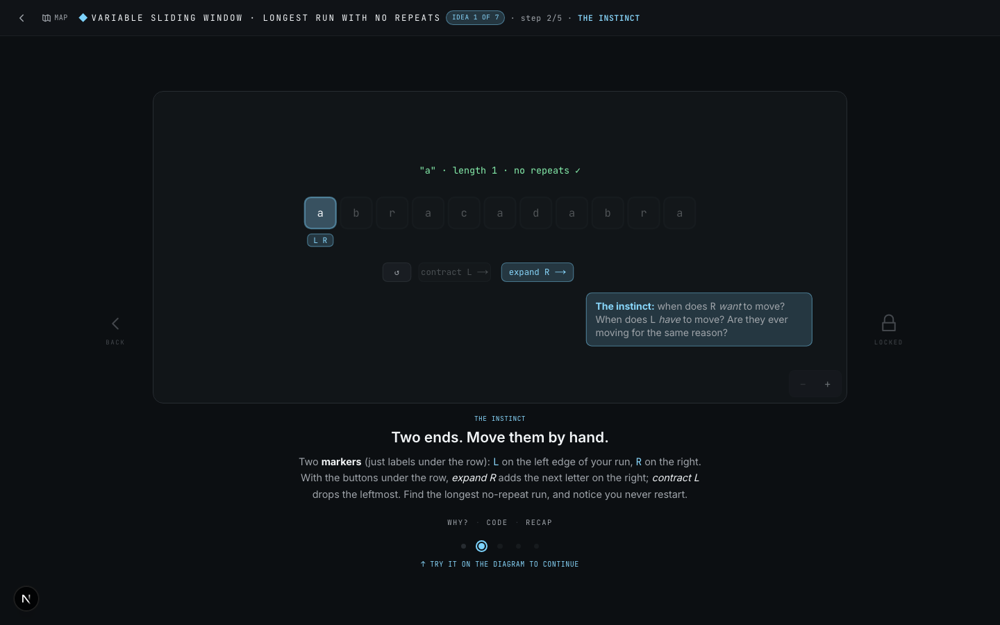
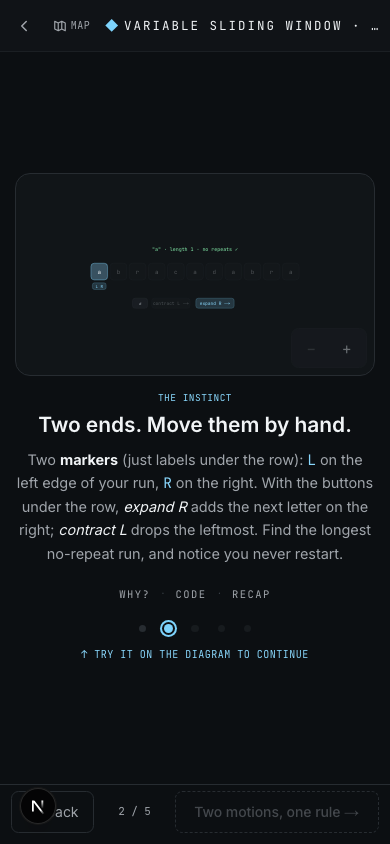

The eleven-box row shows the interactive manual window in its initial state: box 0 (`a`) is highlighted active with an "L R" marker pinned beneath it (L and R coincide on the first cell), and a status line above the row reads `"a" · length 1 · no repeats ✓`. Three controls sit below the row: a `↺` reset button, a disabled `contract L →` button (disabled because L equals R), and an enabled `expand R →` button. A note card on the right reads "The instinct: when does R want to move? When does L have to move? Are they ever moving for the same reason?". The main panel is captioned "THE INSTINCT", titled "Two ends. Move them by hand.", and explains the two markers L and R and what `expand R` and `contract L` do. This is a wedge interaction: the learner clicks the window controls to grow R (pull in the next letter) or contract L (drop the leftmost), and boxes turn active (window unique) or bad/red on a repeat. Shown pre-interaction, so the right side nav reads "LOCKED" and the prompt under the chips reads "↑ TRY IT ON THE DIAGRAM TO CONTINUE"; clicking a window control fires the beat's interaction-done signal and unlocks forward navigation. On mobile the diagram, status line, and controls render in a smaller frame above the panel, with the bottom-bar forward button shown disabled and a "2 / 5" counter.

### Beat 3 — The derivation
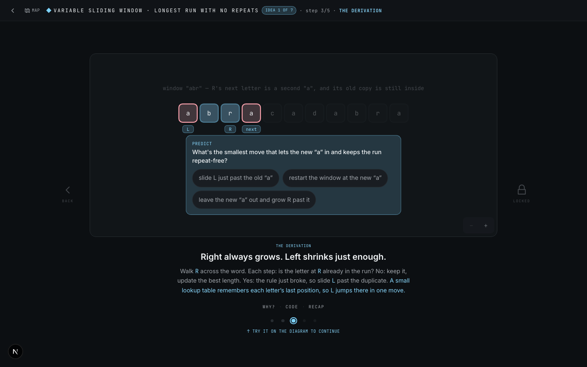
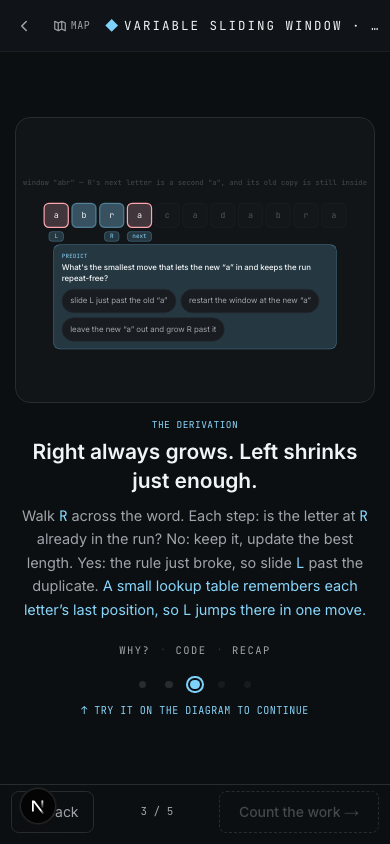

The diagram is frozen at the lesson's pivot: the window holds "abr" (box 0 outlined red and marked "L", boxes 1-2 active blue with box 2 marked "R") and box 3, a second `a`, is outlined red and marked "next"; the caption reads `window "abr" — R's next letter is a second "a", and its old copy is still inside`. A PREDICT panel on the canvas asks "What's the smallest move that lets the new "a" in and keeps the run repeat-free?" with three choices: "slide L just past the old "a"" (correct), "restart the window at the new "a"", and "leave the new "a" out and grow R past it". The main panel is captioned "THE DERIVATION", titled "Right always grows. Left shrinks just enough." This is a wedge interaction implemented as a prediction gate: tapping a pill fires the interaction-done signal, shows feedback, and after a short reading pause the AutoWindow playback runs to answer the prediction. Shown pre-interaction, so the right side nav reads "LOCKED" and the footer reads "↑ TRY IT ON THE DIAGRAM TO CONTINUE"; committing to a choice clears the gate. On mobile the predict panel overlays the diagram and the body text stacks below.

### Beat 4 — The win
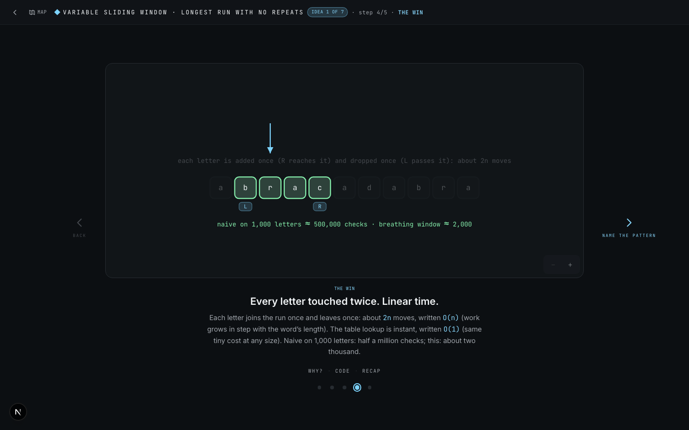
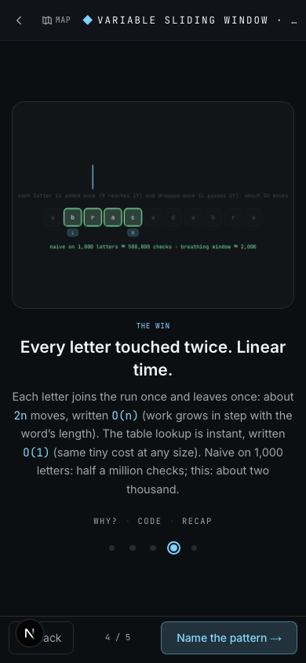

The diagram shows a static linear-time contrast: boxes 1-4 ("brac") are highlighted green with "L" under box 1 and "R" under box 4, the rest dimmed. A caption above reads "each letter is added once (R reaches it) and dropped once (L passes it): about 2n moves" with a vertical arrow into the row, and a line below the row reads "naive on 1,000 letters ≈ 500,000 checks · breathing window ≈ 2,000". The main panel is captioned "THE WIN", titled "Every letter touched twice. Linear time.", with body text stating each letter joins and leaves once (about 2n moves, written O(n)), the table lookup is instant (O(1)), and naive on 1,000 letters is about half a million checks against this method's roughly two thousand. The fourth progress dot is filled. The right side nav reads "NAME THE PATTERN". This beat has no diagram interaction (interaction: none).

### Beat 5 — The pattern
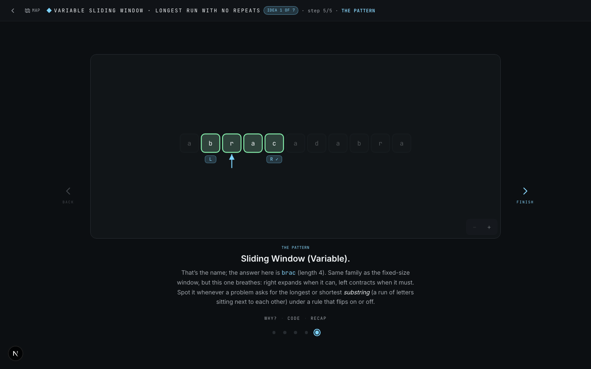
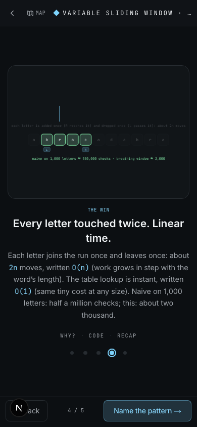

The diagram shows the final answer: boxes 1-4 ("brac") highlighted green, "L" under box 1, "R ✓" under box 4, with an upward arrow pointing into the window. The main panel is captioned "THE PATTERN", titled "Sliding Window (Variable).", and the body names the pattern, gives the answer as `brac` (length 4), describes the window as breathing (right expands when it can, left contracts when it must), and gives the trigger cue (longest or shortest substring under a rule that flips on or off). All five progress dots are filled and the right side nav reads "FINISH". This beat has no diagram interaction (interaction: none).

### Code drawer
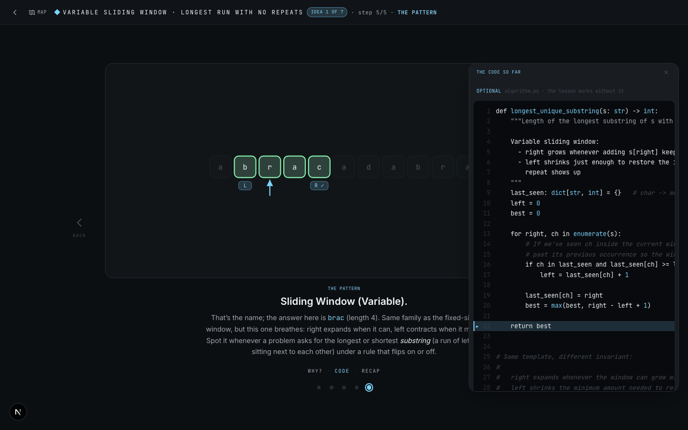

The drawer slides in from the right over the beat-5 desktop scene, headed "THE CODE SO FAR" with the subline "OPTIONAL · algorithm.py · the lesson works without it". It shows the Python source `def longest_unique_substring(s: str) -> int:` with a docstring describing the variable sliding window (right grows whenever adding `s[right]` keeps it valid; left shrinks just enough to restore the rule when a repeat shows up). The body initializes `last_seen: dict[str, int] = {}`, `left = 0`, `best = 0`, then loops `for right, ch in enumerate(s):` with the guard `if ch in last_seen and last_seen[ch] >= left:`, the update `left = last_seen[ch] + 1`, then `last_seen[ch] = right`, `best = max(best, right - left + 1)`, and `return best`. The `return best` line (line 22) is marked as the active line. Below the function are commented lines describing the same template under a different invariant. Line numbers run down the left margin.

---

## activity-selection

route: `/categories/algorithms/activity-selection/` · diagram shape: line

The gallery renders this lesson at five beats (setup, instinct, derivation, operations, pattern); the spec's `obvious` and `general` beats are not present in this register. The header reads `ACTIVITY SELECTION · FIT THE MOST MEETINGS`, carries an `IDEA 7 OF 7` pill, and shows a `step N/5 · <LABEL>` counter. A `MAP` link sits top-left, and on desktop a left-rail `BACK` control plus a right-rail action label (with chevron) flank the diagram. The diagram is a horizontal-bar timeline: seven meeting bars (stand-up, design sync, lunch&learn, 1:1, review, all-hands, retro), one per row, laid on a 9→17 hour axis, each bar spanning its start-to-end hours with the range printed inside. A small zoom control (− / +) sits at the bottom-right of the canvas.

### Beat 1 — The setup

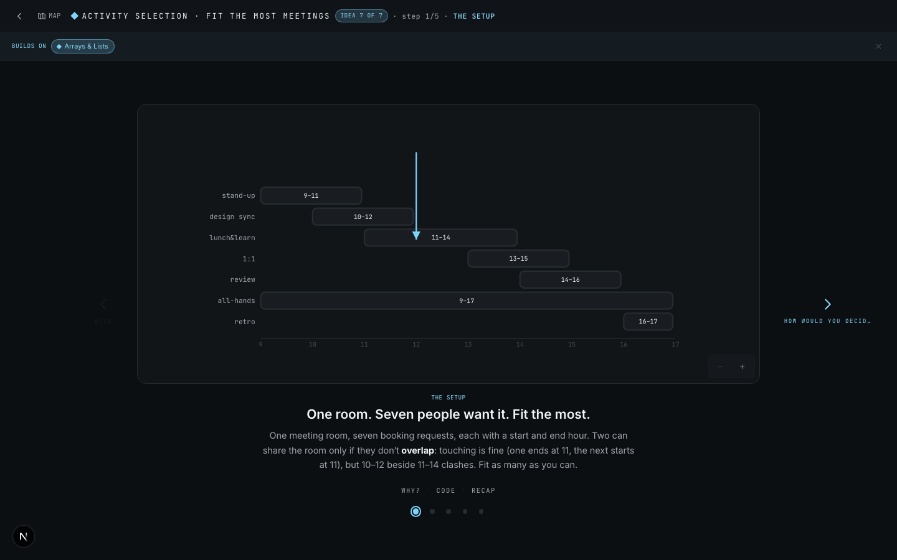
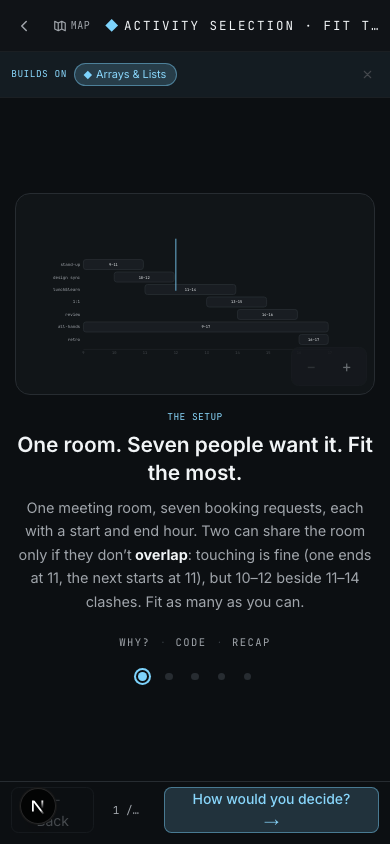

All seven meetings render as idle (gray) bars in real timeline positions, with a vertical line and downward arrowhead dropping into the tangled 11–14 region where bars overlap. A `BUILDS ON` row under the header carries an `Arrays & Lists` prereq pill. The main panel is captioned `THE SETUP`, titled "One room. Seven people want it. Fit the most.", and explains that two meetings can share the room only if they don't overlap, with touching edges allowed (one ends at 11, the next starts at 11) but 10–12 beside 11–14 clashing. Interaction type is none; the right-rail action reads "How would you decide?". Below the body, `WHY? · CODE · RECAP` chips sit above five progress dots with the first filled. On mobile the diagram sits above the prose, and a bottom bar shows `Back`, the `1 / 5` step counter, and the "How would you decide? →" action button.

### Beat 2 — The instinct

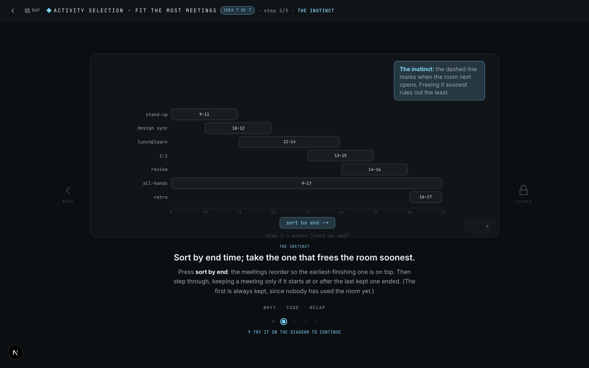
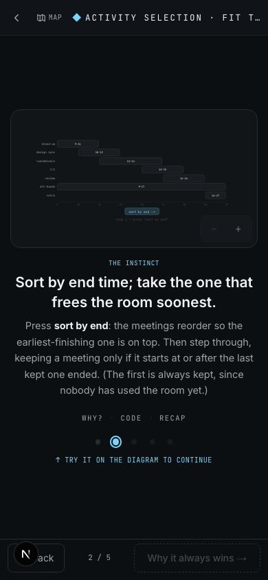

This is the wedge beat, captured in its initial pre-interaction state (the dot-jump does not perform the interaction, so the right rail reads `LOCKED` with a padlock icon). The bars are still in original order, and a blue `sort by end →` button sits below the axis with the caption "step 1 — press 'sort by end'". A top-right note reads "The instinct: the dashed line marks when the room next opens. Freeing it soonest rules out the least." The main panel, captioned `THE INSTINCT` and titled "Sort by end time; take the one that frees the room soonest.", describes pressing sort to reorder by earliest finish, then stepping through to keep a meeting only if it starts at or after the last kept one ended. Mechanically: tap "sort by end" (reorders the bars and fires onInteractionDone), then tap "step" to walk the list one meeting at a time, accepting (green) or skipping (red) each as a dashed "free at" line slides right, with a "↺ reset" to start over. The beat is gated by that interaction; a `↑ TRY IT ON THE DIAGRAM TO CONTINUE` hint sits under the dots (second dot active).

### Beat 3 — The derivation

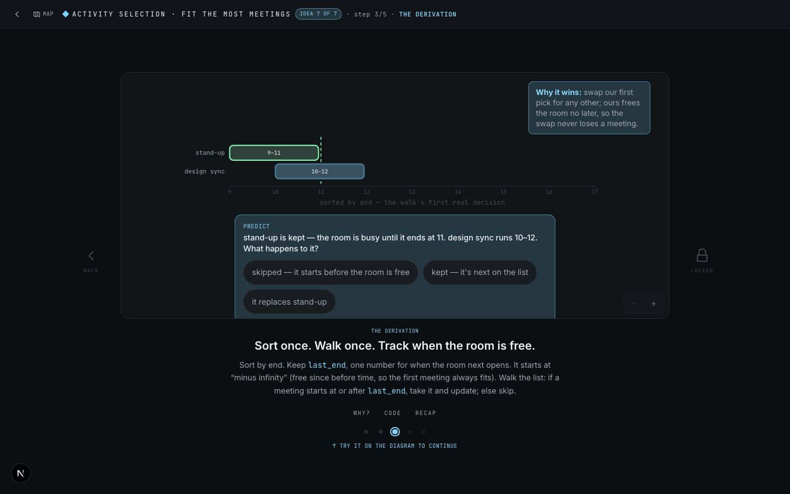
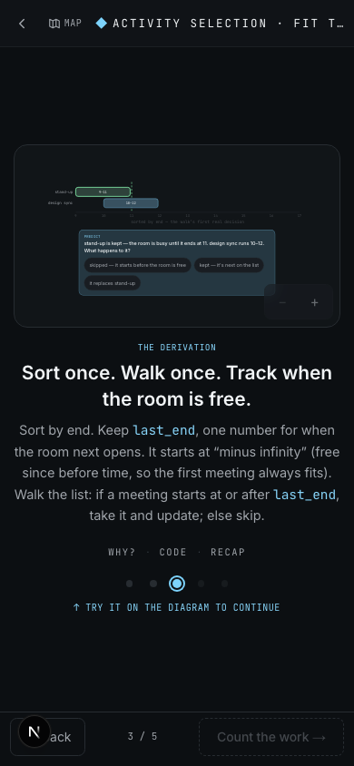

The diagram collapses to the first two sorted meetings: stand-up (9–11) drawn green/accepted with a dashed "free at" line at hour 11, and design sync (10–12) drawn active/blue and visibly crossing that line. The caption reads "sorted by end — the walk's first real decision". A `PREDICT` panel is hosted on the canvas asking "stand-up is kept — the room is busy until it ends at 11. design sync runs 10–12. What happens to it?" with three choice pills: "skipped — it starts before the room is free", "kept — it's next on the list", and "it replaces stand-up". The interaction is a single tap on a prediction pill, which fires onInteractionDone; the correct answer is "skipped", and after a short reading pause the auto-playback greedy walk runs to answer it. Captured pre-interaction, the right rail reads `LOCKED` and the `↑ TRY IT ON THE DIAGRAM TO CONTINUE` hint shows. A top-right note reads "Why it wins: swap our first pick for any other; ours frees the room no later, so the swap never loses a meeting." The main panel ("Sort once. Walk once. Track when the room is free.") describes keeping one number, `last_end`, starting at minus infinity. Mobile stacks the diagram and predict panel above the prose with the `3 / 5` counter and a "Count the work →" action.

### Beat 4 — The operations

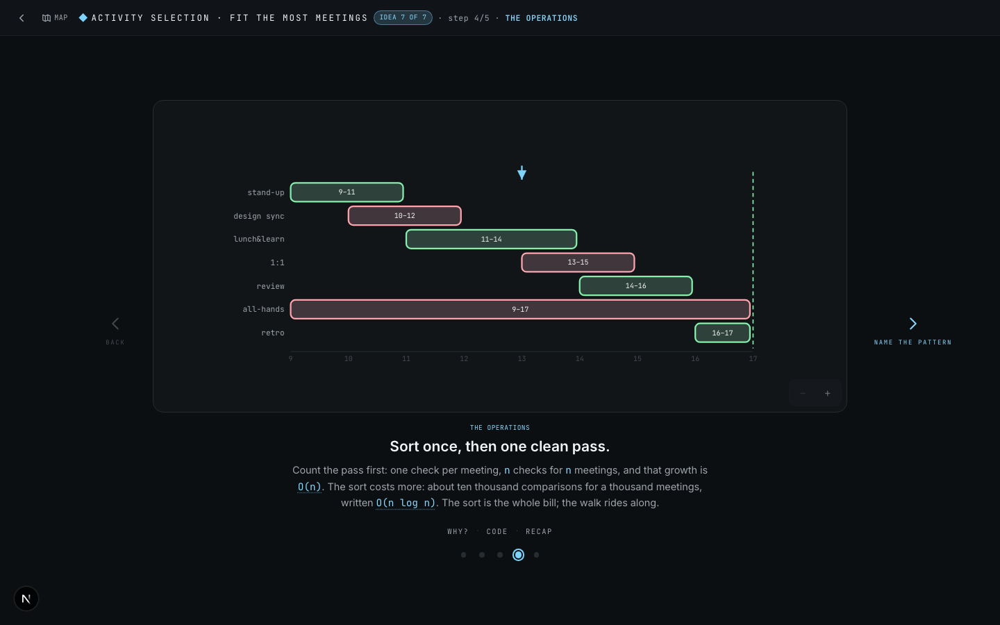
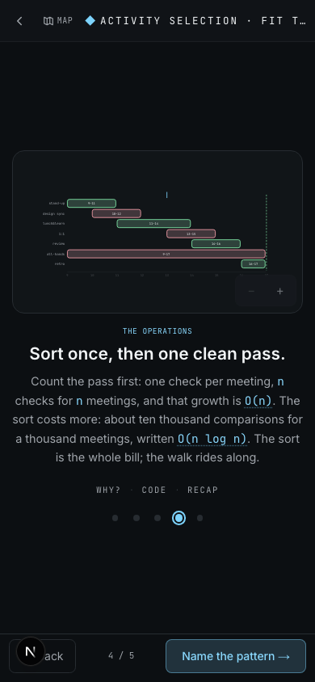

The diagram shows the final solved state: kept meetings (stand-up, lunch&learn, review, retro) outlined green and skipped meetings (design sync, 1:1, all-hands) outlined red, with a dashed "free at 17" line at the right edge and a downward arrow above the timeline. Interaction type is none; the right-rail action reads "NAME THE PATTERN". The main panel, captioned `THE OPERATIONS` and titled "Sort once, then one clean pass.", counts the work: one check per meeting (`O(n)`) and the sort costing about ten thousand comparisons for a thousand meetings (`O(n log n)`), concluding the sort is the whole bill while the walk rides along. Below the body, `WHY? · CODE · RECAP` chips sit above the five dots with the fourth filled.

### Beat 5 — The pattern

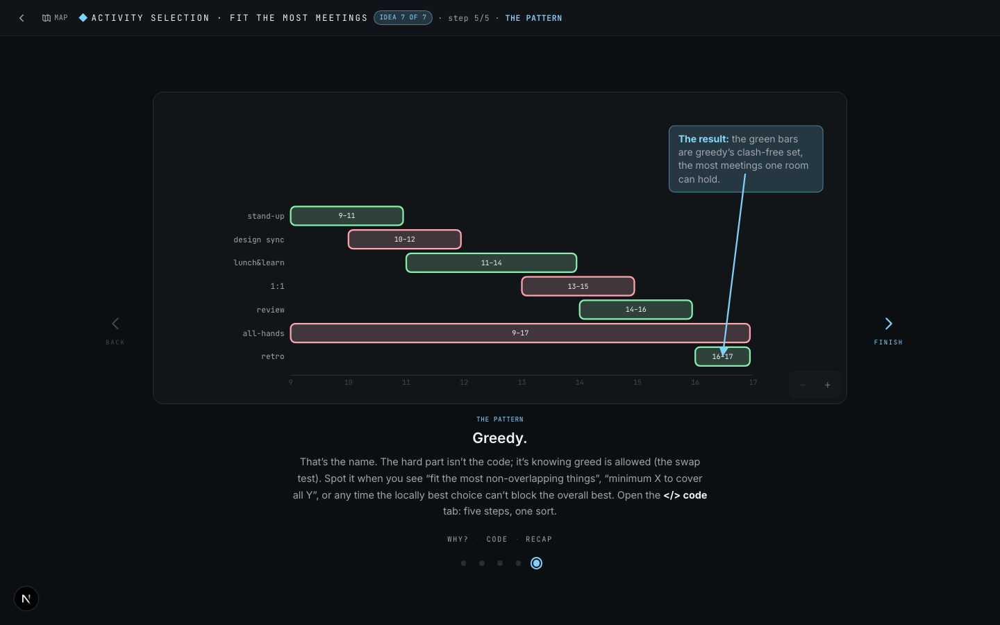
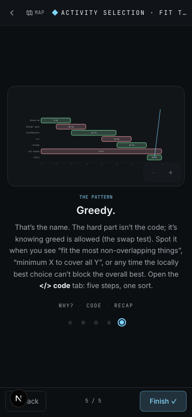

The diagram repeats the final accepted/rejected set (green kept bars, red skipped bars), with an arrow drawn from a top-right note down to the retro (16–17) bar. The note reads "The result: the green bars are greedy's clash-free set, the most meetings one room can hold." Interaction type is none; the right-rail action reads "FINISH". The main panel, captioned `THE PATTERN` and titled "Greedy.", names the move, states the hard part is knowing greed is allowed (the swap test), lists the signals ("fit the most non-overlapping things", "minimum X to cover all Y"), and points to the `</> code` tab. The five progress dots show the last one filled.

### Code drawer

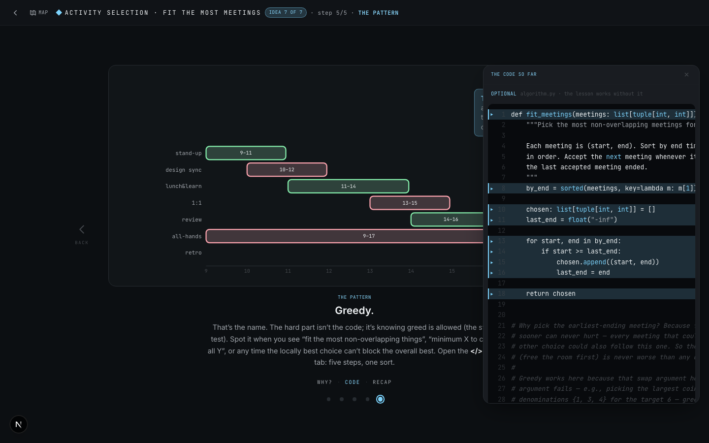

The code drawer slides in from the right over the lesson, headed "THE CODE SO FAR" with an `OPTIONAL algorithm.py · the lesson works without it` subline and a close (×) button. It shows the Python `fit_meetings(meetings: list[tuple[int, int]])` function: a docstring, `by_end = sorted(meetings, key=lambda m: m[1])`, a `chosen` list and `last_end = float("-inf")` initialization, the `for start, end in by_end:` loop with the `if start >= last_end:` check that appends `(start, end)` and updates `last_end = end`, then `return chosen`. Lines are numbered 1–28, with several highlighted (the sort line and loop body), and a trailing comment block (lines 21–28) explaining why the earliest-ending pick is safe and noting that greedy fails on coins {1, 3, 4} for target 6. The drawer is captured over the Beat 5 ("THE PATTERN") state, with the solved timeline visible behind it on the left.

---

## backtracking

route: `/categories/algorithms/backtracking/` · diagram shape: box

The captured route renders 5 of the spec's 7 beats: the default register trims the `obvious` and `general` beats, so the on-screen step counter reads 1/5 through 5/5. The header shows a map link, the title "BACKTRACKING · SIX QUEENS, NO CLASHES", an "IDEA 2 OF 7" pill, the step indicator, and the current beat label. A "BUILDS ON" prerequisite row sits beneath the header on the first beat with pills for Arrays & Lists, Recursion, and Depth-First Search. Each beat carries WHY? · CODE · RECAP chips above a five-dot progress strip, with BACK and a forward action label in the left and right gutters. The visual band holds a 6×6 board of rounded square cells.

### Beat 1 — The setup

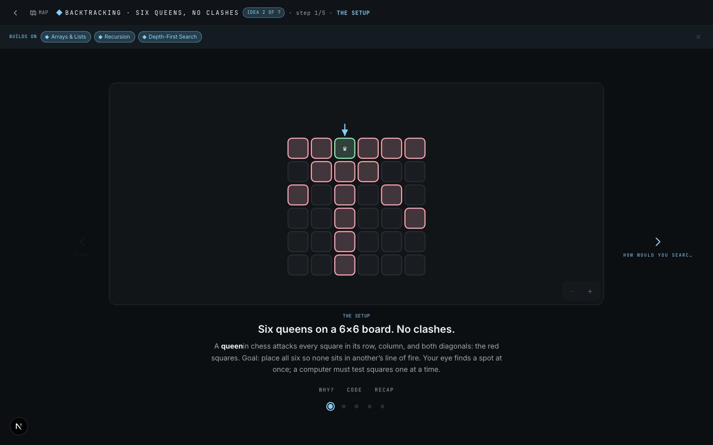
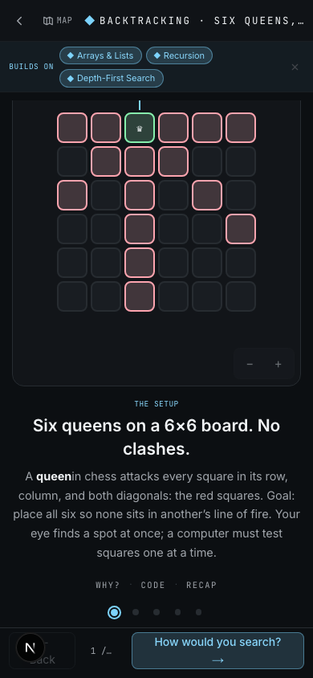

The board shows a single queen at row 0, column 2 (toned green) with every square it attacks lit red across its row, column, and both diagonals; a downward arrow points to the queen from above. The main panel is labeled "THE SETUP", titled "Six queens on a 6×6 board. No clashes.", and the body explains that a chess queen attacks its whole row, column, and diagonals (the red squares) and that the goal is placing all six with none in another's line of fire. The "BUILDS ON" row above shows the three prerequisite pills, the WHY? · CODE · RECAP chips appear with the first of five dots active, and the right gutter action reads "HOW WOULD YOU SEARCH?". On mobile the board sits at top, the panel text stacks below, and the forward action becomes a full-width "How would you search? →" button next to "1 / …".

### Beat 2 — The instinct

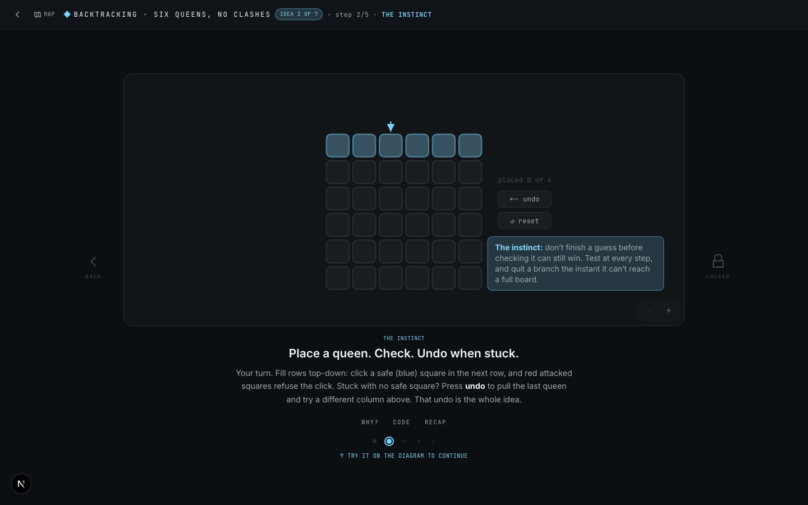
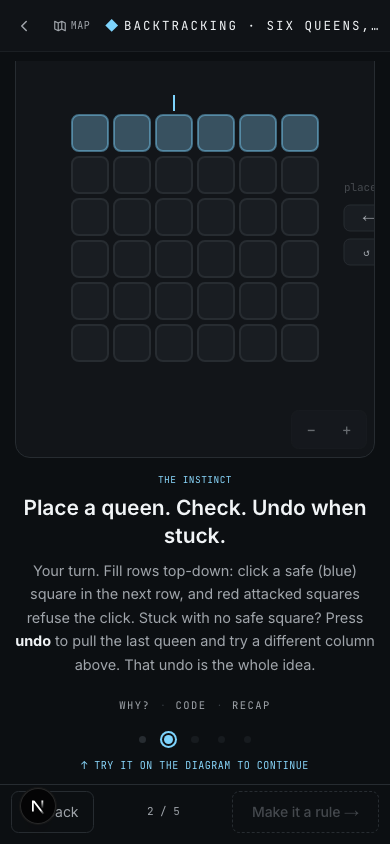

This is the wedge beat (interaction: "wedge"); it is shown pre-interaction, so the right gutter reads "LOCKED" and the footer prompts "↑ TRY IT ON THE DIAGRAM TO CONTINUE". The board's top row (row 0) is highlighted blue as the next clickable row while lower rows are idle. A right-gutter readout shows "placed 0 of 6" with "← undo" and "↺ reset" buttons, and a note panel states the instinct: don't finish a guess before checking it can still win, test at every step, quit a branch when it can't reach a full board. The main panel is labeled "THE INSTINCT", titled "Place a queen. Check. Undo when stuck." Mechanically, the learner clicks a safe (blue) square in the next row top-down; attacked (red) squares refuse the click; with no safe square the learner presses undo to lift the last queen and try another column. Any interaction (a click or undo) fires onInteractionDone to clear the LOCKED gate. On mobile the board, the "placed" counter, and the undo/reset controls stack; the forward button reads "Make it a rule →".

### Beat 3 — The derivation

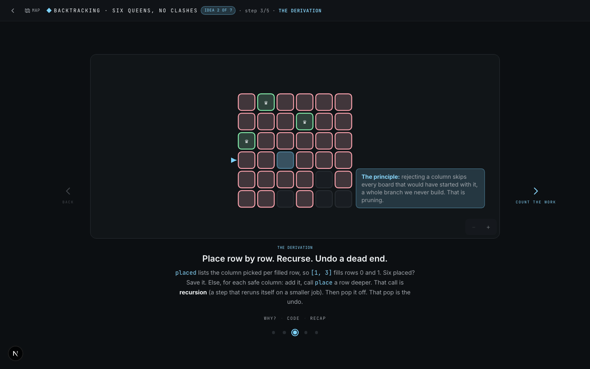
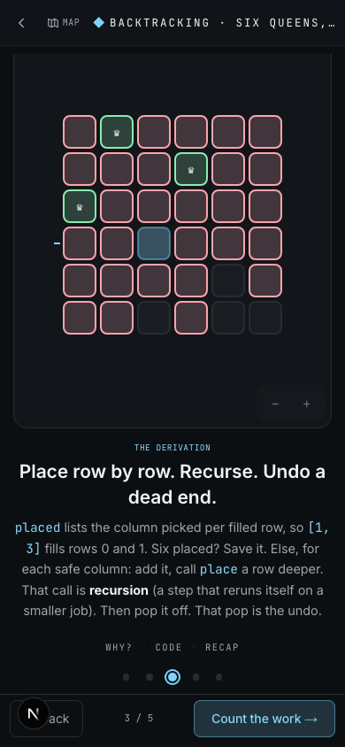

The board shows a partial placement — queens at row 0 col 1, row 1 col 3, row 2 col 0 (green) — with their combined attacks lit red and one blue "active" candidate cell in row 3, pointed to by a left-side arrow. The main panel is labeled "THE DERIVATION", titled "Place row by row. Recurse. Undo a dead end.", and the body describes `placed` as the list of columns picked per filled row (so `[1, 3]` fills rows 0 and 1), the save-when-six base case, and the per-safe-column add / call `place` a row deeper / pop sequence, defining recursion inline and naming the pop as the undo. A note panel states the principle: rejecting a column skips every board that would have started with it — a whole branch never built — which is pruning. This beat is non-interactive; the right gutter action reads "COUNT THE WORK".

### Beat 4 — The operations

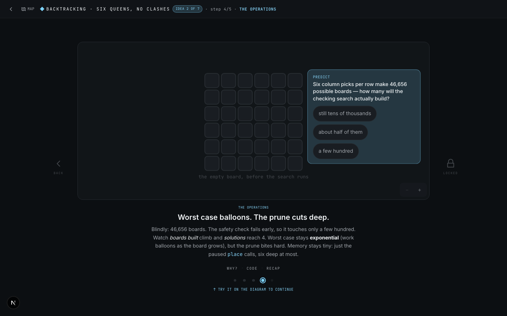
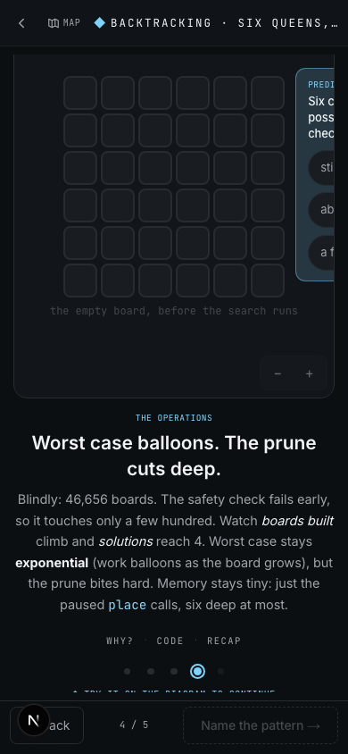

This is a wedge beat with a prediction gate, shown pre-interaction: the right gutter reads "LOCKED" and the footer prompts "↑ TRY IT ON THE DIAGRAM TO CONTINUE". The board is empty with the caption "the empty board, before the search runs" below it. A PREDICT panel overlays the board asking "Six column picks per row make 46,656 possible boards — how many will the checking search actually build?" with three tappable choices: "still tens of thousands", "about half of them", and "a few hundred" (the correct one). The main panel is labeled "THE OPERATIONS", titled "Worst case balloons. The prune cuts deep.", noting the search touches a few hundred boards instead of 46,656, that `boards built` climbs and `solutions` reach 4, that the worst case stays exponential, and that memory stays tiny (paused `place` calls, six deep at most). Mechanically, one tap on a prediction pill is the real interaction; PredictGate fires onInteractionDone, shows feedback, and after a short pause reveals the AutoBacktrack playback that animates placing, pruning, and undoing while a live "boards built" counter answers the prediction. On mobile the PREDICT panel is partly clipped at the right edge over the empty board; the forward button reads "Name the pattern →".

### Beat 5 — The pattern

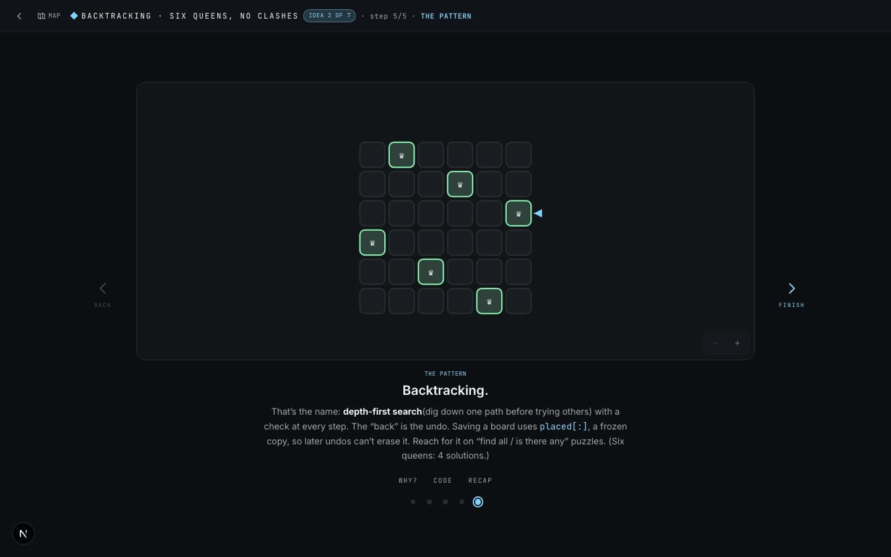
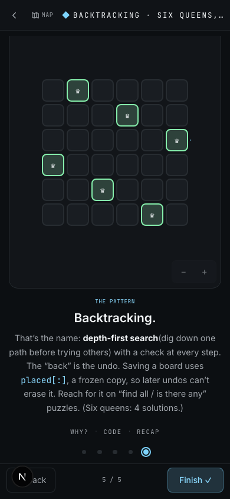

The board shows a complete legal six-queens solution — queens at columns [1, 3, 5, 0, 2, 4] across the rows, all toned green with no red attacks — and a left-pointing arrow at the row-2 queen. The main panel is labeled "THE PATTERN", titled "Backtracking.", and the body names the move as depth-first search (dig down one path before trying others) with a check at every step, identifies the "back" as the undo, notes that saving a board uses `placed[:]` (a frozen copy so later undos can't erase it), and gives the "find all / is there any" usage cue plus the fact that six queens has 4 solutions. This beat is non-interactive; the right gutter action reads "FINISH". On mobile the solved board sits above the stacked panel and the footer button reads "Finish ✓".

### Code drawer

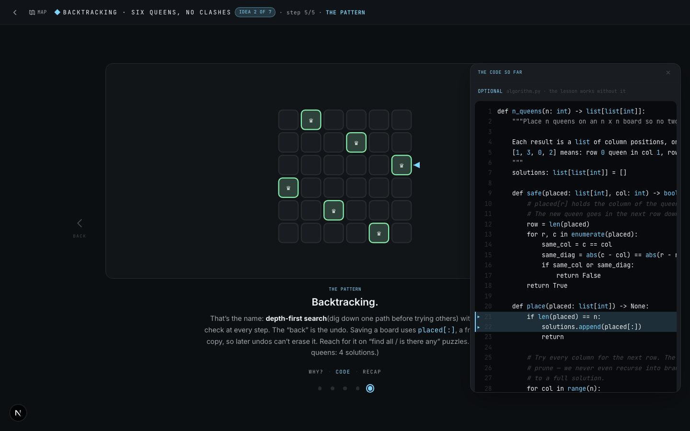

The code drawer slides in from the right over the final beat (step 5/5), titled "THE CODE SO FAR" with an "OPTIONAL — the lesson works without it" note and a close button. It shows the Python source `algorithm.py`: a `n_queens(n: int) -> list[list[int]]` function with a docstring, a `solutions` list, a nested `safe(placed, row, col) -> bool` helper that scans `placed` for same-column and same-diagonal clashes, and a `place(placed) -> None` function whose base case appends `placed[:]` when `len(placed) == n` and whose loop tries every column in `range(n)`. The currently active lines (the base-case `if len(placed) == n:` and `solutions.append(placed[:])`) are highlighted, matching the recorded-solution step of the closing beat.

---

## dfs
route: `/categories/algorithms/dfs/` · diagram shape: box

The captured run renders the structured register: 5 beats (setup, wedge "The instinct", derive "The derivation", operations, name "The pattern"). The top bar reads "DEPTH-FIRST SEARCH · ESCAPE THE MAZE", a pill "IDEA 4 OF 7", a "step N/5" counter, and the current beat label. The header has a MAP control and a back arrow. A "BUILDS ON" prereq strip shows three pills: Arrays & Lists, Graphs, Recursion (with a dismiss × on the right). Left/right gutters carry "BACK" and the next-action label; below the main panel sit the WHY? · CODE · RECAP chips and a row of progress dots.

### Beat 1 — The setup
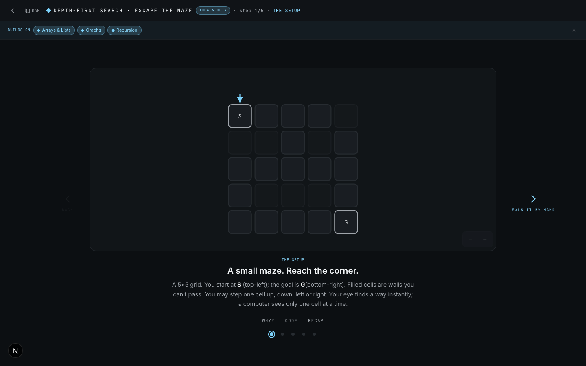
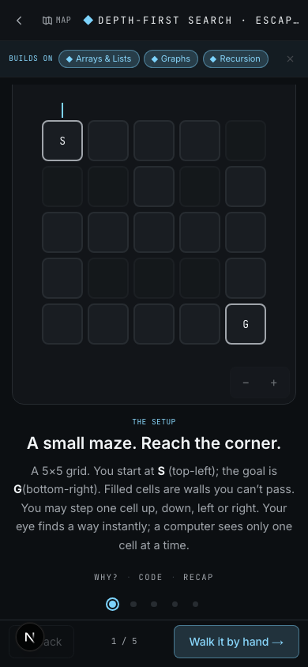
The diagram is a 5×5 grid of square cells inside a large rounded panel: S labels the top-left cell, G the bottom-right, both outlined. The remaining cells render as empty dark boxes; a small blue down-arrow points into the S cell from above, and a − / + zoom control sits in the panel's bottom-right corner. Below the diagram the caption reads "THE SETUP", title "A small maze. Reach the corner.", and body text explaining the 5×5 grid, S start, G goal, walls, and one-cell moves. The right gutter shows the next action "WALK IT BY HAND"; this beat is non-gated, so the learner advances with the next arrow. The progress dots show the first of five filled. On mobile the layout stacks vertically with a bottom bar showing "back", "1 / 5", and a "Walk it by hand →" button.

### Beat 2 — The instinct
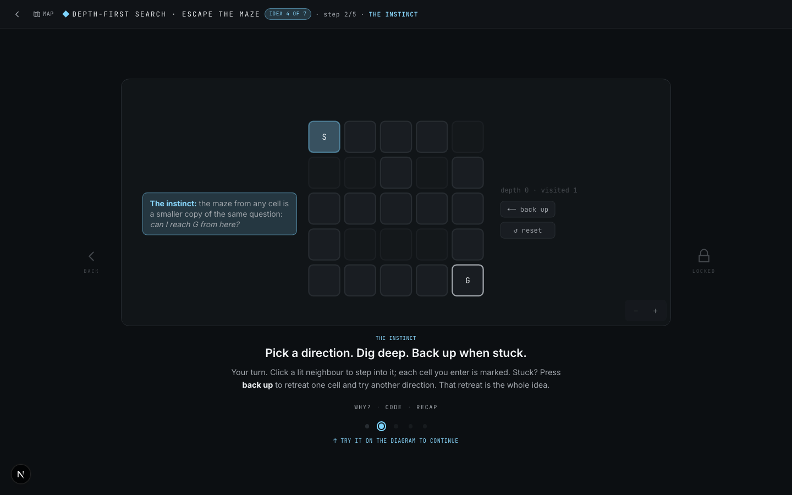
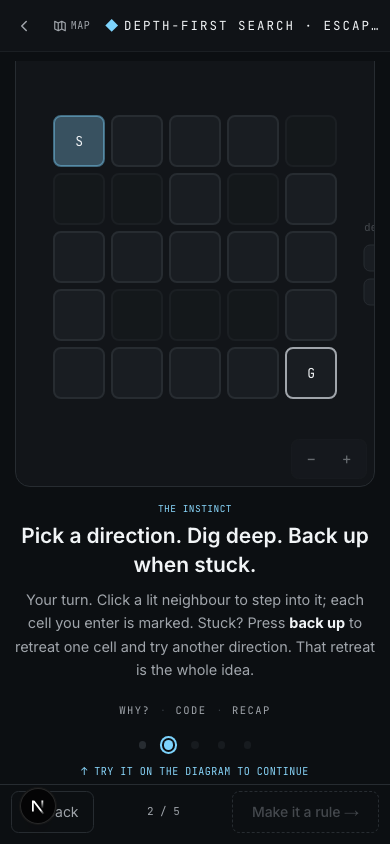
This is the wedge-gated beat (interaction: "wedge"). The same 5×5 grid renders with the S cell highlighted (active tone) at depth 0. A note card overlaps the grid's left ("The instinct: the maze from any cell is a smaller copy of the same question: can I reach G from here?"). To the right of the grid a status line reads "depth 0 · visited 1" above two buttons, "← back up" and "↺ reset". The main caption is "THE INSTINCT" / "Pick a direction. Dig deep. Back up when stuck." with body text instructing the learner to click a lit neighbour to step into it (each entered cell is marked) and press back up to retreat. The learner clears the gate by interacting with the maze: the prompt "↑ TRY IT ON THE DIAGRAM TO CONTINUE" sits under the dots and the right gutter shows "LOCKED" until an interaction fires. On mobile the diagram's right-side controls are clipped off-screen, the bottom bar reads "2 / 5" with the next action "Make it a rule →" rendered disabled/greyed; the mobile capture stopped here (gate not cleared on mobile).

### Beat 3 — The derivation
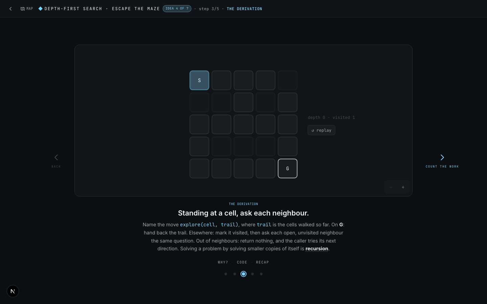
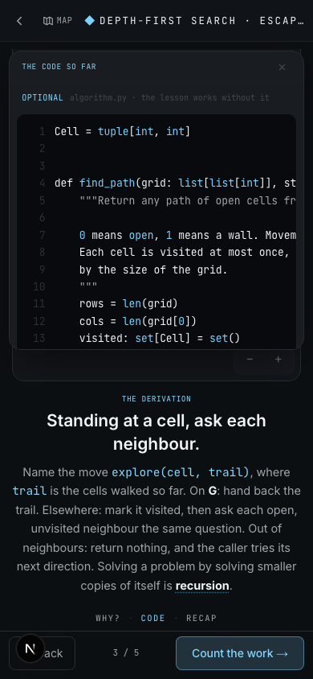
This beat runs an automatic DFS playback (interaction: "playback"). The capture shows the playback at its starting frame: only the S cell is highlighted (active) with the status line "depth 0 · visited 1" and a "↺ replay" button to the right of the grid. Per the spec the walker then dives and backtracks on its own via a timed step loop (about 600ms a step) with the visited count climbing; replay restarts it. The caption "THE DERIVATION" / "Standing at a cell, ask each neighbour." sits below, with body text naming the move `explore(cell, trail)`, the goal/elsewhere/out-of-neighbours cases, and the term "recursion" rendered as a linked term. The right gutter action is "COUNT THE WORK"; progress shows the middle dot filled. Non-gated.

### Beat 4 — The operations
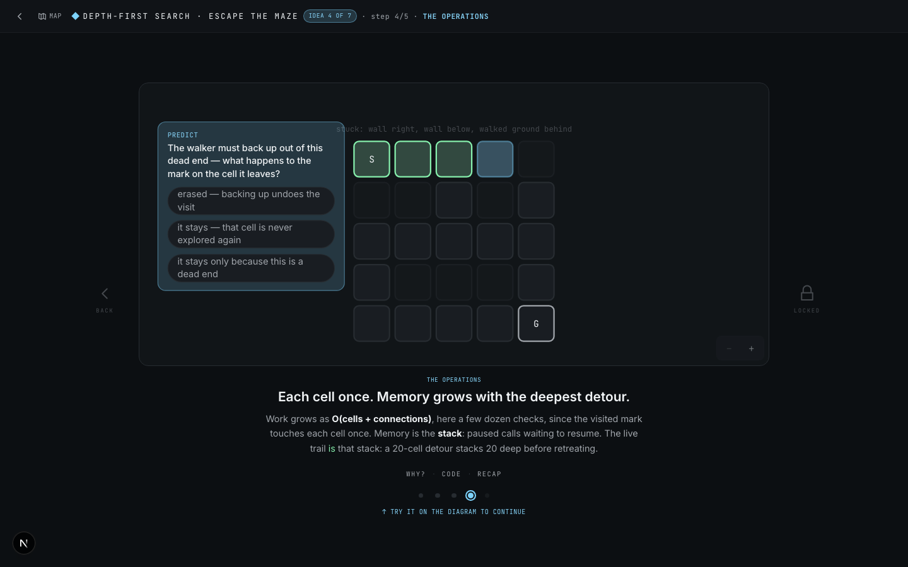
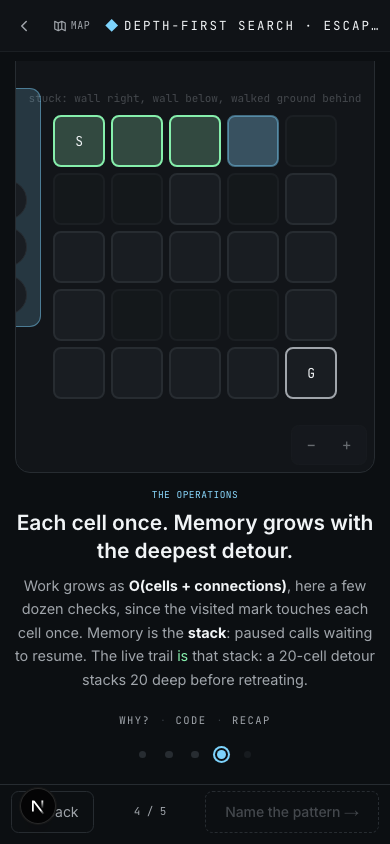
This beat opens on a prediction gate (interaction: "wedge", implemented as a PredictGate). The grid shows a walked trail across the top row (S plus three green trail cells, the fourth tinted as the current dead-end cell) with a faint caption above the grid "stuck: wall right, wall below, walked ground behind". A "PREDICT" card overlays the grid's left with the question "The walker must back up out of this dead end — what happens to the mark on the cell it leaves?" and three choices: "erased — backing up undoes the visit", "it stays — that cell is never explored again" (the correct one), and "it stays only because this is a dead end". Tapping a choice fires the gate and, after a short reading pause, the AutoDfs playback runs with the stack bracket on. The main caption is "THE OPERATIONS" / "Each cell once. Memory grows with the deepest detour." with body covering O(cells + connections) work and the stack as memory. The right gutter shows "LOCKED" and the under-dots prompt reads "↑ TRY IT ON THE DIAGRAM TO CONTINUE"; selecting a prediction clears the gate.

### Beat 5 — The pattern
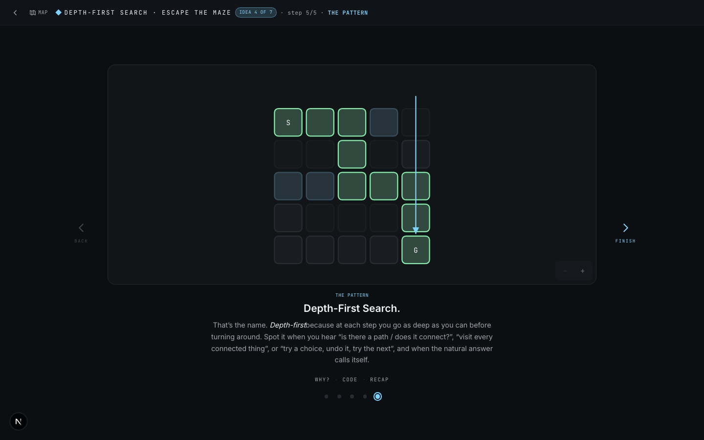
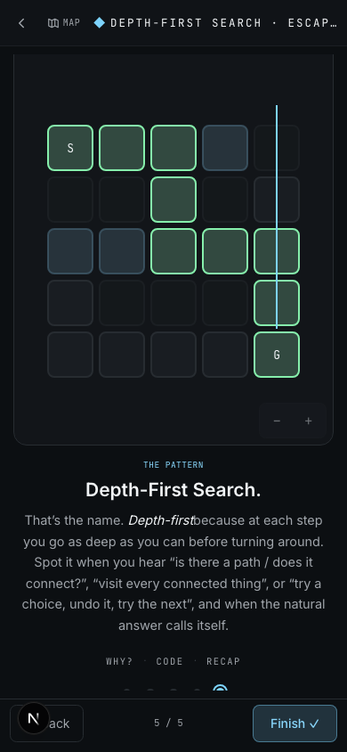
The closing beat. The grid shows the full solved path traced from S to G: the top row, a dive down through the middle column to the bottom-right, and the goal cell, all outlined green, plus two grey visited (off-path) cells; a blue vertical arrow runs down the right column into G. The caption "THE PATTERN" / "Depth-First Search." names the algorithm, with body text explaining "depth-first" and the cues (is there a path / does it connect, visit every connected thing, try-undo-retry, the answer calls itself). All five progress dots are present with the last filled, and the right gutter action reads "FINISH".

### Code drawer
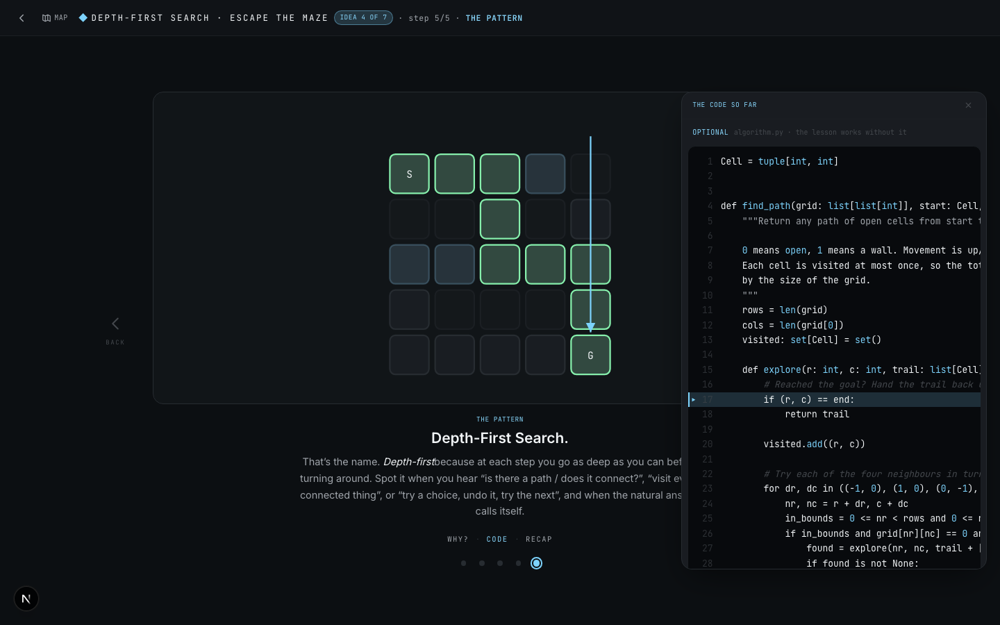
Opened on beat 5, the drawer panel ("THE CODE SO FAR") slides over the right half of the screen. It is labelled "OPTIONAL · algorithm.py · the lesson works without it" and shows numbered Python source for `find_path` / `explore`: the `Cell = tuple[int, int]` alias, a docstring, `rows`/`cols`/`visited` setup, the recursive `explore(r, c, trail)` helper with the goal base case (`if (r, c) == end: return trail`), `visited.add((r, c))`, and the four-neighbour loop with the recursive call. Line 17 (the goal base case) is highlighted with a left-margin marker. The grid diagram and the lesson caption remain visible to the left of the drawer.

---

## bfs
route: `/categories/algorithms/bfs/` · diagram shape: box

The captured run is the structured-register sequence of five beats (setup, the instinct, the derivation, the operations, the pattern); the spec's full intuitive arc also includes "the obvious thing" and "the generalization", which are not in this capture. The header reads "BREADTH-FIRST SEARCH · THE FEWEST STEPS OUT" with an "IDEA 3 OF 7" pill and a "step N/5" progress marker. Wedge beats are shown in their initial pre-interaction (LOCKED) state because the dot-jump does not perform the interaction.

### Beat 1 — The setup
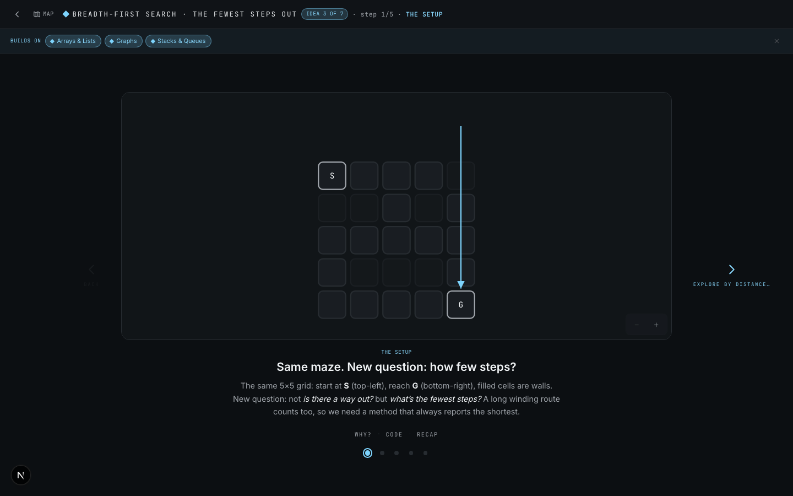
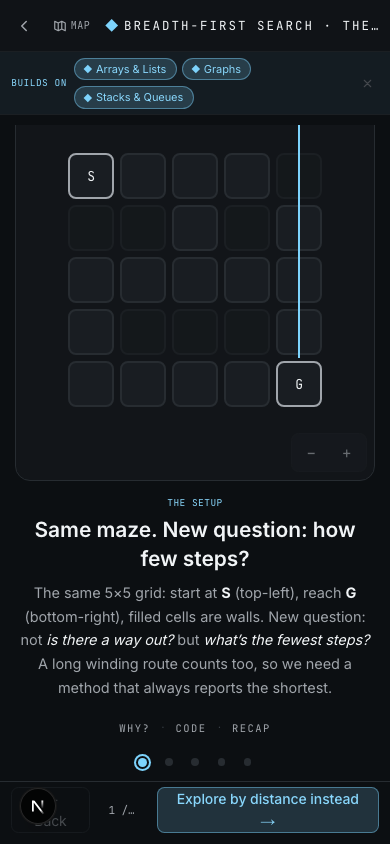

The progress marker reads "step 1/5 · THE SETUP". A "BUILDS ON" prereq row shows three diamond pills: Arrays & Lists, Graphs, Stacks & Queues. The diagram is a 5x5 grid of box cells with "S" in the top-left cell and "G" in the bottom-right cell, both drawn with outlined borders; a vertical blue arrow descends the rightmost column into the G cell. A minus/plus zoom control sits at the grid's bottom-right. The main panel below carries caption "THE SETUP", title "Same maze. New question: how few steps?", and body text describing the 5x5 grid, S/G positions, walls, and the shift from "is there a way out?" to "what's the fewest steps?". Under the panel are "WHY? · CODE · RECAP" chips and five progress dots with the first filled. The right side-nav shows a forward chevron "EXPLORE BY DISTANCE...", the left a "BACK" chevron. Interaction type is none. On mobile the prereq pills wrap to two lines, the grid stacks above the panel text, and a bottom action bar shows "Back", a "1 /..." counter, and a primary "Explore by distance instead →" button.

### Beat 2 — The instinct
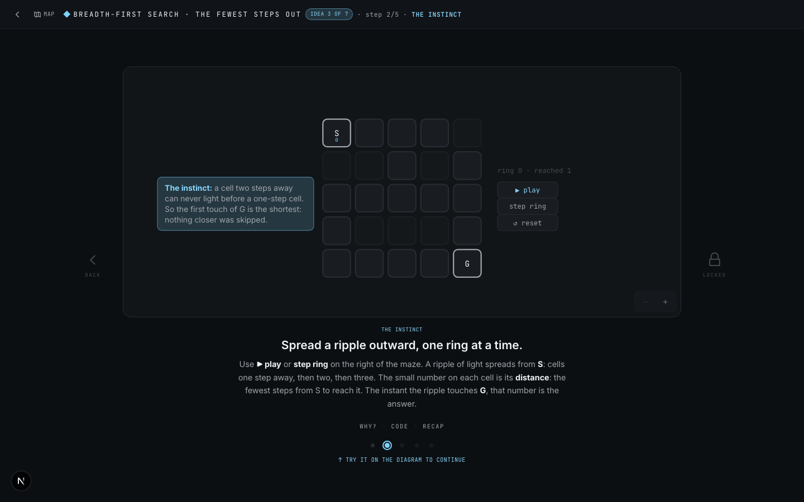
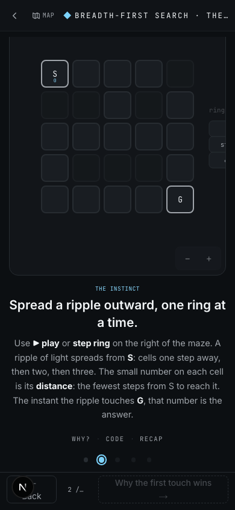

The progress marker reads "step 2/5 · THE INSTINCT". The diagram is the same 5x5 grid; the S cell now carries a sub-number "0" beneath its "S" label, marking distance 0. To the right of the grid a status line "ring 0 · reached 1" sits above three stacked control buttons: "▶ play", "step ring", and "↺ reset". An overlaid note card to the left reads "The instinct: a cell two steps away can never light before a one-step cell. So the first touch of G is the shortest: nothing closer was skipped." The main panel has caption "THE INSTINCT", title "Spread a ripple outward, one ring at a time.", and body text telling the learner to use ▶ play or step ring, explaining the small number on each cell is its distance and the first touch of G is the answer. Interaction type is wedge: pressing play runs the ripple automatically, or step ring advances one distance ring at a time, lighting cells one step from S, then two, then three, and writing each cell's distance; each press fires the interaction-done signal that unlocks the forward nav. Shown pre-interaction, so the right side-nav is a padlock labeled "LOCKED" and a prompt reads "↑ TRY IT ON THE DIAGRAM TO CONTINUE". On mobile the note card is not shown, the grid sits above the panel, and the bottom action bar shows "Back", a "2 /..." counter, and a "Why the first touch wins →" button.

### Beat 3 — The derivation
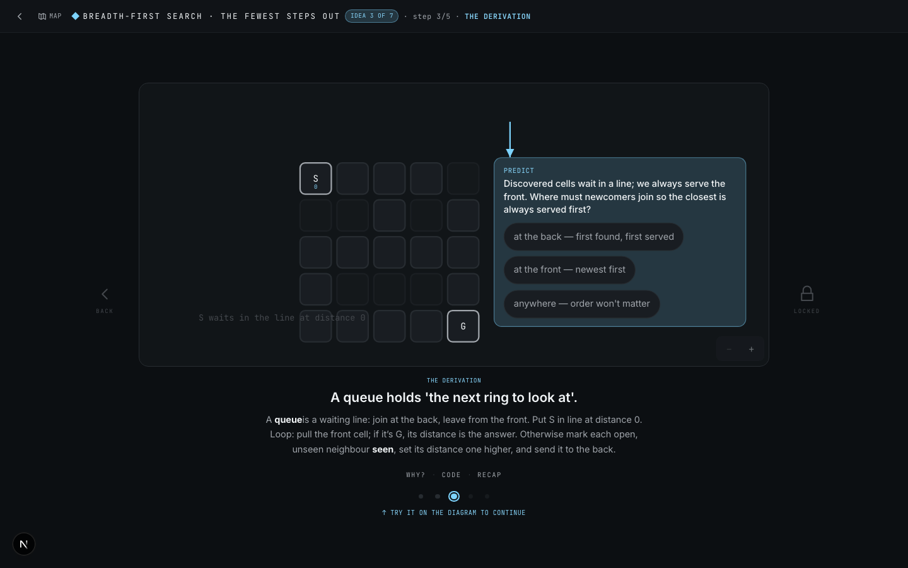
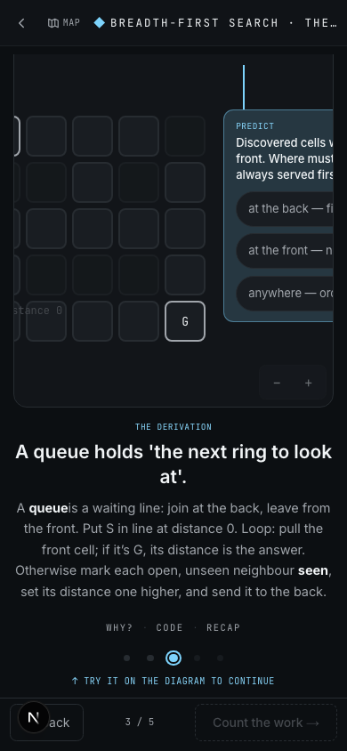

The progress marker reads "step 3/5 · THE DERIVATION". The diagram shows the maze with S at distance 0 and a status line "S waits in the line at distance 0", with a PREDICT gate panel overlaid on the right (hosted on the canvas via a foreignObject) and a blue arrow pointing down into the queue region. The gate asks "Discovered cells wait in a line; we always serve the front. Where must newcomers join so the closest is always served first?" with three tappable choice pills: "at the back — first found, first served" (the correct choice), "at the front — newest first", and "anywhere — order won't matter". The main panel has caption "THE DERIVATION", title "A queue holds 'the next ring to look at'.", and body text describing the queue as a waiting line (join at the back, leave from the front), seeding S at distance 0, marking open unseen neighbours seen, and sending them to the back at distance one higher. Interaction type is wedge: tapping a pill is the gating action; after a short reading pause an AutoBFS playback replaces the gate and grows a live queue column beside the maze. Shown pre-interaction, so the right side-nav is "LOCKED" and the prompt reads "↑ TRY IT ON THE DIAGRAM TO CONTINUE". On mobile the gate panel is partly clipped at the right edge, the maze sits above the panel text, and the bottom bar shows "Back", "3 / 5", and a "Count the work →" button.

### Beat 4 — The operations
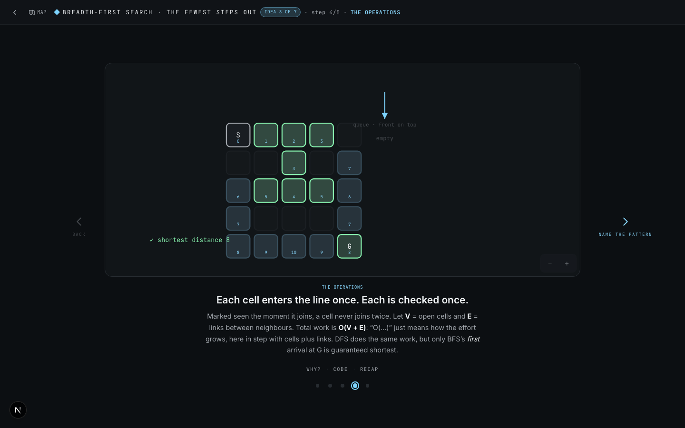
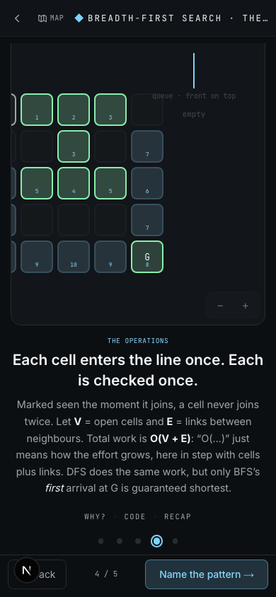

The progress marker reads "step 4/5 · THE OPERATIONS". The diagram shows the fully flooded maze: every open cell carries its distance number (S=0 rising to G=8), green-outlined cells trace the BFS path, and a "queue · front on top" column to the right reads "empty" because the run is frozen at completion. A status line reads "✓ shortest distance 8". The main panel has caption "THE OPERATIONS", title "Each cell enters the line once. Each is checked once.", and body text introducing V (open cells), E (links between neighbours), the O(V + E) total-work claim, and the note that DFS does the same work but only BFS's first arrival at G is guaranteed shortest. Interaction type is playback, frozen here as a static solved frame rather than a running animation. The right side-nav reads "NAME THE PATTERN".

### Beat 5 — The pattern
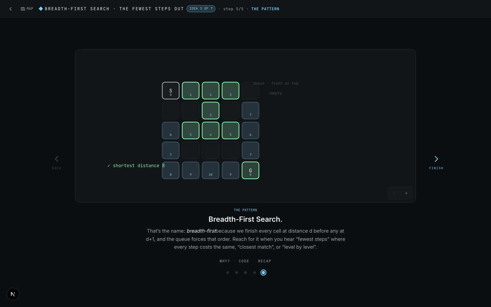
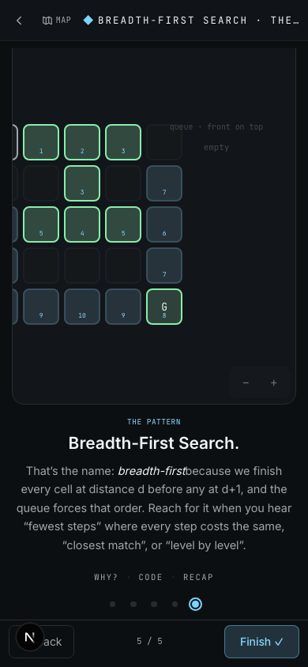

The progress marker reads "step 5/5 · THE PATTERN". The diagram again shows the frozen fully-flooded maze with distance numbers and the green BFS trail, the "queue · front on top" column reading "empty", and the "✓ shortest distance 8" status line. The main panel has caption "THE PATTERN", title "Breadth-First Search.", and body text naming the algorithm (finish every cell at distance d before any at d+1, the queue forcing that order) and listing the triggers "fewest steps" where every step costs the same, "closest match", and "level by level". Interaction type is none (a static frozen frame). The right side-nav reads "FINISH", marking the final beat.

### Code drawer
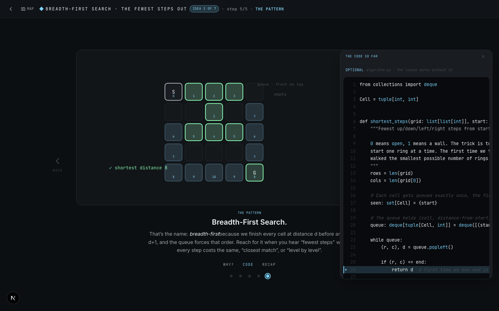

The code drawer opens as a right-side panel titled "THE CODE SO FAR" over the dimmed lesson view, with a subheader "OPTIONAL algorithm.py · the lesson works without it". It renders numbered Python lines: `from collections import deque`, a `Cell = tuple[int, int]` type alias, and `def shortest_steps(grid: list[list[int]], start...` with a docstring about the fewest up/down/left/right steps and a comment that "0 means open, 1 means a wall" and the trick is to start one ring at a time. Visible lines set `rows = len(grid)` and `cols = len(grid[0])`, a `seen: set[Cell] = {start}` set (commented "Each cell gets queued exactly once"), a `queue: deque[tuple[Cell, int]] = deque([(start...` worklist (commented "The queue holds (cell, distance-from-start)"), and the main `while queue:` loop with `(r, c), d = queue.popleft()` and an `if (r, c) == end: return d` goal check. Line 26 (`return d`) is highlighted with a left-edge marker, corresponding to the active code line for the captured beat.

---

## mergesort
route: `/categories/algorithms/mergesort/` · diagram shape: line

The captured run renders the structured register, a 5-beat path (setup → instinct → derivation → operations → pattern); the header step counter reads "step N/5" on every beat and the script reached all 5 beats on both desktop and mobile (`{desktop:{reached:5,total:5}, mobile:{reached:5,total:5}}`). The full intuitive path defines seven beats in the spec; the `naive` and `general` beats are cut at this register. Every beat shares the same chrome: a top bar with a MAP link, a diamond "MERGESORT · SORT EIGHT CARDS" title, an "IDEA 4 OF 7" pill, the step counter, and the current beat label; a centered SVG canvas card; a main text panel below it with caption / title / body; a "WHY? · CODE · RECAP" tab row above five progress dots; and side-nav affordances ("BACK" left, an action label right). Captures show each beat in its initial state — a wedge beat appears LOCKED, because the dot-jump does not perform the interaction. Mobile (390) stacks the same pieces in a single column: the title truncates in the header, the canvas card sits on top, the text panel runs full width below it, and a fixed bottom bar shows "Back", the "N / 5" counter, and the next-action button.

### Beat 1 — The setup
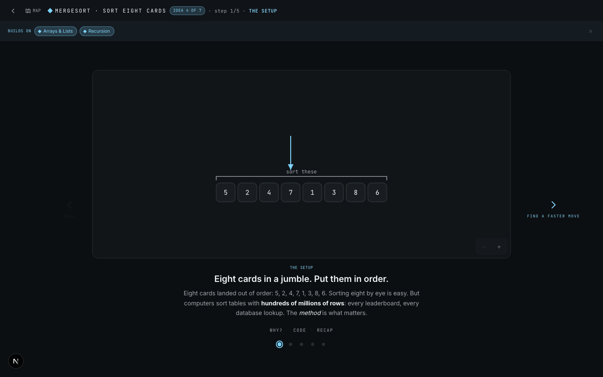
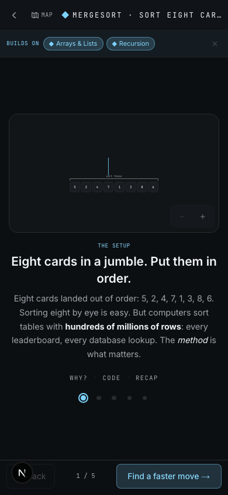

The canvas shows the eight starting cards in a single row — 5, 2, 4, 7, 1, 3, 8, 6 — under a "sort these" bracket, with a blue arrow pointing down into the row. The panel caption reads "THE SETUP", the title "Eight cards in a jumble. Put them in order.", and the body explains that sorting eight by eye is easy but computers sort tables with hundreds of millions of rows, so the method is what matters. A "BUILDS ON" strip under the header carries two prereq pills, "Arrays & Lists" and "Recursion". The right side-nav action reads "FIND A FASTER MOVE"; the left reads "BACK". This beat has no interaction (interaction: none); a small −/+ zoom control sits in the lower-right of the canvas, and the first of five progress dots is filled. On mobile the same row, bracket, and arrow render inside the stacked canvas card, with "Find a faster move" as the bottom-bar action.

### Beat 2 — The instinct
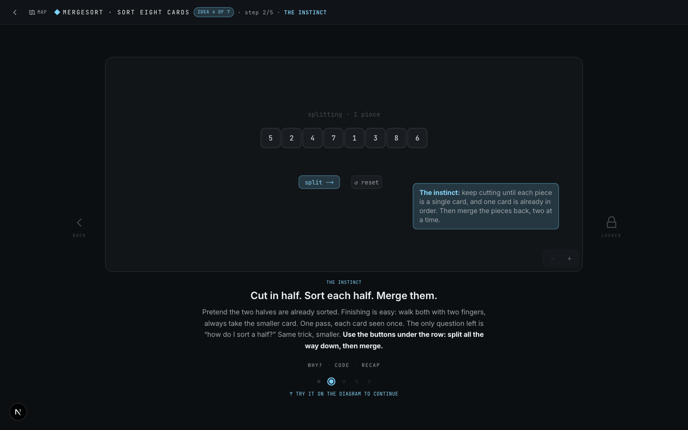
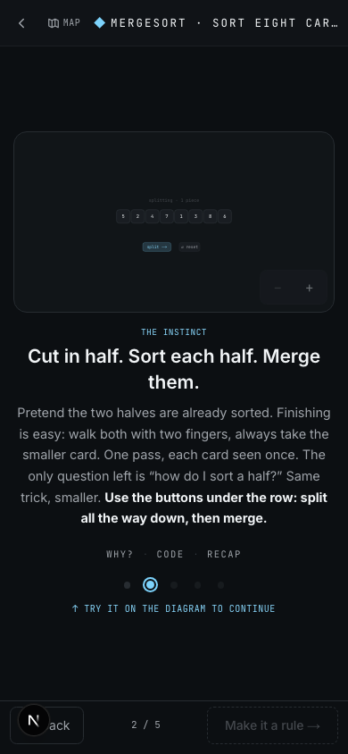

The canvas shows the eight cards in one row with the caption "splitting · 1 piece" above them, a blue "split →" button and a "↺ reset" button below the row, and a note panel reading "The instinct: keep cutting until each piece is a single card, and one card is already in order. Then merge the pieces back, two at a time." The main panel is captioned "THE INSTINCT", titled "Cut in half. Sort each half. Merge them.", with body text describing the two-finger merge and instructing "Use the buttons under the row: split all the way down, then merge." This is a wedge interaction: pressing "split →" repeatedly breaks the row into halves, quarters, then singletons (the caption tracks the running piece count), at which point the button becomes "merge →"; pressing merge fuses the sorted pieces back up one level at a time, and the gate clears (Next unlocks, `api.onInteractionDone` fires) only after the full round trip — split all the way down to singles and merged back to one fully sorted segment; "↺ reset" returns the cards to their starting jumble. The shot is pre-interaction, so the row is still whole, the right side-nav shows "LOCKED" with a padlock, and the footer reads "↑ TRY IT ON THE DIAGRAM TO CONTINUE". Mobile renders the same row, split/reset buttons, and note, still locked, with "Make it a rule →" as the bottom action.

### Beat 3 — The derivation
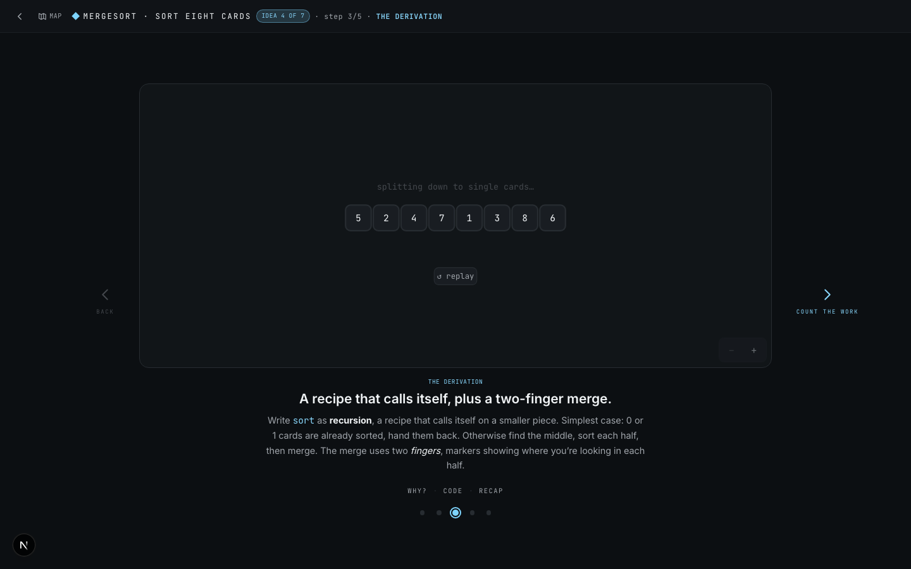
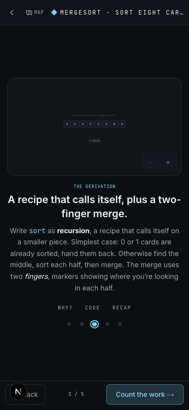

The canvas shows the eight-card row with the caption "splitting down to single cards…" above it and a "↺ replay" button below. This beat is a playback interaction: it auto-runs, splitting down to singletons and then merging the sorted halves back up while the active code line follows each frame; the shot captures it mid-split before the animation has separated the piles into distinct piles. The panel is captioned "THE DERIVATION", titled "A recipe that calls itself, plus a two-finger merge.", and the body describes writing `sort` as recursion (base case of 0 or 1 cards, otherwise find the middle, sort each half, then merge with two fingers, markers showing where you're looking in each half). The right side-nav action reads "COUNT THE WORK"; because playback is not a gating interaction, the Next arrow is available rather than locked, and the third progress dot is filled.

### Beat 4 — The operations
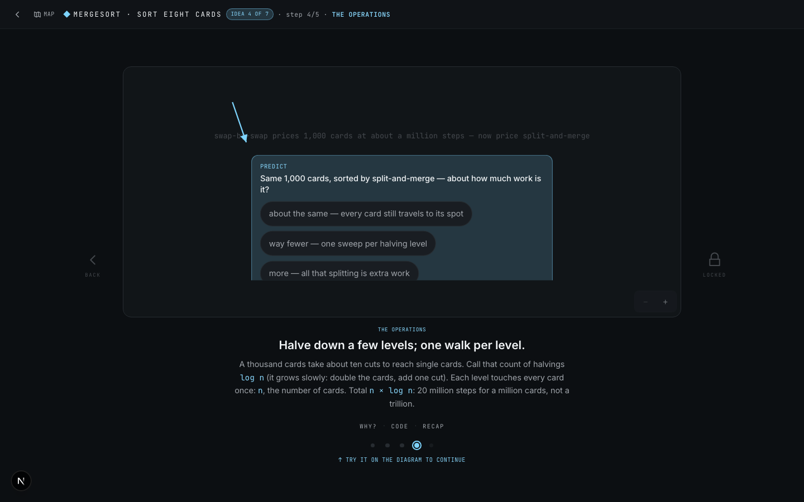
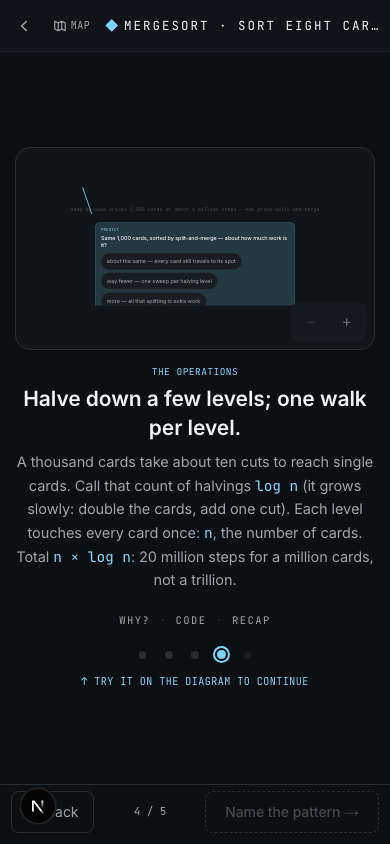

The canvas hosts the lesson's one prediction gate. A line of text reads "swap-by-swap prices 1,000 cards at about a million steps — now price split-and-merge", a blue arrow points down into a "PREDICT" card asking "Same 1,000 cards, sorted by split-and-merge — about how much work is it?", with three choice pills: "about the same — every card still travels to its spot", "way fewer — one sweep per halving level", and "more — all that splitting is extra work". The panel is captioned "THE OPERATIONS", titled "Halve down a few levels; one walk per level.", and the body works out log n levels × n cards per level for about 20 million steps on a million cards, not a trillion. This is a wedge interaction: the PredictGate fires interaction-done when a pill is tapped, then after a short pause the gate is replaced by the CostLevels triangle (an 8 → 4s → 2s → singles stack with a "~3 levels" height bracket on the left and an "every card touched once" marker). The shot is pre-interaction, so the gate is still showing its question; the right side-nav reads "LOCKED" with a padlock and the footer reads "↑ TRY IT ON THE DIAGRAM TO CONTINUE". Mobile shows the same predict card and three choices stacked inside the canvas, with "Name the pattern →" as the bottom action.

### Beat 5 — The pattern
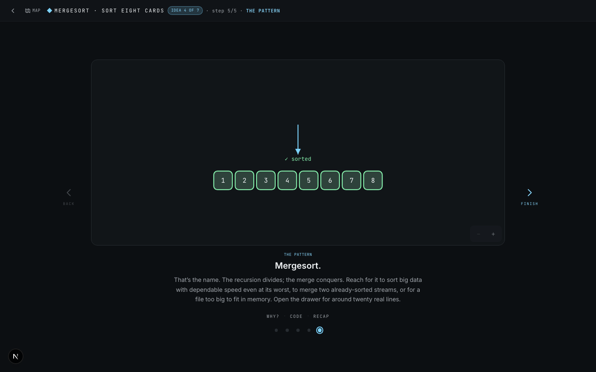
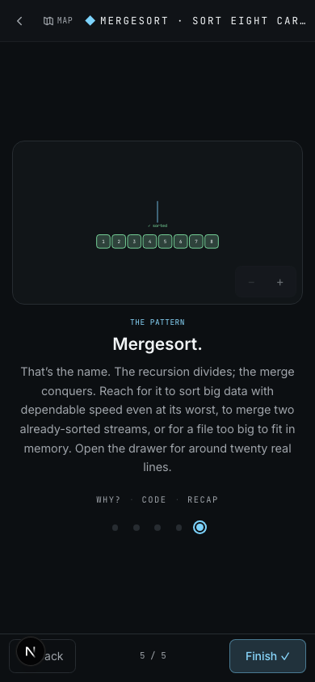

The canvas shows the eight cards now in sorted order — 1, 2, 3, 4, 5, 6, 7, 8 — each cell drawn with a green border, a green "✓ sorted" caption above, and a blue arrow pointing down into the row. The panel is captioned "THE PATTERN", titled "Mergesort.", and the body names the algorithm (the recursion divides, the merge conquers), lists when to reach for it (big sorts needing dependable speed, merging two already-sorted streams, files too big for memory), and points to the code drawer for around twenty real lines. This beat has no interaction (interaction: none); the fifth progress dot is filled and the right side-nav action reads "FINISH".

### Code drawer
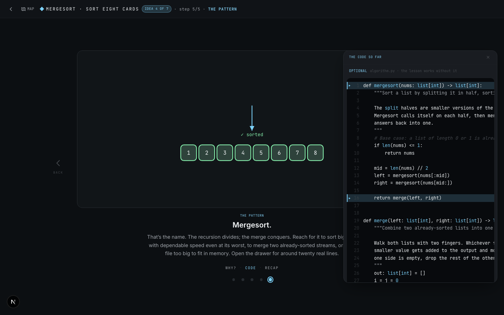

The code drawer slides in from the right, headed "THE CODE SO FAR" with an "OPTIONAL · algorithm.py · the lesson works without it" subline. It shows the Python source with line numbers: `def mergesort(nums: list[int]) -> list[int]:` and its docstring, the base case `if len(nums) <= 1: return nums`, the split `mid = len(nums) // 2`, the two recursive calls `left = mergesort(nums[:mid])` and `right = mergesort(nums[mid:])`, and `return merge(left, right)`; below it begins `def merge(left, right) -> ...` with its own docstring and the start of the two-pointer loop (`out: list[int] = []`, `i = j = 0`). Line 1 (`def mergesort`) and line 16 (`return merge(left, right)`) carry left gutter markers and are highlighted as the active lines. The drawer was captured while beat 5 (THE PATTERN) was on screen.

---

## recursion

route: `/categories/algorithms/recursion/` · diagram shape: box

The default register renders 5 beats (the header reads `step N/5`): setup, the instinct (wedge), the derivation, the operations (predict gate), and the pattern. The top bar reads `MAP · ◆ RECURSION · HOW BIG IS YOUR DOWNLOADS FOLDER?` with an `IDEA 4 OF 7` pill and the current beat name; a `BUILDS ON` strip carries the prereq pills `Arrays & Lists` and `Trees`. All beats share one diagram: a Downloads folder tree drawn left-of-centre (Downloads/ → resume, photos/ → beach, party; projects/ → notes, code/ → app.zip; scratch), leaving the right band free for the call-stack or panel. Wedge beats are captured in their INITIAL state because the dot-jump does not perform the interaction, so they appear LOCKED.

### Beat 1 — The setup

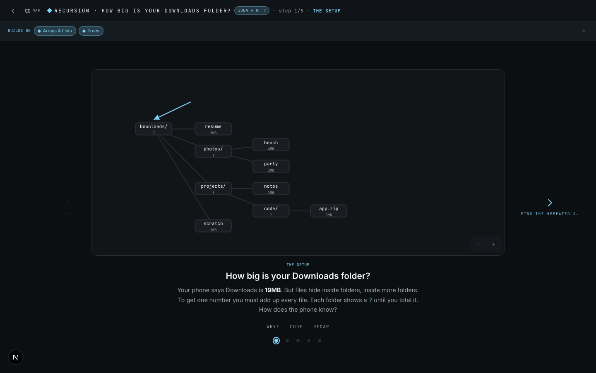
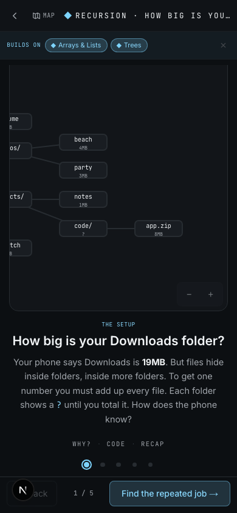

The diagram shows the full file tree with every folder row reading `?` for its size while file rows show fixed sizes (resume 2MB, beach 4MB, party 3MB, notes 1MB, app.zip 8MB, scratch 1MB). A blue arrow points into the `Downloads/` root node. The main panel is captioned `THE SETUP` with title "How big is your Downloads folder?" and body text stating the phone reports 19MB but files hide inside nested folders, so each folder shows a `?` until totalled. Interaction type is none. Below the panel sit the `WHY? · CODE · RECAP` chips and a row of five progress dots (first filled). Desktop side-nav shows `BACK` (left) and `FIND THE REPEATED J...` (right); on mobile the tree is horizontally clipped, the panel stacks below, and a bottom bar shows `back`, `1 / 5`, and the forward action `Find the repeated job →`.

### Beat 2 — The instinct

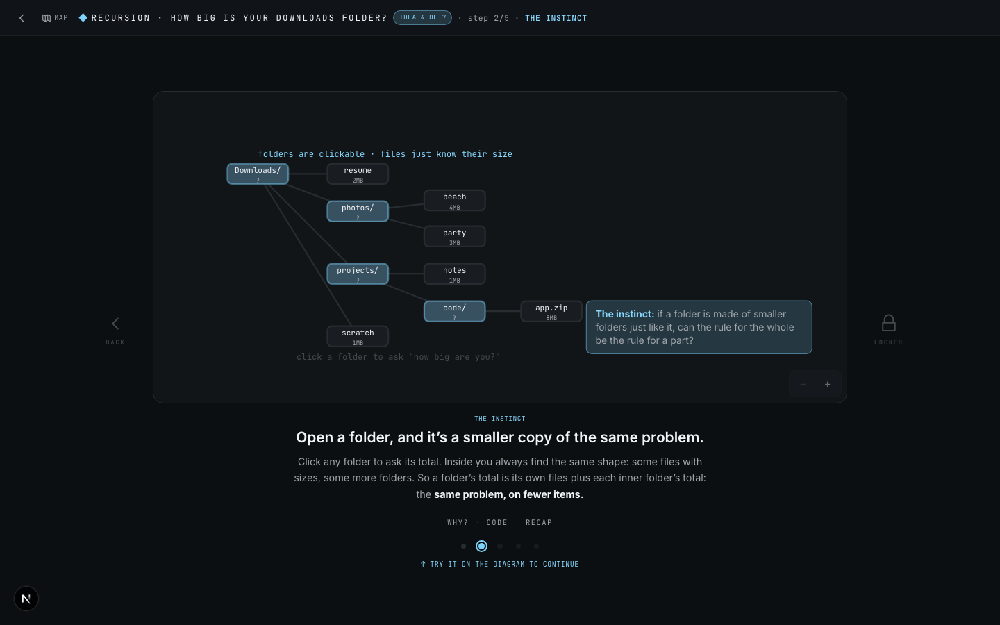
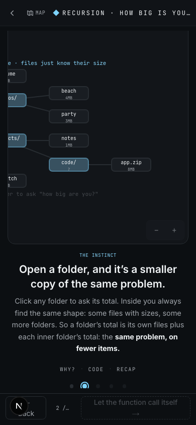

This is the wedge beat, shown here in its initial LOCKED state (the dot-jump does not perform the interaction, so the right rail reads `LOCKED` and the panel shows `↑ TRY IT ON THE DIAGRAM TO CONTINUE`). The diagram highlights all four folder nodes (Downloads/, photos/, projects/, code/) in active blue as clickable, with the caption "folders are clickable · files just know their size" above and the prompt `click a folder to ask "how big are you?"` below. A note card sits over the right band reading "The instinct: if a folder is made of smaller folders just like it, can the rule for the whole be the rule for a part?". The main panel is captioned `THE INSTINCT`, title "Open a folder, and it's a smaller copy of the same problem." Mechanically, clicking a folder fills in its total and turns it green while its children glow, surfacing the message "<folder>/ = its files + each subfolder = <total>MB"; that click fires `api.onInteractionDone()` and clears the gate to allow advancing.

### Beat 3 — The derivation

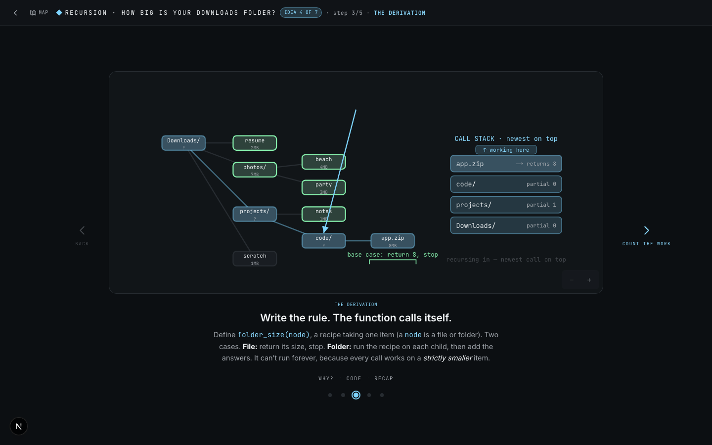
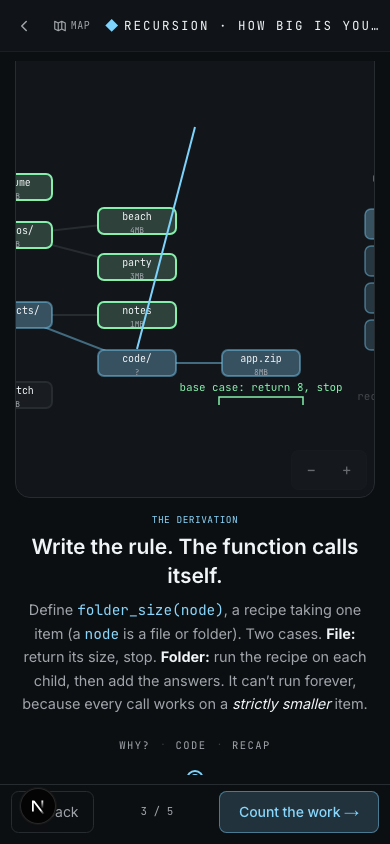

A static mid-recursion snapshot. The deepest path Downloads/ › projects/ › code/ › app.zip is highlighted on the tree (already-finished nodes such as resume, photos/=7MB, beach, party, notes show green totals), with a bracket under app.zip labelled "base case: return 8, stop". The right band shows the CALL STACK panel ("CALL STACK · newest on top", an "↑ working here" pill) with four frames stacked newest-on-top: app.zip "→ returns 8", code/ "partial 0", projects/ "partial 1", Downloads/ "partial 0", and the note "recursing in — newest call on top". The main panel is captioned `THE DERIVATION`, title "Write the rule. The function calls itself.", explaining `folder_size(node)` with its file case (return its size, stop) and folder case (run on each child, add up). Interaction type is none; this beat is a fixed illustration, not animated by the dot-jump.

### Beat 4 — The operations

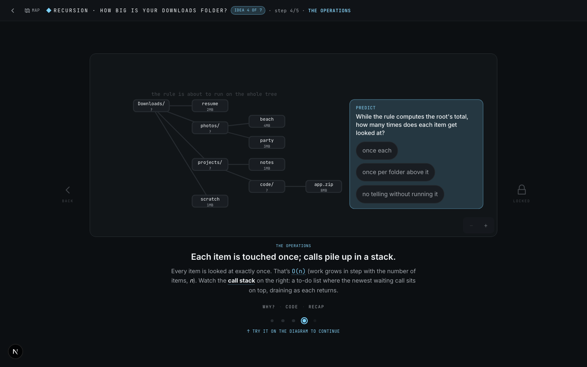
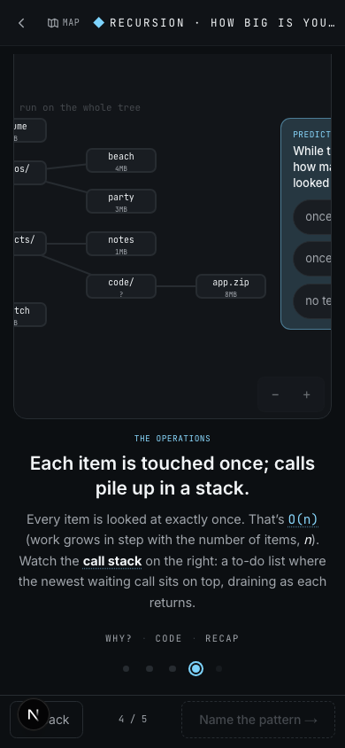

This is a predict-gate wedge, shown pre-interaction in its LOCKED state (right rail `LOCKED`, `↑ TRY IT ON THE DIAGRAM TO CONTINUE` under the panel). The tree is drawn idle with all folders showing `?` and the caption "the rule is about to run on the whole tree". A PREDICT card occupies the right band asking "While the rule computes the root's total, how many times does each item get looked at?" with three choices: "once each" (correct), "once per folder above it", and "no telling without running it". The main panel is captioned `THE OPERATIONS`, title "Each item is touched once; calls pile up in a stack.", introducing O(n) and the call stack. Mechanically, tapping a prediction pill fires interaction-done, shows feedback, and after a short pause swaps the visual for an auto-playing recursion (frames pushed and popped on the stack, each node lighting once, plus a "↺ replay" button) that answers the prediction before the panel names it O(n). On mobile the PREDICT card is partially clipped off the right edge.

### Beat 5 — The pattern

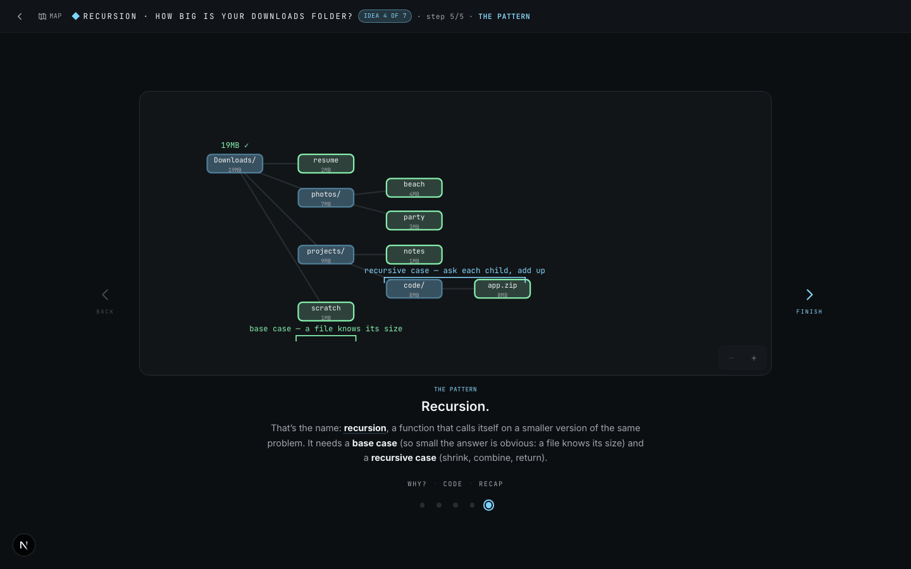
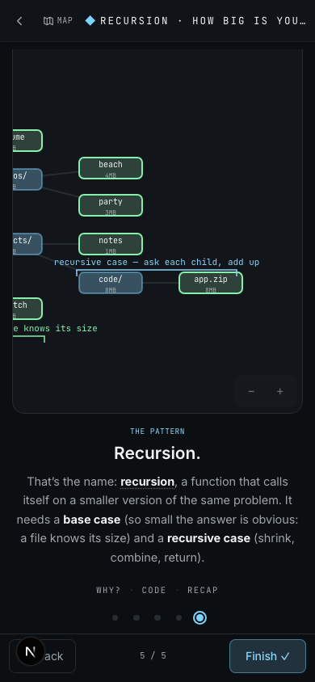

The fully resolved tree: every node is green with its real total (Downloads/ 19MB with a "19MB ✓" badge above the root, photos/ 7MB, projects/ 9MB, code/ 8MB, files at their sizes). Two brackets annotate the pattern: a green bracket under scratch labelled "base case — a file knows its size", and a blue bracket over code/→app.zip labelled "recursive case — ask each child, add up". The main panel is captioned `THE PATTERN`, title "Recursion.", defining recursion as a function that calls itself on a smaller version, requiring a base case and a recursive case. Interaction type is none. The right rail action reads `FINISH` and the fifth progress dot is filled. On mobile the bottom bar shows `back`, `5 / 5`, and the greyed `Name the pattern →` action.

### Code drawer

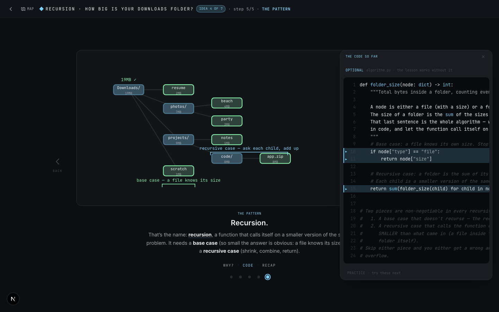

Opened from the `code` chip, a right-side drawer slides over beat 5 captioned "THE CODE SO FAR · the lesson works without it" and marked `OPTIONAL algorithm.py`. It shows the numbered Python `def folder_size(node: dict) -> int:` source with a docstring ("Total bytes inside a folder, counting..."), with the base case (`if node["type"] == "file": return node["size"]`) and recursive case (`return sum(folder_size(child) for child in n...`) highlighted, followed by comment lines noting the two non-negotiable pieces (a base case that doesn't recurse, a recursive case that calls the function on a smaller version) and the overflow/wrong-answer consequence of dropping either. A `PRACTISE · try these next` footer sits at the bottom of the drawer.

---

## monotonic-stack
route: `/categories/algorithms/monotonic-stack/` · diagram shape: box

Capture reached all 5 of 5 beats on both desktop (1440) and mobile (390). The active register renders 5 beats — setup, the wedge (instinct), derivation, operations, name — so the spec's "obvious" and "generalization" beats are not in this run. Each shot shows the beat in its INITIAL state on landing; the wedge and auto-playback beats are captured pre-interaction (the dot-jump does not perform the click or run the animation), so the waiting line reads "(line is empty)" and counters sit at 0.

### Beat 1 — The setup
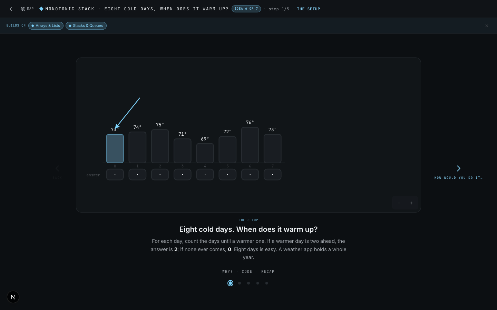
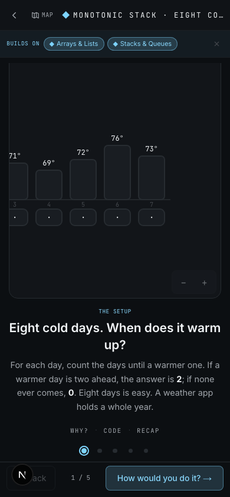
The canvas draws eight left-aligned temperature bars (73, 74, 75, 71, 69, 72, 76, 73 degrees), each labeled with its temperature above and its index (0-7) below, sitting on a baseline. A row labeled "answer" runs beneath the bars, every cell holding a placeholder dot. Bar 0 is tinted active (sky) and a diagonal arrow points down to its top. The top bar shows the title "MONOTONIC STACK · EIGHT COLD DAYS, WHEN DOES IT WARM UP?" with an "IDEA 6 OF 7" pill, "step 1/5", and "THE SETUP". Below "BUILDS ON" are two prereq pills: "Arrays & Lists" and "Stacks & Queues". The main panel reads caption "THE SETUP", title "Eight cold days. When does it warm up?", and body explaining that for each day you count the days until a warmer one (2 if two ahead, 0 if none). The why·code·recap chips and five progress dots (first filled) sit at the bottom; the right side nav reads "HOW WOULD YOU DO IT…" with a forward chevron. This beat has no gate — the forward nav advances to Beat 2. On mobile the bars overflow horizontally inside a scrollable canvas (only indices 3-7 visible), the panel stacks below the canvas, and the bottom footer shows "back", "1 / 5", and a "How would you do it? →" button.

### Beat 2 — The instinct
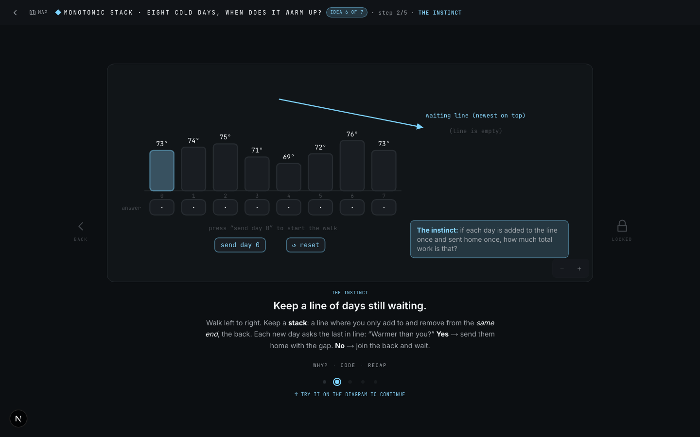
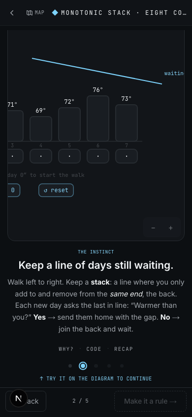
The same eight bars appear, bar 0 active. A "waiting line (newest on top)" label sits in the right column with "(line is empty)" beneath it, and a diagonal arrow points from the bars toward that empty waiting-line panel. The note "press "send day 0" to start the walk" sits under the bars, with two in-canvas SVG buttons: "send day 0" and "↺ reset". A blue note panel reads "The instinct: if each day is added to the line once and sent home once, how much total work is that?" The header shows "step 2/5 · THE INSTINCT". The main panel caption is "THE INSTINCT", title "Keep a line of days still waiting.", body describing walking left to right keeping a stack where you only add to and remove from the same end (the back); each new day asks the last in line "Warmer than you?" (Yes sends them home with the gap, No joins the back to wait). This beat is gated by a wedge interaction: clicking "send day i" repeatedly drives each day into the line — a warmer arrival pops the cooler waiters and records each gap, a cooler one pushes onto the back. Partway through (at day 5) a prediction gate fires asking who gets sent home from the line; after the learner taps a choice and a reading pause it steps aside, and the learner's own next click answers it. The captures show the pre-interaction state, so the gate is unfired: the footer reads "↑ TRY IT ON THE DIAGRAM TO CONTINUE" and the right side nav shows a padlock icon with "LOCKED". Performing the walk clears the gate and unlocks "Make it a rule →". On mobile the bars overflow (indices 3-7 visible), the "send day 0" / "↺ reset" buttons render in-canvas, and the footer shows "back", "2 / 5", and the still-greyed "Make it a rule →" button.

### Beat 3 — The derivation
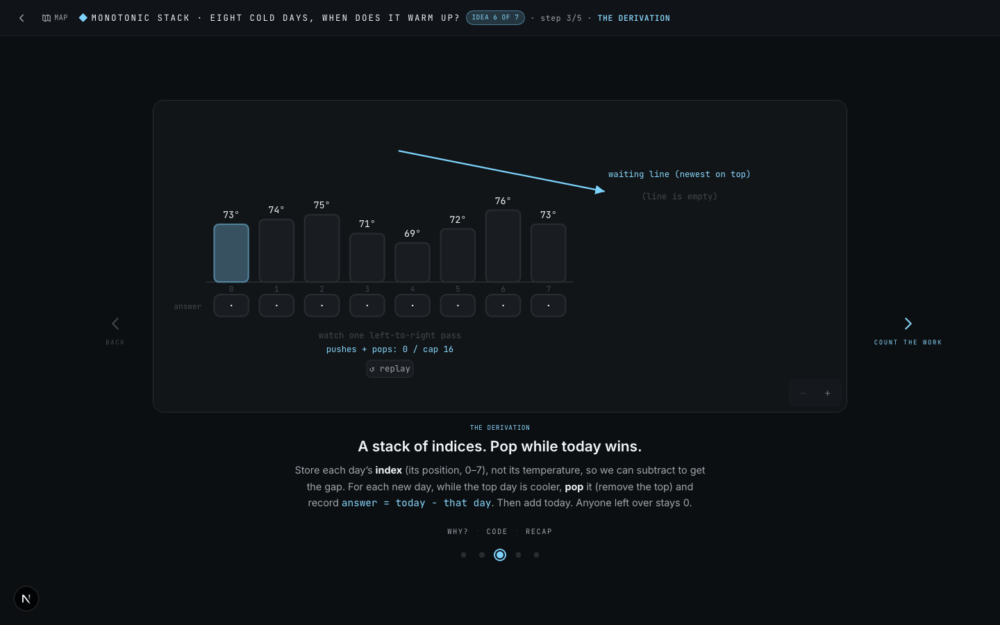
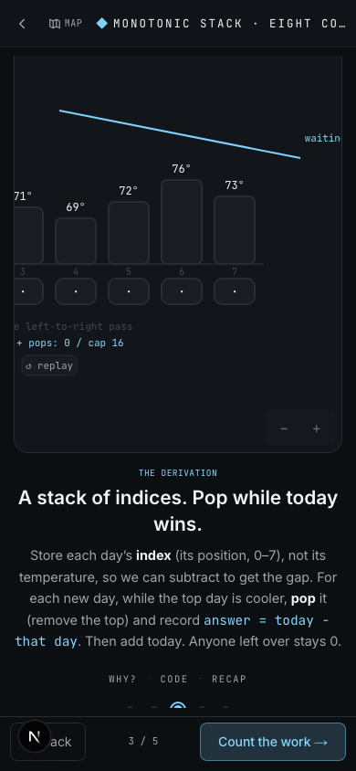
The header reads "step 3/5 · THE DERIVATION". The eight bars render with bar 0 active and the "waiting line (newest on top)" panel showing "(line is empty)", with the diagonal arrow pointing to it. This beat runs an auto-playback walk: under the bars the note "watch one left-to-right pass" appears, a live counter "pushes + pops: 0 / cap 16", and an "↺ replay" button. The captures show the playback at frame 0 (counter still 0, line empty). The main panel caption is "THE DERIVATION", title "A stack of indices. Pop while today wins.", body explaining that each day's index (0-7) is stored, not its temperature, so positions can be subtracted for the gap; for each new day, while the top day is cooler, pop it and record `answer = today - that day`, then add today, and anyone left over stays 0. The right side nav reads "COUNT THE WORK" with a forward chevron; progress dots show the third filled. On mobile the bars overflow (indices 3-7 visible), the "watch one left-to-right pass" note, counter, and "↺ replay" sit below, and the footer shows "back", "3 / 5", and "Count the work →".

### Beat 4 — The operations
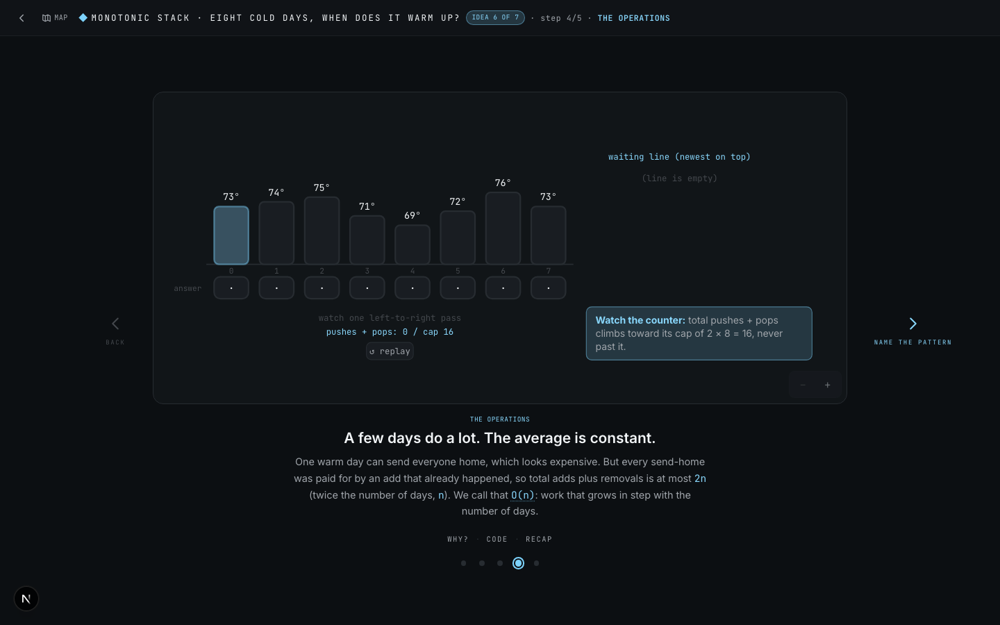
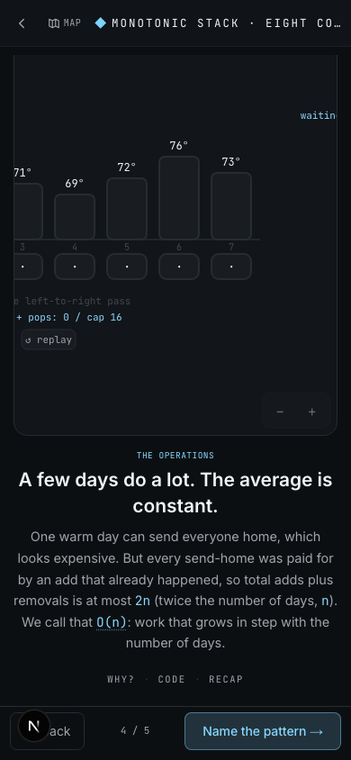
The header reads "step 4/5 · THE OPERATIONS". The same bars and the "waiting line (newest on top)" / "(line is empty)" panel render, with the auto-playback note "watch one left-to-right pass", the counter "pushes + pops: 0 / cap 16", and the "↺ replay" button (shown at frame 0). A blue note panel reads "Watch the counter: total pushes + pops climbs toward its cap of 2 × 8 = 16, never past it." The main panel caption is "THE OPERATIONS", title "A few days do a lot. The average is constant.", body explaining that one warm day can send everyone home but every send-home was paid for by an earlier add, so total adds plus removals is at most 2n (twice the number of days), which is O(n) — work that grows in step with the number of days. The right side nav reads "NAME THE PATTERN"; the fourth progress dot is filled. On mobile the bars overflow (indices 3-7 visible), the playback note and counter sit below, and the footer shows "back", "4 / 5", and "Name the pattern →".

### Beat 5 — The pattern
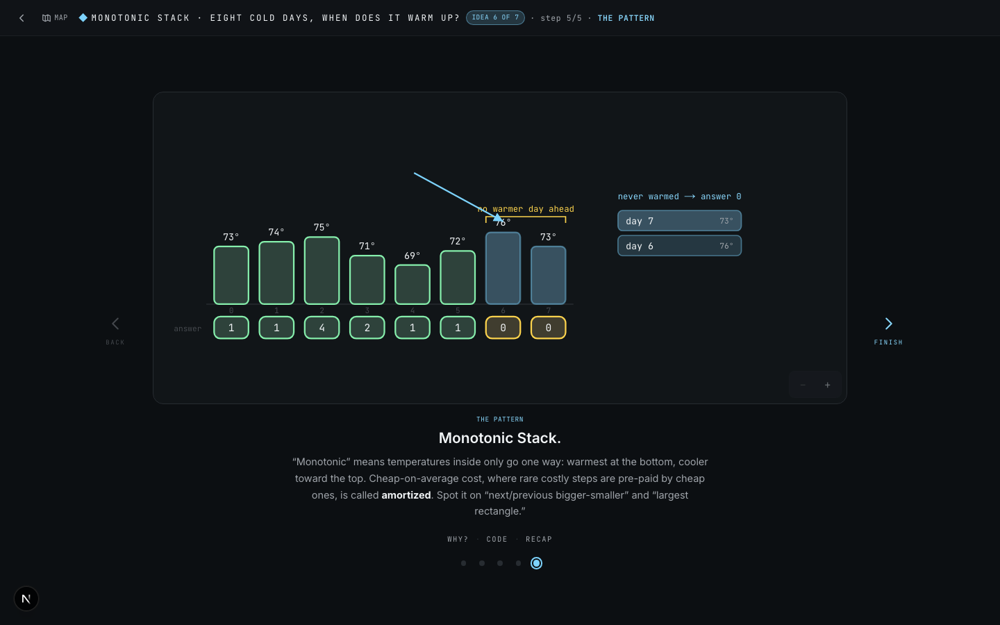
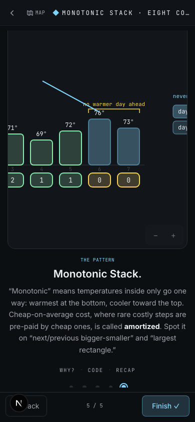
The header reads "step 5/5 · THE PATTERN". This is the resolved final state: all eight bars carry green-outlined answer cells reading 1, 1, 4, 2, 1, 1, 0, 0. Bars 6 and 7 (76 and 73 degrees) are tinted active and their answer cells are amber-outlined 0; a bracket spanning them is labeled "no warmer day ahead". The right column shows a "never warmed → answer 0" panel listing "day 7 73°" and "day 6 76°". A diagonal arrow points toward bar 6. The main panel caption is "THE PATTERN", title "Monotonic Stack.", body explaining that "monotonic" means temperatures inside only go one way (warmest at the bottom, cooler toward the top), that cheap-on-average cost where rare costly steps are pre-paid is called amortized, and that the pattern shows up on "next/previous bigger-smaller" and "largest rectangle." The right side nav reads "FINISH" with a forward chevron; the fifth (final) progress dot is filled. On mobile the fully-answered bars overflow (indices 3-7 plus the amber 0 cells visible), the "never warmed → answer 0" panel and the bracket label render to the right, and the footer shows "back", "5 / 5", and a "Finish ✓" button.

### Code drawer
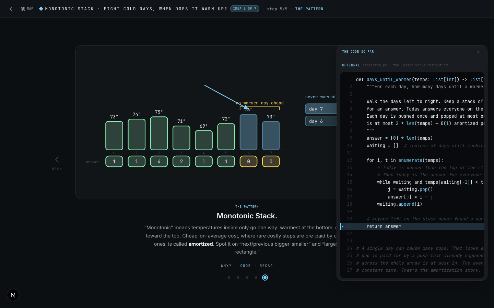
The code drawer slides in from the right over the lesson (captured on the final beat, header "step 5/5 · THE PATTERN"), headed "THE CODE SO FAR" with a subtitle "OPTIONAL algorithm.py — the lesson works without it" and a close (×) control. It shows the Python source for `days_until_warmer(temps: list[int]) -> list[...]` with a docstring, the line-numbered body initializing `answer = [0] * len(temps)` and `waiting = []`, the `for i, t in enumerate(temps):` loop, the `while waiting and temps[waiting[-1]] < t:` pop loop with `j = waiting.pop()`, `answer[j] = i - j`, then `waiting.append(i)`, and a trailing `return answer` plus a comment block about a single warm day causing many pops and the amortization story. The `return answer` line carries a left accent marker, tying the visible code to the beat's active line.

---

## dp-1d
route: `/categories/algorithms/dp-1d/` · diagram shape: box

The captured run renders the lesson at the structured register, so 5 of the spec's 7 beats appear (the `obvious` and `general` beats are cut at this register). Both viewports reached all 5 beats. The header reads "DYNAMIC PROGRAMMING · WAYS TO CLIMB 8 STAIRS" with an "IDEA 1 OF 7" pill and a "step N/5 · <LABEL>" counter. The why·code·recap chip row and a 5-dot progress indicator sit under the main panel. Captures show each beat in its initial state, so wedge beats appear LOCKED, since the dot-jump does not perform the interaction.

### Beat 1 — The setup
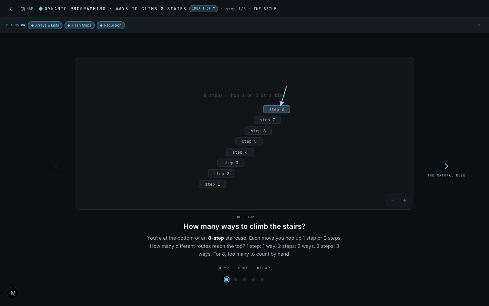
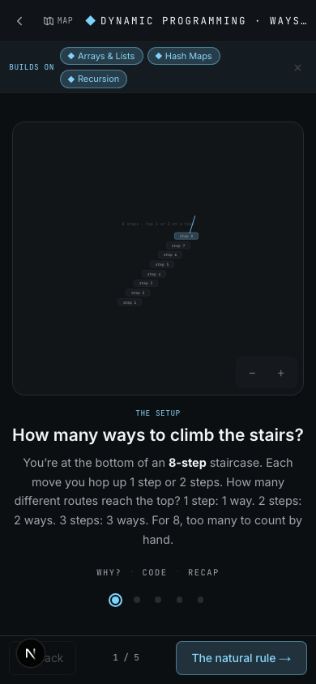
The diagram is a staircase of 8 stacked treads labeled "step 1" (bottom) through "step 8" (top), each shifted right as it climbs, with a caption "8 steps · hop 1 or 2 at a time" and a sky-tinted "step 8" tread the arrow points to. A "BUILDS ON" prereq row shows pills "Arrays & Lists", "Hash Maps", and "Recursion" (dismissible via an X at right). The main panel is titled "How many ways to climb the stairs?" and states the 8-step setup with the 1/2/3-step counts. Side nav reads "BACK" (left, dimmed) and "THE NATURAL RULE" (right). The first progress dot is filled. No gate; the learner advances with the right nav. On mobile the staircase and panel stack, with a bottom bar showing "Back", "1 / 5", and a "The natural rule →" button.

### Beat 2 — The instinct
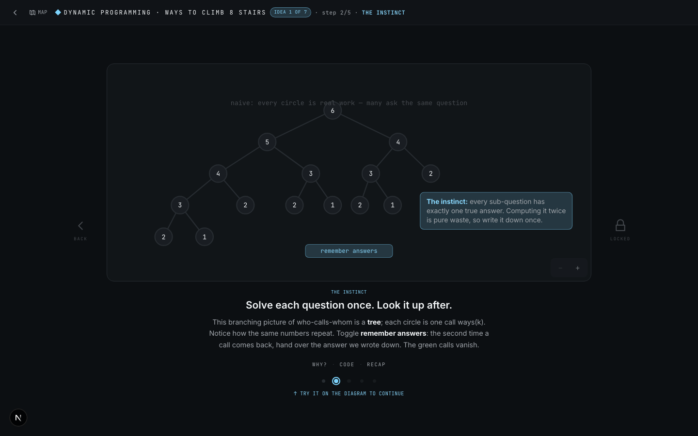
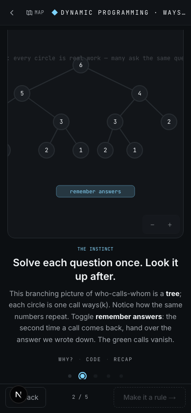
The diagram switches to a recursion tree for ways(6): circular nodes labeled with the call value (6 at top branching to 5 and 4, down through repeated 3s, 2s, and 1s), connected by edges, with the caption "naive: every circle is real work — many ask the same question". A "remember answers" toggle button sits below the tree, and on desktop a note card reads "The instinct: every sub-question has exactly one true answer. Computing it twice is pure waste, so write it down once." The main panel is titled "Solve each question once. Look it up after." This beat is gated (interaction "wedge"): the right nav shows "LOCKED" and the footer prompt reads "↑ TRY IT ON THE DIAGRAM TO CONTINUE". Clicking "remember answers" fires the interaction-done signal — repeat calls recolor green and the caption updates to report how many calls are looked up versus the reduced real-work count, which clears the gate. Shown pre-interaction, so the tree is in its naive (uncolored) state.

### Beat 3 — The derivation
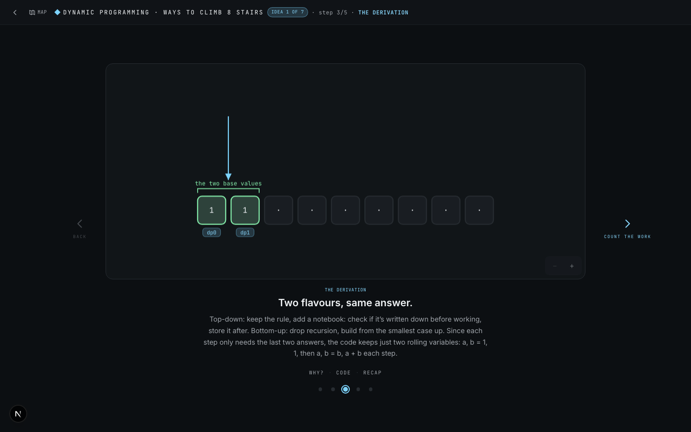
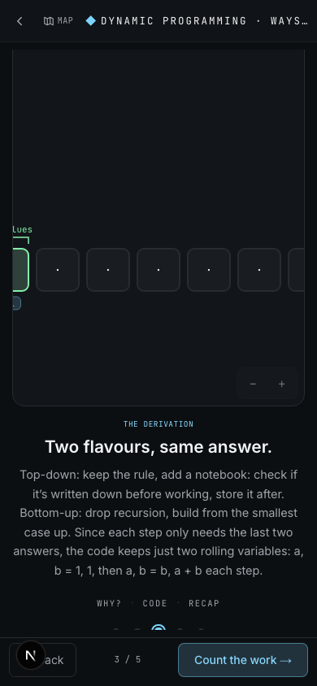
The diagram is a 9-cell dp row: the first two cells hold "1" (green-bordered, marked "dp0" and "dp1" below), the remaining seven hold "·". A green bracket above the first two cells is labeled "the two base values", and an arrow drops into it. The main panel is titled "Two flavours, same answer." and describes the top-down notebook build versus the bottom-up table build, ending with the rolling-pair code (a, b = 1, 1 then a, b = b, a + b). Side nav reads "BACK" and "COUNT THE WORK". The third progress dot is filled. No gate; advance with the right nav.

### Beat 4 — The operations
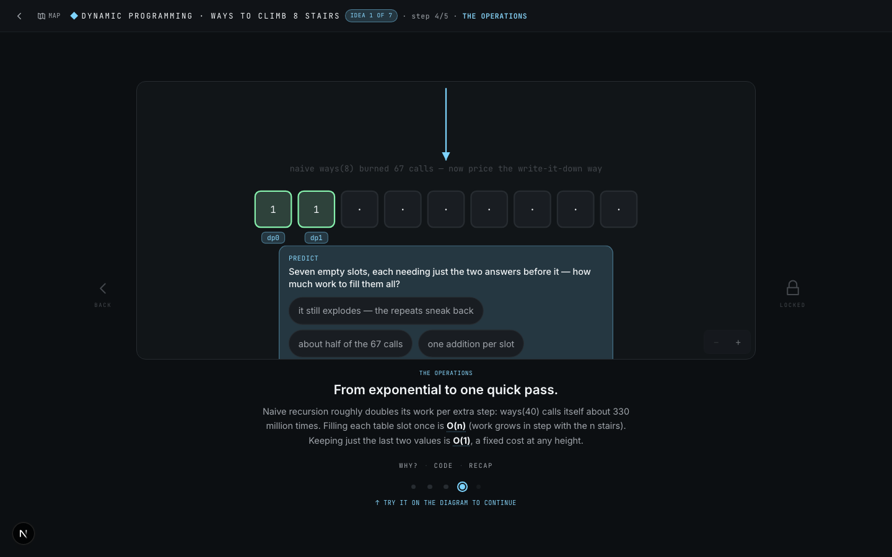
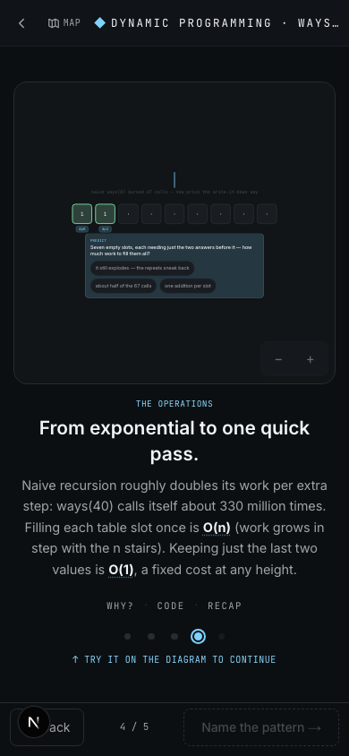
The diagram shows the dp row with dp0 and dp1 filled (1, 1) and the rest as "·", caption "naive ways(8) burned 67 calls — now price the write-it-down way", with an arrow pointing down into the row. A PREDICT card is hosted below the row asking "Seven empty slots, each needing just the two answers before it — how much work to fill them all?" with three choices: "it still explodes — the repeats sneak back", "about half of the 67 calls", and "one addition per slot" (the correct option). The main panel is titled "From exponential to one quick pass." and explains the O(n) time / O(1) space result, with tappable "O(n)" and "O(1)" term chips. This beat is gated (interaction "wedge", predict gate): the right nav shows "LOCKED" and the footer reads "↑ TRY IT ON THE DIAGRAM TO CONTINUE". Picking a choice reveals its note, then after a pause the row auto-fills slot by slot (AutoTabulate) to answer the prediction, which clears the gate. Shown pre-interaction, so the gate sits unanswered with the row still at dp0/dp1.

### Beat 5 — The pattern
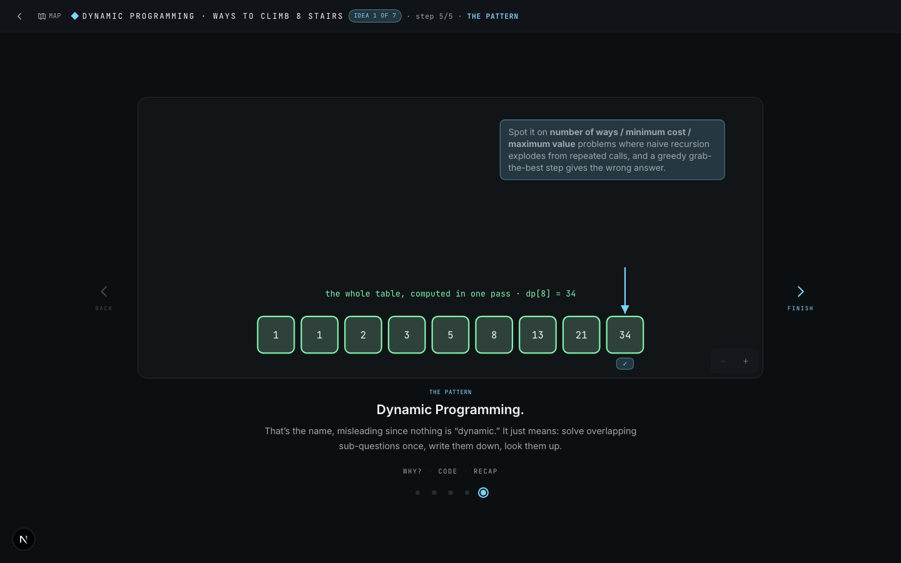
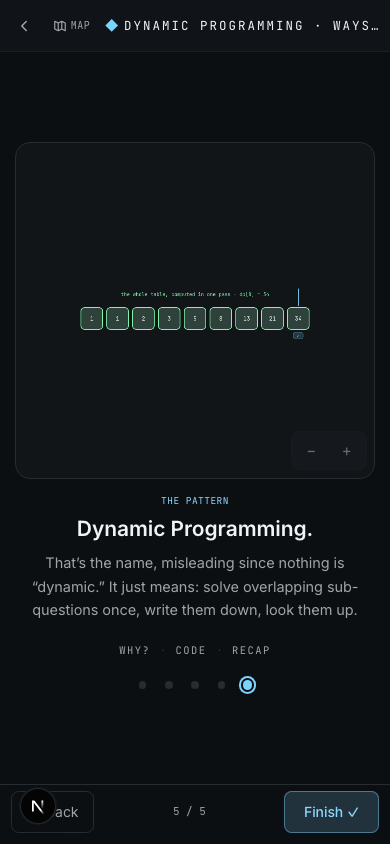
The diagram is the fully filled dp row: 1, 1, 2, 3, 5, 8, 13, 21, 34, every cell green-bordered, with a green checkmark marker under the last cell and the caption "the whole table, computed in one pass · dp[8] = 34"; an arrow points down at the final "34" cell. A note card at top-right reads "Spot it on number of ways / minimum cost / maximum value problems where naive recursion explodes from repeated calls, and a greedy grab-the-best step gives the wrong answer." The main panel is titled "Dynamic Programming." and gives the plain-language definition (solve overlapping sub-questions once, write them down, look them up). Side nav reads "BACK" and "FINISH". The fifth (final) progress dot is filled. No gate; the right nav presents "FINISH".

### Code drawer
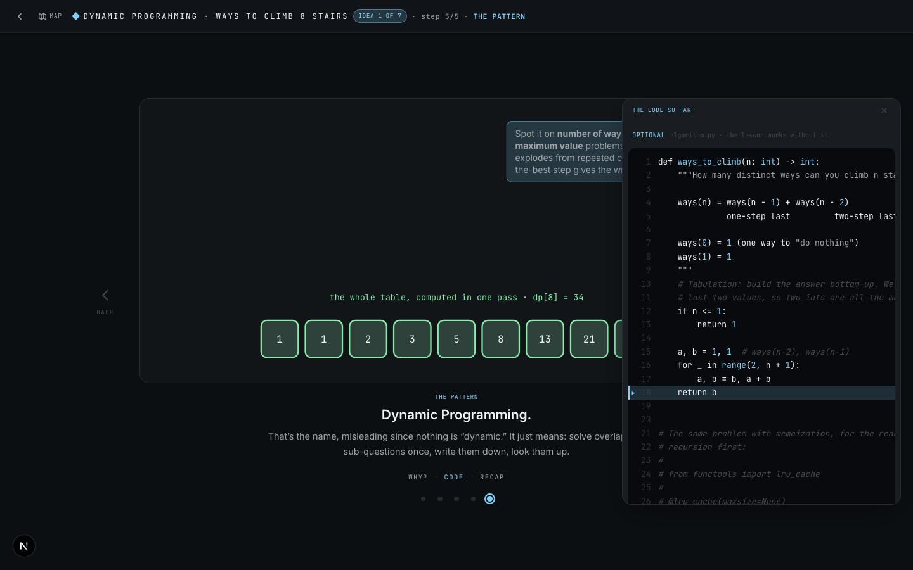
The drawer opens from the right titled "THE CODE SO FAR", tagged "OPTIONAL · algorithm.py · the lesson works without it". It shows the Python source for `def ways_to_climb(n: int) -> int:` with a docstring spelling out the recurrence (ways(n) = ways(n-1) + ways(n-2), ways(0)=1, ways(1)=1), the tabulation comment, the base check `if n <= 1: return 1`, the rolling-pair loop (`a, b = 1, 1`; `for _ in range(2, n + 1): a, b = b, a + b`; `return b`), and a commented-out memoization variant referencing `from functools import lru_cache` / `@lru_cache(maxsize=None)`. Line 18 (`return b`) is highlighted as the active line. The main panel and dp row stay visible behind the drawer.

---

